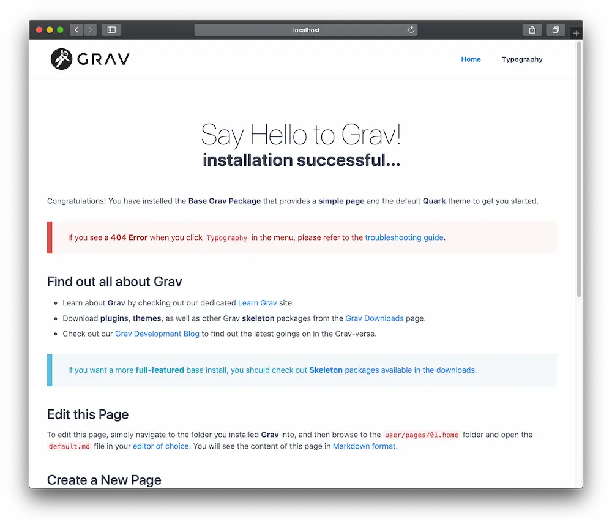
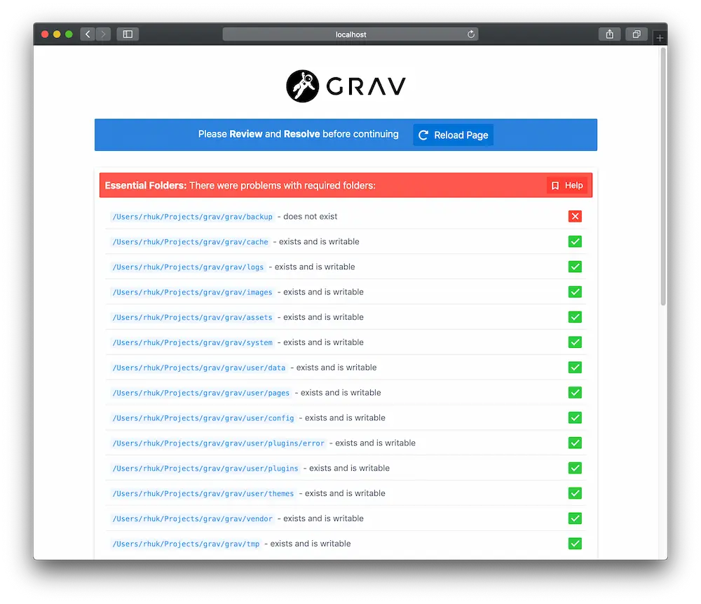

Grav のインストールは簡単です。  
実のところ、本当の意味でのインストールはありません。  
Grav をインストールする方法はいくつかあります。  
まず、最も簡単な方法は、 **zip** アーカイブファイルをダウンロードして、それを展開することです。  
2つ目の方法は、 **Composer** によってインストールする方法です。  
3つ目の方法は、 **GitHub** から直接ソースのプロジェクトをクローンし、そこに含まれるスクリプトコマンドを実行し、必要な依存関係をインストールすることです。  
バンドルされたスクリプトを実行する [さらなる方法](#further-options) もあります。

## PHP のバージョンを確認{#check-for-php-version}

Grav は、驚くほど簡単に構築して動かすことができます。  
少なくとも、 PHP のバージョンが 7.3.6 以上であることを確認してください。  
ターミナルで、 `php -v` とタイプすることでわかります。

```bash
php -v
PHP 7.3.18 (cli) (built: Jun  5 2020 11:06:30) ( NTS )
Copyright (c) 1997-2018 The PHP Group
Zend Engine v3.3.18, Copyright (c) 1998-2018 Zend Technologies
    with Zend OPcache v7.3.18, Copyright (c) 1999-2018, by Zend Technologies
```

> [!訳注]  
> 上記の php バージョン7.3以上というのは、Grav バージョン 1.7 での要件です。1.8を動かすときは、8.3以上を確認してください。確認方法は、同じで `php -v` するだけです。

## 選択肢1: ZIP パッケージからインストール{#option-1-install-from-zip-package}

Grav をインストールする最も簡単な方法は、 ZIP パッケージをダウンロードして、展開することです：

1. 最新で最上位の **[Grav](https://getgrav.org/download/core/grav/latest)** パッケージもしくは、 **[Grav + Admin](https://getgrav.org/download/core/grav-admin/latest)** パッケージを、ダウンロードしてください
2. その ZIP ファイルを、 web サーバーの [webroot](https://www.wordnik.com/words/webroot) に展開してください。たとえば、次のフォルダで展開してください： `~/webroot/grav`

> [!Note]  
> [Skeleton](https://getgrav.org/downloads/skeletons) パッケージも利用できます。スケルトンパッケージには、 Grav コアシステムと、サンプルページ、プラグイン、諸設定が含まれます。 Grav を始めて触るときには最適な方法です。お好みの [スケルトンをダウンロード](https://getgrav.org/downloads/skeletons) して、ステップに従うだけです。

getgrav.org のサイトから、 [タグ付きリリース](https://github.com/getgrav/grav/tags) をダウンロードし、インストールすることもできます。  
`https://getgrav.org/download/タイプ/パッケージ/バージョン` という形式で使ってください。

- [getgrav.org/download/core/grav/1.7.0](https://getgrav.org/download/core/grav/1.7.0) Grav コア v1.7.0 をダウンロードします
- [getgrav.org/download/core/grav/1.7.0-rc.10?testing=true](https://getgrav.org/download/core/grav/1.7.0-rc.10?testing=true) Grav コア v1.7.0-rc.10, テストリリースをダウンロードします
- [getgrav.org/download/core/grav-admin/1.7.0](https://getgrav.org/download/core/grav-admin/1.7.0) Grav コア及び Admin プラグインをコア v1.7.0 でダウンロードします
- [getgrav.org/download/core/grav-admin/1.7.0-rc.10?testing=true](https://getgrav.org/download/core/grav-admin/1.7.0-rc.10?testing=true) Grav コア v1.7.0-rc.10 テストリリース 及び Admin プラグインをダウンロードします
- [getgrav.org/download/core/grav-update/1.7.0](https://getgrav.org/download/core/grav-update/1.7.0) Grav コア 向けのアップデートパッケージをダウンロードします
- [getgrav.org/download/plugins/flex-objects-json/0.1.0](https://getgrav.org/download/plugins/flex-objects-json/0.1.0) Flex Objects JSON プラグイン v0.1.0 をダウンロードします
- [getgrav.org/download/themes/quark/2.0.3](https://getgrav.org/download/themes/quark/2.0.3) Quark テーマ v2.0.3 をダウンロードします

> [!Tip]  
> もしZIPファイルをダウンロードして、 webroot に移動しようとした場合、 **すべてのフォルダ** を移動させてください。なぜなら、 ( .htaccess のような) いくつかの隠しファイルがあり、通常は移動時に選択されないからです。隠しファイルの見逃しにより、 Grav を動かしたときに問題を引き起こす可能性があります。

## 選択肢2: composer でインストール{#option-2-install-with-composer}

次の方法は、 [composer](https://getcomposer.org/doc/00-intro.md#installation-linux-unix-macos) を使って、 Grav をインストールする方法です:

```bash
composer create-project getgrav/grav ~/webroot/grav
```

Grav の最先端のバージョンをチェックしたい場合は、 `1.x-dev` をパラメータとして追加してください：

```bash
composer create-project getgrav/grav ~/webroot/grav 1.x-dev
```

## 選択肢3: GitHub からインストール{#option-3-install-from-github}

もう1つの方法として、 Github のリポジトリから Grav をクローンして、依存関係のインストールをシンプルなスクリプトで実行する方法があります。

1. [GitHub](https://github.com/getgrav/grav) から、サーバの webroot に、 Grav のリポジトリをクローンしてください。例： `~/webroot/grav` 。 **ターミナル** または **コンソール** を起動し、 webroot フォルダへ移動してください：

```bash
cd ~/webroot
git clone -b master https://github.com/getgrav/grav.git
```

2. [composer](https://getcomposer.org/doc/00-intro.md#installation-linux-unix-macos) を利用して、 **ベンダーの依存関係** をインストールをしてください：

```bash
cd ~/webroot/grav
composer install --no-dev -o
```

3. [Grav CLIアプリケーション](../../07.cli-console/02.grav-cli/) の `bin/grav` を使って、 **プラグイン** と、 **テーマの依存関係** をインストールしてください：

```bash
cd ~/webroot/grav
bin/grav install
```

これにより、 GitHub から必要な依存関係をこの Grav のインストールに直接 **クローンします** 。

## その他の選択肢{#further-options}

### Docker でインストール{#install-with-docker}

[Docker](https://ja.wikipedia.org/wiki/Docker) は、サーバとローカル環境の両方でプラットフォームやサービスを起動するための非常に効率的な方法です。  
同一環境とする必要がある複数の環境をセットアップしたり、共同作業をしている場合、インストール間の一貫性を確保する簡単な方法を提供します。  
複数の Grav サイトを開発している場合、 Docker を使用してセットアップを効率化することができます。

[Apache](https://github.com/getgrav/docker-grav) （公式イメージ）や、 [Nginx](https://github.com/dsavell/docker-grav) 、 [Caddy](https://github.com/hughbris/grav-daddy) ウェブサーバーを使用する安定した Docker イメージが利用可能です。  
検索すれば、試せるものがもっと見つかるでしょう。  
どのイメージであっても、 Grav の `user` 、 `backups` 、 `logs` フォルダを保存する volume を作成してください。（ `backups` と `logs` は、バックアップやログを保存する必要がない場合は無くても構いません）。

### Cloudron でのインストール{#install-on-cloudron}

Cloudron は、あなたのサーバーでアプリケーションを実行し、最新状態に保ち、安全にしておくための完璧なソリューションです。  
Cloudron では、Grav を数クリックだけでインストール可能です。  
複数サイトをホスティングしたい場合は、同じサーバーに、完全に個別の Grav をインストールできます。

[Cloudron インストールボタン](https://cloudron.io/store/org.getgrav.cloudronapp.html)

パッケージのソースコードは、 [ここ](https://git.cloudron.io/cloudron/grav-app) で見つかります。

### Linode マーケットプレイスでのインストール{#install-through-linode-marketplace}

Linode サーバーを利用されているなら、 [Linode マーケットプレイスを使った、簡単でドキュメント化された方法](https://www.linode.com/docs/marketplace-docs/guides/grav/) があります。  
これは、新しい Grav サイトを専用の Linode 仮想サーバー上に設定します。  
仮想サーバーには、定期的に料金が発生します。

## Web サーバー{#webservers}

#### Apache/IIS/Nginx{#apache-iis-nginx}

Grav を、 Apache や、 IIS 、 Nginx などの Web サーバーで使用することは、 Grav を [webroot](https://www.wordnik.com/words/webroot) 下のフォルダに展開するのと同じくらい単純です。  
機能に必要なのは PHP 7.3.6 以上であることだけなので、サーバーインスタンスがその要件を満たしていることを確認してください。  
Grav の要件の詳細については、このガイドの [システム要件](../02.requirements/) の章を参照してください。

もし webroot が、たとえば `~/public_html` であるとき、このフォルダに展開し、 `http://localhost` からサイトにつながります。  
`~/public_html/grav` に展開したときは、 `http://localhost/grav` からつながります。 

> [!Note]  
> すべてのウェブサーバには設定が必要です。Grav は、デフォルトで .htaccess ファイルによって、 Apache サーバに適用されます。そして、 [デフォルトサーバ設定ファイル集](https://github.com/getgrav/grav/tree/master/webserver-configs) により、 `nginx` や、 `caddy server` 、 `iis` 、 `lighttpd` に適用されます。必要に応じて、これらのファイルを利用してください。

#### Grav を PHP のビルトインサーバーで動かす{#running-grav-with-the-built-in-php-webserver}

PHP がインストールされていれば、 PHP のビルトインサーバを利用して、 Grav を、ターミナルやコマンドプロンプトから、簡単なコマンドで実行することができます。

ターミナルやコマンドプロンプトで、 Grav をインストールした root フォルダへ移動し、 `bin/grav server` を実行するだけです。

> [!Caution]  
> 技術的には PHP がインストールされていればよいのですが、 [Symfony CLIアプリケーション](https://symfony.com/download) をインストールすれば、サーバーは SSL 証明書を提供するので、 `https://` を使えますし、よりよいパフォーマンスのために PHP-FPM を利用できます。

このコマンドを実行すると、以下に示すような出力がされます：

```bash
➜ bin/grav server

Grav Web Server
===============

Tailing Web Server log file (/Users/joeblow/.symfony/log/96e710135f52930318e745e901e4010d0907cec3.log)
Tailing PHP-FPM log file (/Users/joeblow/.symfony/log/96e710135f52930318e745e901e4010d0907cec3/53fb8ec204547646acb3461995e4da5a54cc7575.log)
Tailing PHP-FPM log file (/Users/joeblow/.symfony/log/96e710135f52930318e745e901e4010d0907cec3/53fb8ec204547646acb3461995e4da5a54cc7575.log)

[OK] Web server listening
The Web server is using PHP FPM 8.0.8
https://127.0.0.1:8000


[Web Server ] Jul 30 14:54:53 |DEBUG  | PHP    Reloading PHP versions
[Web Server ] Jul 30 14:54:54 |DEBUG  | PHP    Using PHP version 8.0.8 (from default version in $PATH)
[PHP-FPM    ] Jul  6 14:40:17 |NOTICE | FPM    fpm is running, pid 64992
[PHP-FPM    ] Jul  6 14:40:17 |NOTICE | FPM    ready to handle connections
[PHP-FPM    ] Jul  6 14:40:17 |NOTICE | FPM    fpm is running, pid 64992
[PHP-FPM    ] Jul  6 14:40:17 |NOTICE | FPM    ready to handle connections
[Web Server ] Jul 30 14:54:54 |INFO   | PHP    listening path="/usr/local/Cellar/php/8.0.8_2/sbin/php-fpm" php="8.0.8" port=65140
[PHP-FPM    ] Jul 30 14:54:54 |NOTICE | FPM    fpm is running, pid 73709
[PHP-FPM    ] Jul 30 14:54:54 |NOTICE | FPM    ready to handle connections
[PHP-FPM    ] Jul 30 14:54:54 |NOTICE | FPM    fpm is running, pid 73709
[PHP-FPM    ] Jul 30 14:54:54 |NOTICE | FPM    ready to handle connections
```

ターミナルは、このアドホックなサーバ上のアクティビティをリアルタイムで更新します。  
`[OK] Web server listening` の行のURLをコピーし、ブラウザに貼り付ければ、管理者としてサイトにアクセスできます。

```
https://127.0.0.1:8000
```

> [!Tip]  
> この方法は、迅速な開発には便利なツールですが、 Apache や Nginx のような専用 web サーバを使うべき場面（本番環境など）では、 PHP ビルトインサーバーやSymfony サーバーは **利用すべきではありません** 。

## インストール成功{#successful-installation}

最初にロードされるとき、 Grav はいくつかのファイルをコンパイルします。  
ブラウザを再表示させれば、キャッシュが表示され、表示速度が向上します。



> [!Caution]  
> 先ほどの例では、コマンドプロンプトが **$マーク** で表示されていました。これはプラットフォームごとに見た目が異なることがあります。

標準では、 Grav は、あなたが始められるようなサンプルページを用意しています。  
あなたのサイトはすでに完全に機能しており、あなたはそれを好きなように設定し、コンテンツを追加し、拡張し、カスタマイズできます。

## インストールとセットアップの問題{#installation-setup-problems}

最初のページがロードされるときに（もしくは、キャッシュがクリアされたあとに）、なにか問題が見つかった場合、エラーページが表示されるかもしれません：



具体的な問題については、 [Troubleshooting](../../11.troubleshooting/) をご参照ください。

> [!Warning]  
> ファイルのパーミッションに関する問題であれば、 [Permissions に関するトラブルシューティングのドキュメント](../../11.troubleshooting/05.permissions/) をチェックしてください。また、さまざまなホスティング環境について解説している [ホスティングガイドのドキュメント](../../09.webservers-hosting/) も、ご覧ください。

## Grav のアップデート{#grav-updates}

サイトを最新に保つため、[Grav とプラグインのアップデート](../../01.basics/08.updates/) をお読みください。

