Grav 2.0 では、 Twig レンダリングのクラシックな管理パネルを **Admin Next** に更新しました：白紙状態から **SvelteKit5** で書かれたシングルページアプリケーション（SPA）であり、あなたの web サーバーから静的アセットとして提供され、ファーストパーティーの [Grav API プラグイン](../14.api/) により完全に提供されます。
これは、Grav 2.0 のデフォルトの管理パネルであり、無料で、クラシック管理パネルで使われていた `/admin` ルーティングと同じようにインストールされます。

---

> [!NOTE]  
> このページは、 Admin Next の概要であり、完全なドキュメントは執筆中です。ここでは、インターフェースの内容と、各インターフェースが何をするかを解説しています。クラシック管理パネルのリファレンスは、 [Grav 1.7 ドキュメント](https://learn.getgrav.org/17/admin-panel) にあり、古いインターフェースとその動作を解説していますが、 Grav 2.0 では適用されません。

> [!IMPORTANT]
> 名前に関する注意： **Admin Next** は、それ自体は SvelteKit のアプリケーションです。 **Admin2** は、 Admin Next を搭載し、 Grav のルーティング（デフォルトでは `/admin` ）で提供する Grav のプラグインです。つまり、 Admin Next はユーザー体験であり、 Admin2 はそれを実現するためにインストールするプラグインです。 **Admin Classic** は、Grav 1系の管理パネルプラグインのことで、ここでは2つを区別するためだけに使われます。

## 何故新しい管理パネルか{#why-a-new-admin}

クラシック管理パネルは、 Twig によるレンダリングや、公開サイトのリクエストライフサイクルに密結合していました。
管理パネルの全てのページは、サーバーサイドでレンダリングされるテンプレートであり、全ての操作は PHP を経由して往復処理されていました。
それを拡張するには、さらなる Twig や PHP を書くか、既存のテンプレートに jQuery を組み込まなければならず、テーマもページ設定から全てをレンダリングする同一のテンプレートの制約を受けていました。

Admin Next は、異なるアプローチを取ります。
管理パネルは単なる SPA であり、データレイヤーは API プラグインであり、インターフェースのすべての部分（サイドバー、ダッシュボード、ページエディタ、設定フォーム、プラグインページ）は、プラグインから明示的にフックされたコンポーネントです。
その結果、速く、レスポンシブで、一貫性のある拡張が可能な管理パネルになりました。
拡張性の開発者サイドについては、 [API ドキュメント](../api/) と [開発者向けアップグレードガイド](../migration/developer-upgrade-guide/) をご覧ください。

## シェル{#the-shell}

シェル（shell）は、単一のスクロール領域の周りにある固定されたフレームです：サイドバーが一方の端にあり、トップバーが上部に渡り、そしてコンテンツエリアだけがスクロールする領域となります。

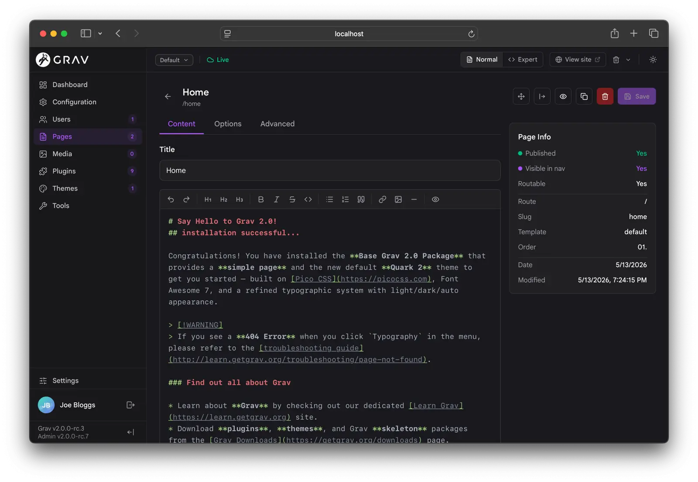

Admin Next は、完全にライト・ダークモードをサポートし、アクセントカラー、ロゴ、フォント、そしてフォントサイズがカスタマイズ可能です。

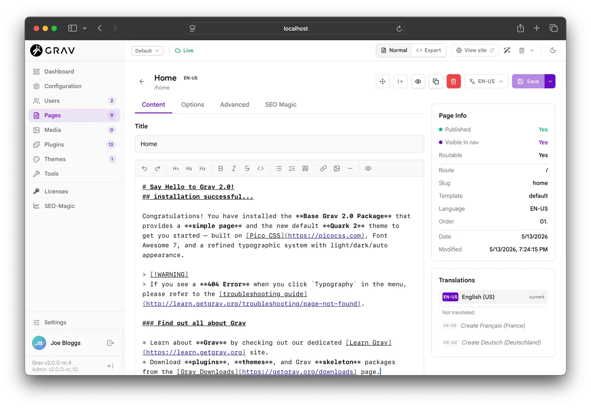

シェルについて、知っておくと便利な詳細情報：

- トップバーにある **環境セレクター（environment selector）** は、管理パネルから離れることなく `Default` と `user/env/` 設定を切り替えられます。設定を保存すると、選択された環境に差分保存（有効なベース設定とは異なるキーのみが保存）されます。ドロップダウンから新しい環境を作成することもできます。
- **プレゼンスクラスター（presence cluster）** は、あなたと同時に管理パネルにいるすべてのアバターが、それぞれの同期状態を意味する色付きのドットとともに表示されます。この機能は、オプションの **sync** プラグインが必要です。
- **サイドバーバージョンラベル（sidebar version labels）** は、現在実行中の `Grav` 及び `Admin` のバージョンが表示され、アップデー後に自動で更新されます。
- インターフェースは、スマホウィジェットにレスポンシブダウンします：サイドバーはモバイルで非表示となり、ツールバーはアイコンに縮小され、ページリストは二番目の列を非表示にします。

## ダッシュボード{#the-dashboard}

ダッシュボードは、完全にカスタマイズ可能で、各ユーザーがアレンジ可能なマルチウィジェットグリッドです。
スーパー管理者は、サイト全体に適用されるレイアウトを保存できるため、全員が同じ状態からスタートできます。

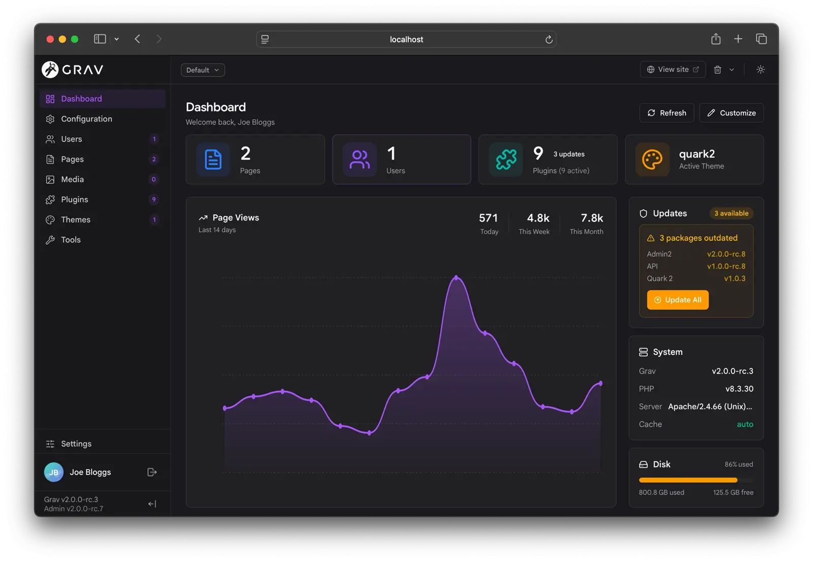

エディットモードにするには、上部にある **Customize** ペンシルマークをクリックしてください。
各ウィジェットに、ドラッグ操作ハンドル、サイズ選択（`SM` / `MD` / `LG` / `XL` をサポート）、そして隠すトグルボタンのツールバーが表示されます。
"Add a widget" タイルで、隠したものすべてを再表示できます。
カスタマイズツールバーから、3つの表示が利用可能です： **Default**, **Minimal** （統計と最近のページ）, そして **Compact** （すべてのウィジェットを最小サイズにする）。スーパー管理者は、 **サイトのデフォルトとして保存** することもできます。

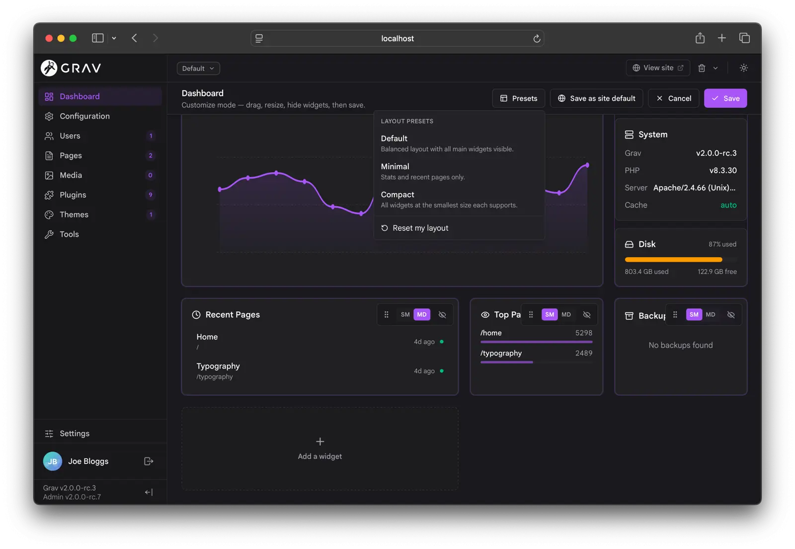

グリッドは、4列のレスポンシブレイアウトを使います。標準的なウィジェットをいくつか紹介します：

- **Updates** is front-and-center: a Grav-core callout (`current → available` with an Upgrade button) above a package panel with per-row version chips and an Update All button.
- **Notifications** renders promo cards, info, notices, and warnings with icons, markdown messages, and relative dates.
- **System Health** tracks PHP and Grav versions, available updates, scheduler status, and cache state.
- **Page Views**, **Top Pages**, **Recent Pages**, and **Backups** round out the standard set.

Plugins can contribute their own widgets through the API, and they appear in the picker and size selector automatically.

## ページ{#pages}

ページビューは、3つの初期表示があります： **Tree**, **List** そして **Columns** （ミラー）

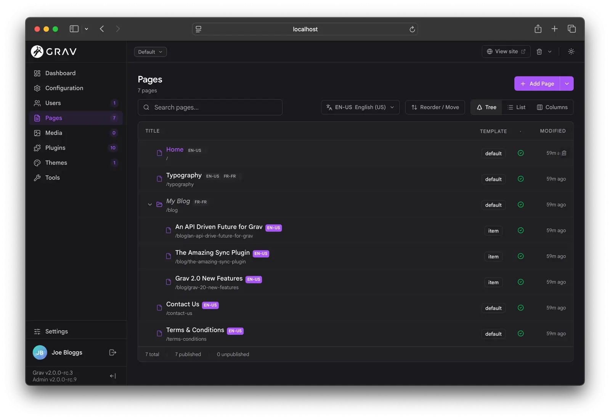

ツールバーは、3つすべての表示に共通しています：ビューモード選択、API（でバウンス済み、最大結果500の）フルサイト検索する検索欄、多言語サイト用の言語選択、再並べかえトグル、 **Add Page** ボタンです。

**Add Page** ボタンは、3つの方法に分割されています：メインボタンは、通常ページを追加し、山型ボタンを開くと **Add Folder** メニュー（ `.md` ファイルの無い、ルーティングやフォルダのグループ分け用のフォルダ）及び **Add Module** （Grav のモジュラー規約の通り、 `_` のプレフィックスを自動で付与されるモジュラーサブページ）を追加します。

A few things worth flagging across the views:

- **Page visibility** is shown with a two-tone icon: visible pages use the accent color, non-visible pages drop to muted grey.
- **Drafts** carry an amber `Draft` pill.
- **Translation badges** sit inline next to the title and highlight the active language.
- **Symlink indicators** appear on plugins, themes, and pages installed via symlink.
- **Background refreshes are silent.** When another tab saves a page, the affected row updates in place without flipping a skeleton.

The **Columns view** gives you a finder-style drill-down with an inline preview pane on wider screens.

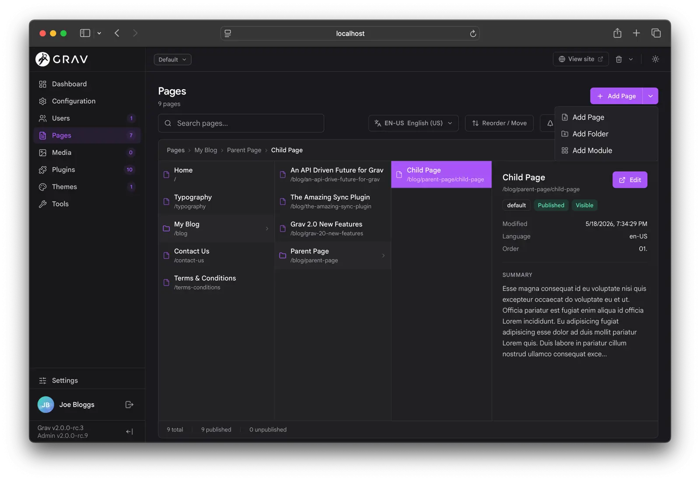

Multi-language support is a major focus of this version: it is easier to see what language you are in, to save as another supported language, and to check translation status in the right sidebar. You can also re-sync a page from the default language.

## ページエディタ{#the-page-editor}

The page editor renders its form straight from the page's blueprint. Every standard field type (text, textarea, toggle, select, list, array, file, media, color picker, date picker, code editor, markdown editor) is a native Svelte component with keyboard support, ARIA hooks, and live validation against the blueprint's `validate:` block. Custom field types from plugins load on demand as web components.

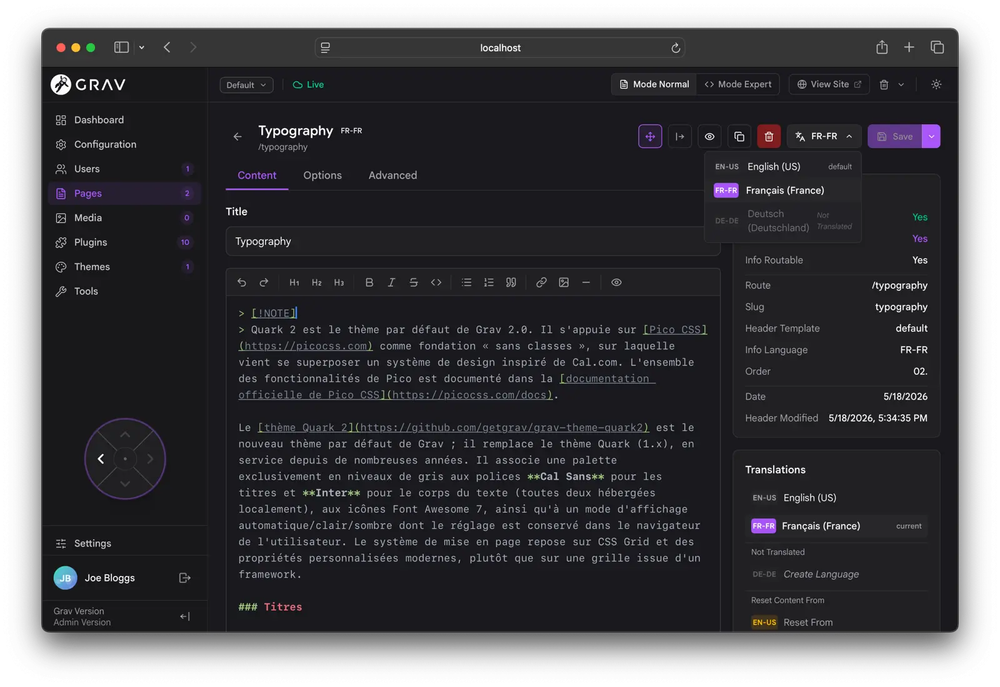

A few of the headline changes:

- The **Normal/Expert** toggle (between the blueprint-driven form and raw frontmatter editing) lives in the global topbar, next to View Site.
- **Presence avatars** for the page sit in the topbar. Click them to see who else is editing.
- The **right rail** (Page Info, Translations, Page Media) is collapsible, and the state persists per browser.
- The **Page Navigator d-pad** is a small floating control that jumps to the parent, the previous or next sibling, or the first child.
- **Copy page** is back, alongside Save, Preview, Delete, and a per-language Save-as split.

Expert mode exposes the raw frontmatter and advanced page settings for when you need to edit them directly.

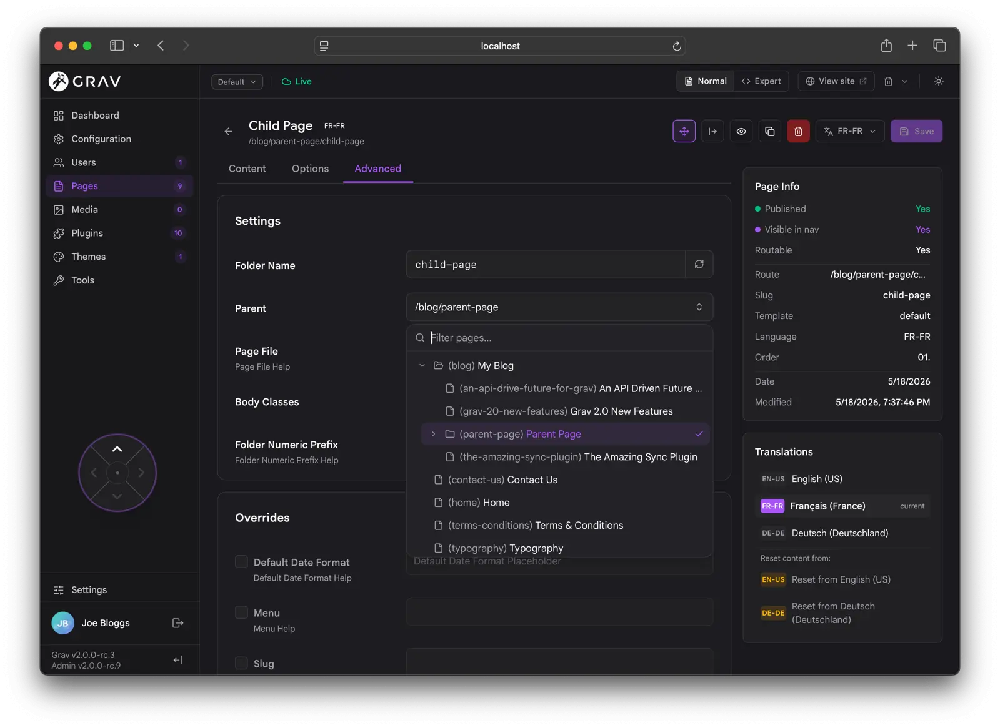

### リアルタイムコラボレーション編集{#real-time-collaborative-editing}

The page editor supports **real-time collaborative editing**, opt-in via **Settings → Editing → Real-time Collaboration**. Multiple users can edit the same page at once and see each other's changes character by character, with named cursors in the content editor and live presence avatars in the topbar.

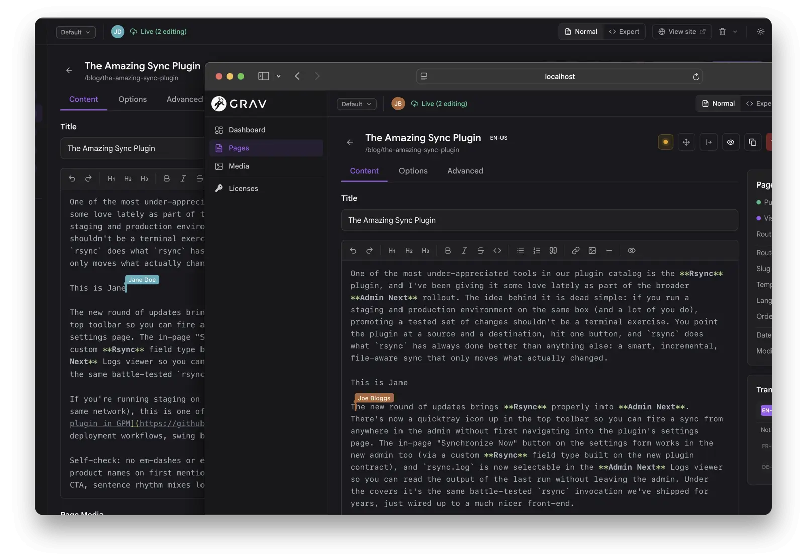

Under the hood the whole blueprint is mirrored into a shared **Yjs** document, not just the markdown body. Long-form text fields use character-level CRDT, toggles and selects use last-write-wins, and list/array fields merge concurrent additions instead of clobbering. The transport is short-polling by default; installing the `sync-mercure` plugin upgrades it to **Mercure** Server-Sent Events for sub-50ms updates.

## config 設定{#configuration}

The configuration page covers System, Site, Media, Security, Info, Plugins, and Themes. It has a single shared **filter input** that searches across every visible panel and tab, expanding sections that contain matches and highlighting the matched text.

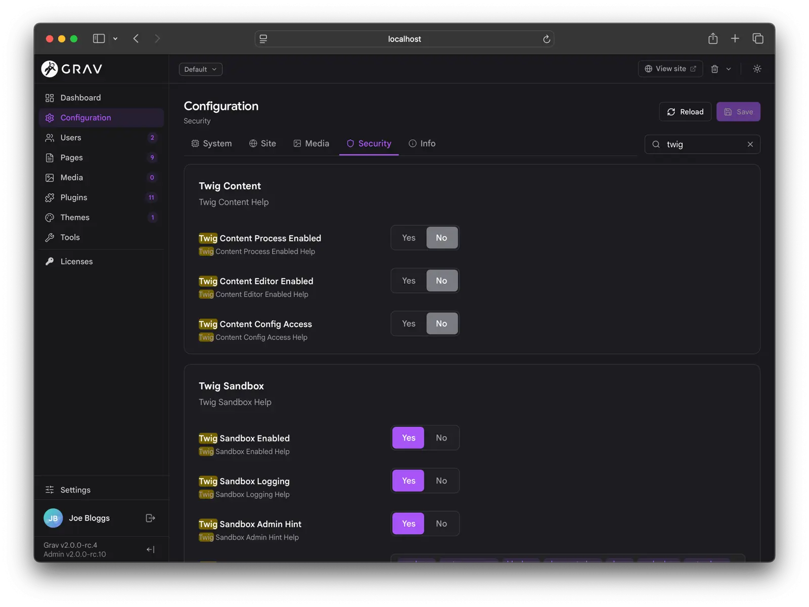

A couple of things worth knowing:

- **Twig in Content** is a security panel that gates editor-authored Twig in page content, exposing the global toggle, the editor-permission toggle, and the `config` access toggle in one place. See [Twig in Content](/20/content/twig-in-content) for the full feature.
- **Blueprint help and section bodies render HTML.** Inline `<code>`, `<strong>`, and similar tags work as they did in classic admin. The trust model is the same: blueprint YAML is server-controlled, not user-submitted.
- **Override-only saves** are standard: when saving a configuration or plugin config, only the values that differ from the defaults are written, so you can always tell what has actually changed.

## Plugins, Themes, and Users

The plugin and theme list pages share a layout: a filterable list on the left, a preview pane on the right on wider screens, and a top toolbar with batch actions like **Update All**.

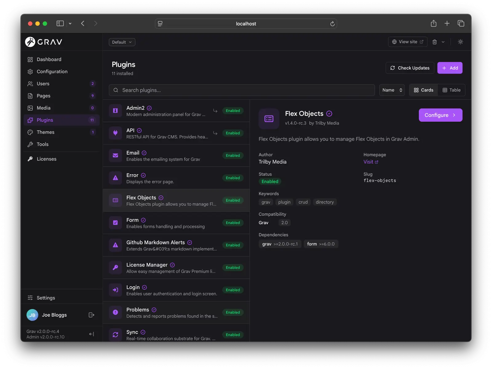

Update All shows failure reasons inline (Grav too old, PHP too old, conflicting version) instead of just a list of slugs. Installing a plugin pulls in missing blueprint dependencies automatically, and confirmation modals gate every update, upgrade, and uninstall.

User management lists users on the left with detail on the right, and a Permissions section that lays out the full ACL tree as a recursive tri-state picker (Allowed / Denied / Not-set).

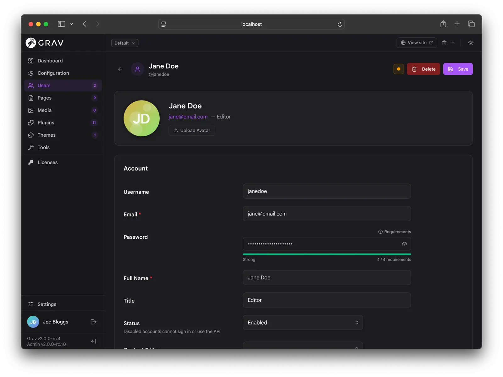

A few details:

- The **State** field (Enabled / Disabled) is exposed in the form. Admin Next injects it into the account blueprint at request time, gated to managers, so you can disable a user without hand-editing YAML.
- The **password fields** ship with a live strength meter and a requirements hint. The rules come from `system.pwd_regex` (or the new `system.pwd_rules` list of labeled rules), so what the user sees matches what the server enforces.
- **2FA enrollment** is built in: enable it, scan the QR with an authenticator app, and confirm with the six-digit code. Recovery codes are issued at setup and can be re-issued.

## Settings, Personalization, and Site Defaults

Settings is the personal-preferences home. Every user can set their **Appearance** (color mode, accent color, font, font size), **Pages defaults** (default view mode and items per page), **Editor** preferences, and **Admin language**.

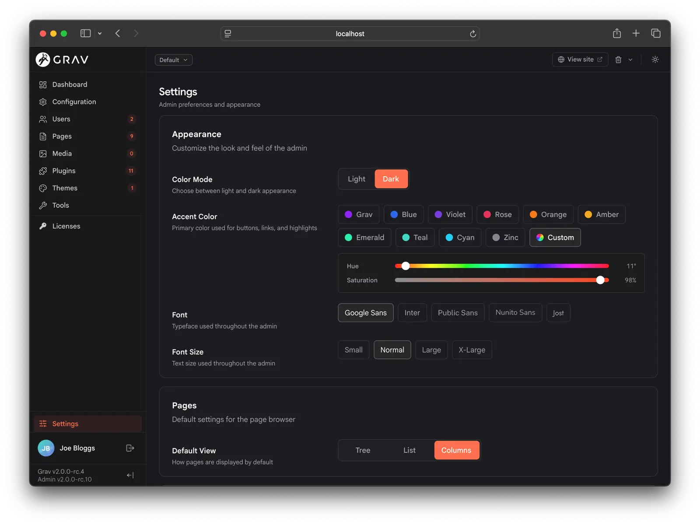

Personalization persists per user via the API, so logging in on another browser or device picks up your customizations automatically. Changes propagate across open tabs, and the background poll doubles as a session keep-alive.

Super-admins get a separate **Site Defaults** section for **site branding** (light/dark logo and brand text), **baseline appearance and editor preferences** for every user (which users can still override), **site-wide editing behavior** (auto-save, real-time collaboration), and **menubar links** shown in the top toolbar for everyone.

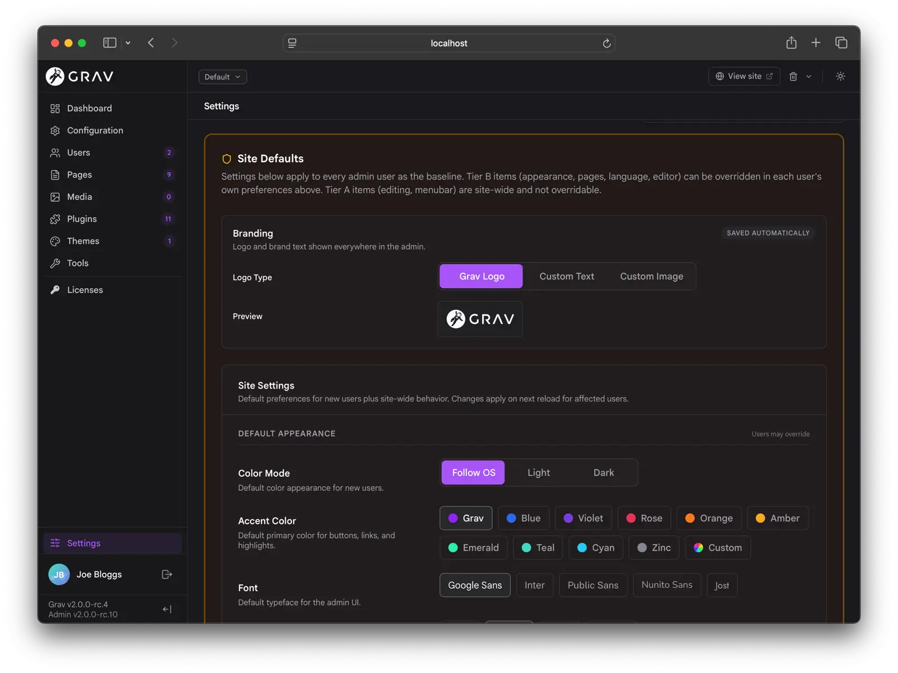

## Languages and Direction

Admin Next has a full **ICU MessageFormat** translation layer, with placeholders, plurals, select cases, and CLDR-aware plural categories applied per locale. Every translation key is looked up first as `ICU.<key>` (passed through ICU MessageFormat) and then as `<key>` (returned raw). A plugin can ship a single language file that works on both Grav 1 / classic admin and Grav 2 / Admin Next. See [Admin Translations](/20/plugins/admin-translations) for the details.

The admin ships with a complete `en.yaml` covering every toast, button title, aria-label, placeholder, and inline label. Picking a locale that Grav flags as right-to-left (Arabic, Hebrew, Persian, Urdu, and others) flips the entire admin to **RTL**.

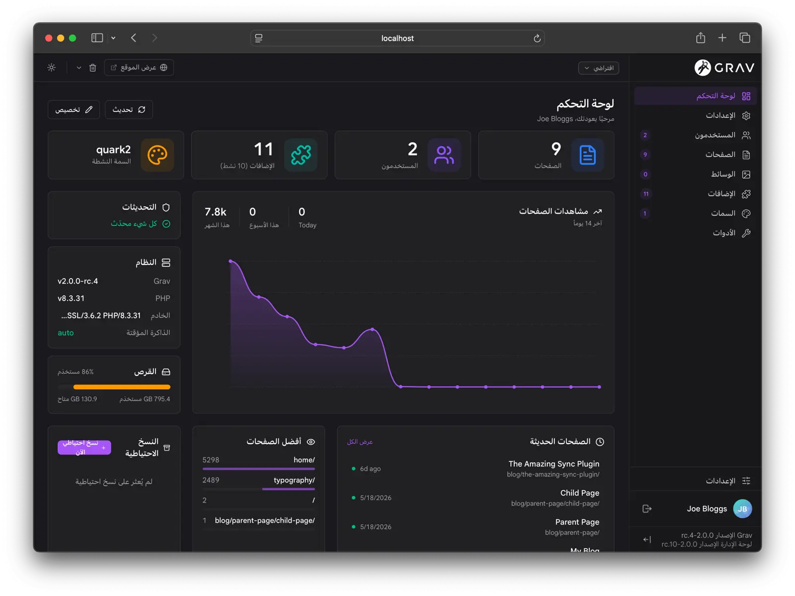

The RTL pass is more than a CSS direction flip: the sidebar and panels dock and animate from the correct edges, directional icons flip with the language, and the Page Navigator d-pad swaps its sibling semantics so a "next" arrow always points the way reading flows. Code editors stay left-to-right because code itself does not reverse.

## Tools

The **Tools** section gathers admin utilities that do not fit elsewhere: the **Logs** viewer, the **Reports** page, the **Scheduler** view, the **Cache** controls, and the **Backups** manager.

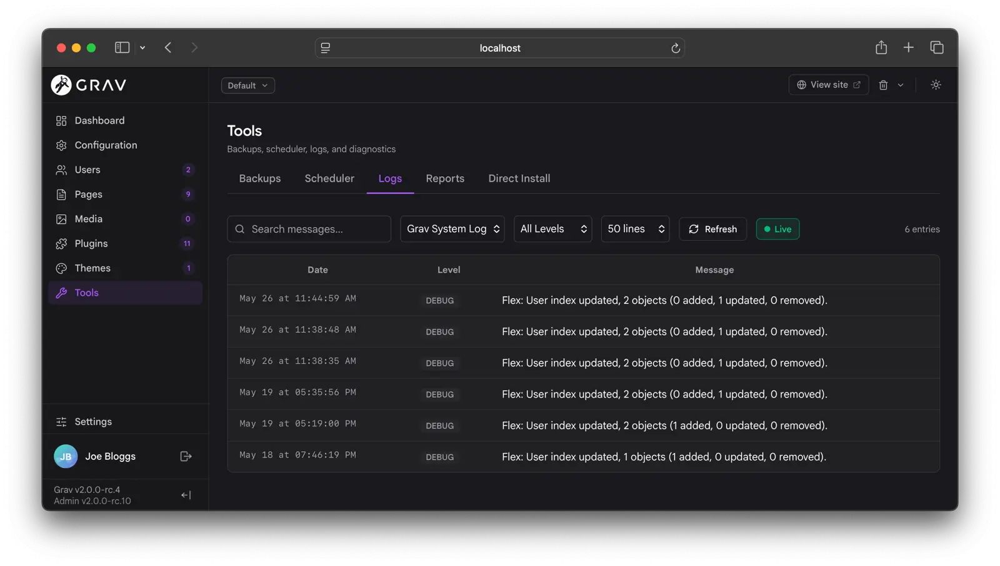

The **Logs** viewer lists `grav.log`, `email.log`, `scheduler.log`, and any log file a plugin contributes. On default installs where only the core logs exist, the file selector is hidden.

The **Reports** page is plugin-extensible. Built-in reports cover security configuration and YAML lint, and one of them is the [Twig in Content](/20/content/twig-in-content) report that lists pages whose content would leak raw Twig. Plugins can contribute their own diagnostic cards.

## A Unified Plugin Experience

Admin Next is built so that complex plugins feel like part of the admin rather than a separate interface bolted on. The same plumbing that powers the core admin (the API, the blueprint system, the web-component contract, and the sidebar, menubar, widget, panel, and report registries) is the plumbing every plugin uses. When a plugin ships its own admin section it appears as a first-class sidebar entry, opens with the same chrome as Pages or Users, renders forms with the same field components, and respects the same permissions, dark mode, accent color, and language.

The integration points cover what a complex plugin tends to need:

- **Full plugin pages** with their own sidebar entry, in either *blueprint mode* (ship a YAML form, admin renders it) or *component mode* (ship a web component, admin mounts it).
- **Custom blueprint field types** as web components, loaded on demand.
- **Settings panels** for configuration that belongs alongside system settings.
- **Menubar items** for one-click actions in the top toolbar.
- **Floating widgets** for persistent UI that lives across page navigation.
- **Context panels** that slide in from the edge of editors for editor-scoped tooling.
- **Custom reports** and **custom dashboard widgets**.

Each follows the same recipe: a small PHP event hook in the plugin, an optional JavaScript web component under `admin-next/{kind}/{slug}.js`, and any custom REST endpoints the UI needs. The full developer reference lives in the [API documentation](/20/api) and the [Developer Upgrade Guide](/20/migration/developer-upgrade-guide).

## How to Try It

Admin Next ships as the default admin in Grav 2.0. Stand up a fresh Grav 2.0 install on **PHP 8.3+**, complete the first-user wizard, and you are in. If you are coming from Grav 1.7, the [Migration](/20/migration) section walks through the side-by-side staged install: a clean 2.0 site is created next to your existing one, the migration wizard imports your content and configuration, and you promote it when you are happy.

The classic admin plugin remains available on the 1.7 line for sites that need it, but Admin Next is the path forward, and everything new lands there first.
