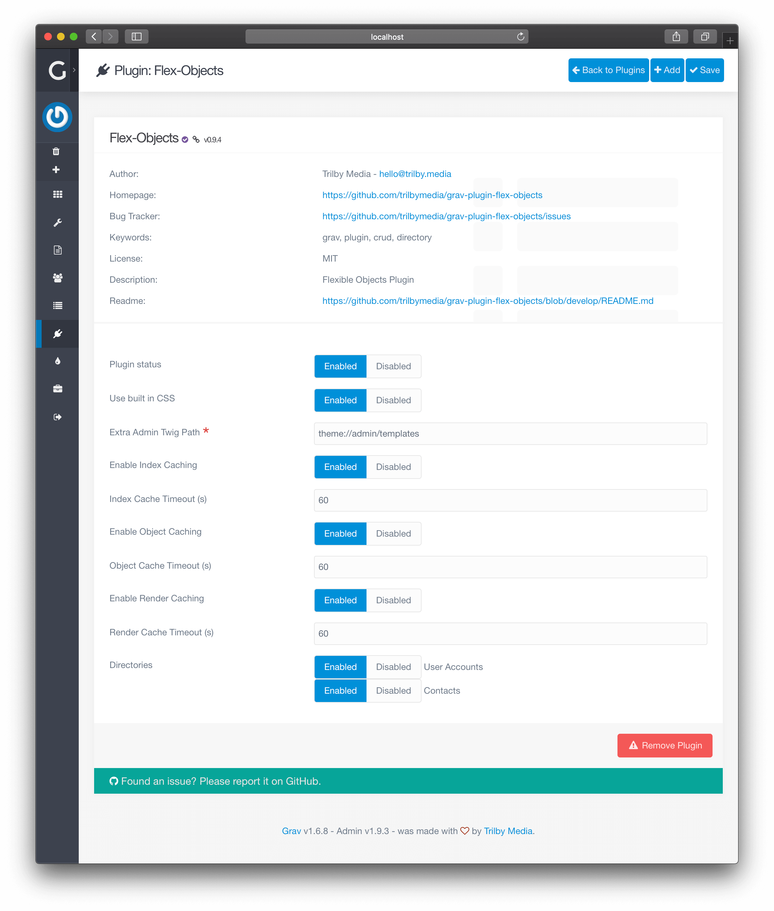
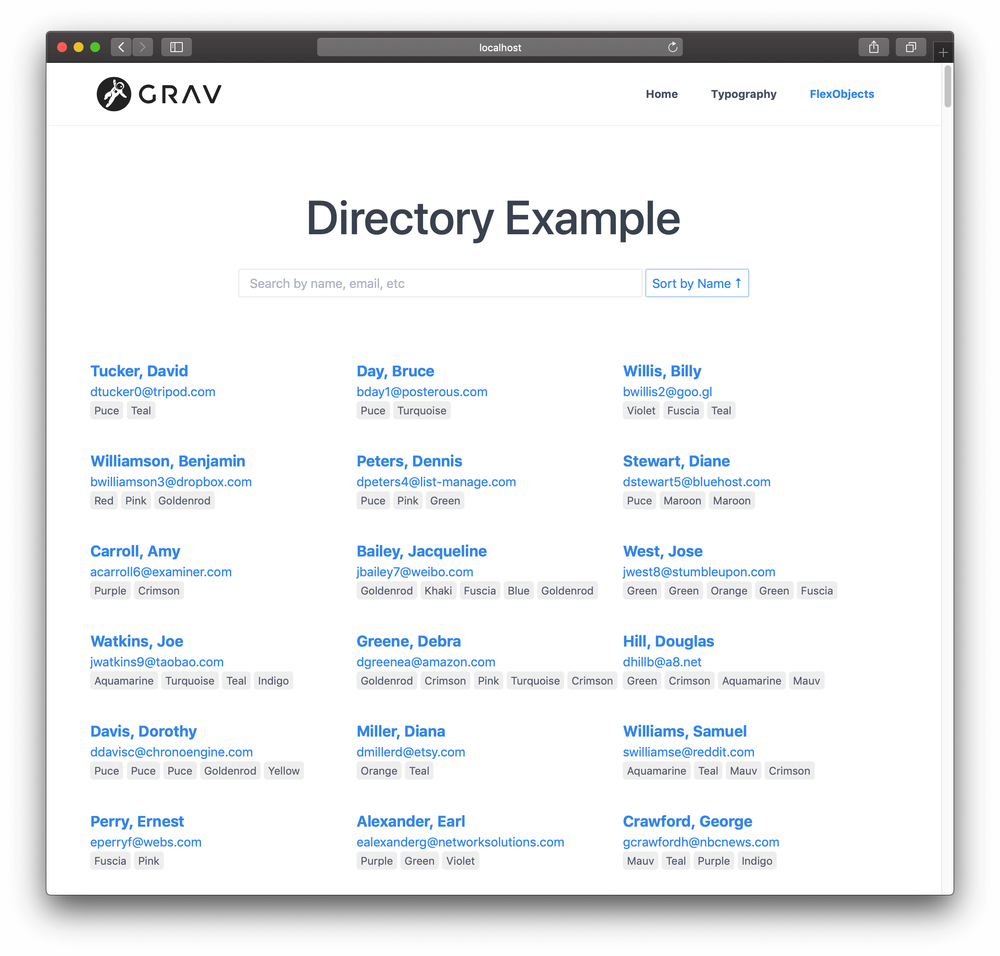
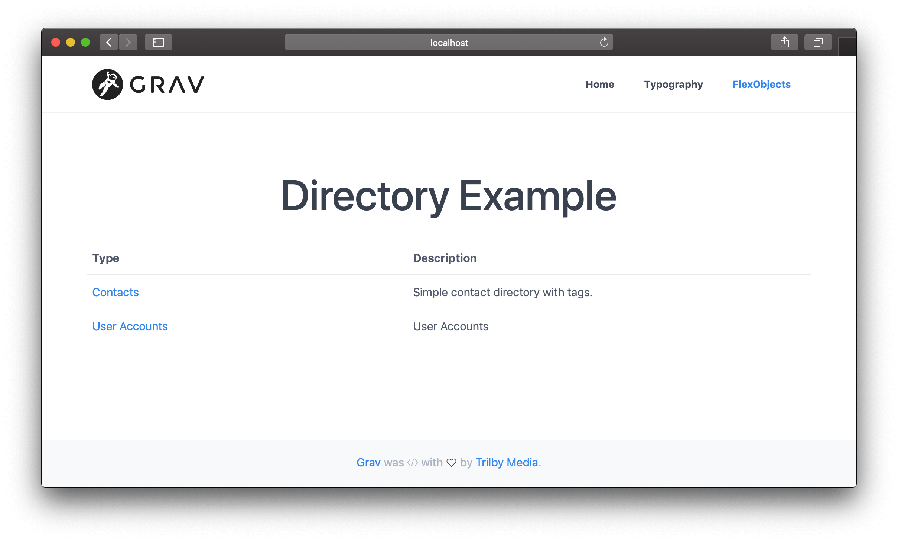

このセクションでは、既存の **Flex ディレクトリ** を速やかに有効化し、 Grav 管理パネルに表示するまでの手順について、解説します。  
具体例として、このデモのために、 **Flex Objects プラグイン** に含まれる **Contacts** flex ディレクトリを使用します。

## ディレクトリの有効化{#enabling-a-directory}

カスタムの **Flex ディレクトリ** を有効化するには、管理パネルのサイドバーから、 **Plugins** > **Flex Objects** へ移動してください。

ページの下の方に、 **Directories** 設定があります。  
この設定には、 Grav で検出されたすべての **Flex ディレクトリ** が一覧表示されます。



有効化したいディレクトリを見つけて、 **Enabled** オプションをチェックします。

このデモでは、 **Contacts** （連絡先）ディレクトリを有効化し、ページ上部にある **Save** ボタンをクリックします。

ページのリロード後、 Grav の管理パネルメニューに **Contacts** という新しい項目が表示されているはずです。

## サンプルデータのインストール（オプション）{#install-sample-data-optional}

今回の具体例のため、 **Contacts** flex ディレクトリ用のサンプルデータセットをコピーしたものとします。

```shell
$ cp user/plugins/flex-objects/data/flex-objects/contacts.json user/data/flex-objects/contacts.json
```

## ページの作成{#create-a-page}

**[管理パネルのページ](../../../../05.admin-panel/03.page/)** へ移動して、 [新しいページを追加](../../../../05.admin-panel/03.page/#adding-new-pages) してください。  
以下の値を入力してください。

- **Page Title** : `Directory`
- **Page Template** : `Flex-objects`

その後、 **Continue** ボタンをクリックします。

**[コンテンツエディタの Advanced タブ](../02.views-edit/)** で、次のように、フロントマターに `flex.direcory` が `contacts` となるようにしてください：

```twig
---
title: Directory
flex:
  directory: contacts
---

# Directory Example
```

ページがこれで良かったら、 **Save** をクリックします。

> [!Tip]  
> `Flex ディレクトリ` を指定しなかったとき、単一のディレクトリではなく、すべてのディレクトリからページが表示されます。

## ページを表示{#display-the-page}

作成したページに移動してください。  
**Contacts** を含む以下のようなページが表示されます。



ディレクトリを選択しなかった場合、代わりに、次のように表示されます。



