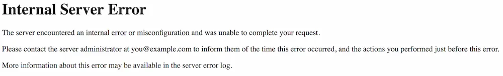

Grav には、独自の `.htaccess` ファイルが付属しています。このファイルによって、 Grav は適切に操作できます。このファイルは、ルートフォルダにあり続ける必要があります。 `.htaccess` ファイルを使って解決できる問題に出会うかもしれません。

Apache サーバーは、現在利用できる、もっとも人気のあるサーバーのひとつです。i
無料であり、ほとんどどこでも幅広く使えます。
不幸なことに、 Apache も完璧ではありません。
ときどき、 `.htaccess` ファイルが頭痛の種になることがあります。
気にすることはありません。それはほとんどの場合、常に柔軟に対応できます。

## Windows や maxOS で .htaccess の編集方法{#how-to-edit-htaccess-in-windows-and-macos}

.htaccess ファイルは、隠しファイルです。つまり、デフォルトでは macOS や Windows ユーザーには、ファイルマネージャー（ファインダー）で、このファイルが見えません。隠しファイルの表示を有効化しなければいけません。

**macOS** では：

1. **Terminal** を開いてください。
2. **Terminal** に `defaults write com.apple.finder AppleShowAllFiles YES` と入力し、 **return** キーを押してください。
3. **Terminal** に `killall Finder` を入力し、 **return** を押してください。

これで Grav を展開したフォルダの root ディレクトリに、 `.htaccess` ファイルが見えるようになったはずです。設定をもとの隠す状態に戻したいなら、この処理を繰り返し、 ステップ2 の `YES` になっているところを `NO` にして入力してください。

**Windows 10** では：

1. **File Explorer** を開いてください。
2. **View** タブを選択してください。
3. **Hidden Items** のとなりのボックスにチェックを付けてください。

このボックスのチェックをはずすと、隠しファイルが隠れる状態に戻ります。 **File Explorer** に戻ると、デフォルトの状態になっています。

## .htaccess のテスト{#testing-htaccess}

たとえば、ブラウザを開いて、新しく作った Grav サイトを表示して見ましょう ... 見つかりません！
きれいな Grav サイトが表示されるはずの場所には、大きく、太字の `Not Found` メッセージが表示されています。
これは厄介な問題ですが、 `.htaccess` ファイルの調整だけで解決するシンプルな問題かもしれません。

`.htaccess` ファイルに関する問題のトラブルシューティングにおける最初の一歩は、そのファイルがサーバーに認識され、機能しているかどうかを確認することです。
そのファイルが、 Grav サイトのあるべきルートディレクトリに存在することを確認し、ピリオド（`.`）から始まる `.htaccess` という適切なファイル名であることを確認してください。

ファイルがそこにちゃんとあれば、次のステップとして、サーバーがそのファイルを認識するかテストし、確認しましょう。
このステップは、ファイルの最初に、一行追加するだけのシンプルな処理です。

テストするため、 `.htaccess` ファイルをテキストエディタで開いてください。
それから、最初の行に `Test.` を記入し、保存してください。



このエラーによって、問題そのものが解決するわけではありませんが、 Grav サイトのルートディレクトリにある `.htaccess` ファイルが、サーバーでパースされていることが分かります。

このエラーが表示されない場合、サイトのルートディレクトリにそのファイルがあるか確認してください。
オリジナルの Grav がインストールされたディレクトリにこのファイルが存在する必要があります。
このようなミスがあるため、 zip 圧縮された Grav を展開したときに、ファイルをコピーアンドペーストするのではなく、ディレクトリごとサイト表示したい場所に移動させることを、推奨しています。
コピーではなく、ディレクトリごと移動させることは、すべてのファイルとディレクトリ構造が、同じ状態になり、上記のような問題を引き起こさないことを保証してくれます。

## 壊れた .htaccess のトラブルシューティング{#troubleshooting-a-broken-htaccess}

.htaccess ファイルを編集したときに、何も変化がなければ、 `.htaccess` が有効であるか確認する必要があります。
もし無効だった場合、サーバーは、一番最初の .htaccess さえ探しにいきません。

対策は次の通りです：

`httpd.conf` もしくは `apache.conf` ファイルを探し、テキストエディタで開きます。
Windows では、これはメモ帳か、開発用に作らてたテキストエディタになります。
Word で開く場合、不必要な情報が追加されてしまい、問題を悪化させる可能性があります。

次に、ファイル内の `Directory` エリアを探してください。
次のようなテキストブロックにあるはずです：

```txt
    #
    # AllowOverride controls what directives may be placed in .htaccess files.
    # It can be "All", "None", or any combination of the keywords:
    #   Options FileInfo AuthConfig Limit
    #
    AllowOverride All
```

もし `AllowOverride` が `None` や `All` 以外に設定されていたら、 `All` に変更して、保存してください。
この変更により、 Apache サーバーの登録をリセットするため、リスタートする必要があるでしょう。

この設定を終えたら、次のテストを実行します。

Grav 実行中の [404](../01.page-not-found/) エラーや、 [500](../03.internal-server-error/) サーバー内部エラーに対処する際に役立つトラブルシューティングガイドもありますので、それぞれ参照してください。

## .htaccess の具体例{#htaccess-examples} 

[https://www.askapache.com/htaccess/](https://www.askapache.com/htaccess/)

