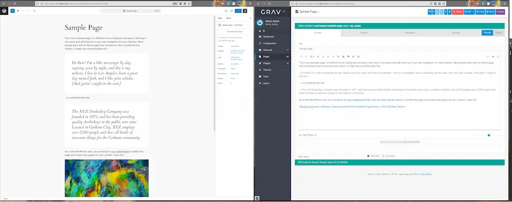
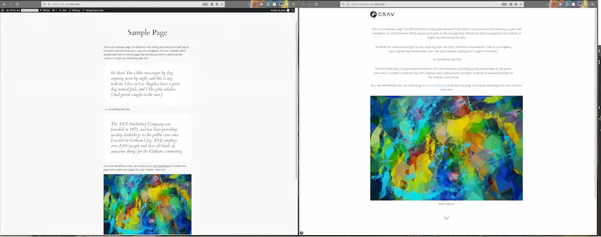
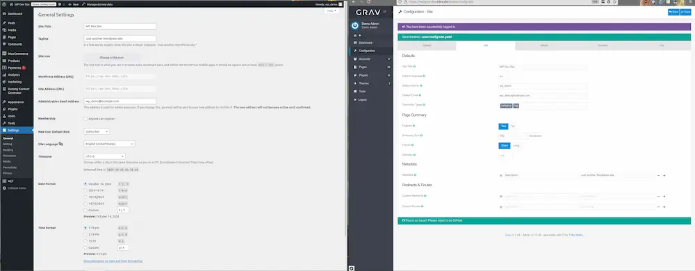

<h2 id="requirements">要件</h2>

* PHP v7.1 以上 (composer の依存関係のため)
* その WordPress がホストされている環境に [WP-CLI](https://wp-cli.org/) がインストールされている
* エクスポート元の WordPress サイトが機能している
* WordPress サイトの `wp-content/uploads` に読み/書きアクセスができる
* Grav がホストされる環境に [Composer](https://getcomposer.org/) がインストールされている

<h2 id="installation">インストール</h2>

1. 最新リリースの [wp2grav_exporter](https://github.com/jgonyea/wp2grav_exporter/releases) プラグインをダウンロードし、 WordPress の `wp-content/plugins` ディレクトリにアップロードしてください。
2. `wp2grav_exporter` ディレクトリ内で、依存関係のインストールのため、 `composer install --no-dev` を実行してください。
3. 新しいプラグインを有効にしてください：
   - wp-cli を使う： `wp plugin activate wp2grav_exporter` か、 GUI の管理パネルから有効化
4. すべてのアイテムをエクスポートするため、 `wp wp2grav-all` を実行してください。その他のオプションについては、以下を参照してください。
5. エクスポートされたファイルは、 `WP_ROOT/wp-content/uploads/wp2grav-exports/DATE` に置かれます。
6. Grav v1.6 サイトに対しては、ユーザーを表示し、管理するために [admin-addon-user-manager](https://github.com/david-szabo97/grav-plugin-admin-addon-user-manager) を推奨します。 Grav 1.7 以上のサイトには不要です。

<h2 id="notes">注意点</h2>

> `wp wp2grav-all` を実行すると、以下のエクスポートの各手順を、一度に実行することになります。エクスポートの実行後、後述の各セクションに従って、インストールされている Grav に、データをインポートしてください。

<h2 id="exporting-users-from-wordpress">WordPress からユーザーのエクスポート</h2>

左にある WordPress ユーザー一覧を、右の Grav にエクスポートしました。

<h3 id="command">コマンド</h3>

`wp wp2grav-users` により、 Grav のユーザーアカウントファイルが生成されます。

<h3 id="results">結果</h3>

* ユーザーアカウントは、 `EXPORT/accounts/` 下のエクスポートディレクトリにあります。
  * ユーザーネームは、 3文字以上16文字以下になります。
  * もしユーザーネームが短縮されたり調整された場合、衝突を避けるため、ユーザーネームに、 WordPress の uid も付与されます。
  * 各アカウントのパスワードはランダムに生成され、対応する WordPress アカウントとは関係ありません。アカウントが初回に認証を行うと、平文のパスワードは自動でハッシュ化されたパスワードに変換されます。

<h3 id="importing-users-to-grav">Grav へのユーザーのインポート</h3>

`EXPORT/accounts` ディレクトリを、 `user` ディレクトリにコピーしてください（たとえば: username.yaml ファイルは、 `user/accounts` ディレクトリ内に置かれるべきです）。

<h2 id="exporting-user-roles-from-wordpress">WordPress からユーザーロールのエクスポート</h2>

左の WordPress のロール付きユーザーを、右の Grav グループにエクスポートしました。

<h3 id="command-1">コマンド</h3>

`wp wp2grav-roles` により、 Grav の groups.yaml ファイルを生成します。

<h3 id="results-1">結果</h3>

WordPress ユーザーロールは、 `config/groups.yaml` にある `groups.yaml` ファイルの Grav グループとしてエクスポートされます。  
ロールのエクスポートには、いくつかの注意点があります:

* 各 WordPress ロールは、 Grav の `wp_<アンダースコア付きロール>` グループに変換されます（例: `subscriber` の場合、 `wp_subscriber` になります）。
* WordPress 管理者ユーザーロールは、 `wp_administrator` グループを受け取ります。
* `wp_administrator` グループは、 `admin.login` アクセスとともに `admin.super` アクセスを受け取ります。これらのパーミッションを持つアカウントは、 Grav サイトのすべての管理権限を持ちます！
* `wp_authenticated_user` グループと呼ばれる新しい Grav グループは、 `admin.login` アクセスを受け取ります。
* すべてのアカウントは、 `wp_authenticated_user` グループを受け取ります。

<h3 id="importing-user-roles">ユーザーロールのインポート</h3>

`EXPORT/config` ディレクトリを、 `users/config` にコピーしてください。

<h2 id="exporting-post-types-from-wordpress">WordPress から投稿タイプのエクスポート</h2>

WordPress の投稿タイプ（post type）は、（上記画像で黄色く強調しているような） "WP" 付きの Grav ページタイプに変換されます。

<h3 id="command-2">コマンド</h3>

* `wp wp2grav-post-types` により、 WordPress 投稿タイプに対応したページタイプとともに、基本的な Grav プラグインを生成します。

<h3 id="results-2">結果</h3>

* Grav プラグインは、管理パネルツール内で、基本的なフィールド機能を表示するものとして生成されます。

<h3 id="importing-post-types-to-grav">Gravへの投稿タイプのインポート</h3>

* `EXPORT/plugins` ディレクトリを `user` ディレクトリにコピーしてください。
* Grav の `user/plugins/wordpress-exporter-helper` プラグインディレクトリに移動し、 `composer install` を実行してください。

<h2 id="exporting-posts-from-wordpress">WordPress から投稿のエクスポート</h2>

左にある WordPress の管理パネルの "Sample Page" を、右の Grav のマークダウンにエクスポートします。

左にある WordPress の管理パネルの "Sample Page" をエクスポートし、右のように Gravu によるレンダリング表示します。

<h3 id="command-3">コマンド</h3>

* `wp wp2grav-posts` により、すべての投稿をエクスポートします。

<h3 id="results-3">結果</h3>

* 各 投稿/固定ページ は、たとえば各タイトルのようなメタデータに対応したディレクトリにエクスポートされます。
* ライブラリメディアは、 `data/wp-content` にコピーされ、インラインコンテンツは、（最終的に）そのページのディレクトリ内に含まれます。

<h3 id="importing-posts-to-grav">Gravへの投稿のインポート</h3>

* `EXPORT/pages` ディレクトリを `user` ディレクトリにコピーしてください。
* `EXPORT/data` ディレクトリを `user` ディレクトリにコピーしてください。

<h2 id="exporting-site-metadata-from-wordpress">WordPress からサイトのメタデータのエクスポート</h2>

左の WordPress 管理パネルに表示される一般設定を、右の Grav サイトの config 設定にエクスポートします。

<h3 id="command-4">コマンド</h3>

* `wp wp2grav-site` により、サイトのメタデータがエクスポートされます。

<h3 id="results-4">結果</h3>

* Grav サイトのメタデータは、 `EXPORT/config/site.yaml` に保存されます。

<h3 id="importing-site-metadata-to-grav">Grav へのサイトのメタデータのインポート</h3>

* `EXPORT/config/site.yaml` を、`user/config/site.yaml` にコピーしてください。

