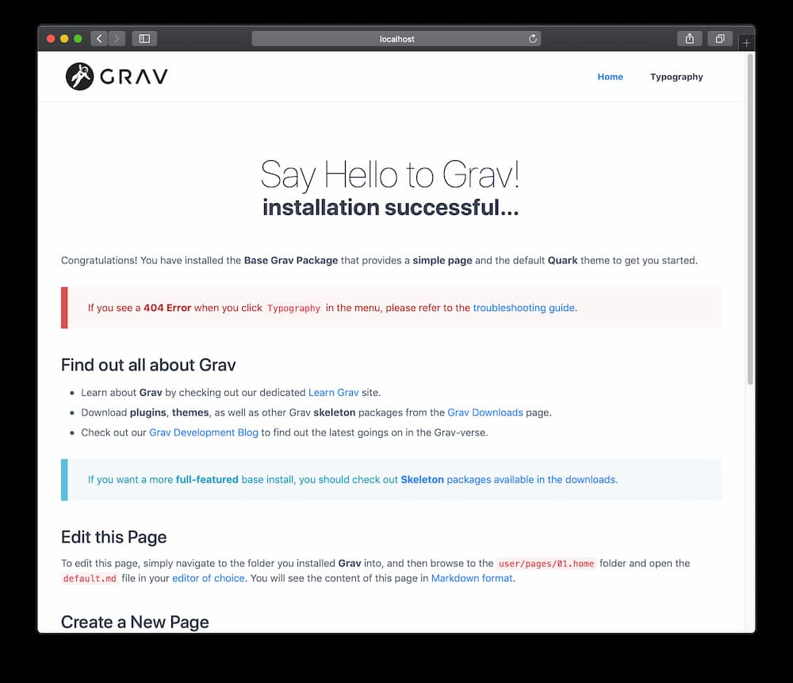
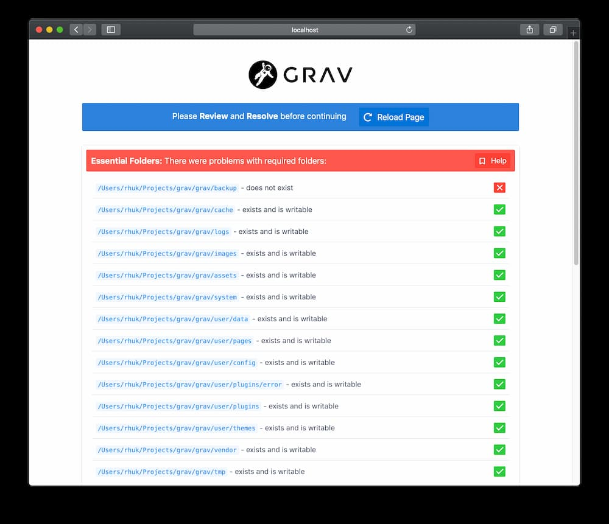

Gravのインストールはかんたんです。実際、本当の意味でのインストールはありません。Gravをインストールする方法はいくつかあります。まず、最もかんたんな方法は、 **zip** アーカイブファイルをダウンロードして、それを展開することです。2つ目の方法は、 **Composer** によってインストールする方法です。3つ目の方法は、 **GitHub** から直接ソースのプロジェクトをクローンし、そこに含まれるスクリプトコマンドを実行し、必要な依存関係をインストールすることです。バンドルされたスクリプトを実行する[さらなる方法](#further-options)もあります。

<h2 id="check-for-php-version">PHPのバージョンを確認</h2>

Gravは、驚くほどかんたんに構築して動かすことができます。少なくとも、PHPのバージョンが7.3.6以上であることを確認してください。ターミナルで、`php -v`とタイプすることでわかります。


```bash
php -v
PHP 7.3.18 (cli) (built: Jun  5 2020 11:06:30) ( NTS )
Copyright (c) 1997-2018 The PHP Group
Zend Engine v3.3.18, Copyright (c) 1998-2018 Zend Technologies
    with Zend OPcache v7.3.18, Copyright (c) 1999-2018, by Zend Technologies
```

<h2 id="option-1-install-from-zip-package">選択肢1: ZIPパッケージからインストール</h2>

Gravをインストールする最もかんたんな方法は、ZIPパッケージをダウンロードして、展開することです：

1. 最新で最上位の **[Grav](https://getgrav.org/download/core/grav/latest)** もしくは **[Grav + Admin](https://getgrav.org/download/core/grav-admin/latest)** パッケージを、ダウンロードしてください
2. そのZIPファイルを、ウェブサーバの[webroot](https://www.wordnik.com/words/webroot)に展開してください。たとえば、 `~/webroot/grav`

> [!Tip]  
> [Skeleton](https://getgrav.org/downloads/skeletons) パッケージも利用できます。それは、Gravコアシステムと、サンプルページ、プラグイン、諸設定が含まれます。Gravを始めて触るときには最適な方法です。お好みの[スケルトンをダウンロード](https://getgrav.org/downloads/skeletons)して、ステップに従うだけです。

getgrav.orgのサイトから、[タグ付きリリース](https://github.com/getgrav/grav/tags)をダウンロードし、インストールすることもできます。`https://getgrav.org/download/タイプ/パッケージ/バージョン`という形式で使ってください。

- [getgrav.org/download/core/grav/1.7.0](https://getgrav.org/download/core/grav/1.7.0) downloads Grav Core v1.7.0
- [getgrav.org/download/core/grav/1.7.0-rc.10?testing=true](https://getgrav.org/download/core/grav/1.7.0-rc.10?testing=true) downloads Grav Core v1.7.0-rc.10, a testing release
- [getgrav.org/download/core/grav-admin/1.7.0](https://getgrav.org/download/core/grav-admin/1.7.0) downloads Grav Core with the Admin plugin, at Core v1.7.0
- [getgrav.org/download/core/grav-admin/1.7.0-rc.10?testing=true](https://getgrav.org/download/core/grav-admin/1.7.0-rc.10?testing=true) downloads Grav Core v1.7.0-rc.10 with the Admin plugin, a testing release
- [getgrav.org/download/core/grav-update/1.7.0](https://getgrav.org/download/core/grav-update/1.7.0) downloads the update package for Grav Core
- [getgrav.org/download/plugins/flex-objects-json/0.1.0](https://getgrav.org/download/plugins/flex-objects-json/0.1.0) downloads the Flex Objects JSON plugin at v0.1.0
- [getgrav.org/download/themes/quark/2.0.3](https://getgrav.org/download/themes/quark/2.0.3) downloads the Quark theme at v2.0.3

> [!Warning]  
> もしZIPファイルをダウンロードして、ウェブルートに移動しようとした場合、 **すべてのフォルダ** を移動させてください。なぜなら、いくつかの隠しファイル(.htaccessのような)があり、通常は移動時に選択されないからです。隠しファイルの見逃しにより、Gravを動かしたときに問題を引き起こす可能性があります。

<h2 id="option-2-install-with-composer">選択肢2: composerでインストール</h2>

次の方法は、[composer](https://getcomposer.org/doc/00-intro.md#installation-linux-unix-osx)を使って、Gravをインストールする方法です:

```bash
composer create-project getgrav/grav ~/webroot/grav
```

Gravの最先端のバージョンをチェックしたい場合は、`1.x-dev`をパラメータとして追加してください：

```bash
composer create-project getgrav/grav ~/webroot/grav 1.x-dev
```

<h2 id="option-3-install-from-github">選択肢3: GitHubからインストール</h2>

もう1つの方法として、GithubのリポジトリからGravをクローンして、依存関係のインストールをシンプルなスクリプトで実行する方法があります。

1. [GitHub](https://github.com/getgrav/grav)から、サーバのウェブルートに、Gravのリポジトリをクローンしてください。例：`~/webroot/grav`。 **ターミナル** または **コンソール** を起動し、webrootフォルダへ移動してください：

```bash
cd ~/webroot
git clone -b master https://github.com/getgrav/grav.git
```

2. [composer](https://getcomposer.org/doc/00-intro.md#installation-linux-unix-osx)を利用して、 **ベンダーの依存関係** をインストールをしてください：

```bash
cd ~/webroot/grav
composer install --no-dev -o
```

3. [Grav CLIアプリケーション](../../07.cli-console/02.grav-cli/)の `bin/grav` を使って、 **プラグイン** と、 **テーマの依存関係** をインストールしてください：

```bash
cd ~/webroot/grav
bin/grav install
```

これにより、GitHubから必要な依存関係をこのGravのインストールに直接 **クローンします** 。

<h2 id="further-options">その他の選択肢</h2>

<h3 id="install-with-docker">Dockerでインストール</h3>

[Docker](https://en.wikipedia.org/wiki/Docker_(software)) は、サーバとローカル環境の両方でプラットフォームやサービスを起動するための非常に効率的な方法です。同じにする必要がある複数の環境をセットアップしたり、共同作業をしている場合、インストール間の一貫性を確保する簡単な方法を提供します。複数のGravサイトを開発している場合、Dockerを使用してセットアップを効率化することができます。

[Apache](https://github.com/getgrav/docker-grav)（公式イメージ）や、[Nginx](https://github.com/dsavell/docker-grav)、 [Caddy](https://github.com/hughbris/grav-daddy)ウェブサーバーを使用する安定したDockerイメージが利用可能です。検索すれば、試せるものがもっと見つかるでしょう。どのイメージであっても、Gravの `user` 、`backups` 、 `logs`フォルダを保存するvolumeを作成してください。（ `backups` と `logs` は、そのデータを保持する必要がない場合はオプションです）。

### Install on Cloudron

Cloudron is a complete solution for running apps on your server and keeping them up-to-date and secure. On your Cloudron you can install Grav with a few clicks. If you host multiple sites, you can install them completely isolated from one another on the same server.

[button: Cloudron install](https://cloudron.io/store/org.getgrav.cloudronapp.html)

The source code for the package can be found [here](https://git.cloudron.io/cloudron/grav-app).

### Install through Linode Marketplace

If you use Linode servers, there is an [easy, documented method using Linode Marketplace](https://www.linode.com/docs/guides/grav-marketplace-app/). This will set up a new Grav site on a new dedicated Linode virtual server. The virtual server will incur a periodic charge.

<h2 id="webservers">webサーバ</h2>

<h4 id="apache-iis-nginx">Apache/IIS/Nginx</h4>

Gravを、Apacheや、IIS、Nginxなどのウェブサーバーで使用することは、Gravを[webroot](https://www.wordnik.com/words/webroot)下のフォルダに展開するのと同じくらい単純です。機能に必要なのは PHP 7.3.6 以上であることだけなので、サーバーインスタンスがその要件を満たしていることを確認してください。Grav の要件の詳細については、このガイドの[システム要件](../02.requirements/)の章を参照してください。

もしwebrootが、たとえば `~/public_html` であるとき、このフォルダに展開し、`http://localhost` からサイトにつながります。 `~/public_html/grav` に展開したときは、 `http://localhost/grav` からつながります。 

> [!Tip]  
> すべてのウェブサーバには設定が必要です。Gravは、デフォルトで.htaccessファイルによって、Apacheサーバに適用されます。そして、[デフォルトサーバ設定ファイル集](https://github.com/getgrav/grav/tree/master/webserver-configs)により、`nginx`や、 `caddy server`、`iis`、`lighttpd`に適用されます。必要に応じて、これらのファイルを利用してください。

<h4 id="running-grav-with-the-built-in-php-webserver">GravをPHPのビルトインサーバで動かす</h4>

PHPがインストールされていれば、PHPのビルトインサーバを利用して、Gravを、ターミナルやコマンドプロンプトから、かんたんなコマンドで実行することができます。

ターミナルやコマンドプロンプトで、Gravをインストールしたrootフォルダへ移動し、`bin/grav server` を実行するだけです。

> [!Info]  
> 技術的には PHP がインストールされていればよいのですが、[Symfony CLIアプリケーション](https://symfony.com/download)をインストールすれば、サーバーは SSL 証明書を提供するので、`https://` を使い、よりよいパフォーマンスのために PHP-FPM を利用できます。

このコマンドを実行すると、以下に示すような出力がされます：

```bash
➜ bin/grav server

Grav Web Server
===============

Tailing Web Server log file (/Users/joeblow/.symfony/log/96e710135f52930318e745e901e4010d0907cec3.log)
Tailing PHP-FPM log file (/Users/joeblow/.symfony/log/96e710135f52930318e745e901e4010d0907cec3/53fb8ec204547646acb3461995e4da5a54cc7575.log)
Tailing PHP-FPM log file (/Users/joeblow/.symfony/log/96e710135f52930318e745e901e4010d0907cec3/53fb8ec204547646acb3461995e4da5a54cc7575.log)

[OK] Web server listening
The Web server is using PHP FPM 8.0.8
https://127.0.0.1:8000


[Web Server ] Jul 30 14:54:53 |DEBUG  | PHP    Reloading PHP versions
[Web Server ] Jul 30 14:54:54 |DEBUG  | PHP    Using PHP version 8.0.8 (from default version in $PATH)
[PHP-FPM    ] Jul  6 14:40:17 |NOTICE | FPM    fpm is running, pid 64992
[PHP-FPM    ] Jul  6 14:40:17 |NOTICE | FPM    ready to handle connections
[PHP-FPM    ] Jul  6 14:40:17 |NOTICE | FPM    fpm is running, pid 64992
[PHP-FPM    ] Jul  6 14:40:17 |NOTICE | FPM    ready to handle connections
[Web Server ] Jul 30 14:54:54 |INFO   | PHP    listening path="/usr/local/Cellar/php/8.0.8_2/sbin/php-fpm" php="8.0.8" port=65140
[PHP-FPM    ] Jul 30 14:54:54 |NOTICE | FPM    fpm is running, pid 73709
[PHP-FPM    ] Jul 30 14:54:54 |NOTICE | FPM    ready to handle connections
[PHP-FPM    ] Jul 30 14:54:54 |NOTICE | FPM    fpm is running, pid 73709
[PHP-FPM    ] Jul 30 14:54:54 |NOTICE | FPM    ready to handle connections
```

ターミナルは、このアドホックなサーバ上のアクティビティをリアルタイムで更新します。`[OK] Web server listening` の行のURLをコピーし、ブラウザに貼り付ければ、管理者としてサイトにアクセスできます。

```
https://127.0.0.1:8000
```

> [!Warning]  
> この方法は、迅速な開発には便利なツールですが、ApacheやNginxのようなwebサーバでは **利用すべきではありません** 。

<h2 id="successful-installation">インストール成功</h2>

最初にロードされるとき、Gravはいくつかのファイルをコンパイルします。ブラウザを再表示させれば、表示速度が上がり、キャッシュされたものが得られます。



> [!Info]  
> 先ほどの例では、コマンドプロンプトが **$マーク** で表示されていました。これはプラットフォームにより見え方が異なることがあります。

標準では、Gravは、あなたが始められるようなサンプルページを用意しています。あなたのサイトはすでに完全に機能しており、あなたはそれを好きなように設定し、コンテンツを追加し、拡張し、カスタマイズできます。

<h2 id="installation-setup-problems">インストールとセットアップの問題</h2>

最初のページがロードされるときに（もしくは、キャッシュがクリアされたあとに）、なにか問題が見つかった場合、エラーページが表示されるかもしれません：



具体的な問題については、[Troubleshooting](../../11.troubleshooting/)をご参照ください。

> [!Note]  
> ファイルのパーミッションに関する問題であれば、[Permissionsに関するトラブルシューティングのドキュメント](../../11.troubleshooting/05.permissions/)をチェックしてください。また、さまざまなホスティング環境について解説している[ホスティングガイドのドキュメント](../../09.webservers-hosting/)も、見てください。

<h2 id="grav-updates">Gravのアップデート</h2>

サイトを最新に保つため、[Gravとプラグインのアップデート](../../01.basics/08.updates/)をお読みください。

