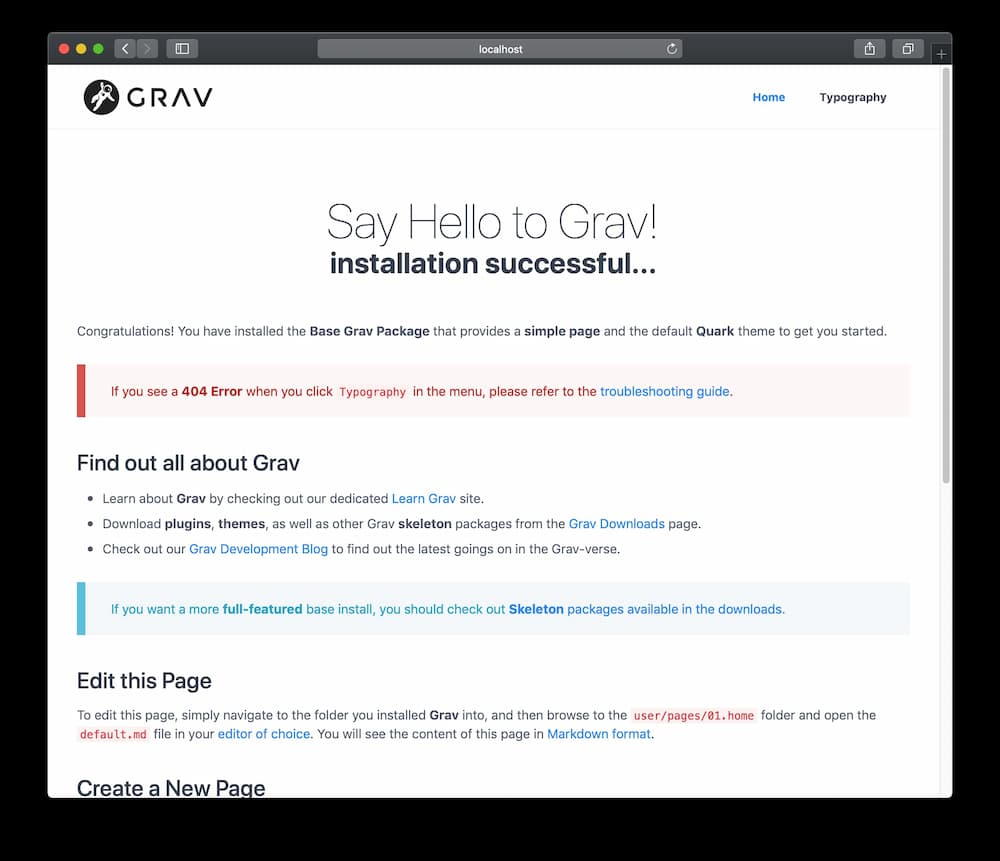
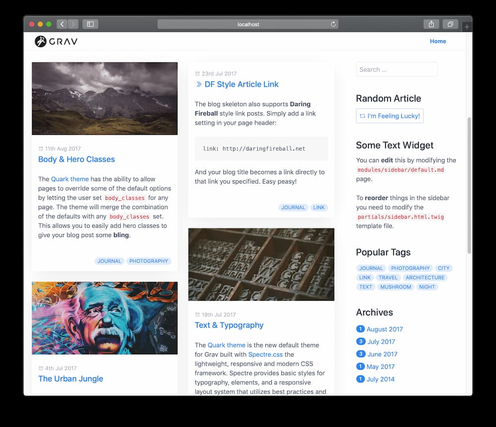

Gravでは、 **Page** とは、サイトの根本的な構成要素です。Gravシステムでは、これらページによって、コンテンツを書いたり、ナビゲーションを提供したりします。

コンテンツとナビゲーションを組み合わせることで、コンテンツ作成の初心者であっても、直感的に使用できるシステムを実現しています。しかしながら、このシステムは、強力なタクソノミー機能と組み合わせることで、複雑なコンテンツ要求にも応えられる十分なパワーを備えています。

Gravは、リッチなwebコンテンツを作成できる **3つのタイプのPage** を最初からサポートしています。これらのタイプは、次のようなものです：


> [!訳注]  
> 左から、通常、リスト、モジュラー

<h4 id="regular-page">通常ページ</h4>



通常のPageは、たとえば **ブログの投稿** や、**問い合わせフォーム** 、**エラーページ** のような、一般的な単一ページです。作成するページとしては、これが、最も普通のものです。デフォルトでは、Gravに何か別の指定をしない限り、ひとつのPageは、ひとつの通常のページとして認識されます。

**Gravコア** パッケージをダウンロードし、インストールしたとき、標準的なページに出迎えられます。シンプルな通常Pageの作り方は、[基本のチュートリアル](../../01.basics/04.basic-tutorial/)で解説しています。

<h4 id="listing-page">リストページ</h4>



これは、通常Pageの拡張です。ページのコレクションを参照するページです。

このページを設定する最も素直なアプローチは、リストPageの下に、**子ページ** を作ることです。このタイプの事例としては、**ブログの一覧ページ** がありうるでしょう。そこでは、子ページにあるブログ投稿の概要の一覧を表示します。

**表示順の設定** や、**アイテムの上限の設定** 、**ページネーション** を有効化するかどうかなどのいくつかの設定があります。

> [!Info]  
> **リストPage** を使った **ブログのスケルトン（ひな形）** のサンプルが、[Gravのダウンロード](https://getgrav.org/downloads/skeletons/) にあります。

<h4 id="modular-page">モジュラーページ</h4>


**モジュラーPage**　は、リストページの特別なタイプです。というのは、その **子ページ** や、**モジュール** から、**単一ページ** を作るからです。このことにより、モジュールからとても複雑な**1ページのレイアウト** を作ることができます。これは、モジュラーページの主要フォルダにある複数の **モジュール** から、**モジュラーPage** を制作することで達成されます。

> [!Info]  
> **モジュラーPage** を使った **1ページのスケルトン** のサンプルが、[Gravのダウンロード](https://getgrav.org/downloads/skeletons/) にあります。

これらのページはいずれも、同じ基本構造に従うため、各タイプの詳細を説明する前に、Gravでページがどのように作られるのかを説明しなければいけません。

> [!Info]  
> モジュールは、それ自体は別ページの部分になるためのものなので、URLを通して直接的に表示できるページではありません。このため、すべてのモジュールページは、デフォルトでは **ルーティング外** のものとして設定されています。

<h2 id="folders">フォルダ</h2>

すべてのコンテンツページは、`/user/pages` フォルダ下にあります。それぞれの **Page** は、それ自身のフォルダに置かれます。

> [!Info]  
> フォルダ名も、有効な **スラグ(slugs)** でなければいけません。スラグは、すべて小文字で、アクセント記号付きの文字はアルファベット文字に置き換えられ、空白文字は、エンコードされないようにダッシュやアンダースコアに置き換えられます。

Gravは、ピリオドが続く整数値が、順序付けのためだけのものであり、システム内で削除されることを理解しています。たとえば、`01.home` という名前のフォルダがあったとき、Gravはこのフォルダを `home` として扱いつつ、デフォルトの順序で `02.blog` よりも前にするようにします。

```
/user
└── /pages
    ├── /01.home
    │   ├── /_header
    │   ├── /_features
    │   ├── /_body
    ├── /02.blog
    │   ├── /blog-item-1
    │   ├── /blog-item-2
    │   ├── /blog-item-3
    │   ├── /blog-item-4
    │   └── /blog-item-5
    ├── /03.about-us
    └── /error
```

サイトには、エントリーポイントが必要です。エントリーポイントとは、ブラウザがサイトのルートにアクセスしたときに表示される場所です。たとえば、ブラウザに `http://yoursite.com` と打ち込んだとき、Gravは、デフォルトでは `home/` を表示します。しかし、[Grav設定ファイル](../../01.basics/05.grav-configuration/) にある `home.alias` オプションを変更することで、ホームの場所を上書きすることができます。

**モジュール** は、フォルダ名の最初をアンダースコア（`_`）にすることで区別できます。これは、**モジュラーコンテンツ** としてのみ使われることを意図する、特別なフォルダの種類です。これらは、**ルーティング外** ですし、ナビゲーションからも **見えません** 。モジュラーページの設定例としては、上記のフォルダの`user/pages/01.home` のようなものがあります。homeは、**モジュール** のコレクションを持つ **モジュラーページ** として設定され、この例ではhomeフォルダ内の、`_header`と、`_features`、 `_body` フォルダから構築されます。

各フォルダ名のテキストは、デフォルトでは、システムがURLの一部として使う _スラグ_です。たとえば、 `/user/pages/02.blog` のようなフォルダがあったとき、このページのスラグは、デフォルトでは `blog` となり、URL全体は、`http://yoursite.com/blog` となるでしょう。 `/user/pages/02.blog/blog-item-5` に位置するブログのひとつのページは、`http://yoursite.com/blog/blog-item-5` によってアクセスできます。

もし、フォルダ名に番号をつけなかった場合、そのページは **見えなくなり** 、ナビゲーションにも表示されません。上記のフォルダ構成における `error` ページがその例です。

> [!Tip]  
> この設定は、そのページの自身のヘッダに、[visibleパラメータ](../02.headers/#visible) を設定することで上書きできます。

<h2 id="ordering">表示順</h2>

コレクションを扱うとき、フォルダをどんな順番に並べるかの制御方法について、いくつかのオプションが選べます。最も重要な選択肢は、そのページの設定の `content.order.by` に設定するものです。選択肢は、以下の通りです：

| プロパティ | 説明 |
| -------- | ----------- |
| **default**  | ファイルシステムの順 （例） `01.home` before `02.advark` |
| **title**    | それぞれのページで定義された title の順 |
| **basename** | 数字順ではなく、そのフォルダのアルファベット |
| **date**     | それぞれのページで定義された date の順 |
| **modified** | そのページを修正したタイムスタンプ順 |
| **folder**   | The order is based on the folder name with any numerical prefix, i.e. `01.`, removed |
| **header.x** | ページのヘッダのフィールド順 （例） `header.taxonomy.year` 。また、パイプを用いてデフォルトを追加できます。（例） `header.taxonomy.year|2015` |
| **manual**   | `order_manual` 変数の順 |
| **random**   | 順序はなく、ランダム |

`content.order.custom` 設定のオプションによって、手動の特別な順番を定義することもできます。これは、 `content.order.by` と連動して働きます。というのも、まず手動の順番を試しますが、手動の順番から抜け落ちたページについては、もとの順序で並べられます。

> [!Info]  
> [Gravのシステム設定ファイル](../../01.basics/05.grav-configuration/) の `pages.order.dir` と `pages.order.by` オプションを設定することで、**デフォルトの振る舞い** を上書きできます。

<h2 id="page-file">ページファイル</h2>

ページフォルダの中で、具体的なページファイルを作成します。ファイル名は、マークダウンで書かれたファイルを示す `.md` で終わる必要があります。技術的には、これはYAMLフロントマターを含むマークダウンファイルであり、仰々しい印象を与えますが、大したものではありません。ファイル構成については、このあと解説予定です。

理解しておくべき重要事項は、このファイル名は、それを表示するテーマのテンプレートファイルを直接参照するということです。テンプレートファイルの標準的な名前は、 **default** です。つまり、多くのファイルは、 `default.md` です。

もちろん、ファイル名は好きにつけられます。たとえば： `document.md` というファイルがあるとき、Gravはテーマのテンプレートファイルを探し、 **document.html.twig** という名前に合うTwigテンプレートを探します。

> [!Info]  
> この振る舞いは、そのページのヘッダの[テンプレート・パラメータ](../02.headers/#template) を設定することにより、上書きできます。

ページファイルの例は、次のようなものです：

```
---
title: Page Title
taxonomy:
    category: blog
---
# Page Title

Lorem ipsum dolor sit amet, consectetur adipiscing elit. Pellentesque porttitor eu
felis sed ornare. Sed a mauris venenatis, pulvinar velit vel, dictum enim. Phasellus
ac rutrum velit. **Nunc lorem** purus, hendrerit sit amet augue aliquet, iaculis
ultricies nisl. Suspendisse tincidunt euismod risus, _quis feugiat_ arcu tincidunt
eget. Nulla eros mi, commodo vel ipsum vel, aliquet congue odio. Class aptent taciti
sociosqu ad litora torquent per conubia nostra, per inceptos himenaeos. Pellentesque
velit orci, laoreet at adipiscing eu, interdum quis nibh. Nunc a accumsan purus.
```

2つの `---` のマーカーの間にある設定は、YAML フロントマターとして知られており、一般的なYAMLの設定で構成されています。

この例では、タイトルと **blog** タクソノミーの設定がされています。2つ目の `---` の後にあるコンテンツが、サイトにHTMLとして表示される実際のコンテンツです。これは[マークダウン](../04.markdown/) で書かれ、後ほどの章で詳しく解説予定です。今のところ、`#` が　**見出し1** 、`**` が **太字** そして`_` が **斜体** ということを知っておいてください。

> [!Info]  
> `.md` ファイルが、`UTF-8` でエンコードされていることを確認してください。言語特有の文字に対応できます。

<h3 id="summary-size-and-separator">概要の文字数と区切り文字</h3>

`site.yaml` ファイルでは、要約のデフォルトの文字数を設定できます。ページの要約やあらすじを `page.summary()` によって表示できます。これは、ページコンテンツ全体ではなく、要約情報のみを一覧にしたいブログのようなときに特に便利です。

デフォルトでは、この値は `300` 文字です。`user/config/site.yaml` ファイルで、これを上書きできます。しかし、より便利なやり方があります。手動の **要約の分離記号(summary separator)** もしくは **要約の区切り記号(summary delimiter)** である `===` を使うことです。

この記号を置くときには、**前後** に空白行があるようにしてください。たとえば、次のように：

```markdown
Lorem ipsum dolor sit amet, consectetur adipisicing elit, sed do eiusmod
tempor incididunt ut labore et dolore magna aliqua. Ut enim ad minim veniam,
quis nostrud exercitation ullamco laboris nisi ut aliquip ex ea commodo
consequat.

===

Duis aute irure dolor in reprehenderit in voluptate velit esse
cillum dolore eu fugiat nulla pariatur. Excepteur sint occaecat cupidatat non
proident, sunt in culpa qui officia deserunt mollit anim id est laborum. Lorem ipsum dolor sit amet, consectetur adipisicing elit, sed do eiusmod
tempor incididunt ut labore et dolore magna aliqua. Ut enim ad minim veniam,
quis nostrud exercitation ullamco laboris nisi ut aliquip ex ea commodo
consequat. Duis aute irure dolor in reprehenderit in voluptate velit esse
cillum dolore eu fugiat nulla pariatur. Excepteur sint occaecat cupidatat non
proident, sunt in culpa qui officia deserunt mollit anim id est laborum.
```

この例では、区切りの上のテキストが、`page.summary()` で参照され、すべてのページのコンテンツは、`page.content()` により参照されます。

> [!Info]  
> `page.summary()` を使うときは、区切り記号がページのコンテンツに無い場合に、要約の文字数設定が適用されます。

<h3 id="finding-other-pages">他のページを探す</h3>

Gravには、便利な機能があります。ページ内で、別ページを探して、アクションを実行できることです。これは、`find()` メソッドにより行われ、**ルート(route)** を使って、新しいページオブジェクトを返します。

このことにより、あなたのGravサイトのあらゆるページから、幅広く多様な機能を利用できます。たとえば、プロジェクト詳細ページで、すべての現行プロジェクトの一覧を表示させたいときは：

```twig
# All Projects
<ul>

<li><a href="{{ p.url|e }}">{{ p.title|e }}</a></li>

</ul>
```

> [!Info]  
> `pages` オブジェクトは、[マークダウンコンテンツの中で直接Twigを動かす](../02.headers/#process) ときには利用できません。しかしながら、 `page` オブジェクトと、その継承された `find()` メソッドは、使用可能です。そのため、上記の代わりに、`` が利用可能です。**pages** が、Gravで利用できるPageすべてを指し、**page** は、単独で、しばしば現在のPageを指すことに注意してください。

次のセクションでは、引き続き、ページとページコレクションの詳細について掘り下げます。

<h3 id="contentmeta">コンテンツメタ</h3>

ページやコンテンツを参照するのは単純です。しかし、フロントエンドに表示されない、残りのページについてはどうなっているでしょうか？

Gravがページのコンテンツを読み込んだとき、このコンテンツをキャッシュに保存します。これにより、次回ページが表示される際には、すべてのコンテンツを `.md` ファイルから読み込む必要がなくなります。一般的に、このコンテンツはすべてフロントエンドに表示されます。しかしキャシュにページとともに保存される追加的なデータが便利なこともあります。

このようなときのために、`contentMeta()` があります。contentMetaは、[Shortcode](https://github.com/getgrav/grav-plugin-shortcode-core) プラグインで、[他のページのセクションを取得するため](https://github.com/getgrav/grav-plugin-shortcode-core#sections-from-other-pages) に使われます。たとえば、次のように：

```twig
<div id="author">{{ page.find('/my/custom/page').contentMeta.shortcodeMeta.shortcode.section.author|e }}</div>
```

Shortcodecore プラグインでは、そのページで必要なCSSやJSファイルを保存するのに使っています。しかし、この機能は、あなたが必要と思うあらゆるデータ構造でも保存可能です。

