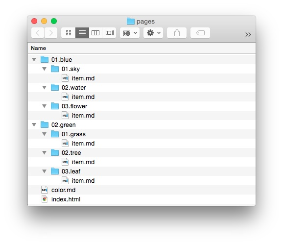

Grav には、たくさんの柔軟な方法でリンクできるので、あるページからサイト内の別ページ、もしくは別のサイトのページへリンクすることができます。  
これまで HTML を使ってファイルをリンクしたり、あるいはファイルシステムをコマンドラインで使ったことがあれば、とてもかんたんに理解できるはずです。

これから、簡単な利用例を実演します。  
次のような Grav サイトの **Pages** ディレクトリのモデルを使います。



このディレクトリ構造を例として使うことで、コンテンツで使えるさまざまなタイプのリンクがわかるでしょう。

はじめに、 Grav のリンクの一般的なコンポーネントをかんたんに見ていきます。  
そして、それらの意味も解説します。

```markdown
[Linked Content](../path/slug/page)
```

| 文字列 | 説明 |
| :----- | :----- |
| `[]`   | 角カッコは、リンクとなるテキストやコンテンツを囲みます。HTMLでは、 `<a href="">` と `</a>` の間に入るものです |
| `()`   | 丸カッコは、リンク先を囲みます。角カッコの直後に置く必要があります |
| `../`  | リンクの中で使われ、親ディレクトリに移動することを意味します |

<h3 id="slug-relative">スラッグによる相対リンク</h3>

Grav では、サイト内リンクを、ファイル名やフォルダ名だけに限定しません。  
ファイルのフロントマターに書いたスラッグによっても、ディレクトリ名などと同様に、リンクできます。  
このことから、特定のファイル名をいちいち覚える必要はなく、よりわかりやすいスラッグを覚えておくだけで、かんたんに素早くリンクを貼ることができます。

Grav のテンプレートエンジンは、ファイル名をテンプレートファイルの割り当てのために使います。  
たとえば、ブログ投稿の記事は `item.md` という名前になっていることが多いです。  
ブログ投稿そのものは、より意味のあるスラッグをつけることができます。  
たとえば、 `grass` もしくは `grass-is-green` のように。

ディレクトリ名もまた、表示順を示すために番号が打たれています。  
スラッグの相対リンクでは、この番号を含める必要はありません。  
Grav は、スラッグを生成するときにこの数字を無視します。  
これにより、 URL がきれいになります。

相対スラッグのリンクの例をいくつか示します。

次の例では、 `pages/01.blud/01.sky/item.md` から、親ディレクトリに移動したあとに、 `pages/01.blue/02.water/item.md` ファイルを読み込みます。  
対象となりうる `item.md` ファイルには、スラッグが指定されていなかったので、 Grav はディレクトリ名を使っています。

```markdown
[link](../water)
```

次の例も似ていますが、 `pages/01.blue/01.sky/item.md` から、 `pages/02.green/02.tree/item.md` へのリンクです。  
しかし、ここで呼び出される `item.md` ファイルには、 `tree-is-green` というスラッグが指定されていたので、このリンクが可能になっています。

```markdown
[link](../../green/tree-is-green)
```

`item.md` のフロントマターに、スラッグが指定されていると、デフォルトの値であるディレクトリ名（`green`）から、`tree-is-green` に置き換えられます。

<h3 id="directory-relative">ディレクトリによる相対リンク</h3>

**相対ディレクトリ** リンクは、現在ページからの相対的な位置にある目的地へリンクします。これは、同じディレクトリ内の画像へのリンクのような、かんたんなものもありますし、いくつものディレクトリ階層を上り、特定のフォルダやファイルまで下っていくような、複雑なものもあります。

相対リンクにおいては、リンク元のファイルの場所が、リンク先のファイルの場所と同じくらい重要です。どちらかが動けば、それらの間の道筋が変わってしまい、リンクが壊れるかもしれません。

一方で、長所もあります。ローカルサーバーと本番サーバーとの変更が容易です。異なるドメイン名であっても、ファイル間の構造さえ同じであれば、リンクは問題なく機能します。

ファイルリンクは、ファイル名を指し示します。ディレクトリ名やスラッグではありません。`pages/01.blue/01.sky/item.md` から、`pages/02.green/01.grass/item.md` へリンクしたい場合、以下のように書きます。

```markdown
[link](../../02.green/01.grass/item.md)
```

`../../` とあるので、まず2階層上のフォルダへ移動し、それから2階層下のフォルダにある目的の `item.md` ファイルを、直接指し示します。

ときには、あるひとつのディレクトリに誘導するだけで、そのデフォルトのページを読み込ませたいこともあります。ファイルを指定しなくても、ディレクトリを指定するだけで、Gravは正しいファイルを特定し、読み込んでくれます。正しく整頓されたサイトであれば、問題ないはずです。

次の例では、`pages/01.blue/01.key/item.md` から、デフォルトで `color.md` ファイルを読み込む `pages/02.green/` へリンクしています。

```markdown
[link](../../02.green)
```

If you want to link to a directory two steps up, you can do so using this process. 

The next example is a lot like the file link we demonstrated earlier. Instead of linking directly to the file, we're linking to its directory, which should load the file we want anyway since it's the default file. If you were creating a link from `pages/01.blue/01.sky/item.md` to `/pages/02.green/01.grass/` you would use the following command.

```markdown
[link](../../02.green/01.grass)
```

<h3 id="absolute">絶対リンク</h3>

絶対リンクは、相対リンクに似ていますが、サイトrootからの相対位置を示します。**Grav** においては、とくに **/user/pages/** ディレクトリがrootになります。絶対リンクには、2つの方法があります。

You can do it in a similar fashion to the **Slug Relative** style which uses the slug, or directory name in the path for simplicity. This method removes potential issues of order changes later on (changing the number at the beginning of the folder name) breaking the link. This would be the most commonly used method of absolute linking.

In an absolute link, the link opens with a `/`. Here is an example of an absolute link made to `pages/01.blue/01.sky/item.md` in the **Slug** style.

```markdown
[link](/blue/sky)
```

The second method is fashioned after the **Directory Relative** style detailed previously. This method leaves in elements like the ordering numbers at the beginning of directory names. While this does add the potential of a broken link when content is reordered, it is more reliable when used with services like [Github](https://github.com) where content links do not have the benefit of Grav's flexibility. Here is an example of an absolute link made to `pages/01.blue/01.sky/item.md` using this style.

```markdown
[link](/01.blue/01.sky)
```

<h3 id="remote">サイト外リンク</h3>

Remote links enable you to link directly to pretty much any file or document out there via its URL. This doesn't have to include your own site's content, but it can. Here is an example of how you would link to Google's home page.

```markdown
[link](http://www.google.com)
```

You can link to pretty much any direct URL, including secured HTTPS links. For example:

```markdown
[link](https://github.com)
```

<h3 id="link-attributes">リンク属性</h3>

マークダウン構文を利用して、リンクの属性を提供してくれる機能が提供されました。  
これを使えば、 **class** 属性、 **id** 属性、 **rel** 属性、そして **target** 属性を、[Markdown Extra](https://michelf.ca/projects/php-markdown/extra/) を使うことなく利用できます。

いくつかの例を示します：

<h5 id="class-classes-attribute">クラス属性</h5>

```markdown
[Big Button](../some-page?classes=button,big)
```

HTMLにすると次のようになります：

```html
<a href="/your/pages/some-page" class="button big">Big Button</a>
```

<h5 id="id-attribute">ID属性</h5>

```markdown
[Unique Button](../some-page?id=important-button)
```

HTMLにすると次のようになります：

```html
<a href="/your/pages/some-page" id="important-button">Unique Button</a>
```

<h5 id="rel-attribute">Rel属性</h5>

```markdown
[NoFollow Link](../some-page?rel=nofollow)
```

HTMLにすると次のようになります：

```html
<a href="/your/pages/some-page" rel="nofollow">NoFollow Link</a>
```

<h5 id="target-attribute">Target属性</h5>

```markdown
[Link in new Tab](../some-page?target=_blank)
```

HTMLにすると次のようになります：

```html
<a href="/your/pages/some-page" target="_blank">Link in new Tab</a>
```

<h5 id="attribute-combinations">属性の組み合わせ</h5>

```markdown
[Combinations of Attributes](../some-page?target=_blank&classes=button)
```

HTML にすると次のようになります：

```html
<a href="/your/pages/some-page" target="_blank" class="button">Combinations of Attributes</a>
```

<h5 id="attribute-combinations-with-anchors">アンカー付きの属性の組み合わせ</h5>

```markdown
[Element Anchor](../some-page?target=_blank&classes=button#element-id)
```

HTMLにすると次のようになります：

```html
<a href="/your/pages/some-page#element-id" target="_blank" class="button">Element Anchor</a>
```

<h5 id="anchor-links-on-the-same-page">同一ページのアンカーリンク</h5>

```markdown
[Element Anchor](?classes=button#element-id)
```

HTML にすると次のようになります：

```html
<a href="#element-id" class="button">
```

注意： [Issue 1324](https://github.com/getgrav/grav/issues/1324#issuecomment-282587549) での議論のように、アンカーはクエリの _後に_ 来なければいけません。

<h5 id="pass-through-of-non-supported-attributes">未サポートの属性を素通り</h5>

```markdown
[Pass-through of 'cat' attribute](../some-page?classes=underline&cat=black)
```

HTML にすると次のようになります：

```html
<a href="/your/pages/some-page?cat=black" class="underline">Pass-through of 'cat' attribute</a>
```

<h5 id="skip-all-attributes">すべての属性をスキップ</h5>

```markdown
[Skip all attributes](../some-page?classes=underline&rel=nofollow&noprocess)
```

HTML にすると次のようになります：

```html
<a href="/your/pages/some-page?rel=nofollow&classes=underline">Skip All attributes</a>
```

<h5 id="skip-certain-attributes">特定の属性のみスキップ</h5>

```markdown
[Skip Certain attributes](../some-page?id=myvariable&classes=underline&target=_blank&noprocess=id,classes)
```

HTML にすると次のようになります：

```html
<a href="/your/pages/some-page?id=myvariable&classes=underline" target="_blank">Skip Certain attributes</a>
```

これは、特定の属性のみスキップし、他のものは通常通り属性づけたい場合に便利です。

