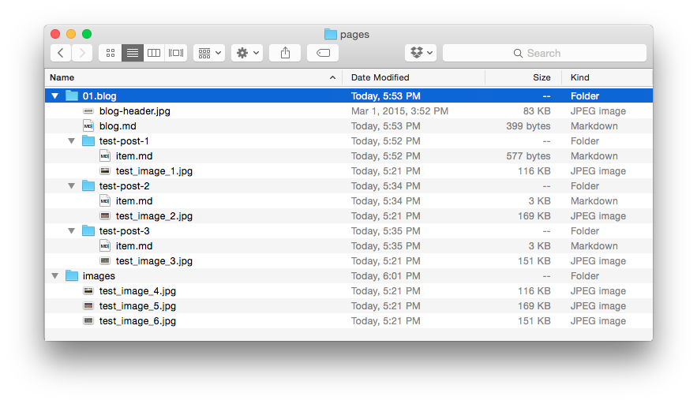

Grav には、たくさんの柔軟なリンク方法があり、各ページからサイト内の画像、もしくは別のサイトの画像を表示することができます。  
これまで HTML を使ってファイルをリンクしたり、あるいはファイルシステムをコマンドラインで使ったことがあれば、とても簡単に理解できるはずです。

これから、簡単な利用例を実演します。  
次のような Grav サイトの **Pages** ディレクトリのモデルを使います。



上記のディレクトリ構造を例に、コンテンツ中に画像を貼るいくつかの異なる方法を見ていきましょう。  
上記の例では、すべてのフォルダに画像が入っています。  
各ブログ投稿に1枚ずつ、そしてページではなくメディアファイルのみを持つ特別な `pages/images` ディレクトリに3枚あります。

複数のページで頻繁に利用されるファイルを、シンプルに一元化して保存することで、メンテナンスしやすくする場合の例として、`/images` フォルダを使います。  
これにより、リンク処理がシンプルになります。

> [!Warning]  
> 一元化した画像ディレクトリを作る場合、画像はフロントエンドで使われるものなので、そのディレクトリは `/pages` フォルダに入れるようにしてください。

はじめに、 Grav の画像タグの一般的なコンポーネントを簡単に見ていきます。

```markdown

```

| 文字列 | 説明   |
| :----- | :-----  |
| `!`    | ページリンクのマークダウンタグを、`!` で始めると、画像リンクであることを意味します |
| `[]`   | 角カッコは、**オプショナルな** 画像の altテキストを囲みます |
| `()`   | 丸カッコは、画像の参照先を囲みます。角カッコのすぐ後に書く必要があります |
| `../`  | リンクの中で使われ、親ディレクトリに移動することを意味します |

> [!Tip]  
> 画像リンクを、ページリンクで囲むことができます： `[](http://example.net/)`

<h3 id="slug-relative">スラッグによる相対画像リンク</h3>

**Relative** image links use destinations set relative to the current page. This can be as simple as linking to another file in the current directory, such as an image file associated with the current page, or as complex as going up several directory levels and then back down to the specific folder/file where an image may reside.

With relative links, the location of the source file is every bit as important as that of the destination. If either file in the mix is moved, changing the path between them, the link can be broken.

The advantage of this type of linking structure is that you can quickly switch between a local development server and a live server with a different domain name and as long as the file structure remains consistent, the links should work without a problem.

A file link points to a particular file by name, rather than its directory or slug. If you were creating an image link in `pages/01.blog/test-post-1/item.md` to `/pages/01.blog/test-post-3/test-image-3.jpg` you would use the following command.

```markdown

```

This link moves up one folder, as indicated by `../`, and then down one folder, pointing directly to `test-image-3.jpg` as the destination.

If we want to load `blog-header.jpg` from the `01.blog` directory, we would do the following:

```markdown

```

> [!Note]  
> You do not need to include ordering numerals (`01.`) for slug relative links.

Grav has integrated support for slugs in the header of the page's primary markdown file. This slug supersedes the folder name for the page, and any media files contained within.

For example, **Test Post 2** has a slug set through its markdown file (`/pages/01.blog/test-post-2/item.md`). The header of this file contains the following:

```yaml
---
title: Test Post 2
slug: test-slug
taxonomy:
    category: blog
---
```

You will notice the slug `test-slug` has been set. Slugs set this way are completely optional, and do not have to be present. As mentioned in the last chapter, they do provide an easy way of linking. If a slug is set, then any link you make to a media file within that folder will have to be either **Slug Relative** or **Absolute** with a full URL set for the link.

If we want to link `test-image-2.jpg` from **Test Post 2**, we would enter the following:

```markdown

```

You will notice that we navigated up one directory using (`../`) and then down into the `test-slug` page folder using the slug which was set in `/pages/01.blog/test-post-2/item.md` file.

<h3 id="directory-relative">ディレクトリによる相対画像リンク</h3>

**Directory Relative** image links use destinations set relative to the current page. The main difference between a slug relative, and directory relative link, is that rather than using the URL slugs, you reference via the full path with folder names.

An example of this would be something like:

```markdown

```

> [!Info]  
> The main benefit of this, is that you can maintain link integrity in other systems outside of Grav, such as GitHub.

<h3 id="absolute">絶対画像リンク</h3>

Absolute links are similar to relative links, but are relative to the root of the site. In **Grav**, this is typically based in your **/user/pages/** directory. This type of link can be done in two different ways.

You can do it in a similar fashion to the **Slug Relative** style which uses the slug, or directory name in the path for simplicity. This method removes potential issues of order changes later on (changing the number at the beginning of the folder name) breaking the link. This would be the most commonly used method of absolute linking.

In an absolute link, the link opens with a `/`. Here is an example of an absolute link made to `pages/01.blog/test-post-2/test-image-2.jpg` in the **Slug** style from `pages/01.blog/blog.md`.

```markdown

```

!!! A powerful technique is to create a `user/pages/images/` folder in your Grav site and put your images here.  Then you can easily reference them with an absolute URL from any Grav page: `/images/test-image-4.jpg` and still be able to perform [media actions](../media) on them.

<h3 id="php-streams">PHPストリーム</h3>

Gravでは、PHPストリームを使って、画像を参照したりリンクしたりすることもできます。いくつかのPHPストリームを用意しています：

* `user://` - userフォルダ. 例： `user/`
* `page://` - pagesフォルダ 例： `user/pages/`
* `image://` - imagesフォルダ 例： `user/images/`
* `plugins://` - pluginsフォルダ  例： `user/plugins/`
* `theme://` - 現在テーマ  例： `user/themes/antimatter/`

これらにより、以前はpagesの階層（`user/pages/`）の外にあった画像へのアクセスが容易になります。

```markdown

```

もしくは：

```markdown

```

デフォルトで使えるストリームの全体像は、[複数サイト設定 - ストリーム](../../08.advanced/05.multisite-setup#streams) を参照してください。

<h3 id="remote">サイト外リンク</h3>

Remote image links enable you to directly display pretty much any media file via its URL. This doesn't have to include your own site's content, but it can. Here is an example of how you would display a remote image file.

```markdown

```

You can link to pretty much any direct URL, including secured HTTPS links.

### Media Actions on Images

One of the main benefits of using images associated with pages is that it enables you to take advantage of [Grav's powerful media actions](../07.media). For example, here is a line you would use to load an image from another page:

```markdown

```

or taking advantage of streams to access an image in your current theme:

```markdown

```

You will find more information about actions and other [media file functionality in the next chapter](../07.media).

<h3 id="image-attributes">画像属性</h3>

A great new feature you can take advantage of is providing image attributes directly via the markdown syntax. This allows you to easily add **classes** and **id** HTML attributes without the need of [Markdown Extra](https://michelf.ca/projects/php-markdown/extra/).

Some examples of this are:

<h5 id="single-class-attribute">ひとつのクラス属性</h5>

```markdown

```

which will result in HTML similar to:

```html

```

<h5 id="multiple-classes-attributes">複数のクラス属性</h5>

```markdown

```

which will result in HTML similar to:

```html

```

<h5 id="id-attribute">ID属性</h5>

```markdown

```

which will result in HTML similar to:

```html

```

