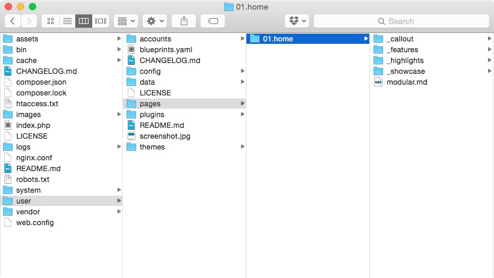
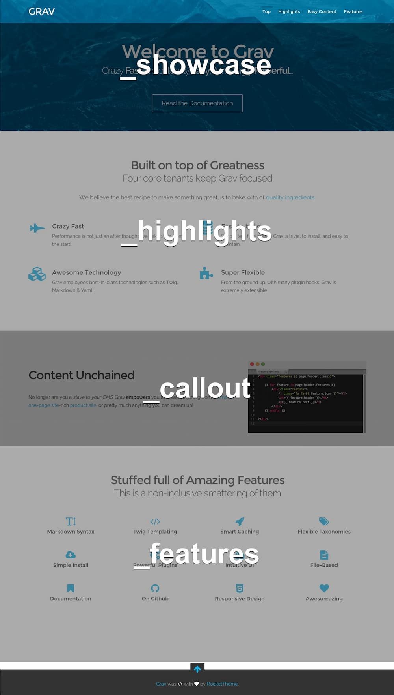
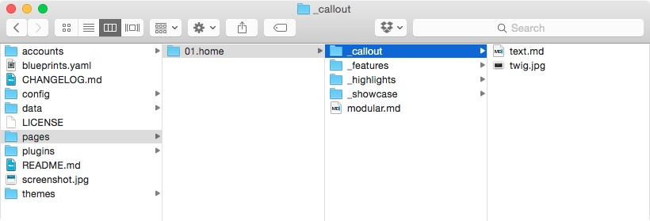

**モジュラーページ** の概念は、最初のうちは多少トリッキーに映るかもしれません。しかし実際に使ってみると、その便利さを理解するでしょう。 **モジュラーページ** は、統一されたひとつのページを構成するために、個々のモジュールページのコレクションを上から積み重ねたものです。これにより、複雑な構造のページも **LEGOブロック** のように作れます。LEGOが嫌いな人なんていないでしょう?!

<h2 id="what-are-modular-pages-and-what-are-they-not">モジュラーページとは何か？ そして何でないか？</h2>

Gravでは、[ページ](../01.content-pages) という概念は幅広いもので、webサイトで考えうることのほとんど全てを網羅しうるものです。モジュラーページは、このページ概念のひとつですが、通常ページとは違うものです。通常ページは、他のコンテンツ（他のページや子ページ）を利用せずにレンダリングされ、表示されるという意味で、独立しています。しかしながら、モジュラーページは、子ページを持ちません。これはシンプルなページ構造がイメージされるでしょう。

`domain.com/books` という通常ページがあったとして、その詳細に、売出し中の本の情報があったとします。このページには、いくつかの子ページがあり、たとえば、`domain.com/books/gullivers-travels` とか、 `domain.com/books/the-hobbit` などだったとします。これらのフォルダは、Grav内では、`pages/books` であり、 `pages/books/gullivers-travels` であり、 `pages/books/the-hobbit` です。このような構造は、モジュラーページではありません。

モジュラーページは、子ページを持たないというより、ページを構成する **モジュール** を持っているのです。トップレベルのページの下に、さまざまな本があるというより、 **同じページ** にモジュールを表示します。Gulliver's Travels も、The Hobbit も、`pages/books/_gullivers-travels` や `pages/books/_the-hobbit` にありながら、`domain.com/books` に表示されます。よって、モジュラーページは、直接的には通常ページと互換性がありません。モジュラーページ独自の構造を持ちます。

<h2 id="example-folder-structure">フォルダ構造の例</h2>

**1ページスケルトン** を例に使い、モジュラーページがどのように働くのかを詳しく説明します。

> [!訳注]  
> 1ページスケルトンとは、[このスケルトン](https://github.com/getgrav/grav-skeleton-onepage-site) のことだと思います。

**モジュラーページ** それ自体は、メインフォルダの中にあるサブフォルダに存在するページを集めたものです。1ページスケルトンにおいては、モジュラーページは、`01.home` フォルダにあります。このフォルダには、1つの `modular.md` ファイルがあり、このファイルがどのサブページをモジュラーページに集めるのかを指示し、さらにどんな順番で表示するのかを示します。このファイルの名前は重要です。現在のテーマから、`mojular.html.twig` テンプレートを使ってページを表示させるからです。

サブページは、アンダースコア（`_`） で始まるフォルダに入っています。アンダースコアを使うことで、通常の単独ページではなく、**モジュール** のページであることをGravシステムに伝えます。たとえば、サブページのフォルダは、`_features` や、`_showcase` などの名前になります。これらのページは、**ルーティングされません** 。つまり、ブラウザでダイレクトに指定されても、それらのページは **表示されません** 。メニューにも追加されません。

1ページスケルトンの場合、以下に示すようなフォルダ構成になっています。



それぞれのサブフォルダには、ページとして働くマークダウンファイルが収まっています。

これらモジュールフォルダ内のデータには、マークダウンファイルや、画像などがありますが、モジュラーページにより集められ、表示されます。メインページが作成され、メインページのYAMLフロントマターから [ページコレクション](../03/collections/) が定義され、このコレクションをTwigのテンプレートで繰り返し処理し、組み合わされたHTMLページを生成します。テーマには、すでに `mojulara.html.twig` テンプレートファイルがなければいけません。以下は、シンプルな `mojulara.html.twg` の例です：

```twig

    {{ module.content|raw }}

```

以下は、モジュラーページの結果です。ハイライトされているのは、どのモジュラーページが使われているかの違いを明確にするためです。



<h2 id="setting-up-the-primary-page">メインページのセットアップ</h2>

上記のとおり、それぞれのセクションは、異なるモジュールフォルダからコンテンツを集めてきたものです。どのモジュールフォルダをどんな順番で利用するかは、モジュールたちの親フォルダにある、メインのマークダウンファイルに書かれます。以下は、`01.home` フォルダの`modular.md` ファイルのコンテンツです。

```yaml
---
title: One Page Demo Site
menu: Home
onpage_menu: true
body_classes: "modular header-image fullwidth"

content:
    items: '@self.modular'
    order:
        by: default
        dir: asc
        custom:
            - _showcase
            - _highlights
            - _callout
            - _features
---
```

上記のとおり、このファイルに実質的なコンテンツはありません。ヘッダー内のYAMLフロントマターによる制御だけです。まずページの **title** や、 **menu** は割り当てられます。他の通常ページにも見られるような諸設定もあります。そして [content](../03.collections/#ordering-options) により、モジュラーページのコレクションに基づいたコンテンツを作成し、カスタムの順番で提供するように指示しています。

> [!訳注]  
> 上記の例では、`@self.modular` を使っていますが、[collectionsのモジュール部分](../03.collections/#atself-modules-modules-of-the-current-page) によると現在非推奨であり、`@self.modules` を使ったほうが良いようです。

<h2 id="modules">モジュール</h2>



それぞれのモジュールのマークダウンファイルは、それぞれ独自のテンプレートや設定などを持っています。これは通常ページの機能や設定をほとんど持っており、単に1ページとしてレンダリングされないというだけです。ページに適用される設定（たとえば **タクソノミー** ）は、メインファイルのマークダウンに置くことをおすすめします。

モジュラーページ自身は、通常ページと同じように操作できます。モジュラーページの中段に現れる、`_callout` というフォルダの中の `text.md` という例をあげます。

```markdown
---
title: Homepage Callout
image_align: right
---

## Content Unchained

No longer are you a _slave to your CMS_. Grav **empowers** you to create anything from a [simple one-page site](#), a [beautiful blog](#), a powerful and feature-rich [product site](#), or pretty much anything you can dream up!
```

上記のとおり、ページのフロントマターには、通常ページに見られるのと同じような情報が書いてあります。参照用のtitleと、[カスタムページのヘッダー](../02.headers/#custom-page-headers) で書かれた画像の配置位置を示す設定です。他のページでも見られるようなものです。

この `text.md` ファイルのテンプレートファイルは、テーマフォルダの `/templates/modular` フォルダにあります。そして、`text.html.twig` という名前です。このファイルは、他のページのテンプレートファイルと同じように、設定を定義し、baseページとのスタイリングの違いも定義できます。

```twig
<div class="modular-row callout">
    
    
        {{ image.cropResize(400,400).html('','','align-'~page.header.image_align)|raw }}
    
{{ content|raw }}
</div>
```

一般に、モジュラーページはとてもシンプルです。ただ、ページ内の各セクションは、実質的なページの下にそれぞれのフォルダを持つモジュールページで定義されるというアイディアに慣れる必要はあります。閲覧者にとっては、一度に表示される内容ですが、通常ページよりも少し違った方法で構成されます。Gravのモジュラーページでどこまで達成できるか、気楽に体験し、発見してください。

