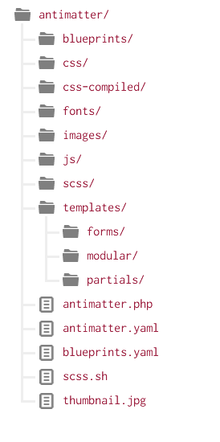

Gravのテーマは、非常にシンプルで、とても柔軟です。というのも、強力な [Twigテンプレートエンジン](https://twig.symfony.com/) を使っているからです。すべてのテーマは、テンプレートと呼ばれるtwigファイル（twigライクなPHPコードとHTMLを混ぜたもの）とCSSを合わせて作られます。わたしたちは、特に[Sass CSS拡張](http://sass-lang.com) をCSSファイルの生成に使っていますが、[Less](https://lesscss.org/) を使ってもかまいませんし、通常のCSSでも良いです。単に好みの問題です。

<h2 id="content-pages-twig-templates">ページコンテンツとTwigテンプレート</h2>

まず最初に理解してほしいのは、Gravの **pages** と、テーマの **Twigテンプレートファイル** との直接的な関係性です。

作成された各ページは、それぞれ特定のテンプレートファイルを参照します。そのページファイルの名前もしくは、ページのヘッダー変数で指定されたテンプレート名にひも付きます。メンテナンスしやすくするために、できるだけページヘッダーで上書きすることなく、ファイル名で指定する方法を使うことをおすすめします。

これからシンプルな例をやってみましょう。[**Grav Base** パッケージをインストールした](../../01.basics/03.installation/) 場合、`user/pages/01.home` フォルダがあるはずです。そこに、`default.md` ファイルという、マークダウンベースのページのコンテンツファイルが入っています。このファイル名（この例では `default` ）が、このページをレンダリングすべきテンプレートファイルを指し示します。この場合は、`default.html.twig` というTwigテンプレートで、テーマファイルの `templates/` フォルダに入っています。

> [!Info]  
> ページテンプレートは、小文字でなければいけません。"default" や、"blog" などのように。

`blog.md` というページファイルがあったとき、Gravは `<your_theme>/templates/blog.html.twig` というTwigテンプレートでレンダリングしようとします。

> [!Info]  
> Gravでは、ファイル名は、フロントエンドに現れません。現れるのは、フォルダ名だけです。すべてのブログ投稿のファイル名が同じであることを気にしないでください。Gravでは普通のことです。

<h2 id="theme-organization">テーマの構成</h2>

<h3 id="definition-configuration">定義と設定</h3>

それぞれのテーマには、それぞれのテーマに関する情報をまとめた `blueprints.yaml` という定義ファイルがあります。このファイルでは、[**管理パネル**](../../05.admin-panel/01.introduction/) 上でテーマ設定を編集できる **form** が定義できます。**Antimatter** テーマの場合、`blueprints.yaml` ファイルは以下のとおりです：

```yaml
name: Antimatter
slug: antimatter
type: theme
version: 1.6.7
description: "Antimatter is the default theme included with **Grav**"
icon: empire
author:
  name: Team Grav
  email: devs@getgrav.org
  url: https://getgrav.org
homepage: https://github.com/getgrav/grav-theme-antimatter
demo: https://demo.getgrav.org/blog-skeleton
keywords: antimatter, theme, core, modern, fast, responsive, html5, css3
bugs: https://github.com/getgrav/grav-theme-antimatter/issues
license: MIT

dependencies:
    - { name: grav, version: '>=1.6.0' }

form:
  validation: loose
  fields:
    dropdown.enabled:
        type: toggle
        label: Dropdown in navbar
        highlight: 1
        default: 1
        options:
          1: Enabled
          0: Disabled
        validate:
          type: bool
```

> [!訳注]  
> `Antimatter` テーマは、昔のGravで標準テーマだったものです。今（2025年時点）は `quark` です。基本的な内容は変わらないので、適宜読みかえてください。

テーマの設定オプションを使いたい場合は、デフォルト設定を `<あなたのテーマ>.yaml` ファイルに書いてください。たとえば：

```yaml
enabled: true
color: blue
```

> [!Info]  
> 上記の `color: blue` 設定は、何か具体的な設定ではまったくありません。たんに設定を上書きする例です。

利用可能な forms について知りたい場合、[第6章のフォーム](../../06.forms) を参照してください。また、`thumbnail.jpg` という`300px` x `300px` の画像も、テーマのルートフォルダに置いてください。管理パネルのテーマのセクションで表示されます。

<h3 id="templates">テンプレート</h3>

Gravテーマの構造において、**ルールは1つだけ** です。コンテンツとして作成したページそれぞれに対応する適切なTwigテンプレートを、`templates/` フォルダに置かなければならないということだけです。

> [!Info]  
> ページコンテンツとテーマ内のTwigテンプレートには、強い結びつきがあるので、テーマ制作は、そのコンテンツの使われ方としばしば連動します。 _一般的な_ テーマを作るなら、[公式のダウンロードページ](https://getgrav.org/download) でダウンロード可能なスケルトンで利用されているテンプレートの種類を網羅すると良いです。たとえば、**default** 、**blog** 、**error** 、**item** そして **modular** などです。

一般論として、`templates/` フォルダには、主要なテンプレートのみを置いた方が良く、サブフォルダとして `partials/` フォルダのようなものを作り、部分的なパーツ用のテンプレートや、テンプレートの小さな _かたまり_ は、そこに置くのが良いです。

テーマで **modular** テンプレートに対応したいときも、`modular/` というサブフォルダを作り、モジュラー用のテンプレートファイルはそこに置くのが良いでしょう。

**forms** に対応するときも、同じです。`forms/` というサブフォルダを作り、そこにカスタムフォーム用のテンプレートを格納してください。

### SCSS / LESS / CSS

さて、ルールは何も無いのですが、実用上は、Sassを使って開発したいときは `scss/` サブフォルダを、Lessのときは `less/` を、静的なCSSファイルには `css/` を置き、SassやLessをコンパイルしたものは、 `css-compiled/` フォルダに自動的に生成されるようにするのが良いでしょう。

どのように構成するので、完全に自由です。Gravの基本パッケージにあるデフォルトの **antimatter** テーマを具体例として使い、気楽な気持ちで参考にしてください。このテーマでは、よりCSSに近く、より自然に書けるSassの **scss** を利用しています。

To install Sass on your computer, simply [follow the instructions on the sass-lang.com](http://sass-lang.com/install) website.

1. Execute the simple provided scss shell script by typing `./scss.sh` from the root of the theme.
2. Running the command directly `scss --source-map --watch scss:css-compiled` which is the same thing.

デフォルトでは、scssファイルは `css-compiled` フォルダにコンパイルされます。テーマからは、コンパイルされたCSSが利用できます。

### Blueprints

`blueprints/` フォルダは、テンプレートファイルそれぞれの設定やフォームの選択肢を定義するためにあります。これらは、**管理パネル** で利用され、オプショナルな（あってもなくても良い）ものです。これらがなくても、テーマは100%機能します。が、これらが無ければ、管理パネルを通して設定変更することはできません。

<h3 id="theme-and-plugin-events">テーマとプラグインのイベント</h3>

もうひとつの、完全にオプショナルで強力な機能は、**プラグイン** アーキテクチャによってテーマがGravとやりとりできるということです。かんたんに言うと、Gravの起動手順の中に、独自コードを「フックできる」箇所がいくつかあります。これは便利です。たとえば、Twigを初期化する際に、テーマ中へ追加のパスショートカットを定義しておけば、Twigのテンプレート中でそれを使えます。これらフックは、空の関数によって利用できるようになっています。それらの関数は、Gravシステムによって事前に定義された名前を持ち、都合に合わせて自由に書き込めるようになっています。[第4章プラグイン](../../04.plugins) では、プラグインシステムやイベントフックに関するより詳しい内容が書いてあります。テーマでこれらのフックを利用するには、`mytheme.php` というファイルを作り、以下のようなフォーマットで使います：

```php
<?php
namespace Grav\Theme;

use Grav\Common\Theme;

class MyTheme extends Theme
{

    public static function getSubscribedEvents(): array
    {
        return [
            'onThemeInitialized' => ['onThemeInitialized', 0]
        ];
    }

    public function onThemeInitialized(): void
    {
        if ($this->isAdmin()) {
            $this->active = false;
            return;
        }

        $this->enable([
            'onTwigSiteVariables' => ['onTwigSiteVariables', 0]
        ]);
    }

    public function onTwigSiteVariables(): void
    {
        $this->grav['assets']
            ->addCss('plugin://css/mytheme-core.css')
            ->addCss('plugin://css/mytheme-custom.css');

        $this->grav['assets']
            ->add('jquery', 101)
            ->addJs('theme://js/jquery.myscript.min.js');
    }
}
```

上記のとおり、イベントフックを利用するためには、まず `getSubscribedEvents` 関数にそれらを登録し、それからコードを定義する必要があります。イベントを登録したら、そのコードも定義する必要があります。そうしなければ、エラーになります。

<h3 id="other-folders">他のフォルダ</h3>

テーマのルートフォルダには、以下のような独立したフォルダを作っておくことをおすすめします。テーマで使う画像を収める `images/`、webフォントのための `fonts/`、そして必要なJavaScriptファイルのための `js/` フォルダです。

<h2 id="theme-example">テーマの例</h2>

デフォルトの **antimatter** テーマを具体例として、以下のようなこのテーマの全体構造を見てください：



この例では、読みやすさのために、実質的な `css`、 `css-compiled`、 `fonts`、 `images`、 `js`、 `scss` そして `templates` ファイルは表示していません。ここで注意すべき重要な点は、テーマの全体構造です。

