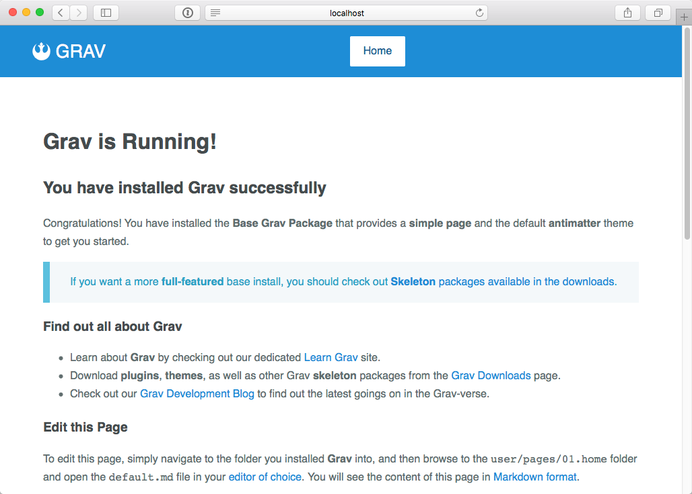

新しいことを学ぶのに最良の方法は、しばしば、具体例を使って、自分独自のものを作ってみることです。テーマづくりについて、この方法を採用してみましょう。

## Quark

Gravには、[Spectre.css フレームワーク](https://picturepan2.github.io/spectre/) を使った **Quark** という、クリーンでモダンなテーマが付属しています。

Spectre.css は、迅速で拡張性高い開発のための、軽量で、レスポンシブで、モダンなCSSフレームワークです。

Spectreは、基本的なタイポグラフィーや要素のスタイル、flexboxベースのレスポンシブ・レイアウト・システム、pure CSSコンポーネントとユーティリティを、ベストプラクティスのコーディングと一貫したデザイン言語とともに提供してくれます。

しかしながら、よりシンプルなものから始めたほうが、より良いこともあります。

## Pure.css

このチュートリアルのために、Yahoo!が開発した人気の[Pure.css フレームワーク](https://pure-css.github.io/) を使って、テーマを作っていきましょう。

Pure は、小さく、速く、レスポンシブなCSSフレームワークで、[Bootstrap](https://getbootstrap.jp/) や、[Foundation](https://get.foundation/) のような大きなフレームワークのオーバーヘッドが無い状態でサイトの開発ができます。Pureにはいくつかのモジュールがあり、それぞれ独立して使えますが、すべて合わせても **minifyしてgzipすると4.0KB** しかありません。

[Pure.css プロジェクトサイト](http://purecss.io/) では、Pureがもたらすすべての機能を読むことができます。

また、[テーマの重要なアップデート](https://getgrav.org/blog/important-theme-updates) というブログ記事を読んでおいてください。この記事では、将来的なプラグインサポートをベストな状態にするために、Gravテーマの重要な変更の概要を説明しています。

> [!訳注]  
> 上記のブログ記事は、Grav1.5, 1.6時代のものなので、これから始める方には、とくに関係なさそうでした。

<h2 id="step-1-install-devtools-plugin">ステップ1: DevToolsプラグインのインストール</h2>

> [!Info]  
> 以前のバージョンのチュートリアルでは、あらかじめベーステーマを作る必要がありました。この手順はすべて、新しい **DevToolsプラグイン** のおかげで、やらなくて済むようになりました。

新しいテーマを作る最初のステップは、**DevToolsプラグインをインストールする** ことです。2つの方法でインストールできます。

<h4 id="install-via-cli-gpm">CLI GPMによるインストール</h4>

* コマンドラインを、Gravをインストールしたルートディレクトリへ移動させてください。

```bash
bin/gpm install devtools
```

<h4 id="install-via-admin-plugin">管理パネルからのインストール</h4>

* After logging in, simply navigate to the **Plugins** section from the sidebar.
* Click the <i class="fa fa-plus"></i> **Add** button in the top right.
* Find **DevTools** in the list and click the <i class="fa fa-plus"></i> **Install** button.

<h2 id="step-2-create-base-theme">ステップ2: ベーステーマの作成</h2>

このステップのために、[コマンドライン](../../07.cli-console/01.command-line-intro) を使う必要があります。というのも、DevToolsが提供するいくつかのCLIコマンドによって、新しいテーマづくりがかなりかんたんになるからです！

Gravをインストールしたルートディレクトリから、次のようなコマンドを実行してください：

```bash
bin/plugin devtools new-theme
```

このプロセスでは、新しいテーマづくりに必要な、いくつかの質問を訊ねられます。

> [!Note]  
> これから新しいテーマを作るのに、**pure-blank** を利用したいと思っています。が、他のテーマを継承するシンプルな **inheritance** を作ってもかまいません。

```bash
bin/plugin devtools new-theme

Enter Theme Name: MyTheme
Enter Theme Description: My New Theme
Enter Developer Name: Acme Corp
Enter Developer Email: contact@acme.co
Please choose a template type
  [pure-blank ] Basic Theme using Pure.css
  [inheritance] Inherit from another theme
  [copy       ] Copy another theme
 > pure-blank

SUCCESS theme mytheme -> Created Successfully

Path: /www/user/themes/my-theme
```

最後の行で、DevToolsコマンドが、どこに新しいテンプレートを作ったかを教えてくれます。ここで作られたテンプレートは、完全に機能しますが、とても単純でもあります。必要に応じて、修正したいと思うことでしょう。

新しいテーマの動作を知るために、デフォルトテーマを `quark` から 上記で定義した `my-theme` に変える必要があります。`user/config/system.yaml` ファイルを編集し、以下のように変更してください：

```yaml
...
pages:
    theme: my-theme
...
```

ブラウザで、サイトをリロードすると、テーマが変わっていることがわかるはずです。

<h2 id="step-3-theme-basics">ステップ3: テーマの基本</h2>

さて、新しいテーマができました。これは、修正したり開発したりできます。分解してみて、テーマを作っているものが何かを見ていきましょう。`user/themes/my-theme` フォルダを見てみると、次のようになっているでしょう：

```txt
.
├── CHANGELOG.md
├── LICENSE
├── README.md
├── blueprints.yaml
├── css
│   └── custom.css
├── fonts
├── images
│   └── logo.png
├── js
├── my-theme.php
├── my-theme.yaml
├── screenshot.jpg
├── templates
│   ├── default.html.twig
│   ├── error.html.twig
│   └── partials
│       ├── base.html.twig
│       └── navigation.html.twig
└── thumbnail.jpg
```

これは、サンプルの構造ですが、いくつかの要件があります：

<h3 id="required-items-to-function">機能するのに必要なアイテム</h3>

次のアイテムは、非常に重要です。これらをあなたのテーマに含めない限り、確実に機能しないでしょう。

* **`blueprints.yaml`** - 設定ファイルです。Gravがテーマの情報を得るために使います。管理パネルでテーマ詳細を見るときに表示されるformも定義できます。このフォームにより、テーマ設定を保存できます。[このファイルはFormsの章で解説されています](../../06.forms/01.blueprints/) 。
* **`my-theme.php`** - あなたのテーマ名をもとにファイル名が決まります。あなたのテーマで必要ないかなるロジックも入れられます。`onPluginsInitialized()` 以外のあらゆる [プラグインイベントフック](../../04.plugins/04.event-hooks/) が使えます。テーマ特有の `onThemeInitialized()` も使えます。
* **`my-theme.yaml`** - これは、プラグインで使われる設定で、テーマで使うかもしれないオプションを設定します。
* **`templates/`** - ページをレンダリングするTwigテンプレートを入れるフォルダです。

<h3 id="required-items-for-release">リリースに必要なアイテム</h3>

次のアイテムは、GMPを通してテーマをリリースしたい場合に必要なアイテムです。

* **`CHANGELOG.md`** - A file that follows the [Grav Changelog Format](/advanced/grav-development#changelog-format) to show changes in releases.
* **`LICENSE`** - a license file, should probably be MIT unless you have a specific need for something else.
* **`README.md`** - A 'Readme' that should contain any documentation for the theme.  How to install it, configure it, and use it.
* **`screenshot.jpg`** - 1009px x 1009px screenshot of the theme.
* **`thumbnail.jpg`** - 300px x 300px screenshot of the theme.

<h2 id="step-4-base-template">ベーステンプレート</h2>

[前の章](../01.theme-basics) でみたとおり、Gravのコンテンツファイルは、特定のファイル名を持ちます。たとえば、`default.md` のように。これにより、Gravは `default.html.twig` というレンダリング用のTwigテンプレートを探します。1つのファイルごとに、表示したいものをすべて書いていくこともできますし、それでうまく機能します。しかし、もっと良い方法もあります。

Twigの[Extends](https://twig.symfony.com/doc/1.x/tags/extends.html) タグを使えば、好きな [blocks](https://twig.symfony.com/doc/1.x/tags/block.html) を含むベースレイアウトが作れます。これにより、どんなtwigテンプレートも、ベーステンプレートから **拡張** できるようになり、ベーステンプレートに書いたあらゆる **block** を定義できます。それでは、`templates/default.html.twig` ファイルを見てください。そのコンテンツを試してみましょう：

```twig



    {{ page.content|raw }}

```

ここでは、2つのことが起こっています。

1つ目は、このテンプレートは、`partials/base.html.twig` にあるテンプレートを拡張しています。

> [!Note]  
> Twigテンプレート内で、`tenplates/` をパスに含める必要はありません。Twigはすでに `templates/` をテンプレートのルートディレクトリとしていているからです。

2つ目は、`content` ブロックがベーステンプレートから上書きされています。ページのコンテンツは、その場所に出力されます。

> [!Info]  
> 一貫性を保つために、`templates/partials` フォルダを使うのは良い方法です。このフォルダには、HTMLの小さな塊や、共有されるTwigテンプレートを保存します。同様に、`templates/modular` をモジュラーテンプレートのために、`templates/forms` をフォーム用に使えます。テンプレートを整理するために、いかなるサブフォルダを作っていただいてもかまいません。

`templates/partials/base.html.twig` ファイルを見ると、HTMLレイアウトの中身がわかります：

```twig

<!DOCTYPE html>
<html lang="{{ (grav.language.getActive ?: theme_config.default_lang)|e }}">
<head>

    <meta charset="utf-8" />
    <title>{{ header.title|e }} | {{ site.title|e }}</title>

    <meta http-equiv="X-UA-Compatible" content="IE=edge">
    <meta name="viewport" content="width=device-width, initial-scale=1">
    

    <link rel="icon" type="image/png" href="{{ url('theme://images/logo.png')|e }}" />
    <link rel="canonical" href="{{ page.url(true, true)|e }}" />



    
    
    



    



    {{ assets.css()|raw }}
    {{ assets.js()|raw }}


</head>
<body id="top" class="{{ page.header.body_classes|e }}">


    <div class="header">
        <div class="wrapper padding">
            <a class="logo left" href="{{ (base_url == '' ? '/' : base_url)|e }}">
                <i class="fa fa-rebel"></i>
                {{ config.site.title|e }}
            </a>
            
            <nav class="main-nav">
                
            </nav>
            
        </div>
    </div>



    <section id="body">
        <div class="wrapper padding">
        
        </div>
    </section>



    <div class="footer text-center">
        <div class="wrapper padding">
            <p><a href="https://getgrav.org">Grav</a> was <i class="fa fa-code"></i> with <i class="fa fa-heart"></i> by <a href="http://www.rockettheme.com">RocketTheme</a>.</p>
        </div>
    </div>



    {{ assets.js('bottom')|raw }}


</body>
```

> [!Note]  
> **TIP:** 変数がレンダリングしても安全で、HTMLを含んでいる場合は、`autoescape` がtrueである状態で`|raw` フィルターを使ってください。

> [!Info]  
> [システム設定](../../01.basics/05.grav-configuration/#twig) で、`autoescape` をtrueにするのか、それともすべての変数ひとつひとつに対して、[XSS攻撃](https://developer.mozilla.org/en-US/docs/Glossary/Cross-site_scripting) への対策して、忘れずにエスケープするのかは、とても重要な問題です。

> [!訳注]  
> ひとつひとつの変数をXSS対策するのは、のちのち本当に面倒なことになるので、`autoescape` は `true` でお願いします。

<h2 id="step-5-breaking-it-down">ステップ5: 分解</h2>

何が起こっているのか、より深く理解するために、`base.html.twig` ファイルのコードを読み通してください。いくつかの注目すべき重要な点があります：

1. `theme_config` 変数が、テーマ設定からセットされています。Twigはダッシュマークをうまく使えないため、ダッシュのある変数（たとえば： `config.themes.my-theme` ）を取得するためには、`attribute()` 関数を使います。Twig関数は、動的に`config.thems` から `my-theme` データを取得します。

1. `<html lang=...` のアイテムは、もし有効化されていればGravのアクティブ言語をもとに設定され、そうでなければ、`theme_config` 内の `default_lang` を設定します。

1. `` 構文は、ベーステンプレート内で、あるエリアを定義します。`` タグ内の `head` は、必須ではありませんが、読みやすくなるので使っていることに注意してください。このブロックには、HTMLの `<head>` タグで使われるものを置きます。

1. `<title>` タグは、そのページのフロントマターに書いた `title` 変数をもとに、動的に設定されます。`header.title` は、ショートカットメソッドですが、`page.header.title` と同じことです。

1. 標準的なmeta タグをいくつか設定した後、`partials/metadata.html.twig` が参照され、呼び出されます（includeされます）。このファイルは、`systems/templates/partials` フォルダにあり、ページのメタデータをループします。これは実際には、`site.yaml` のメタデータとページで上書きしたデータを合わせた（mergeした）ものです。

1. The `<link rel="icon"...` entry is set by pointing to a theme-specific image.  In this case it's located in theme directory under `images/logo.png`.  The syntax for this is `{{ url('theme://images/logo.png') }}`.

1. The `<link rel="canonical"...` entry sets a canonical URL for the page that is always set to the full URL of the page via `{{ page.url(true, true) }}`.

1. Now we define a block called `stylesheets`, and in here we use the [Asset Manager](/themes/asset-manager) to add several assets.  The first one loads the Pure.css framework.  The second one loads [FontAwesome](http://fontawesome.io/) to provide useful icons.  The last entry points to a `custom.css` file in the theme's `css/` folder.  In here are a few useful styles to get you started, but you can add more here.  Also you can add other CSS file entries as needed.

1. The `{{ assets.css()|raw }}` call is what triggers the template to render all the CSS link tags.

1. The `javascripts` block, like the `stylesheets` block is a good place to put your JavaScript files.  In this example, we only add the 'jquery' library which is already bundled with Grav, so you don't need to provide a path to it.

1. The `{{ assets.js()|raw }}` will render all the JavaScript tags.

1. The `<body>` tag has a class attribute that will output anything you set in the `body_classes` variable of the page's frontmatter.

1. The `header` block has a few things that output the HTML header of the page.  One important thing to note is the logo is hyperlinked to the `base_url` with the logic: `{{ base_url == '' ? '/' : base_url }}`.  This is to ensure that if there is no subdirectory, the link is just `/`.

1. The title of the site is output as the logo in this example theme with `{{ config.site.title }}` but you could just replace this with a `` tag to a logo if you wanted.

1. The `<nav>` tag actually contains a link to `partials/navigation.html.twig` that contains the logic to loop over any **visible** pages and display them as a menu.  By default it supports dropdown menus for nested pages, but this can be turned off via the theme's configuration.  Have a look in this navigation file to get an idea of how the menu is generated.

1. The use of `` provides a placeholder that allows us to provide content from a template that extends this one. Remember we overrode this in `default.html.twig` to output the page's content.

1. The `footer` block contains a simple footer, you can easily modify this for your needs.

1. Similar to the content block, the `` is intended as a placeholder for templates to add custom JavaScript initialization or analytic codes. In this example, we output any JavaScript that was added to the `bottom` Asset Group.  Read more about this in the [Asset Manager](/themes/asset-manager) documentation.

<h2 id="step-6-theme-css">ステップ6: テーマのCSS</h2>

You might have noticed that in the `partials/base.html.twig` file we made reference to a custom theme css via Asset Manager: `do assets.add('theme://css/custom.css', 98)`.  This file will house any custom CSS we need to fill in the gaps not provided by the Pure.css framework.  As Pure is a very minimal framework, it provides the essentials but almost no styling.

1. In your `user/themes/my-theme/css` folder, take a look at `custom.css`:

```css
/* Core Styles */
* {
    -webkit-box-sizing: border-box;
    -moz-box-sizing: border-box;
    box-sizing: border-box;
}

body {
    font-size: 1rem;
    line-height: 1.7;
    color: #606d6e;
}

h1,
h2,
h3,
h4,
h5,
h6 {
    color: #454B4D;
}

a {
    color: #1F8CD6;
    text-decoration: none;
}

a:hover {
    color: #175E91;
}

pre {
    background: #F0F0F0;
    margin: 1rem 0;
    border-radius: 2px;
}

blockquote {
    border-left: 10px solid #eee;
    margin: 0;
    padding: 0 2rem;
}

/* Utility Classes */
.wrapper {
    margin: 0 3rem;
}

.padding {
    padding: 3rem 1rem;
}

.left {
    float: left;
}

.right {
    float: right
}

.text-center {
    text-align: center;
}

.text-right {
    text-align: right;
}

.text-left {
    text-align: left;
}

/* Content Styling */
.header .padding {
    padding: 1rem 0;
}

.header {
    background-color: #1F8DD6;
    color: #eee;
}

.header a {
    color: #fff;
}

.header .logo {
    font-size: 1.7rem;
    text-transform: uppercase;
}

.footer {
    background-color: #eee;
}

/* Menu Settings */
.main-nav ul {
    text-align: center;
    letter-spacing: -1em;
    margin: 0;
    padding: 0;
}

.main-nav ul li {
    display: inline-block;
    letter-spacing: normal;
}

.main-nav ul li a {
    position: relative;
    display: block;
    line-height: 45px;
    color: #fff;
    padding: 0 20px;
    white-space: nowrap;
}

.main-nav > ul > li > a {
    border-radius: 2px;
}

/*Active dropdown nav item */
.main-nav ul li:hover > a {
    background-color: #175E91;
}

/* Selected Dropdown nav item */
.main-nav ul li.selected > a {
    background-color: #fff;
    color: #175E91;
}

/* Dropdown CSS */
.main-nav ul li {position: relative;}

.main-nav ul li ul {
    position: absolute;
    background-color: #1F8DD6;
    min-width: 100%;
    text-align: left;
    z-index: 999;

    display: none;
}
.main-nav ul li ul li {
    display: block;
}

/* Dropdown CSS */
.main-nav ul li ul ul {
    left: 100%;
    top: 0;
}

/* Active on Hover */
.main-nav li:hover > ul {
    display: block;
}

/* Child Indicator */
.main-nav .has-children > a {
    padding-right: 30px;
}
.main-nav .has-children > a:after {
    font-family: FontAwesome;
    content: '\f107';
    position: absolute;
    display: inline-block;
    right: 8px;
    top: 0;
}

.main-nav .has-children .has-children > a:after {
    content: '\f105';
}
```

This is pretty standard CSS that sets some basic margins, fonts, colors, and utility classes. There is some basic content styling and some more extensive styling required to render the drop-down menu.  Feel free to modify this file as you need, or even add new CSS files (just ensure you add a reference in the `head` block by following the example for `custom.css`).

<h2 id="step-7-testing">ステップ7: テスト</h2>

To see your theme in action, open your browser, and point it to your Grav site.  You should see something like this:



Congratulations, you have created your first theme!

