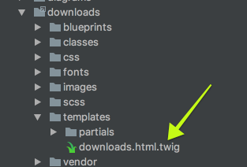

前回の [プラグインチュートリアル](../03.plugin-tutorial/) の解説では、プラグインのプログラミングロジックが、2つのメソッドで作られていたことに気づいたかもしれません。  
これらのメソッド `onPluginInitialized` と、 `onPageInitialized` はそれぞれ、 Grav のライフサイクルで利用可能な **イベントフック** に対応しています。

Grav においてプラグインの力を完全に発揮するには、利用可能なイベントフックを、その呼ばれる順番や、それが呼ばれている間にできることも含めて、知っておく必要があります。  
**イベントフック** は、 [Grav のライフサイクル](../05.grav-lifecycle/) と直接関係しています。

<h2 id="event-order">イベントの順番</h2>

Grav 内のほとんどのイベントは、特定の順番で発火します。  
プラグインを作る時、この順番を理解しておくことは重要です。

1. [onFatalException](#onfatalexception) _（順番無し、いつでも起こる）_
1. `PluginsLoadedEvent` class (1.7)
1. `PluginsLoadedEvent` class (1.7)
1. [onPluginsInitialized](#onpluginsinitialized)
1. `FlexRegisterEvent` class (1.7)
1. onThemeInitialized
1. onRequestHandlerInit (1.6)
1. onTask (1.6)
  1. onTask.{task}
1. onAction (1.6)
  1. onAction.{action} (1.6)
1. onBackupsInitialized
1. onSchedulerInitialized (1.6)
1. [onAssetsInitialized](#onassetsinitialized)
1. [onTwigTemplatePaths](#ontwigtemplatepaths)
1. [onTwigLoader](#ontwigloader)
1. [onTwigInitialized](#ontwiginitialized)
1. [onTwigExtensions](#ontwigextensions)
1. [onBuildPagesInitialized](#onbuildpagesinitialized) _（pages が再処理されるときに一度だけ）_
  1. [onPageProcessed](#onpageprocessed) _(each page not cached yet)_
  1. onFormPageHeaderProcessed (1.6) _(each page not cached yet)_
  1. [onFolderProcessed](#onfolderprocessed) _(for each folder found)_
1. [onPagesInitialized](#onpagesinitialized)
1. [onPageInitialized](#onpageinitialized)
  1. [onPageContentRaw](#onpagecontentraw) _(each page not cached yet)_
  1. [onMarkdownInitialized](#onmarkdowninitialized)
  1. [onPageContentProcessed](#onpagecontentprocessed) _(each page not cached yet)_
  1. onPageContent _(called first time Page::content() is called even when cached)_
1. [onPageNotFound](#onpagenotfound)
1. onPageAction (1.6)
  1. onPageAction.{action} (1.6)
1. onPageTask (1.6)
  1. onPageTask.{task} (1.6)
1. [onTwigPageVariables](#ontwigpagevariables) _(each page not cached yet)_
1. onHttpPostFilter (1.5.2)
1. [onTwigSiteVariables](#ontwigsitevariables)
1. [onCollectionProcessed](#oncollectionprocessed) _(when collection is requested)_
1. [onOutputGenerated](#onoutputgenerated)
1. [onPageHeaders](#onpageheaders)
1. [onOutputRendered](#onoutputrendered)
1. [onShutdown](#onshutdown)

その他のイベント：

1. [onBlueprintCreated](#onblueprintcreated)
1. onTwigTemplateVariables
1. onTwigStringVariables
1. [onBeforeDownload](#onbeforedownload)
1. [onPageFallBackUrl](#onpagefallbackurl)
1. [onMediaLocate](#onmedialocate)
1. [onGetPageBlueprints](#ongetpageblueprints)
1. [onGetPageTemplates](#ongetpagetemplates)
1. onFlexObjectRender (1.6)
1. onFlexCollectionRender (1.6)
1. onBeforeCacheClear
1. onImageMediumSaved (ImageFile)
1. onAfterCacheClear (1.7)
1. onHttpPostFilter (1.7)
1. `PermissionsRegisterEvent`class (1.7)

<h2 id="core-grav-event-hooks">Grav コアのイベントフック</h2>

Grav コアのイベントフックがあります。  
ページを処理する間にトリガーします：

#### onFatalException

PHP が致命的（fatal）なエラーを投げたときに、いつでも発火するイベントです。  
現在、 `problems` プラグインで、 Grav が致命的エラーを投げた理由の一覧を表示するのに使われます。

#### onPluginsInitialized

最初に利用可能なプラグインイベントです。  
この時点では、以下のオブジェクトが初期化されています。

* Uri
* Config
* Debugger
* Cache
* Plugins

> [!Warning]  
> プラグインの設定オプションで `enabled: false` となっているプラグインは、全く読み込まれません。

#### onAssetsInitialized

アセットマネージャーが初期化され、アセット（ JS や CSS など）を追加したり管理したりできる準備ができたときに発火します。

#### onPagesInitialized

Grav の `user/pages` フォルダ内のすべてのページが読み込まれ、**Pages オブジェクト** として利用可能になったときに発火します。

#### onPageNotFound

期待されたページが見つからなかったときに発火します。  
`error` プラグインで、特に 404 エラーページを表示するのに使われます。

#### onPageInitialized

URL からリクエストされた現在ページが、 **Page オブジェクト** として読み込まれたときに発火します。

#### onOutputGenerated

**Twig テンプレートエンジン** が出力し、 HTML 文字列となったときに発火します。

#### onPageHeaders

ページのフロントマターを操作できます。

#### onOutputRendered

出力処理が終わり、表示に送られるときに発火します。

#### onShutdown

これは新しく追加された、とても強力なイベントです。  
Grav が処理を終え、クライアントとのコネクションがクローズするときに、発火します。  
ユーザーとのインタラクションには関係ないが、パフォーマンスの重い処理をしたいときに、特に便利なイベントです。  
ユーザートラッキングや、ジョブプロセスで利用されるかもしれません。

#### onBeforeDownload

この新しいイベントは、`file` を含むイベントオブジェクトを渡します。  
このイベントは、ログを残したり、ファイルのダウンロード時に許可・拒否するときに使われます。

#### onGetPageTemplates

このイベントは、テーマのディレクトリ構造とコアから収集されるテンプレートに、プラグイン独自のテンプレートを追加することができます。  
プラグインから独自のテンプレートを追加したい場合に便利です。

**具体例**

```php
/**
 * Add page template types.
 */
public function onGetPageTemplates(Event $event)
{
    /** @var Types $types */
    $types = $event->types;
    $types->register('downloads');
}
```

これにより、プラグインは（独自に提供した）テンプレートを登録できます。  
そして、（編集ページで）テンプレートタイプのリストを表示できます。  
上記の例では、 `downloads` ディレクトリに、 `downloads.html.twig` ファイルがあったときに、 `downloads` というテンプレートタイプが追加されます。



#### onGetPageBlueprints

このイベントは `onGetPageTemplates` に似て、テーマ特有のリソースを、プラグインからコアに追加することができます。  
このイベントでは、ブループリントを追加します。

**具体例**

```php
$scanBlueprintsAndTemplates = function () use ($grav) {
    // Scan blueprints
    $event = new Event();
    $event->types = self::$types;
    $grav->fireEvent('onGetPageBlueprints', $event);

    self::$types->scanBlueprints('theme://blueprints/');

    // Scan templates
    $event = new Event();
    $event->types = self::$types;
    $grav->fireEvent('onGetPageTemplates', $event);

    self::$types->scanTemplates('theme://templates/');
};
```

上記の例では、`onGetPageTemplates` と `onGetPageBlueprints` フックの両方を使用して、プラグインが提供するリソース（テンプレートとブループリント）を Grav が継承やその他の用途で利用できるようにしています。

<h2 id="twig-event-hooks">Twigイベントフック</h2>

Twg には、独自のイベントフックが設定されています。

#### onTwigTemplatePaths

テンプレートパスのベースとなる場所を、 **Twigオブジェクト** に設定します。  
Twig テンプレートを探す場所を追加したいときに、このイベントを使います。

**具体例**

```php
/**
 * Add template directory to twig lookup path.
 */
 public function onTwigTemplatePaths()
 {
     $this->grav['twig']->twig_paths[] = __DIR__ . '/templates';
 }
```

#### onTwigInitialized

Twig テンプレートエンジンが初期化された時点で発火します。

#### onTwigExtensions

コアの Twig 拡張が読み込まれたが、 [あなた独自の Twig 拡張](https://twig.symfony.com/doc/1.x/advanced.html#creating-an-extension) を追加する必要があるときに、このイベントフックを使ってそれができます。

#### onTwigPageVariables

Twig がページを直接処理するような場合（たとえば、`process: twig: true` がページフロントマターに設定されている場合）に使います。  
ここで、処理中に Twig に使って欲しい変数を追加できます。

#### onTwigSiteVariables

サイト全体で Twig が処理する場面で使います。  
ここで、処理中に Twig に使って欲しい変数を追加できます。

<h2 id="collection-event-hooks">コレクション・イベントフック</h2>

#### onCollectionProcessed

コレクションが処理された後で、それを操作したいときに利用できます。

<h2 id="page-event-hooks">ページ・イベントフック</h2>

#### onBuildPagesInitialized

pages が、再処理されるときに、一度だけ発火します。  
キャッシュが失効した場合や、リフレッシュが必要なときに、起こります。  
コンテンツを操作し、結果をキャッシュする必要があるプラグインで、便利に使えます。

#### onBlueprintCreated

フォームを処理したり、操作したりするために使われます。

#### onPageContentRaw

ページが見つかり、フロントマターが処理され、コンテンツが処理される **前** に発火します。  
このイベントは、 Grav システムの **すべてのページ** で発火します。  
このイベントは、キャッシュされたページでは実行されないため、パフォーマンスが問題になるのは、キャッシュがクリアされたり、キャシュクリアイベントが起こった時だけです。

#### onPageProcessed

ページがパースされ、処理されたあとに発火します。  
このイベントは、 Grav システムの **すべてのページ** で発火します。  
このイベントは、キャッシュされたページでは実行されないため、パフォーマンスが問題になるのは、キャッシュがクリアされたり、キャシュクリアイベントが起こった時だけです。

#### onMarkdownInitialized

マークダウンが初期化されたときに呼び出されます。  
デフォルトの Parsedown 処理を上書きしたいときに使います。  
[使用例](https://github.com/getgrav/grav/pull/747#issuecomment-206821370) を見てください

#### onPageContentProcessed

ページの `content()` メソッドが処理されたあとに発火します。  
コンテンツ処理後に、何か処理を付け加えて、キャッシュもしたいときに便利です。  
キャッシュされたページでは実行されないため、パフォーマンスが問題になるのは、キャッシュがクリアされたり、キャッシュクリアイベントが起こった時だけです。

#### onFolderProcessed

フォルダがパースされ、処理された後に発火します。  
Grav システム内の **すべてのフォルダ** で発火します。  
キャッシュされたページでは実行されないので、パフォーマンスが問題になるのは、キャッシュがクリアされたり、キャッシュクリアイベントが起こった時だけです。

#### onPageFallBackUrl

ルーティングがページとして認識されないとき、 Grav はメディアアセットにアクセスしようとします。  
このイベントは、この処理が始まるとすぐに発火するので、これをフックすれば、追加の機能を提供できます。

#### onMediaLocate

カスタムのメディア置き場をサポートします。

#### onTwigLoader

Twig クラスに2つのメソッドを追加することで、名前空間を使えるようにします： `Twig::addPath($path, $namespace)` と、 `Twig::prependPath($path, $namespace)` です。

