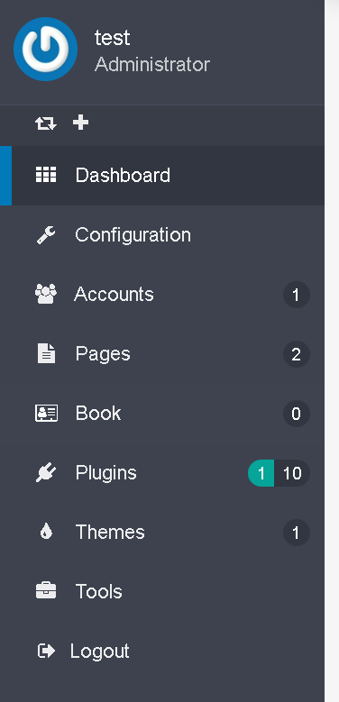

<h2 id="introduction">はじめに</h2>

このページの目的は、twigやコード中の Flex objects の利用方法を解説することだけです。Flex のパワーや柔軟性を理解するために、ぜひ[Flexのドキュメント](../../08.advanced/01.flex/) を読んでください。

Flexにより、オブジェクトのカスタムCRUD処理をひとつのオブジェクトやそのコレクションで行うことができ、プラグインコードやテンプレートから使える、幅広いAPIが使えます。

管理パネルのUIもかんたんに追加でき、標準的なテンプレートを使ったり、カスタマイズされた一覧やフォーム（やその他）を使ったりできます。

<h2 id="requirements">利用要件</h2>

Grav 1.7 以降が必要要件です。このドキュメントの目的のため、管理パネル付きのGravをインストールしてください。そうすれば、以下のステップを実行できます。[インストールの解説](../../01.basics/03.installation/) で管理パネル付きのGravを始められます。

<h2 id="create-your-plugins">プラグインの作成</h2>

プラグインを作った時のように、flexをスクラッチで作るかどうかに関わらず、すべての最新の変更をひとつの場所にまとめるため、devtools でスケルトンをと基本的な機能を生成することを、強くおすすめします。

そのために、devtools CLIを使いましょう：

```sh
bin/gpm install devtools
```

[detoolsを使って新しくプラグインを作成する](../03.plugin-tutorial/) ため、以下のコマンドを入力します。プラグイン名は、`myflexplugin` としましょう：

```sh
bin/plugin devtools new-plugin
```

以下のように質問に答えてください。重要なのは、`Please choose an option:` で flex を選ぶことです。

```sh
 Enter Plugin Name:
 > myflexplugin

 Enter Plugin Description:
 > A little Flex plugin test

 Enter Developer Name:
 > grav@example.com

 Enter GitHub ID (can be blank):
 > gravcms

 Enter Developer Email:
 > grav@example.com

 Please choose an option:
  [blank] Basic Plugin
  [flex ] Basic Plugin prepared for custom Flex Objects
 > flex

 Enter Flex Object Name:
 > book

 Please choose a storage type:
  [simple] Basic Storage (1 file for all objects) - no media support
  [file  ] File Storage (1 file per object)
  [folder] Folder Storage (1 folder per object)
 > folder


SUCCESS plugin myflexplugin -> Created Successfully

Path: /home/pierre/project/grav/grav-admin/user/plugins/myflexplugin

Please run `cd /home/pierre/project/grav/grav-admin/user/plugins/myflexplugin` and `composer update` to initialize the autoloader
```

無事成功したら、依存関係をインストールしておきましょう：


```sh
cd /home/pierre/project/grav/grav-admin/user/plugins/myflexplugin
```

```sh
composer update
```

成功すると、次のように出力されるはずです：

```sh
Loading composer repositories with package information
Updating dependencies
Nothing to modify in lock file
Writing lock file
Installing dependencies from lock file (including require-dev)
Nothing to install, update or remove
Generating autoload files
No installed packages - skipping audit.
```

Gravをインストールしたルートフォルダに戻ってください：


```sh
cd -
```

DevTools は、名前と説明からなる、とても基本的な flex objects を生成します。管理パネルUIは、1行もコードを書かずに、これらの books objects を一覧リスト化し、作成や編集、削除できるようになっています。

管理パネルプラグインの、左のサイドメニューに新しいエントリーが追加されています：



デフォルトの編集フォームは、このような見た目です：


'book' という flex object と、それに関わる多様なフォルダやファイルが作られていることがわかると思います。

<h2 id="what-is-done-where">どこで何が行われるか</h2>

プラグインフォルダは、次のようになっています：

```bash
../grav-admin/user/plugins/myflexplugin
├── CHANGELOG.md
├── LICENSE
├── README.md
├── blueprints
│   └── flex-objects
│       └── book.yaml
├── blueprints.yaml
├── classes
│   └── Flex
│       └── Types
│           └── Book
│               ├── BookCollection.php
│               └── BookObject.php
├── composer.json
├── composer.lock
├── languages.yaml
├── myflexplugin.php
├── myflexplugin.yaml
└── vendor
    ├── autoload.php
    └── composer
        ├── ClassLoader.php
        ├── InstalledVersions.php
        ├── LICENSE
        ├── autoload_classmap.php
        ├── autoload_namespaces.php
        ├── autoload_psr4.php
        ├── autoload_real.php
        ├── autoload_static.php
        ├── installed.json
        ├── installed.php
        └── platform_check.php
```

<h3 id="flex-object-definition">Flex Object の定義</h3>

重要なファイルは、[blurprints](../../08.advanced/01.flex/03.custom-types/01.blueprint/) の定義です。flex object のスキーマを、たくさんのカスタマイズオプションとともに、定義するところです。

今回のプラグインでは、book blueprints が、`user/plugins/myflexplugin/blueprints/flex-objects/book.yaml` ファイルに入っています。

> [!Note]  
> **重要** それぞれの flex object の blueprint は、`blueprints/flex-objects/` フォルダ内に入っていなければいけません。

スキーマは、このblueprints の Form セクションを使って定義されます。管理パネルプラグインのUIを使うかどうかに関わらず、このセクションはこのflex object のプロパティを定義します。

ここでは、すべてのオプションを説明することはできません。まずは book オブジェクトを実装することに集中しましょう。[詳しい Flex blueprints のドキュメント](../08.advanced/01.flex/03.custom-types/01.blueprint/) では、より深くカスタマイズ方法をガイドします。

以下のようなスキーマで、2つのプロパティを定義しています：

```yaml
form:
    validation: loose
    fields:
        published:
            type: toggle
            label: Published
            highlight: 1
            default: 1
            options:
                1: PLUGIN_ADMIN.YES
                0: PLUGIN_ADMIN.NO
            validate:
                type: bool
                required: true
        name:
            type: text
            label: Name
            validate:
                required: true
        description:
            type: text
            label: Description
            validate:
                required: true
```

<h3 id="plugin-hooks">プラグインのフック</h3>

`myflexplugin.php` は、プラグインの実装や、フックなどを定義する中心となるものです。

以下のようなパーツが、flex を有効化するのに必要です：

```php
    public $features = [
        'blueprints' => 0,
    ];

    /**
     * @return array
     *
     * The getSubscribedEvents() gives the core a list of events
     *     that the plugin wants to listen to. The key of each
     *     array section is the event that the plugin listens to
     *     and the value (in the form of an array) contains the
     *     callable (or function) as well as the priority. The
     *     higher the number the higher the priority.
     */
    public static function getSubscribedEvents(): array
    {
        return [
            'onPluginsInitialized' => [
                // Uncomment following line when plugin requires Grav < 1.7
                // ['autoload', 100000],
                ['onPluginsInitialized', 0]
            ],
            FlexRegisterEvent::class       => [['onRegisterFlex', 0]],
        ];
    }
```

その他のファイルは、標準的で、これまでのプラグインのセクションでも解説してきたようなファイルです。ここでは、それらには触れません。

_classes_ フォルダには、book flex object と、book flex collection で使う class が入っています。ここにある class には、すべての object や collection で使えるカスタムメソッドを追加できます。[flex object にカスタムメソッドを追加する](#add-custom-method-to-the-flex-object) を見てください。

<h2 id="modify-the-flex-object-schema">flex object のスキーマを修正する</h2>

object に、フィールドを追加してみましょう。本の出版日をあらわす datetime フィールドを追加するなら、シンプルに `pub_date` フィールドを blueprints に追加するだけです：

```yaml
form:
    validation: loose
    fields:
        published:
            type: toggle
            label: Published
            highlight: 1
            default: 1
            options:
                1: PLUGIN_ADMIN.YES
                0: PLUGIN_ADMIN.NO
            validate:
                type: bool
                required: true
        name:
            type: text
            label: Name
            validate:
                required: true
        pub_date:
            type: datetime
            label: Description
            validate:
                required: true
```

デフォルトの編集フォームに、出版日のフィールドのための日付入力欄が、表示されました。


フィールドタイプは、[ここ](../../06.forms/01.blueprints/01.fields-available/) にその全体のリストがあります。

<h2 id="add-custom-method-to-the-flex-object">flex object にカスタムメソッドを追加する</h2>

現在の book flex object は、`user/plugins/myflexplugin/classes/Flex/Types/Book/BookObject.php` に、GenericObject という trait を使用した class しか実装されていません。

```php
<?php

declare(strict_types=1);

/**
 * @package    Grav\Common\Flex
 *
 * @copyright  Copyright (c) 2015 - 2021 Trilby Media, LLC. All rights reserved.
 * @license    MIT License; see LICENSE file for details.
 */

namespace Grav\Plugin\Myflexplugin\Flex\Types\Book;

use Grav\Common\Flex\Types\Generic\GenericObject;

/**
 * Class BookObject
 * @package Grav\Common\Flex\Generic
 *
 * @extends FlexObject<string,GenericObject>
*/
class BookObject extends GenericObject
{

}
```

概要のための区切りを使って、本の概要を取得するメソッドを追加してみましょう。


```php
<?php

declare(strict_types=1);

/**
 * @package    Grav\Common\Flex
 *
 * @copyright  Copyright (c) 2015 - 2021 Trilby Media, LLC. All rights reserved.
 * @license    MIT License; see LICENSE file for details.
 */

namespace Grav\Plugin\Myflexplugin\Flex\Types\Book;

use Grav\Common\Flex\Types\Generic\GenericObject;

/**
 * Class BookObject
 * @package Grav\Common\Flex\Generic
 *
 * @extends FlexObject<string,GenericObject>
*/
class BookObject extends GenericObject
{
    public function getSummary() {
        $delimiter = \Grav\Common\Grav::instance()['config']['site']['summary']['delimiter'] ?? '===';
        $summary = explode($delimiter, $this->content);
        return $summary[0] ?? '';
    }
}
```

これで、book flex object を利用する場所ならどこからでも、このメソッドを呼び出せます。たとえば、テンプレート中でも可能です：


```twig


    <h1>{{ book.header.title}}</h1>
    <p>{{ book.getSummary()}}</p>

```

`::getSummary` メソッドは、PHPコードでも使えます。

同じことが、collection class （`user/plugins/myflexplugin/classes/Flex/Types/Book/BookCollection.php`）でも行えます。たとえば、些細ではないクエリを利用して検索するフレンドリーなメソッドを追加できます。実際、コレクションclass は、すでにすべての一般的なコレクションメソッドを提供しています。オブジェクトに多くの異なるフィールドがあり、標準的なコレクションメソッドではエラーが出るような場合は、ヘルパーメソッドを追加すると便利です。

