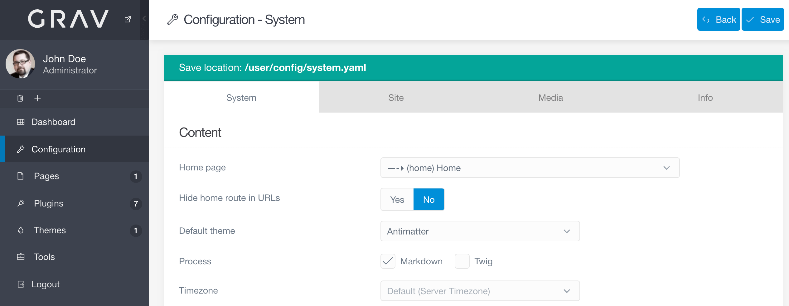

**Configuration** ページでは、サイトの **System** 設定及び **Site** 設定にアクセスできます。  
加えて、PHP プロパティや、サーバー環境のプロパティ、その他のサイトの運営を決定づけるさまざまなコンポーネントのプロパティを閲覧できます。

> [!Info]  
> Configuration ページには、 `access.admin.super` もしくは `access.admin.configuration` のアクセスレベルが必要です。

**System** タブは、 `/user/config/system.yaml` ファイルで設定できることをカスタマイズできます。
これらの設定は、 Grav が操作する system に関係する機能の数によります。  
サイトのホームページや、キャッシュの設定、その他について、ここで設定できます。

これらの設定は、いくつかのセクションに分けられ、それぞれ、 Grav 操作の特定の側面を設定できます。

以下は、**System** タブに表示される個々の設定セクションを説明したものです。

### Content

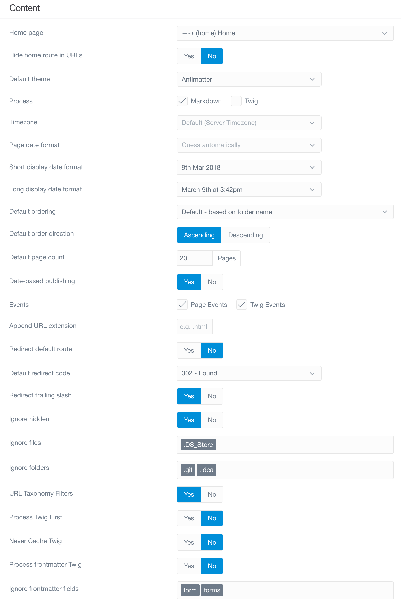

このセクションでは、サイト内でのコンテンツ制御の基本的なプロパティを設定します。  
ホームとなるページや、デフォルトテーマ、その他さまざまなコンテンツ表示オプションを、ここで設定します。

| オプション | 説明 |
| :----- | :----- |
| **Home Page**  | サイトのホームページとして表示させたいページを選びます。 |
| **Default Theme**  | サイトで使うデフォルトテーマを設定します。 |
| **Process**  | どのようにページを処理するかを制御します。サイト全体ではなくページごとにも設定できます。 |
| **Timezone** | サーバーのデフォルトのタイムゾーンを上書きします。|
| **Short Date Format** | テーマで使う日付の短いフォーマットを設定します。 |
| **Long Date Format** | テーマで使う日付の長いフォーマットを設定します。 |
| **Default Ordering** | リストの中のページは、上書きされない限り、ここで設定した順序でレンダリングされます。 |
| **Default Order Direction** | リストページの方向です。 |
| **Default Page Count** | リストページの1ページあたりの最大表示数のデフォルト値。|
| **Date-based Publishing**   | 日付をもとに、自動で投稿を公開・非公開します |
| **Events** | 特定のイベントの有効化・無効化。無効化するとプラグインにフックさせないことができます。 |
| **Redirect Default Route**  | 自動でページのデフォルトのルーティングにリダイレクトします。 |

### Languages

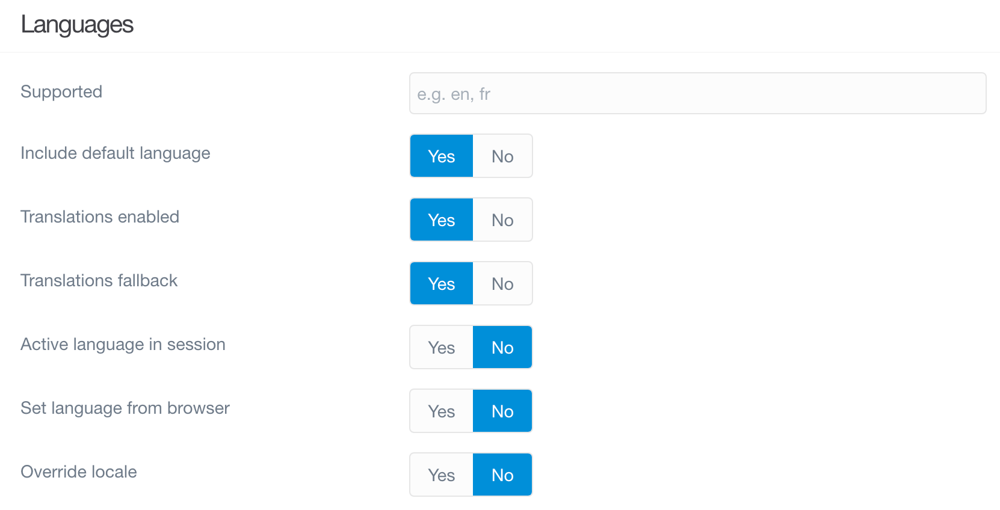

このセクションでは、多言語機能を設定します。

| オプション | 説明 |
| :----- | :----- |
| **Supported**  | 2文字の言語コードのカンマ区切りのリスト（たとえば、`en,fr,de`）  |
| **Translations Enabled** | Gravや、プラグイン、拡張機能で翻訳をサポートする |
| **Translations Fallback**  | 有効な言語が存在しなかったとき、サポート対象言語にフォールバックする |
| **Active Language in Section** | セッションに有効言語を保存する |
| **Home Redirect Include Language** | Include language in home redirect (/en).                                  |
| **Home Redirect Include Route**    | Home redirect include route.                                              |

> [!訳注]  
> 最後の2つは、2025年現在の管理画面にありませんし、画像とも違うので、古い仕様なのかもしれません。

### HTTP Headers

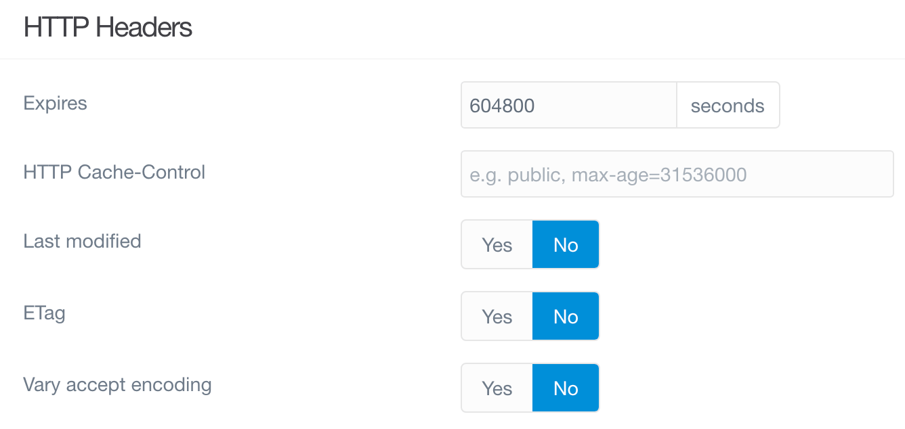

HTTP ヘッダオプションは、このセクションで設定できます。  
ブラウザベースのキャッシュと、最適化に便利です。

| オプション | 説明 |
| :----- | :----- |
| **Expires**  | expires ヘッダを設定します。 値は秒数です。  |
| **Last Modified**  | last modified ヘッダを設定します。プロキシとブラウザキャッシュの最適化を助けます。 |
| **ETag**  | etag ヘッダを設定します。ページがいつ修正されたかの識別を助けます。 |
| **Vary Accept Encoding** |  *Vary: Accept Encoding* ヘッダ設定します。プロキシと CDN キャッシュを助けます。 |

### Markdown

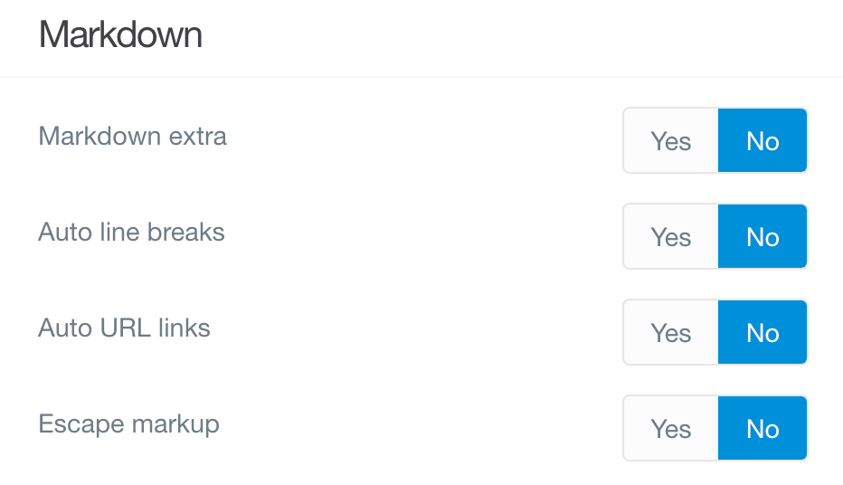

マークダウンは、 Grav のページコンテンツの大部分を占めています。  
このセクションでは、 Markdown Extra の有効化オプションや、 Grav がどのようにマークダウンを制御するかの設定ができます。

| オプション | 説明 |
| :----- | :----- |
| **Markdown Extra**   |  [Markdown Extra](https://michelf.ca/projects/php-markdown/extra/) のデフォルトでのサポートを有効化する |
| **Auto Line Breaks** | マークダウンでの自動改行を有効化する |
| **Auto URL Links**   | URL を HTML ハイパーリンクに自動変換する機能を有効化する |
| **Escape Markup**    | マークアップタグを HTML エンティティにエスケープする |

### Caching

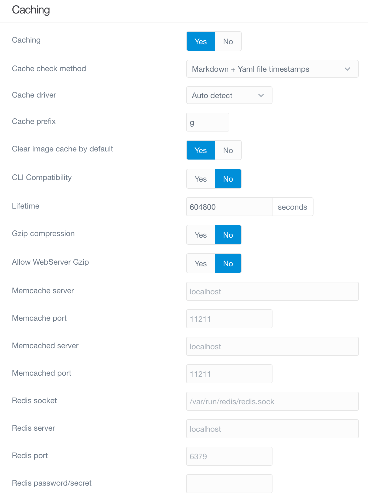

Grav の統合されたキャッシュ機能のおかげで、Grav は最速のフラットファイル CMS のひとつとなっています。  
このセクションで、サイトの主要なキャッシュ機能の設定ができます。

| オプション | 説明 |
| :----- | :----- |
| **Caching** | Grav のキャッシュの有効化/無効化をグローバルに設定 |
| **Cache Check Method** | キャッシュのチェック方法の設定。選択肢は、 **File**, **Folder**, そして **None** |
| **Cache Driver** | Grav が使用すべきキャッシュドライバの選択。 'Auto Detect' で、最適な方法を探します |
| **Cache Prefix**  | Grav キー部分の識別子。内容が分からない場合は変更しないでください。 |
| **Lifetime** | キャッシュのライフタイム秒数。  0 = 無限 |
| **Gzip Compression**   | パフォーマンス向上のために Grav ページの GZip 圧縮を有効化するかどうか |

### Twig Templating

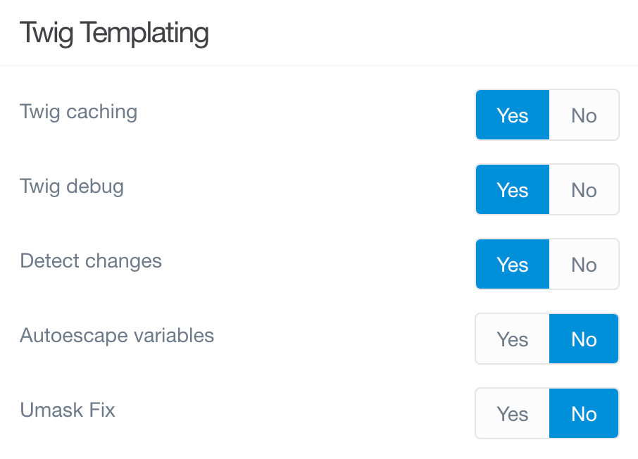

このセクションでは、 Grav の Twig テンプレートに注目します。  
Twig のキャッシュや、デバッグ、変更があったときの検出の設定を行うことができます。

| オプション | 説明 |
| :----- | :----- |
| **Twig Caching** | Twig のキャッシュメカニズムを制御します。ベストパフォーマンスのために、この設定を有効化しておいてください。 |
| **Twig Debug** | Twig のデバッガー拡張を読み込まないオプションを提供します |
| **Detect Changes**       | Twig は、 Twig テンプレートで変更が検出されたら、自動的に Twig キャッシュを再コンパイルします。 |
| **Autoescape Variables** | 変数を自動でエスケープします。サイトが壊れやすくなる危ない設定です。 |

### Assets

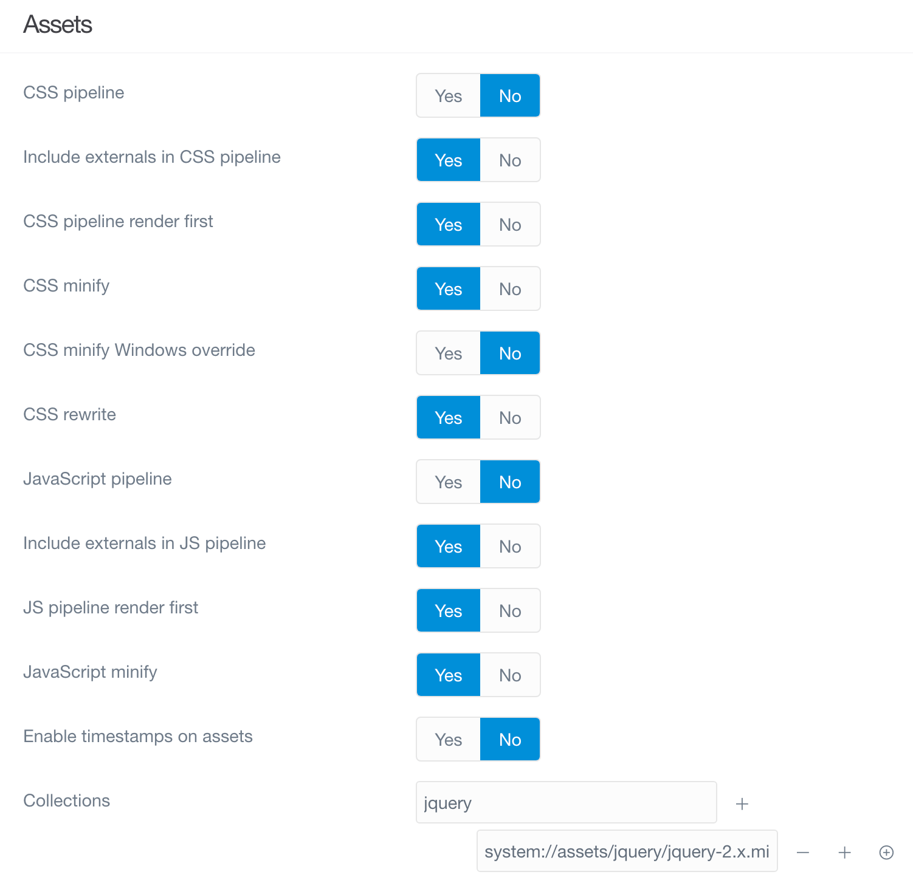

このセクションでは、 CSS や JavaScript などのアセット制御を扱います。

| オプション | 説明 |
| :----- | :----- |
| **CSS Pipeline** | CSS パイプラインとは、複数の CSS リソースを1つのファイルにまとめることです。 |
| **CSS Minify** | パイプライン処理中に CSS をミニファイする |
| **CSS Minify Windows Override** | Widnows プラットフォーム用のミニファイの上書きです。デフォルトでは ThreadStackSize のために false となっています。 |
| **CSS Rewrite** | パイプライン処理中に CSS の相対 URL を書き換えます。 |
| **JavaScript Pipeline** | JS パイプラインとは、複数の JS リソースを1つのファイルにまとめることです。 |
| **JavaScript Minify** | パイプライン処理中に JS をミニファイする |
| **Enable Timestamps on Assets** | アセットのタイムスタンプを有効化する |
| **Collections** | 独立したアセットコレクションを追加する |

### Error Handler

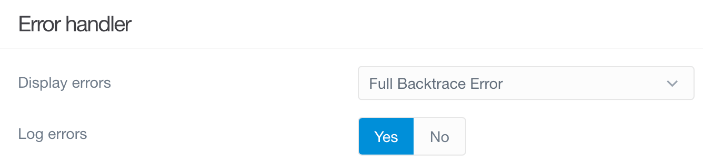

ここでは、 Grav がエラーレポートやエラー表示を制御する方法を設定できます。
これはサイト開発中に便利な機能です。

| オプション | 説明 |
| :----- | :----- |
| **Display Error** | 完全な backtrace スタイルのエラーページを表示します |
| **Log Errors** | `/logs` フォルダにエラーログを書き込みます |

### Debugger

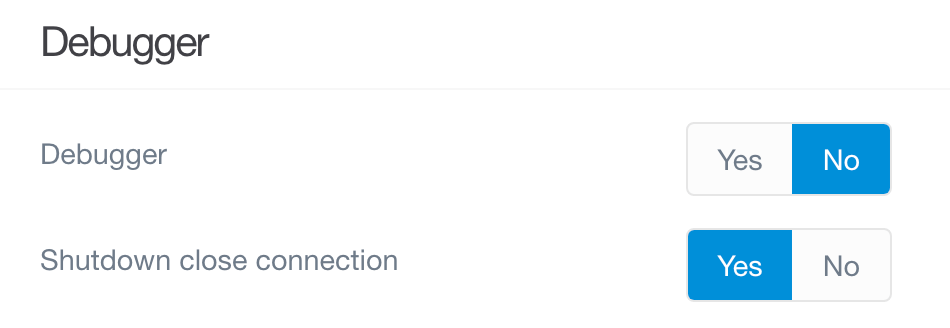

エラー制御のように、 Grav の統合デバッグツールによって、問題の場所を確定したり、トラブルシューティングできるようになります。  
これも開発中に、特に便利です。

| オプション | 説明 |
| :----- | :----- |
| **Debugger** | Grav デバッガーを有効化し、以下の設定ができるようにします |
| **Debug Twig** | Twig テンプレートのデバッグを有効化します |
| **Shutdown Close Connection** | `onShutdown()` が呼ばれる前にコネクションを閉じます。デバッグ中は false にします |

### Media

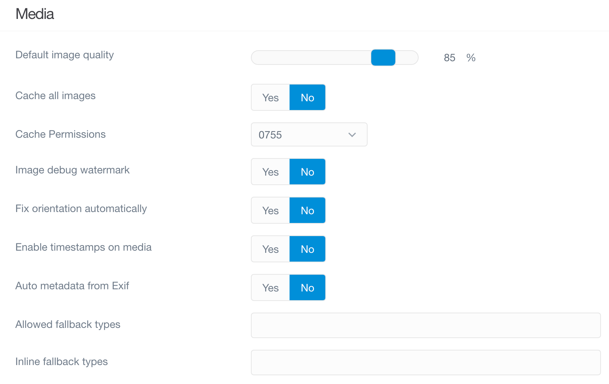

このセクションでは、 Grav がメディアコンテンツをどう制御するかを決定します。  
画質やその他のメディアを制御するオプションが、ここで設定できます。

| オプション | 説明 |
| :----- | :----- |
| **Default Image Quality** | resampling されるときや、キャッシュ画像のデフォルトの画質（85%） |
| **Cache All Images** | メディア操作していないものも含めてすべての画像を、 Grav のキャッシュシステムで実行する |
| **Image Debug Watermark** | たとえば Retina で作業する場合、画像のピクセル深度を示すオーバーレイを画像に表示する |
| **Enable Timestamps on Media** | 各メディアアイテムに最終更新日のタイムスタンプを追加する |

> [!Info]  
> すでに（ Grav の外で）最適化されている画像をキャッシュすると、オリジナルよりもファイルサイズがとても大きい出力ファイルとなることがあります。これは、 Gregwar image library のバグによるもので、 Grav と直接関係するものではありません（より詳しくは、 [オープンイシュー](https://github.com/Gregwar/Image/issues/115) を見てください）。別の方法として、 "Cache All Images" を No に設定できます。

### Session

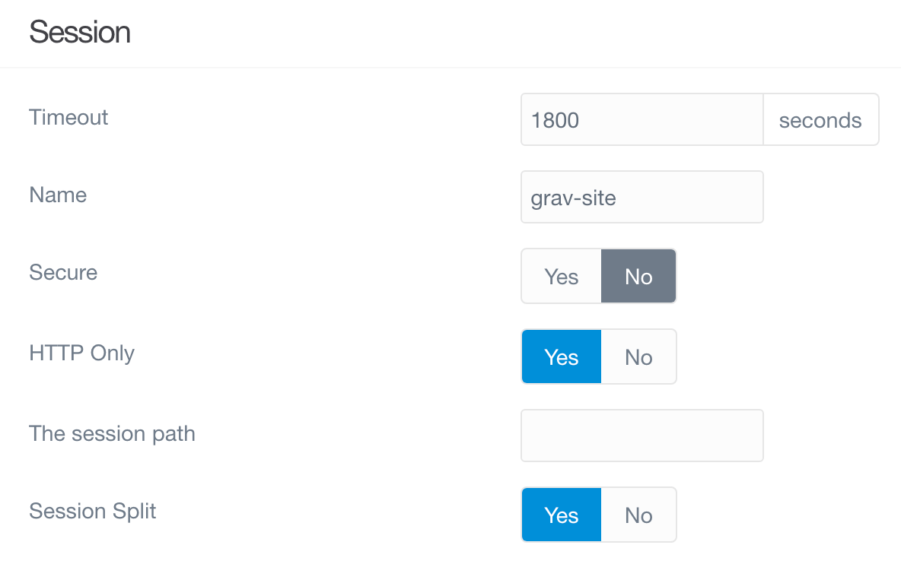

このセクションでは、セッションのサポートを有効化したり、タイムアウト制限を設定したり、この情報の制御に使われるセッションクッキーの名前を設定したりできます。

| オプション | 説明 |
| :----- | :----- |
| **Enable**  | Grav 内でのセッションサポートを有効化する |
| **Timeout** | セッションのタイムアウトを秒単位で設定する |
| **Name**    | セッションクッキーの名前として使われる識別子。英数字とダッシュとアンダースコアのみを使ってください。セッション名にドットを使わないでください。 |

### Advanced

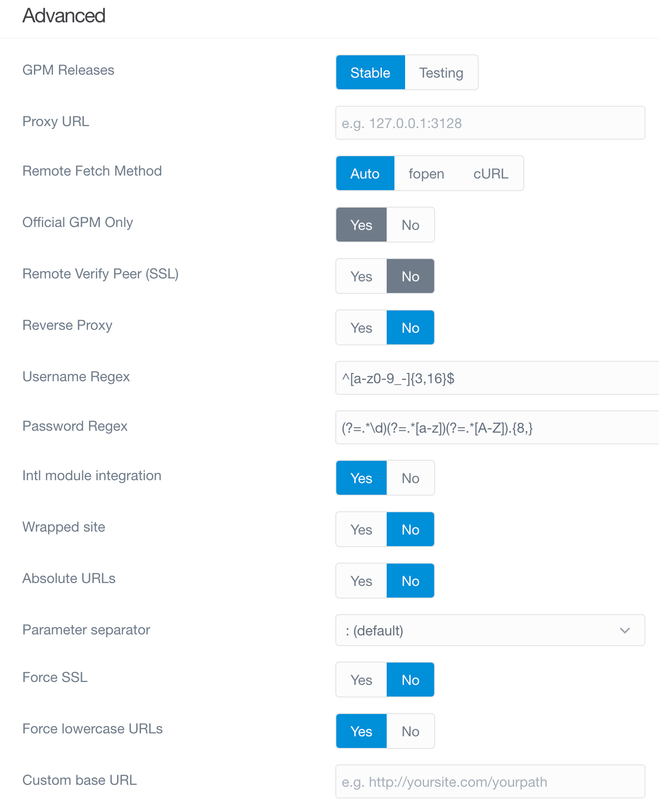

このセクションには、システムの高度な設定を含みます。

| オプション | 説明 |
| :----- | :----- |
| **Absolute URLs** | `base_url` の URL を絶対とするか相対とするか |
| **Parameter Separator** | Windows の Apache で変更できるパラメータを渡すためのセパレータ |

