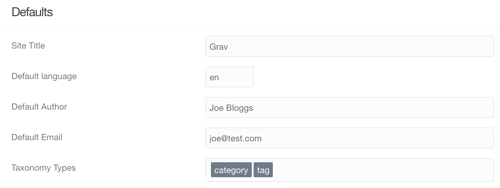
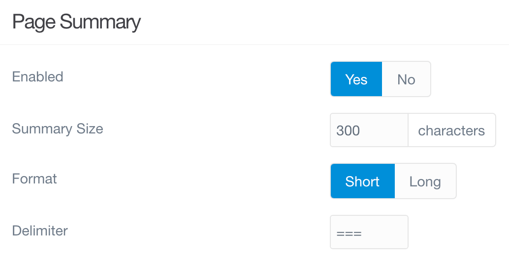

**Configuration** ページでは、サイトの **System** 設定及び **Site** 設定にアクセスできます。加えて、PHP プロパティや、SQL プロパティ、サーバー環境のプロパティ、その他のサイトの運営を決定づけるさまざまなコンポーネントのプロパティを閲覧できます。

> [!Info]  
> Configuration ページには、 `access.admin.super` もしくは `access.admin.configuration` のアクセスレベルが必要です。

**Site** タブでは、 `user/config/site.yaml` ファイルの設定をカスタマイズできます。サイトに関係する変数（たとえばサイト名、デフォルトの著者、サイトで使うメタデータなど）を決定するオプションやフィールドに、このタブからアクセスできます。

以下は、**Site** タブに表示される個々の設定セクションを説明したものです。

### Defaults

このセクションでは、サイトでのコンテンツ制御の基本的なプロパティを設定します。サイトタイトルや、デフォルトの著者が設定できます。

| オプション | 説明 |
| :----- | :----- |
| **Site Title**     | サイトのデフォルトタイトルで、しばしばテーマで使われます。 |
| **Default Author** | デフォルトの著者名で、しばしばテーマとページコンテンツで使われます。 |
| **Default Email**  | テーマやページで参照されるデフォルトの email です。 |
| **Taxonomy Types** | タクソノミータイプをページで使いたい場合、ここで定義されなければいけません。  |

### Page Summary

ページ概要（summary）は、ページコンテンツの小さなプレビューを表示する良い方法です。ページ中に区切り（delimiter）を使い、ページの概要コンテンツと、本文を分ける "カットオフ" ポイントを設定できます。これらの設定は、以下でできます

| オプション | 説明 |
| :----- | :----- |
| **Enabled**      | ページ概要を有効化します（概要はページコンテンツと同じものを返します）|
| **Summary Size** | コンテンツ概要として使われる文字数 |
| **Format**       | **short** = 最初の区切りもしくは文字数を使います； **long** = 概要区切りは無視されます |
| **Delimiter**    | 概要の区切り（デフォルトでは '==='）。これは通常、冒頭の段落の後に置かれ、それ以前はページ概要として表示されます。 |

### Metadata

メタデータ（ `<meta>タグ` ）は、ページのメークアップの舞台裏で、重要な部分です。SEO を改善し、さまざまな検索エンジンやソーシャルフィードでのリンクの見え方を向上させ、その他のこともできます。さまざまなメタデータのプロパティをここで設定できます。

| オプション | 説明 |
| :----- | :----- |
| **Metadata** | デフォルトのメタデータの値。ページで上書きされなければ、すべてのページに表示されます。 |

### Redirects and Routes

リダイレクトとルーティングは、かつてないほど簡単になりました。このセクションをすべて設定すれば、うまくいきます。

| オプション | 説明 |
| :----- | :----- |
| **Custom Redirects** | 他のページへリダイレクトするルーティング設定。標準的な正規表現による書き換えが使えます。 |
| **Custom Routes**    | 他のページの別名にするルーティング設定。標準的な正規表現による書き換えが使えます。 |

