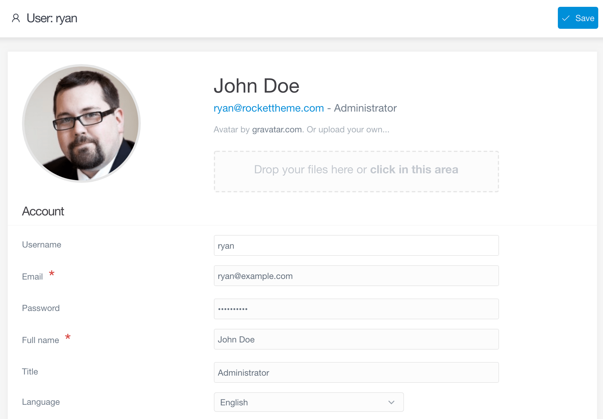
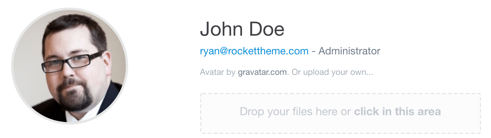
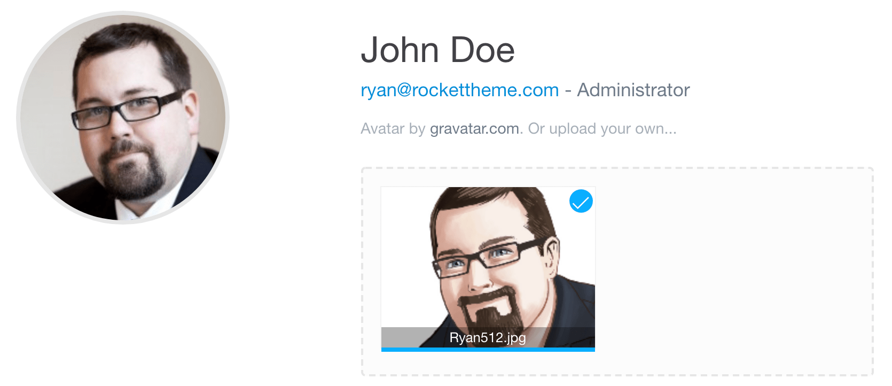
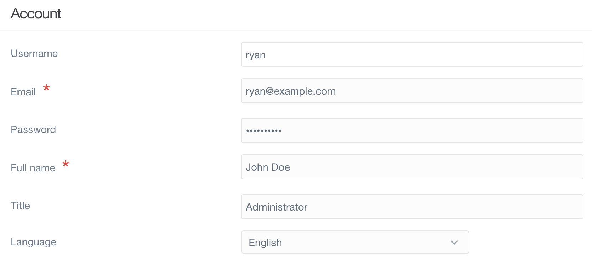
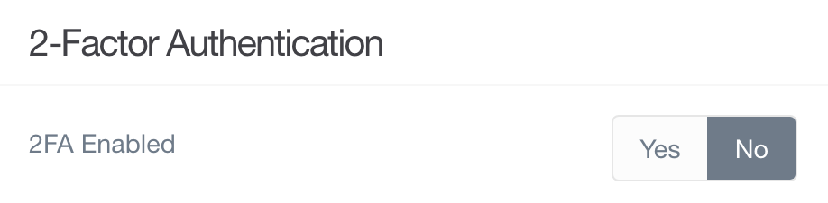
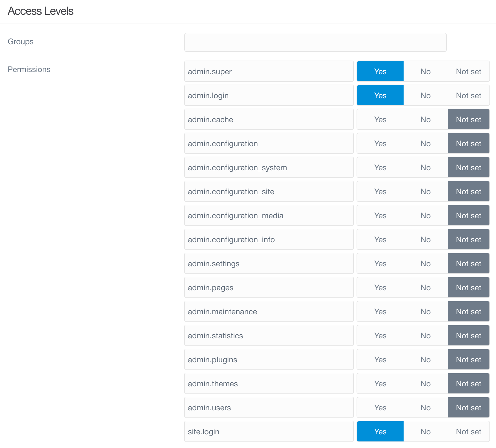

管理パネルのプロフィールページから、あなた個人のプロフィール設定を閲覧したり、更新したりできます。アバターや、メールアドレス、名前、言語、その他たくさんの設定ができる場所です。管理者にとっては、個々のユーザーにグループやパーミッションのレベルを設定する場所でもあります。

プロフィールページへのアクセスは簡単です。管理パネルにログインしたら、サイドバーのアバター画像と名前が書いてあるエリアを選択してください。あなた自身のプロフィールページへ直接リンクしています。

加えて、管理者にとっては、サイト URL に、 `admin/user/ユーザー名` と付け加えることで、 他のユーザーのプロフィールページへ簡単に飛べます。 `ユーザー名` のところは、プロフィール情報やパーミッションを編集したいと思っているユーザーのユーザー名に書き換えてください。

<h3 id="profile-photo">プロフィール写真</h3>

管理パネルの **プロフィール** エリアでは、すばやく、整理された見た目で、あなたのアバターや、名前、タイトルが表示されます。アバターは、 [Gravatar](http://en.gravatar.com/) というグローバルなアバターサービスで自動的に生成されます。そこに、ひとつのプロフィール画像をアップロードすれば、それが有効化され、これは、複数のサイトや複数のサービスをまたいで利用可能です。

Gravatar に画像をアップロードしていなければ、もしくは、あなたが選んだ画像を使いたい場合は、ページの **Drop Your Files Here or Click This Area** と書いてあるセクションに、画像をドラッグ・アンド・ドロップすることで、ここの画像をアップロードできます。そのエリアをクリックすることでも、ファイル選択が立ち上がり、そこで選び、手元のシステムから画像ファイルをアップロードできます。

新しい画像をアップロードしてから、ページ上部の右端にある **Save** ボタンを選択してください。

<h3 id="account">アカウント</h3>

プロフィールページの **アカウント** セクションでは、コンタクト情報や、名前、言語その他を更新できます。ここでは、 **ユーザー名** は編集できません。ユーザー名は、あなたのユーザー情報が保存されている場所と直接結びついているためです。しかし、ユーザー名以外については、編集可能です。

<h3 id="2-factor-authentication">2要素認証</h3>

**2要素認証** は、別レイヤーの web サイトセキュリティを提供します。この機能については、このガイドの [**セキュリティ**](../../06.security/01.2fa/) エリアで詳しく解説しています。

<h3 id="access-levels">アクセスレベル</h3>

管理者には、特に便利なパーミッションのエリアが表示されます。このエリアでは、ユーザーが、管理画面内でどこにアクセスでき、なにができるのかを正確に設定できます。

以下に、ざっくりとパーミッションのオプションと、その人がなにができるのかを掘り下げます。

| オプション | 説明 |
| :-----     | :-----  |
| **admin.super** | そのユーザーをスーパー管理者として設計し、サイト内のすべてのエリアを閲覧でき、設定できるようにします |
| **admin.login** | そのユーザーが管理パネルにログインできるようにします。ユーザーのログインを有効化するには、ここを **Yes** に設定しなければいけません。 |
| **admin.cache** | ユーザーにキャッシュリセットボタンへのアクセス権を渡します |
| **admin.configuration** | ユーザーに管理パネルの **Configuration** エリアへのアクセス権を渡します。これには、タブやサブセクションは含まれません。 |
| **admin.configuration_system** | ユーザーに管理パネルの **Configration** エリアの **System** タブへのアクセス権を渡します。 |
| **admin.configuration_site** | ユーザーに管理パネルの **Configration** エリアの **Site** タブへのアクセス権を渡します。 |
| **admin.configuration_media** | ユーザーに管理パネルの **Configration** エリアの **Media** タブへのアクセス権を渡します。 |
| **admin.configuration_info** | ユーザーに管理パネルの **Configration** エリアの **Info** タブへのアクセス権を渡します。 |
| **admin.pages** | ユーザーに管理パネルの **Pages** エリアへのアクセス権を渡します。 |
| **admin.maintenance** | ユーザーに **Dashboard** の　**Maintenance** エリアへのアクセス権を渡します。 |
| **admin.statistics** | ユーザーに **Dashboard** の　**Statistics** エリアへのアクセス権を渡します。 |
| **admin.plugins** | ユーザーに管理パネルの **Plugins** エリアへのアクセス権を渡します |
| **admin.themes** | ユーザーに管理パネルの **Themes** エリアへのアクセス権を渡します |
| **admin.users** | ユーザーが、他のユーザーのプロフィール情報へアクセスし、編集できるようにします。これはパーミッションを含みません。 |
| **site.login** | ユーザーがフロントエンドでログインできるようにします。 |

