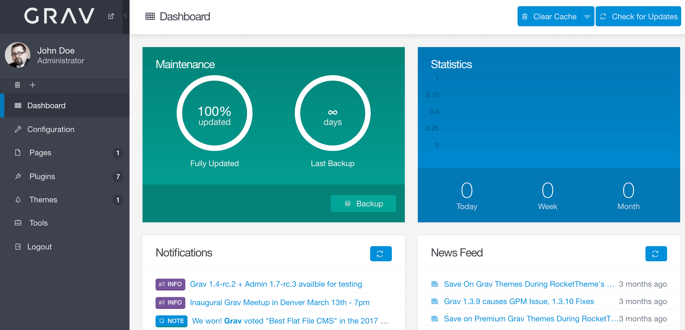
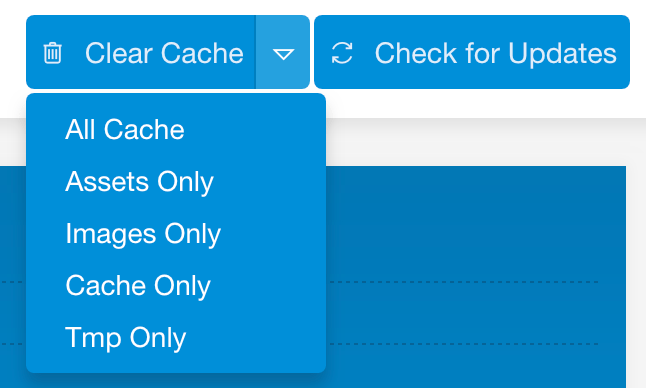
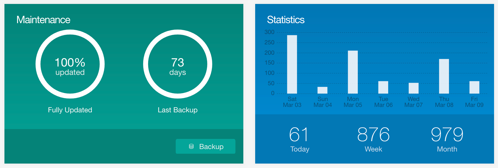
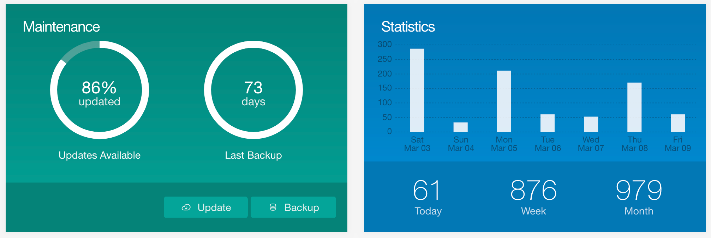
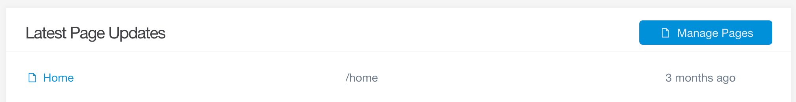

**ダッシュボード** は、 **管理パネル** プラグインで情報のハブ（hub）となるものです。  
この1ページから、アクセス統計の確認や、情報のメンテナンスの確認、 Grav のアップデートの確認、新しいバックアップ作成、最新のページ更新状況確認、さらに Grav のキャッシュをすばやくクリアすることもできます。

ここは、管理する上でのスタートポイントとなる場所です。

> [!Info]  
> ダッシュボードに表示されるコンテンツは、ユーザーのパーミッションにより変わります。  
たとえば、 `access.admin.super` というパーミッションを与えると、すべてが表示されます。  
もしそのアクセスレベルが許可されていなければ、 `access.admin.maintenance` でキャッシュのクリアとアップデートが許可されます。  
`access.admin.pages` で、ページにアクセスできます。  
`access.admin.statistics` で、サイト閲覧の統計情報が表示されます。

<h3 id="cache-and-updates-checking">キャッシュとアップデートをチェック</h3>

ダッシュボードの上部に、2つのボタンがあります。  
最初のものは、 Grav のキャッシュをクリアします。  
メインの **Clear Cache** ボタンをクリックすると、すべてのキャッシュをクリアします。  
アセットと画像のキャッシュも含んでクリアされます。  
すぐ右にある **ドロップダウン** 機能を使うと、特定のタイプのキャッシュのみ消す処理を選べます。

たとえば、他のキャッシュを残したまま、 **画像キャッシュ** のみクリアしたいとき、ここのドロップダウンで、それができます。

2つ目のボタンは、サイトのアップデート状況をチェックできます。
チェック対象は、すべてのサポート対象のプラグインと、テーマと、 Grav 自身です。
新しいアップデートが見つかれば、ダッシュボードに通知が表示されます。
Grav が新しいアップデート情報をチェックする方法は、これだけではありません。

> [!Info]  
> アップデートは、管理パネルで新しいページが読み込まれるときにチェックされ、1日キャッシュされます。 Grav のすべてのキャッシュをクリアし、管理パネルで新しいページを読み込むと、自動的にアップデートチェックが行われます。

<h3 id="maintenance-and-page-view-statistics">メンテナンスとページビューの統計</h3>

**Maintenance** と **Page View Statistics** のセクションでは、サイトの重要情報にすばやくアクセスできます。

**Maintenance** サイドは、 Grav の部分がどの程度アップデートされているかを知らせる円グラフです。

新しいアップデートが利用可能になったら、 **Update** ボタンが表示され、すべてのプラグインとテーマについて、1クリックアップデートが実行できるようになります。  
このボタンは、 Grav そのものはアップデートしません。  
メンテナンスとページビュー統計セクションのすぐ上で、アップデートが必要であることを知らせます。

Grav のコアは、その通知バーの **Update Grav Now** ボタンを選択することによって、アップデートされます。

どれくらいの間、サイトのバックアップが作成されていないかを示すグラフも表示されます。 **Backup** ボタンを選択すると、zip ファイルを生成し、サイトデータのバックアップをダウンロード・保存できるようになります。

> [!Info]  
> バックアップは、 Grav をインストールしているルートフォルダ下の `backup/` フォルダにも保存されます。FTP や、ホスティング会社のウェブ管理ツールで、それらを手に入れられます。

**Page View Statistics** セクションでは、過去1日、1週間、1ヶ月（30日）間のサイトのフロントエンドのページビューを分かりやすく、シンプルに、ひと目でわかるトラフィックデータにして表示します。  
過去1週間のページビューの統計は、その集の日付ごとに分けられた棒グラフで表示されます。

<h3 id="latest-page-updates">最新のページ更新</h3>

管理パネルの **Latest Page Updates** エリアは、 Grav サイトのページによる最新のコンテンツ更新の一覧が表示されます。  
リストは、最新の更新状況を保存し、それぞれの更新時期を表示します。  
このリストのページタイトルを選択すると、管理パネル内のそのページの編集画面に直接リンクしています。

**Manage Pages** ボタンは、**Pages** 管理ページへリンクします。

