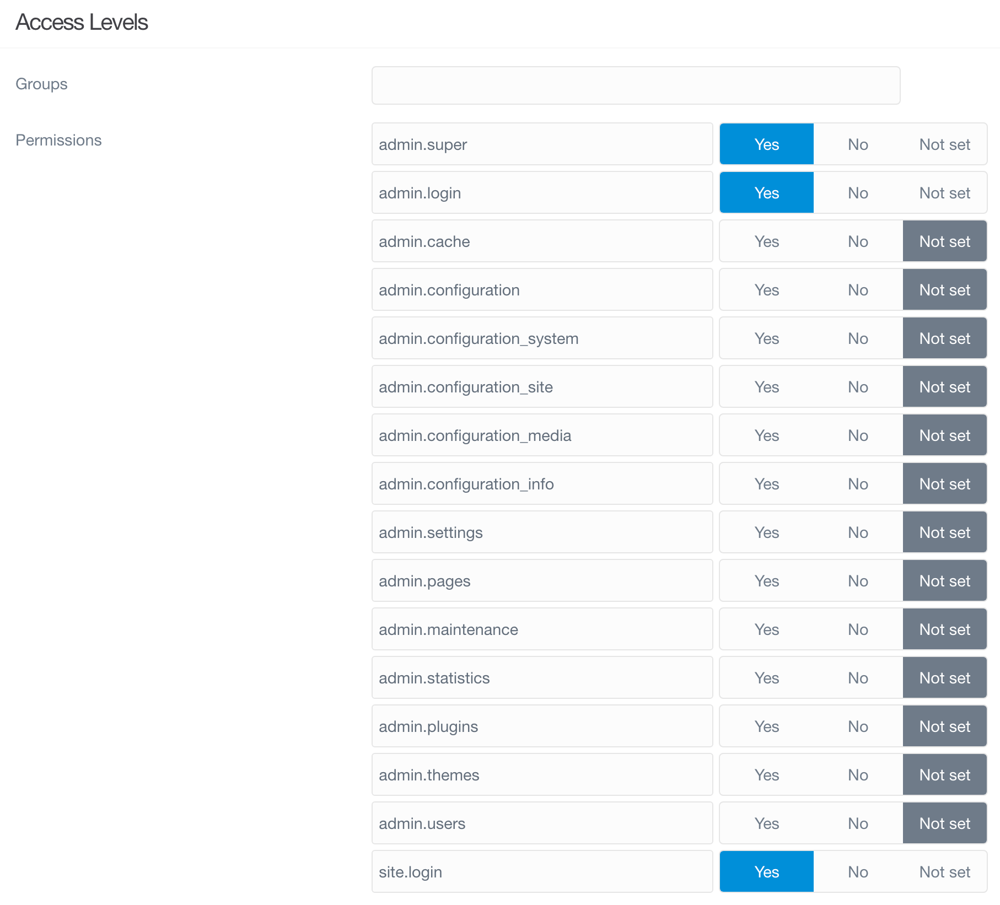

> [!訳注]  
> 何らかの経緯でこうなったのだろうと思いますが、このページの内容は、 [ダッシュボードのプロフィール](../../02.dashboard/03.profile/) とほぼ同じです。最後の [アクセスタブ](#access-tab) のところだけ、多少違います。

<h2 id="user-profile">ユーザープロフィール</h2>

管理パネルのプロフィールページから、あなた個人のプロフィール設定を閲覧したり、更新したりできます。  
アバターや、メールアドレス、名前、言語、その他たくさんの設定ができる場所です。  
管理者にとっては、個々のユーザーにグループやパーミッションのレベルを設定する場所でもあります。

プロフィールページへのアクセスは簡単です。  
管理パネルにログインしたら、サイドバーのアバター画像と名前が書いてあるエリアを選択してください。  
あなた自身のプロフィールページへ直接リンクしています。

加えて、管理者にとっては、サイト URL に、 `admin/user/ユーザー名` と付け加えることで、 他のユーザーのプロフィールページへ簡単に飛べます。  
`ユーザー名` のところは、プロフィール情報やパーミッションを編集したいと思っているユーザーのユーザー名に書き換えてください。

<h3 id="general-tab">一般タブ</h3>

<h4 id="profile-photo">プロフィール写真</h4>

管理パネルの **プロフィール** エリアでは、すばやく、整理された見た目で、あなたのアバターや、名前、タイトルが表示されます。  
アバターは、 [Gravatar](http://en.gravatar.com/) というグローバルなアバターサービスで自動的に生成されます。  
そこに、ひとつのプロフィール画像をアップロードすれば、それが有効化され、これは、複数のサイトや複数のサービスをまたいで利用可能です。

Gravatar に画像をアップロードしていなければ、もしくは、あなたが選んだ画像を使いたい場合は、ページの **Drop Your Files Here or Click This Area** と書いてあるセクションに、画像をドラッグ・アンド・ドロップすることで、ここの画像をアップロードできます。  
そのエリアをクリックすることでも、ファイル選択が立ち上がり、そこで選び、手元のシステムから画像ファイルをアップロードできます。

新しい画像をアップロードしてから、ページ上部の右端にある **Save** ボタンを選択してください。

<h4 id="account">アカウント</h4>

プロフィールページの **アカウント** セクションでは、コンタクト情報や、名前、言語その他を更新できます。  
ここでは、 **ユーザー名** は編集できません。  
ユーザー名は、あなたのユーザー情報が保存されている場所と直接結びついているためです。  
しかし、ユーザー名以外については、編集可能です。

<h4 id="2-factor-authentication">2要素認証</h4>

**2要素認証** は、別レイヤーの web サイトセキュリティを提供します。  
この機能については、このガイドの [**セキュリティ**](../../06.security/01.2fa/) エリアで詳しく解説しています。

<h3 id="access-tab">アクセスタブ</h3>

このタブは、管理者権限を持つユーザーにだけ表示されます。

| オプション | 説明 |
| :-----     | :-----  |
| **Groups** | ユーザーが所属する [グループ](/admin-panel/accounts/groups) のリスト|
| **Permissions** | サイトでの全パーミッションのリスト。 [グループパーミッション](../02.groups/#permissions) を参照してください |

