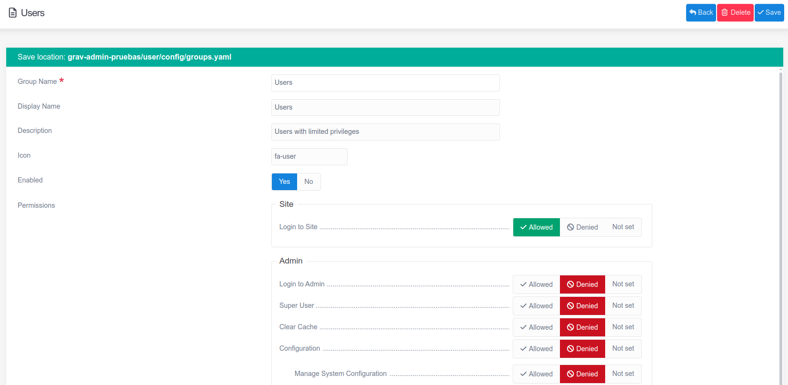
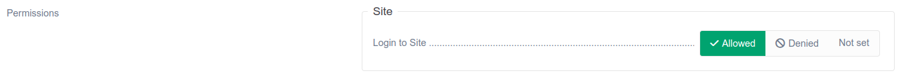
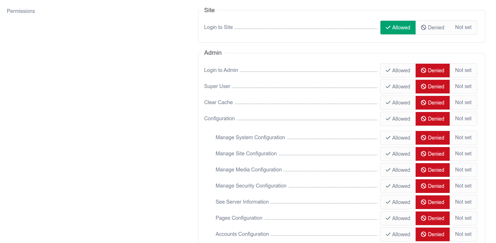

**ユーザーグループ** は、ユーザーの一般的な役割（role）を定義します。すべての **ユーザーアカウント** に、個々にルールを変更するよりも、役割を管理したほうが簡単なので、ユーザーにパーミッションを設定するのは、より良い方法です。

 ユーザーグループを作成後、[アクセスタブ](../01.users/#access-tab) から、ユーザーアカウントに適用できます。

<h2 id="user-group">ユーザーグループ</h2>

| オプション | 説明 |
| :-----    | :----- |
| **Group Name** | グループ名でグループを識別します。ぐるーぷ作成後には変更できません |
| **Display Name** | グループとして表示される名前です |
| **Description** |  |
| **Icon** |  |
| **Enabled** | **Yes** を設定した場合、グループがサイト内で有効化されます。 **No** にすると、グループによるパーミッションの設定が適用されません |
| **Permissions** | サイト内のすべてのパーミッションのリストです。 [以下を参照してください](#permissions). |

<h3 id="permissions">パーミッション</h3>

管理者には、特に便利なパーミッションのエリアが表示されます。このエリアでは、ユーザーが、管理画面内でどこにアクセスでき、なにができるのかを正確に設定できます。

以下に、ざっくりとパーミッションのオプションと、その人がなにができるのかを掘り下げます。

#### Site

| オプション | 値 | 説明 |
| :----- | :----- | :-----  |
| **Login to Site**  | *site.login*  | ユーザーがフロントエンドでログインできるようにする |

#### Admin

| オプション | 値 | 説明 |
| :----- | :----- | :-----  |
| **Login to Admin**  | *admin.login*  | ユーザーが管理画面にログインするのを有効化する。ユーザーがログインするには **Yes** が設定されていなければいけません。 |
| **Super User** | *admin.super* | ユーザーをスーパー管理者にします。サイトのすべてのエリアを閲覧でき、設定できます。 |
| **Clear Cache**  | *admin.cache* | キャッシュリセットボタンにアクセスできます。 |
| **Configuration** | *admin.configuration* | 管理パネルの **Configuration** エリアにアクセスできます。 |
| &nbsp; &nbsp; **Manage System Configuration** | *admin.configuration.system* | 管理パネルの **Configuration** エリア内の **System** タブにアクセスできます。 |
| &nbsp; &nbsp; **Manage Site Configuration**  | *admin.configuration.site*    | 管理パネルの **Configuration** エリア内の **Site** タブにアクセスできます。 |
| &nbsp; &nbsp; **Manage Media Configuration** | *admin.configuration.media*   | 管理パネルの **Configuration** エリア内の **Media** タブにアクセスできます。 |
| &nbsp; &nbsp; **See Server Information** | *admin.configuration.info* | 管理パネルの **Configuration** エリアの **Info** タブにアクセスできます。 |
| &nbsp; &nbsp; **Pages Configuration** | *admin.configuration.pages*   | 管理パネルの  [Pages](../../03.page/05.configuration/) エリア内で **Pages Configuration** にアクセスできます。 |
| &nbsp; &nbsp; **Accounts Configuration** | *admin.configuration.accounts*   | 管理パネルの  [Accounts](../03.configuration/) エリア内で **Accounts Configuration** にアクセスできます。 |
| **Pages**                             | *admin.pages*                 | 管理パネルの  [Pages](../../03.page/) エリアにアクセスできます。 |
| **Site Maintenance**                  | *admin.maintenance*           | **Dashboard** の **Maintenance** エリアにアクセスできます。 |
| **Site Statistics**                   | *admin.statistics*            | **DashBoard** の **Statistics** エリアにアクセスできます。 |
| **Manage Plugins**                    | *admin.plugins*               | 管理パネルの **Plugins** エリアにアクセスできます。 |
| **Manage Themes**                     | *admin.themes*                | 管理パネルの **Themes** エリアにアクセスできます。 |
| **Access to Tools**                   | *admin.tools*                 | 管理ツールにアクセスできます。 |
| **User Accounts**                     | *admin.accounts*              | 管理パネルの  [Accounts](../) エリアにアクセスできます |

