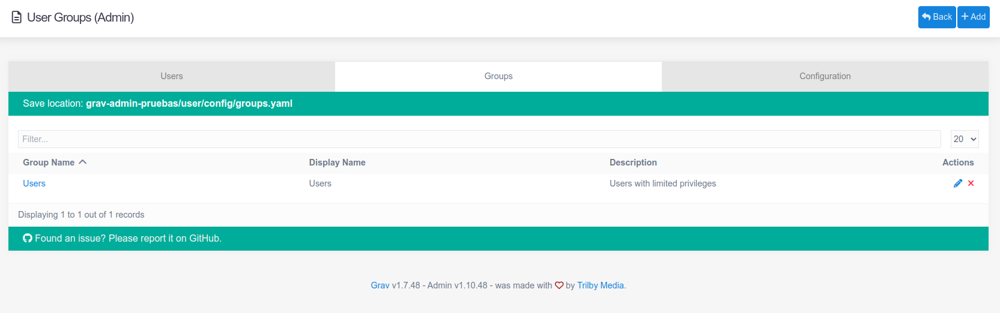

**ユーザーグループ** は、ユーザーの一般的なルールを定義します。
**User Groups** define common roles for the users. It is the preferred way to set permissions to the users as managing roles is easier than changing the rules individually for every **user account**.

After creating a User Group, you can assign it to user accounts from [Access Tab](../01.users/#access-tab).

## User Group

| オプション | 説明 |
| :-----    | :----- |
| **Group Name** | Group name is identifier for the group. It cannot be changed after creating the group. |
| **Display Name** | Display name is the visible name for the group. |
| **Description** |  |
| **Icon** |  |
| **Enabled** | If set to **Yes**, group has been enabled in your site. If **No**, permissions set by the group do not apply. |
| **Permissions** | List of all permissions in your site. [See below](#permissions). |

### Permissions

Administrators will find the permissions area especially useful. This is where you can configure exactly what a user will be able to access and do within the administrator.

Here is a quick breakdown of the permissions options and what they enable someone to do.

#### Site

| オプション | 値 | 説明 |
| :----- | :----- | :-----  |
| **Login to Site**  | *site.login*  | ユーザーがフロントエンドでログインできるようにする |

#### Admin

| オプション | 値 | 説明 |
| :----- | :----- | :-----  |
| **Login to Admin**                    | *admin.login*                 | Enables the user to log in to the admin. This must be set to **Yes** to enable the user to log in. |
| **Super User**                        | *admin.super*                 | Designates the user as a super admin, giving them the ability to see and configure all areas of the site. |
| **Clear Cache**                       | *admin.cache*                 | Gives the user access to the cache reset buttons.                |
| **Configuration**                     | *admin.configuration*         | Gives the user access to the **Configuration** area of the admin. |
| &nbsp; &nbsp; **Manage System Configuration** | *admin.configuration.system* | Gives the user access to the **System** tab in the **Configuration** area of the admin.             |
| &nbsp; &nbsp; **Manage Site Configuration**  | *admin.configuration.site*    | Gives the user access to the **Site** tab in the **Configuration** area of the admin.               |
| &nbsp; &nbsp; **Manage Media Configuration** | *admin.configuration.media*   | Gives the user access to the **Media** tab in the **Configuration** area of the admin.              |
| &nbsp; &nbsp; **See Server Information** | *admin.configuration.info* | Gives the user access to the **Info** tab in the **Configuration** area of the admin.               |
| &nbsp; &nbsp; **Pages Configuration** | *admin.configuration.pages*   | Gives the user access to the **Pages Configuration** found inside the [Pages](../../03.page/05.configuration/) area of the admin.  |
| &nbsp; &nbsp; **Accounts Configuration** | *admin.configuration.accounts*   | Gives the user access to the **Accounts Configuration** found inside the [Accounts](../configuration/) area of the admin.  |
| **Pages**                             | *admin.pages*                 | Gives the user full access to the [Pages](../../03.page/) area of the admin.    |
| **Site Maintenance**                  | *admin.maintenance*           | Gives the user the ability to access the **Maintenance** area of the **Dashboard**.                              |
| **Site Statistics**                   | *admin.statistics*            | Gives the user the ability to access the **Statistics** area of the **Dashboard**.                               |
| **Manage Plugins**                    | *admin.plugins*               | Gives the user access to the **Plugins** area of the admin.                                                      |
| **Manage Themes**                     | *admin.themes*                | Gives the user access to the **Themes** area of the admin.                                                       |
| **Access to Tools**                   | *admin.tools*                 | Access to Admin Tools. |
| **User Accounts**                     | *admin.accounts*              | Gives the user full access to the [Accounts](../../accounts/) area of the admin.    |

