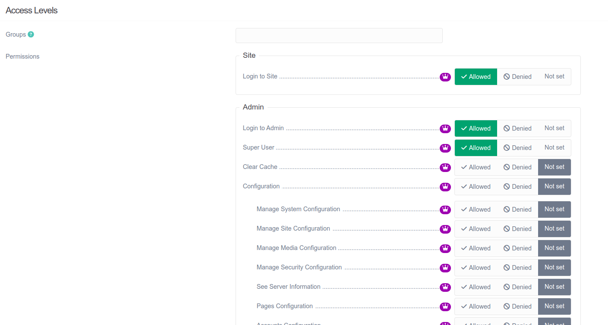

アカウントに関連する情報を管理するための、ユーザーとグループのパーミッションは：

| オプション | 値 | 説明 |
| :----- | :----- | :----- |
| **Configuration**  | *admin.configuration*  | 管理パネルの **Configuration** エリアへユーザーをアクセスできるようにします |
| &nbsp; &nbsp; **Accounts Configuration** | *admin.configuration.accounts* | 管理パネルの **Accounts** 内の **Accounts Configuration** へのアクセス許可 |
| **Accounts** | *admin.accounts* | 管理パネルの **Accounts** エリアへのフルアクセスを許可 |
| &nbsp; &nbsp; **Create** | *admin.accounts.create* | ユーザーアカウントとグループを **Create** する権限を与えます |
| &nbsp; &nbsp; **Read** | *admin.accounts.read* | ユーザーアカウントとグループを **Read** する権限を与えます |
| &nbsp; &nbsp; **Update** | *admin.accounts.update* | ユーザーアカウントとグループを **Update** する権限を与えます |
| &nbsp; &nbsp; **Delete** | *admin.accounts.delete* | ユーザーアカウントとグループを **Delete** する権限を与えます |
| &nbsp; &nbsp; **List** | *admin.accounts.list* | 管理パネルの **Accounts** エリアへのアクセスを許可 |

パーミッションとして受け入れ可能な値は：

| オプション | 値 | 説明 |
| :----- | :----- | :----- |
| **Allowed** | `true`  | 同じレベルに **Denied** パーミッションがひとつも無ければ、 **許可** する |
| **Denied** | `false` | **不許可** にする。ユーザーに **Allowed** と **Denied** があったら、**Denied** が勝ちます |
| **Not set** | `null` | 影響を与えず、もし他のルールが適用されなければ、 **Denied** になる |

ユーザーアカウントに対して特に設定されたパーミッションは、グループパーミッションより優先されます。ユーザーアカウントにパーミッションが設定されていない場合、そのユーザーが属するすべてのユーザーグループに対してアクセスチェックされます。
もしアクションを **Denied** するユーザーグループがひとつでもあれば、そのアクションに対してパーミッションは許可されません。一方、すべｔねおグループで **Allowed** だったら、そのアクションは許可されます。
いずれのグループにもパーミッションが設定されていなければ、 **Super User** パーミッションは全体に対して **Allowed** になり、そうでなければ **Denied** が適用されます。

