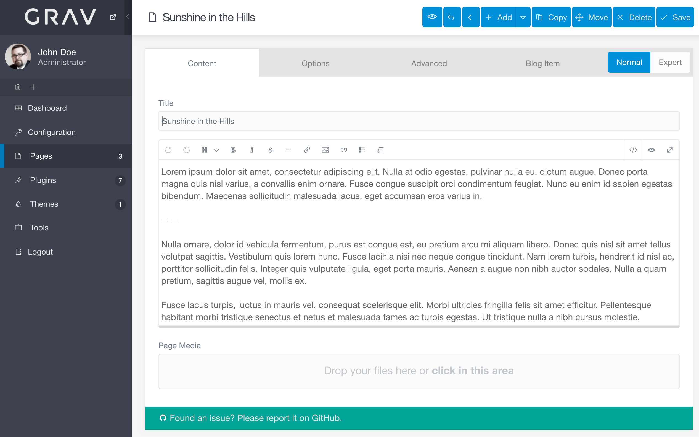
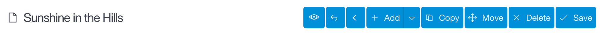
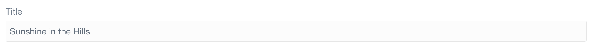
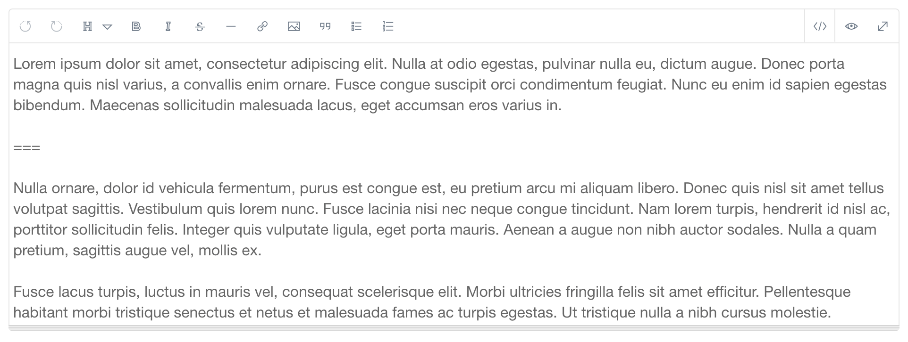
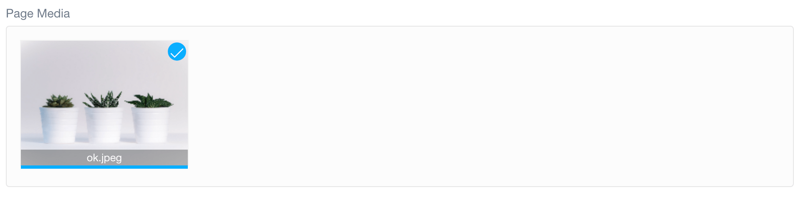

管理パネルの **Page Editor** は、パワフルなテキストエディタであり、ページ管理マネージャーです。ページのコンテンツ（やメディアファイル）を作成したり、公開設定やタクソノミー設定をしたり、その他設定、上書きをしたり、テーマ特有のオプションを設定できたりします。

これにより、特定のページをワンストップで管理できます。

> [!Info]  
> このページ機能にアクセスするには、 `access.admin.super` パーミッションもしくは `access.admin.pages.list` パーミッションが必要です。 [ユーザーアカウントのページ](../../03.accounts/01.users/) と [ユーザーグループのページ](../../03.accounts/02.groups/) をご覧ください。

**Page Editor** で表示されるタブは、すべての人に同じ表示がされるわけではありません。Grav テーマでよく見られるフォームフィールドのデフォルトセットはありますが、テーマによって変更可能です。管理パネルは、テーマや特定のページ用のテンプレートを含むたくさんのソースから、フォームフィールド情報を取得します。

> [!Info]  
> このドキュメントで説明するタブとオプションは、デフォルトのものです。テーマ開発者により、これらのタブにオプションを付け加えることが可能ですし、これらのタブを削除したり、全く違う何かに変更してしまうことも可能です。わたしたちは、このドキュメントでの具体例として、 Antimatter テーマをもとにした一般的なケースを説明します。

このページでは、 **Page Editor** の **Content** タブについて、その特長と機能を説明します。

### Controls

ページの上部に沿って、管理用のコントロールボタンが並んでいます。ページを save（保存）, delete（削除）, copy（コピー）, そして move（移動） することができます。加えて、 **Back** ボタンを押すと、メインの **Pages** エリアに戻ります。

**Save** ボタンと **Delete** ボタンは、一目瞭然でしょう。これらは、現在アクセスしているページをそれぞれ、保存したり、削除したりします。

**Move** ボタンを選択すると、ポップアップが現れて、ページを新しい親に割り当てられます。 **Advanced** タブにも、同じオプションがあります。

**Copy** ボタンは、現在のページの複製を作成します。フォルダ名に `-2` （ `-2` がすでに使われていれば、別の数字）が付け加えられます。フォルダ名とタイトルの療法を変更可能です。

### Title

ページのタイトルは、通常、ページ作成時に設定されますが、後からでも編集できます。ただし、ここでページタイトルを変更しても、フォルダ名（ナビゲーション目的で使われます）に直接影響しないことに気をつけてください。フロントエンドで表示されるタイトルが変更されます。

### Page Editor Content

ここが、ページエディタの心臓部です。ここで、ページのコンテンツ本文を書き、編集します。ブラウザベースのテキストエディタでのみ使える、パワフルなツールがたくさんあります。

たとえば、編集画面と、プレビュー画面を、エディタの右上にある「code アイコン」ボタンと「eye アイコン」ボタンでスイッチできます。

> [!訳注]  
> このサイトには Font Awesome を入れていないので、ツールアイコンは表示されません。 [翻訳元](https://learn.getgrav.org/admin-panel/page/editor) をご覧ください。

Grav のコンテンツは、主にマークダウンをベースにしているので、ショートカットを編集すると、自動的にマークダウンタグがコンテンツに追加されます。たとえば、テキストブロックをハイライトし、**bold**  アイコンを選択すると、ハイライトしたエリアを `**（選んだエリア）**` ボールドタグで囲みます。

以下は、コンテンツエディタのツールの解説です。

| ツール | 説明 |
| :-----| :----- |
| bold アイコン | コンテンツに **Bold** タグを追加 |
| italic アイコン | コンテンツに *Italic* タグを追加 |
| strikethrough アイコン  | コンテンツに ~~Strikethrough~~ タグを追加 |
| link アイコン  | コンテンツに [links](https://getgrav.org) を追加 |
| picture-o アイコン | コンテンツにメディアを追加 |
| quote-right アイコン | コンテンツに quote タグを追加 |
| list-ul アイコン | 順番無しリストを作成 |
| list-ol アイコン | 順番ありリストを作成 |
| code アイコン | 編集表示を有効化 |
| eye アイコン | コンテンツプレビューを有効化 |
| expand アイコン | フルページ編集表示とプレビュー表示をスイッチ |

### Page Media

**Content** タブの下の方にある **Page Media** セクションは、ページのためのメディアファイルです。これらのファイルは、ページのマークダウンファイルと同じフォルダに入っています。新しいメディアファイルをアップロードするには、シンプルに、ファイルと **ドラッグアンドドロップ** するか、セクションの白いエリアを **タップ** してください。ファイル選択画面が立ち上がり、アップロードするファイルをピックアップできます。

ページに追加したいメディアファイルはアップロードされていますか？ それなら、画像サムネイルを動かして、エディタへ **ドラッグアンドドロップ** してください。

もしくは、画像サムネイルの **Insert** オプションを選択することもできます。 これにより、ページコンテンツに直接メディアが挿入されます。

**Delete** を選択すれば、メディアファイルを削除できます。

