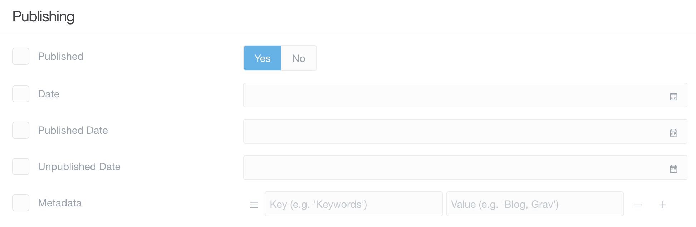
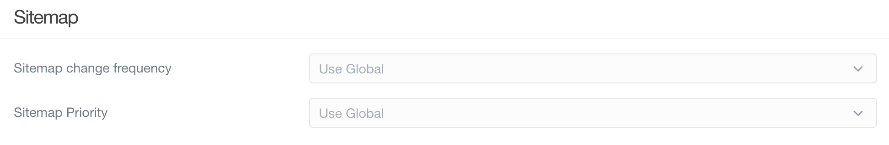

管理パネルの **Page Editor** は、パワフルなテキストエディタであり、ページ管理マネージャーです。ページのコンテンツ（やメディアファイル）を作成したり、公開設定やタクソノミー設定をしたり、その他設定、上書きをしたり、テーマ特有のオプションを設定できたりします。

これにより、特定のページをワンストップで管理できます。

このページでは、 **Page Editor** の **Options** タブについて、その特長と機能を説明します。

> [!Info]  
> このページ機能にアクセスするには、 `access.admin.super` パーミッションもしくは `access.admin.pages.list` パーミッションが必要です。 [ユーザーアカウントのページ](../../03.accounts/01.users/) と [ユーザーグループのページ](../../03.accounts/02.groups/) をご覧ください。

> [!Note]  
> 管理パネルのこのエリアにある、いくつかの選択肢の左側に、チェックボックスがあることに気づいたかもしれません。これらのボックスは、このページのデフォルト値を上書きしたいときにチェックします。チェックを外したままにすると、空白またはデフォルトの状態に戻ります。

### Publishing

このセクションは、コンテンツの公開に関する制御を扱います。コンテンツを公開（もしくは非公開）にしたり、公開開始日や、公開終了日時を設定したり、ページに特定のメタデータを作成したりできます。

| オプション | 説明 |
| :-----  | :-----  |
| Published  | デフォルトでは、ページは公開されます。例外は、`published: false` を設定したり、`publish_date` を未来にしたり、 `unpublish_date` を過去にしたりした場合です。 |
| Date | さまざまな日付で、このページに関係する日付を設定することができます。 |
| Published Date   | そのページの公式公開日として使われます。自動公開のトリガーとなる日付です。 |
| Unpublished Date | 日付/時間 で、自動で非公開にするトリガーを指定できます。 |
| Metadata         | そのページで上書きされなければ、すべてのページで表示されるデフォルトのメタデータ値です。 |

### Taxonomies

タクソノミーエリアでは、ページを整理するプロパティを設定できます。そのページをどのカテゴリーで表示したいか、どのタグか、それ以外のタクソノミーかなどを、ここで設定できます。

| オプション | 説明 |
| :-----  | :-----  |
| Category | このフィールドは、ページのカテゴリーを1つまたは複数設定できます。コンテンツを並べたり、フィルタリングしたりするのに便利です。 |
| Tag      | タグは、そのページが何についてのページかをバックエンドに知らせるための素晴らしい方法です。コンテンツ主体のサイトでは、整理とフィルタリングの仕組みとして便利です。 |
| Month    |     |

### Sitemap

良い、クリーンなサイトマップがあるのは、いくつかの点で重要です。その中でも、ユーザーのナビゲーションと、検索エンジン最適化（SEO）で重要です。サイトマップがあることで、あなたのサイトは検索エンジンと親しくなり、ランキングにも直接的なインパクトを与えます。

options ページのこのエリアは、 [Sitemap プラグイン](https://github.com/getgrav/grav-plugin-sitemap) をインストールしたときのみ利用可能です。

| オプション | 説明 |
| :-----  | :-----  |
| Sitemap Change Frequency | This drop-down enables you to set a frequency by which the page's sitemap is updated. This can be any time a change is made, hourly, daily, weekly, monthly, yearly, or never. By default, the global sitemap options are used. |
| Sitemap Priority         | Sets the priority of this page in your sitemap.                                                                                                                                                                                 |

