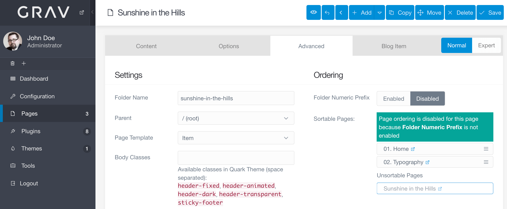
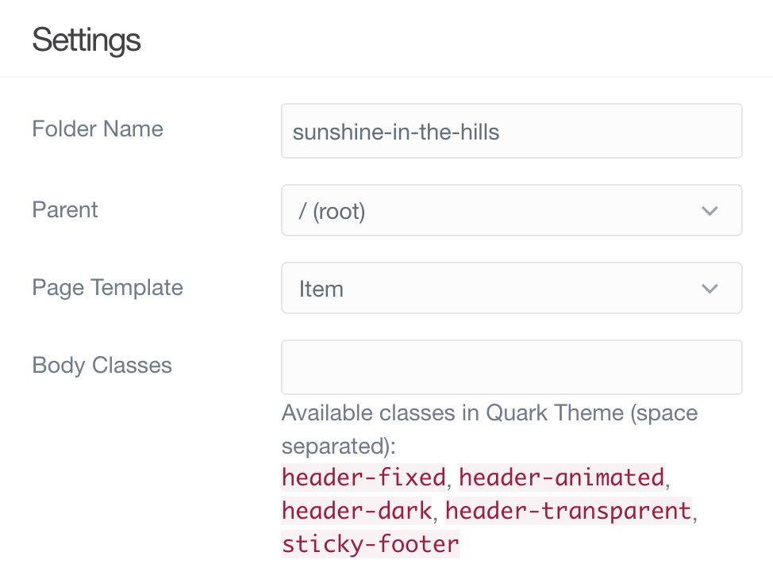
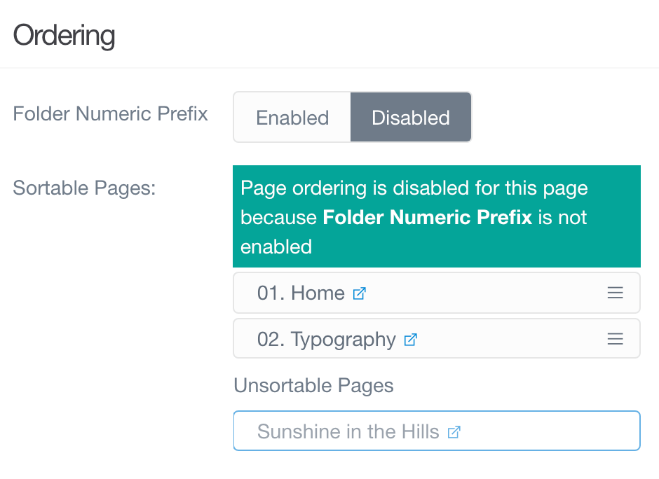
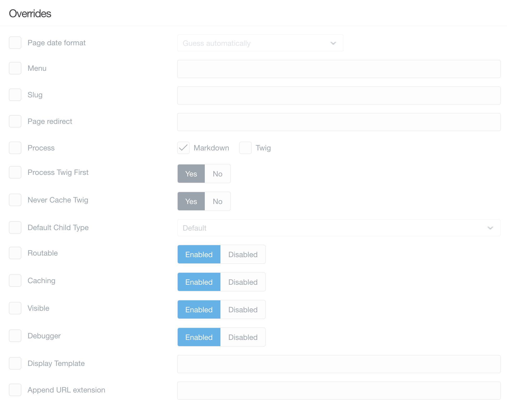
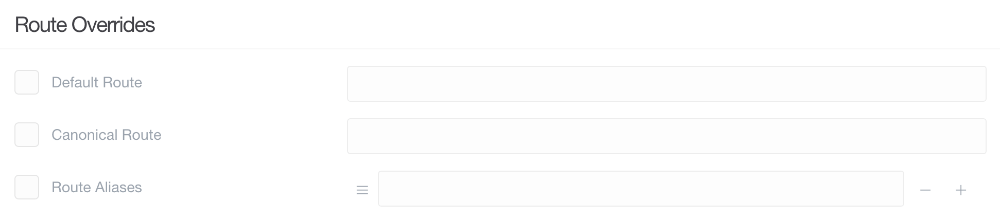
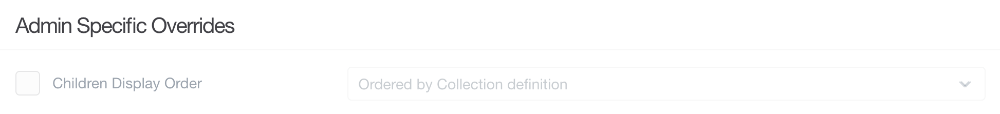

管理パネルの **Page Editor** は、パワフルなテキストエディタであり、ページ管理マネージャーです。ページのコンテンツ（やメディアファイル）を作成したり、公開設定やタクソノミー設定をしたり、その他設定、上書きをしたり、テーマ特有のオプションを設定できたりします。

これにより、特定のページをワンストップで管理できます。

このページでは、 **Page Editor** の **Advanced** タブについて、その特長と機能を説明します。

> [!Info]  
> このページ機能にアクセスするには、 `access.admin.super` パーミッションもしくは `access.admin.pages.list` パーミッションが必要です。 [ユーザーアカウントのページ](../../03.accounts/01.users/) と [ユーザーグループのページ](../../03.accounts/02.groups/) をご覧ください。

> 管理パネルのこのエリアにある、いくつかの選択肢の左側に、チェックボックスがあることに気づいたかもしれません。これらのボックスは、このページのデフォルト値を上書きしたいときにチェックします。チェックを外したままにすると、空白またはデフォルトの状態に戻ります。

### Settings

**Settings** エリアは、ページにとって重要なさまざまなオプションが集まっています。ページの保存されるフォルダ名を変更したり、親を変更したり、表示されるテンプレートを変更したりできます。

| オプション | 説明 |
| :-----  | :-----  |
| Folder Numeric Prefix | 手動の順番付けや、ナビゲーション表示に使われる、数字の接頭辞 |
| Folder Name | ページが入っているフォルダ名を設定 |
| Parent | 現在のページの親を設定。これは、トップレベルのページとして Root とすることもできますし、特定のページを指定して、サブページにすることもできます。 |
| Display Template | ページに適用される（テーマが提供する）テンプレートを設定。これは、ページの見た目に直結します。 |
| Body Classes | このフィールドに class を入力すると、ページの body に適用されます。 |

### Ordering

**Ordering** セクションでは、番号付けしていないフォルダの順番を設定できます。

| オプション | 説明 |
| :-----  | :-----  |
| Page Order | ページの順番を設定できます |

### Overrides

Overrides は、ページに追加の機能を設定します。スラッグは、フォルダ名に基づくデフォルトの URL とは異なるものを設定できます。キャッシュの設定ができます。ナビゲーションでの表示・非表示が設定できます。また、直接 URL からページを表示させないこともできます。

また、このエリアの on / off により、ページにさまざまなプロセスを設定できます。たとえば Twig を有効化すると、ページコンテンツの中に Twig 構文を入れて、レンダリングさせることができます。

| オプション | 説明 |
| :-----  | :-----  |
| Menu  | メニューで利用される文字列。設定されなければ、 **Title** が使用されます。 |
| Slug | スラッグ変数により、 URL のページ部分を具体的に設定できます。 |
| Process | ページコンテンツで利用したいプロセス。 |
| Default Child Template | 子ページのデフォルトのページタイプを設定。 |
| Routable | URL によるルーティング対象とするかどうかの設定。disable にすると、そのページはフロントエンドからアクセスできなくなります |
| Caching  | ページのキャッシュを有効化・無効化 |
| Visible | ページをナビゲーションに表示するかどうか |

### Route Overrides

| オプション | 説明 |
| :-----  | :-----  |
| Default Route   | 新しいデフォルトのルーティングを入力します |
| Canonical Route | canonical ルーティングとして使いたい値を入力します。 |
| Route Aliases   | ルーティングの別名（alias）を作成します。 |

### Admin Specific Overrides

| オプション | 説明 |
| :-----  | :-----  |
| Children Display Order | 子ページが表示される順番を設定します。フォルダ名か collectio 定義を選択します。 |

