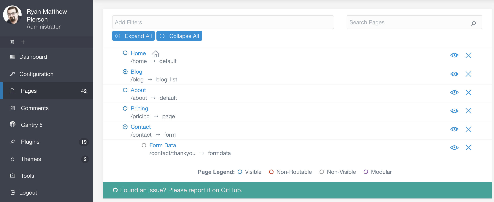

**Pages** 画面からは、サイトのコンテンツをすばやく編集できます。ページの編集、削除、作成する場所であり、ひと目で見てわかるなら、ページを探すことができます。

> [!Info]  
> Pages 機能にアクセスするには、 `access.admin.super` もしくは `access.admin.pages.list` のパーミッションが必要です。 [ユーザーアカウント](../03.accounts/01.users/) 及び [ユーザーグループ](../03.accounts/02.groups/) を見てください。

サイトでコンテンツをよく作成し、修正するなら、管理パネルのこのエリアは、とても良く見る画面となります。

<h3 id="adding-new-pages">新しいページを追加</h3>

管理パネルの **Pages** の上部に、3つのボタンが並んでいます。 **Back** ボタンは、**ダッシュボード** 画面に戻ります。**Add Page** ボタンと、 **Add Modular** ボタンは、サイトに新しいページを作成します。

以下では、これらのボタンを選んだときに利用できるオプションについて、細かく解説します。

> [!訳注]  
> モジュラー非対応テーマの場合、**Add Modular** ボタンは出てこないようです。

#### Add Page

**Add Page** ボタンは、サイトにモジュラーでないページを作成します。一度選ぶと、ポップアップが出現し、**タイトル** と **フォルダ名** を入力し、**親ページ** と **表示テンプレート** を選べるようになり、ページの表示/非表示を設定できます。

| オプション | 説明 |
| :-----  | :-----  |
| Page Title       | 作成するページのタイトルを入力します |
| Folder Name      | ページにカスタムのフォルダ名をつけられます。もしくは、上記のタイトルをもとにした自動生成のフォルダ名のままとすることもできます。 |
| Parent Page      | 新しいページの親ページを設定します。他のページ（たとえば、home や blog ）の子ページにもできますし、サイトのルートにすることもできます。親ページのフロントマターに `child_type` の値を設定することで、デフォルトの `Display Template` が自動で選択されます。 |
| Display Template | テーマから提供されるテンプレートから、そのページに適用したいテンプレートを選びます。 |
| Visible          | ナビゲーションに表示するかどうかを設定します。**Auto** を選択すると、自動で選択されます。自動設定では、もし他の兄弟ページが番号の接頭辞を使っており、そのページも番号の接頭辞を使った場合に、表示されます。そうでない場合は表示されません。 |

この情報を入力し、**Continue** を選ぶことで、新規ページのエディタが表示されます。ページエディタの詳細については、[この後のガイド](./01.editor/) で解説します。

> [!Info]  
> これらの設定でのページの表示・非表示は、ナビゲーションについてのみ影響します。ページがブラウザで表示できるかどうかについては、ページの [publishing 設定](../../02.content/02.headers/#published) で決定されます。

#### Add Modular Page

管理パネルの **Pages** 画面の上部にある 2つ目のボタンは、モジュラーサブページをサイトに追加します。モジュラーページは、標準（regular）ページと違い、実際には複数のページのコレクションであり、並べられ、1つのページとして表示されるものです。このボタンは、サブページを作り、親のモジュラーページにそれを適用します。

以下は、 **Add Modular Page** ボタンによりポップアップされるフィールドとオプションを解説するものです。

| オプション | 説明 |
| :-----    | :----- |
| Page Title       | タイトルをモジュラーページに設定する |
| Folder Name      | そのページにカスタムのフォルダ名を設定できます。設定しない場合は、タイトルを元にした自動生成のままとすることもできます |
| Page             | 新しく作るモジュラーサブページの親ページを設定します。これは、新しいモジュラーページのコンテンツが表示されるページです |
| Modular Template | テーマで提供されているモジュラーページ用のテンプレートで、新しく作るページ用に選べるリストが表示されます。|

この情報を入力したら、 **Continue** を選択し、新しいページエディタが表示されます。ページエディタについてより詳しくは、 [後述のガイド](./01.editor/) をご覧ください。

<h3 id="pages-list">ページリスト</h3>

このエリアに表示される ページリストにより、現在のページすべてにすばやくアクセスでき、ひと目でページの表示・非表示がわかります。

ページのタイトルを選択すると、そのページの編集画面に遷移します。各ページの右にある大きな **X** アイコンで、ページを消せます。

ページの左側にあるアイコンをホバーすると、現在のステータスがわかります。たとえば、ページが routable （URL で訪れることができる）で、 visible （ナビゲーションメニューに表示される）とき、**Page・Routable・Visible** となるでしょう。

探しているページを見つけやすくするため、 **filter** と **search** が使えます。たとえば、 **Add Filters** オプションを使って、リストの中のページから、 **Modular**, **Visible**, and/or **Routable** ページだけをフィルタできます。

特定のページタイトル（もしくは、タイトルの一部分）がわかっていれば、検索バーを使って、探している特定のページをすぐに探すことができます。

