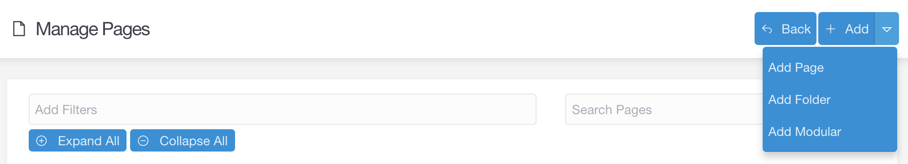

**Pages** 画面からは、サイトのコンテンツをすばやく編集できます。ページの編集、削除、作成する場所であり、ひと目で見てわかるなら、ページを探すことができます。

> [!Info]  
> Pages 機能にアクセスするには、 `access.admin.super` もしくは `access.admin.pages.list` のパーミッションが必要です。 [ユーザーアカウント](../03.accounts/01.users/) 及び [ユーザーグループ](../03.accounts/02.groups/) を見てください。

サイトでコンテンツをよく作成し、修正するなら、管理パネルのこのエリアは、とても良く見る画面となります。

<h3 id="adding-new-pages">新しいページを追加</h3>

管理パネルの **Pages** の上部に、3つのボタンが並んでいます。 **Back** ボタンは、**ダッシュボード** 画面に戻ります。**Add Page** ボタンと、 **Add Modular** ボタンは、サイトに新しいページを作成します。

以下では、これらのボタンを選んだときに利用できるオプションについて、細かく解説します。

> [!訳注]  
> モジュラー非対応テーマの場合、**Add Modular** ボタンは出てこないようです。

#### Add Page

**Add Page** ボタンは、サイトにモジュラーでないページを作成します。一度選ぶと、ポップアップが出現し、**タイトル** と **フォルダ名** を入力し、**親ページ** と **表示テンプレート** を選べるようになり、ページの表示/非表示を設定できます。

| オプション | 説明 |
| :-----  | :-----  |
| Page Title       | 作成するページのタイトルを入力します |
| Folder Name      | ページにカスタムのフォルダ名をつけられます。もしくは、上記のタイトルをもとにした自動生成のフォルダ名のままとすることもできます。 |
| Parent Page      | 新しいページの親ページを設定します。他のページ（たとえば、home や blog ）の子ページにもできますし、サイトのルートにすることもできます。親ページのフロントマターに `child_type` の値を設定することで、デフォルトの `Display Template` が自動で選択されます。 |
| Display Template | テーマから提供されるテンプレートから、そのページに適用したいテンプレートを選びます。 |
| Visible          | ナビゲーションに表示するかどうかを設定します。**Auto** を選択すると、自動で選択されます。自動設定では、もし他の兄弟ページが番号の接頭辞を使っており、そのページも番号の接頭辞を使った場合に、表示されます。そうでない場合は表示されません。 |

この情報を入力し、**Continue** を選ぶことで、新規ページのエディタが表示されます。ページエディタの詳細については、[この後のガイド](./01.editor/) で解説します。

> [!Info]  
> Whether a page is visible or not in these settings only has an effect on navigation. A page's ability to be visited by a browser is determined by the page's [publishing settings](../../02.content/02.headers/#published).

#### Add Modular Page

管理パネルの **Pages** 画面の上部にある 2つ目のボタンは、
The second button along the top of the **Pages** area of the admin allows you to add a modular subpage to your site. Modular pages are different from regular pages because they are actually a collection of pages, arranged and displayed as one page. This button specifically lets you create subpages and assign them to a parent modular page.

Here is a breakdown of the fields and options that appear in the **Add Modular Page** button's popup.

| オプション | 説明 |
| :-----    | :----- |
| Page Title       | Sets a title for the modular page.                                                                                 |
| Folder Name      | You can set a custom folder name for the page, or keep the automatically-generated one based on the title.         |
| Page             | Sets the parent page for the new modular subpage. This is the page your new modular page's content will appear on. |
| Modular Template | Displays a list of templates provided by the theme for modular pages you can choose from for the new page.         |

Once you have filled out this information, selecting **Continue** will take you to the new page's editor. We will cover the Page Editor in more detail in [a following guide](../page-editor).

### Pages List

The pages list that appears in this area gives you quick access to all of your current pages, as well as an at-a-glance method for seeing whether or not the pages are visible.

Selecting the title of any page will take you directly to that page's editor. The big **X** icon to the right of each page lets you delete the page.

If you hover over the icon directly to the left of a page, it will tell you its current status. For example, it may say **Page • Routable • Visible** if a page is routable (visible via the URL) and visible (appears in navigation menus).

You can **filter** and **search** your pages to make it easy to find the exact page you're looking for. For example, using the **Add Filters** option, you can filter pages by type so that only **Modular**, **Visible**, and/or **Routable** pages appear in the list.

If you have a specific page title (or part of a title) in mind, you can use the search bar to quickly find the specific page you're looking for.

