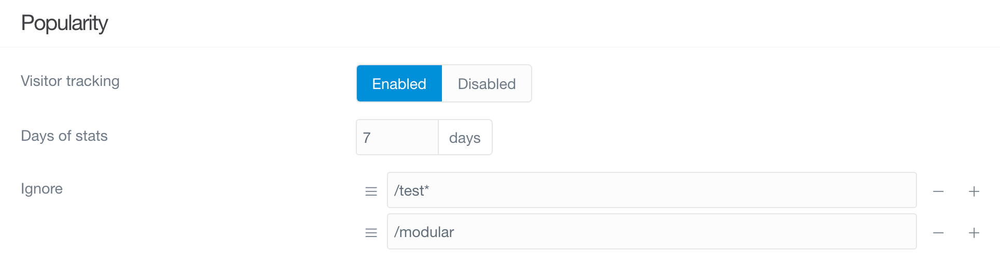

管理パネルプラグイン自体を、管理パネルの **Plugins** エリアでカスタマイズできる、オプションの設定項目があります。  
その設定方法は、シンプルです。  
サイドバーの **Plugins** をクリック後、表示されたプラグイン一覧の中から **Admin Panel** のプラグイン名をクリックしてください。  
新しくページが開いて、管理パネルでの運用体験をカスタマイズできる便利なオプションページが現れます。

<h3 id="plugin-information">プラグイン情報</h3>

Admin Panel のオプションページの上部には、 Admin Panel プラグインについての情報が表示されています。  
ここに書かれているのは、プラグインの作者や、そのホームページ、ライセンス、その他、追加情報やバグ報告に便利なリンクや情報などです。

上記の内容は、すべてのプラグインで同様で、そのプラグインのオプションページにおける標準的な機能です。

### Basics

このページの **Basics** セクションでは、管理プラグイン内での運営体験を決定する助けになるオプションを設定できます。  
これには、サイドバーの上部に表示するテキストを変更したり、管理ページにカスタム path を作成したり、その他いろいろできます。

これらのオプションと、それぞれ何をするのかを、以下に解説します。

| オプション | 説明 |
| :----- | :----- |
| Enable Admin Caching | 管理プラグインでのキャッシュは、ここで **Enabled** か **Disabled** を設定します。フロントエンドのキャッシュに影響を与えることなく、管理プラグインでのキャッシュを無効化できます。 |
| Administrator Path | 管理画面への path を変更できます。デフォルトの path は、 `/admin` ですが、このフィールドに入力した path に変更できます。 |
| Logo Text | 管理パネルのサイドバー上部に表示されるテキストを定義します。 |
| Body Classes | 管理パネルの見た目を変えたいですか？ body タグの class を追加できます。複数の class の場合、スペースで区切ってください。 |
| Sidebar Activation  | サイドバーを広げる方法を **Tab** もしくは **Hover** から選んでください。 |
| Hover Delay | サイドバーを広げるとき、 **Hover** モードの場合に、何ミリ秒ホバーが必要か設定します。 |
| Sidebar Size | デフォルトのサイドバーのサイズを **Automatic** もしくは **Small** から選んでください。 |
| Edit Mode | デフォルトのコンテンツエディタを選択してください。デフォルトでは、 **Normal** か **Expert** が選べます |
| Use Google Fonts | Google カスタムフォントを使います。無効化すると Helvetica を使います。キリル文字などサポートされていない文字を使う時に便利です。 |
| Show GitHub Link | **Enable** もしくは **Disable** で、 "Found an issue? Please report it on GitHub." というメッセージを表示・非表示できます |
| Automatically Check for Updates | **管理パネル** プラグインで、アップデートのチェックを自動で行えるようにする選択肢です |
| Session Timeout | セッションのタイムアウト秒数をここで設定します |

### Dashboard

このセクションでは、管理パネルのメインのダッシュボードに表示するアイテムをカスタマイズできます。  
News Feed は、気に入らないので取り除きたいですか？  
ダッシュボードを、お気に入りの1つか2つのセクションだけにスリム化したいですか？  
そのようなカスタマイズは、ここでできます。

| オプション | 説明 |
| :----- | :----- |
| Maintenance Widget        | **Enable** もしくは **Disable** で、管理パネルのメインダッシュボード画面にある **Maintenance** エリアを表示・非表示できます |
| Statistics Widget         | **Enable** もしくは **Disable** で、管理パネルのメインダッシュボード画面にある **Statistics** エリアを表示・非表示できます |
| Notifications Feed Widget | **Enable** もしくは **Disable** で、管理パネルのメインダッシュボード画面にある **Notifications** エリアを表示・非表示できます |
| News Feed Widget          | **Enable** もしくは **Disable** で、管理パネルのメインダッシュボード画面にある **News Feed** エリアを表示・非表示できます |
| Latest Pages Widget       | **Enable** もしくは **Disable** で、管理パネルのメインダッシュボード画面にある **Latest Pages** エリアを表示・非表示できます |

### Notifications

このセクションで、特定のタイプの通知を有効化・無効化できます。  
アップデート通知を無効化することもできますし、プラグイン通知のみ、テーマ通知のみ、その両方を無効化することもできます。

| オプション | 説明 |
| :----- | :----- |
| Feed Notifications      | **Enable** もしくは **Disable** で、管理パネルの feed ベースの通知を有効・無効にできます |
| Dashboard Notifications | **Enable** もしくは **Disable** で、管理パネルの dashboard ベースの通知を有効・無効にできます |
| Plugins Notifications   | **Enable** もしくは **Disable** で、管理パネルの plugins ベースの通知を有効・無効にできます |
| Themes Notifications    | **Enable** もしくは **Disable** で、管理パネルの themes ベースの通知を有効・無効にできます |

### Popularity

管理パネルの素晴らしい機能のひとつは、管理パネルのダッシュボードから、トラフィック情報を追跡・表示できることです。  
管理パネルプラグインのオプションページにおけるこのセクションは、トラフィックの追跡を有効化・無効化したり、どのようにデータを表示するかの設定をしたりできます。

| オプション | 説明 |
| :----- | :----- |
| Visitor tracking | ここでは、 **Enable** もしくは **Disable** で閲覧者トラッキング機能を有効化・無効化できます |
| Days of stats    | このフィールドで、グラフに表示される閲覧者データが削除されるまでの日数を設定できます。 |
| Ignore           | サイト内の特別な URL についてトラフィックをしないようにできます。たとえば `/test` もしくは `/modular` のような URL です。 |

