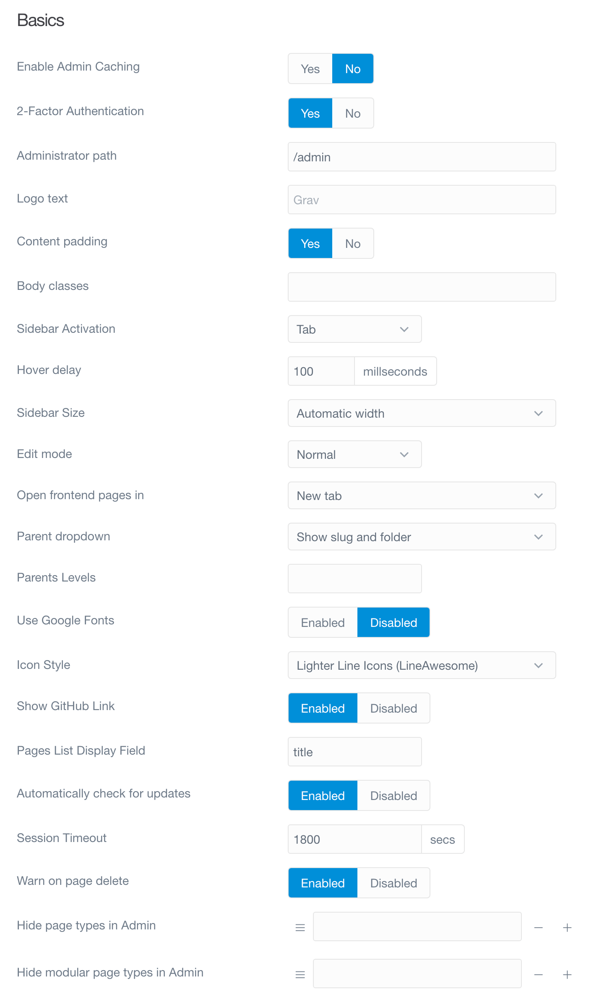
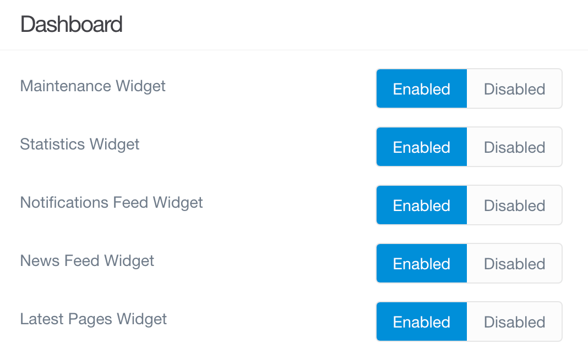

管理パネルプラグインには、管理パネルの **Plugins** エリアで、自身にアクセス可能なオプションの設定項目があります。それらを設定するには、単に、 サイドバーの **Plugins** をクリック後、表示されたプラグイン一覧の中から **Admin Panel** のプラグイン名をクリックします。ページが開いて、管理パネルでの運用体験をカスタマイズできる便利なオプションページが現れます。

### Plugin Information

Admin Panel のオプションページの上部には、 Admin Panel プラグインについての情報が表示されています。ここに書かれているのは、プラグインの作者や、そのホームページ、ライセンス、その他、追加情報やバグ報告に便利なリンクや情報などです。

上記の内容は、すべてのプラグインで同様で、そのプラグインのオプションページにおける標準的な機能です。

### Basics

このページの **Basics** セクションでは、管理プラグイン内での運営体験を決定する助けになるオプションを設定できます。これには、サイドバーの丈夫に表示するテキストを変更したり、管理ページにカスタム path を作成したり、その他いろいろできます。

これらのオプションと、それぞれ何をするのかを、以下に解説します。

| オプション | 説明 |
| :----- | :----- |
| Enable Admin Caching | 管理プラグインでのキャッシュは、ここで **Enabled** か **Disabled** を設定します。フロントエンドのキャッシュに影響を与えることなく、管理プラグインでのキャッシュを無効化できます。 |
| Administrator Path | 管理画面への path を変更できます。デフォルトの path は、 `/admin` ですが、このフィールドに入力した path に変更できます。 |
| Logo Text | This is where you define the text that appears at the top of the administrator's sidebar.                                                   |
| Body Classes | Want to give the body of your admin a different look? You can add body class(es) here. Separate multiple classes with a space.              |
| Sidebar Activation  | Choose between **Tab** and **Hover** methods of expanding the sidebar.                                                                      |
| Hover Delay | Set the delay time your cursor needs to hover over the compressed sidebar to expand in **Hover** mode.                                      |
| Sidebar Size | Choose between **Automatic** and **Small** as your default sidebar size.                                                                    |
| Edit Mode | Choose your default content editor. By default, the options are **Normal** and **Expert**.                                                  |
| Use Google Fonts | Use Google custom fonts.  Disable this to use Helvetica. Useful when using Cyrillic and other languages with unsupported characters.        |
| Show GitHub Link | **Enable** or **Disable** display of the "Found an issue? Please report it on GitHub." message.                                             |
| Automatically Check for Updates | Choose to automatically check for updates to the **Admin Panel** plugin.                                                                    |
| Session Timeout | Set the session timeout (in seconds) here.                                                                                                  |

### Dashboard

ページのこのセクションでは、管理パネルのメインのダッシュボードに表示するアイテムをカスタマイズできます。News Feed は好みではなく、取り除きたいですか？ ダッシュボードをお気に入りの1つか2つのセクションだけにスリム化したいですか？ ここでそれができます。

| オプション | 説明 |
| :----- | :----- |
| Maintenance Widget        | **Enable** or **Disable** the display of the **Maintenance** area of the main Dashboard page in the Admin.   |
| Statistics Widget         | **Enable** or **Disable** the display of the **Statistics** area of the main Dashboard page in the Admin.    |
| Notifications Feed Widget | **Enable** or **Disable** the display of the **Notifications** area of the main Dashboard page in the Admin. |
| News Feed Widget          | **Enable** or **Disable** the display of the **News Feed** area of the main Dashboard page in the Admin.     |
| Latest Pages Widget       | **Enable** or **Disable** the display of the **Latest Pages** area of the main Dashboard page in the Admin.  |

### Notifications

このセクションで、特定のタイプの通知を有効化・無効化できます。アップデート通知を無効化することもできますし、プラグイン通知のみ、テーマ通知のみ、その両方を無効化することもできます。

| オプション | 説明 |
| :----- | :----- |
| Feed Notifications      | **Enable** or **Disable** feed-based notifications in the admin.      |
| Dashboard Notifications | **Enable** or **Disable** dashboard-based notifications in the admin. |
| Plugins Notifications   | **Enable** or **Disable** plugins-based notifications in the admin.   |
| Themes Notifications    | **Enable** or **Disable** themes-based notifications in the admin.    |

### Popularity

管理パネルの素晴らしい機能のひとつは、管理パネルのダッシュボードから、トラフィック情報を追跡・表示できることです。管理パネルプラグインのオプションページにおけるこのセクションは、トラフィックの追跡を有効化・無効化したり、どのようにデータを表示するかの設定をしたりできます。

| オプション | 説明 |
| :----- | :----- |
| Visitor tracking | You can **Enable** or **Disable** the visitor tracking feature here.                               |
| Days of stats    | This field lets you set the number of days of visitor data kept in the graph before being dropped. |
| Ignore           | Ignore traffic to specific URLs in your site. For example `/test` or `/modular`                    |

