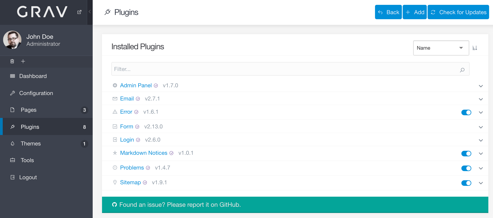
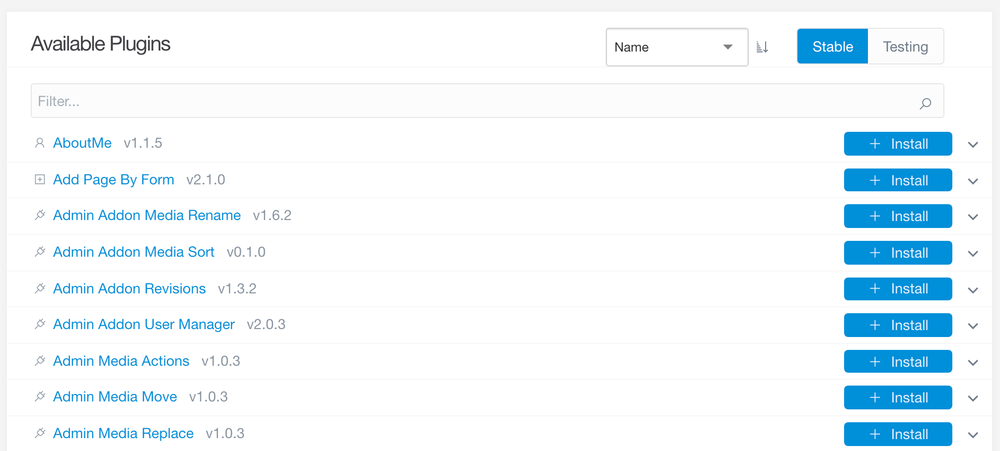
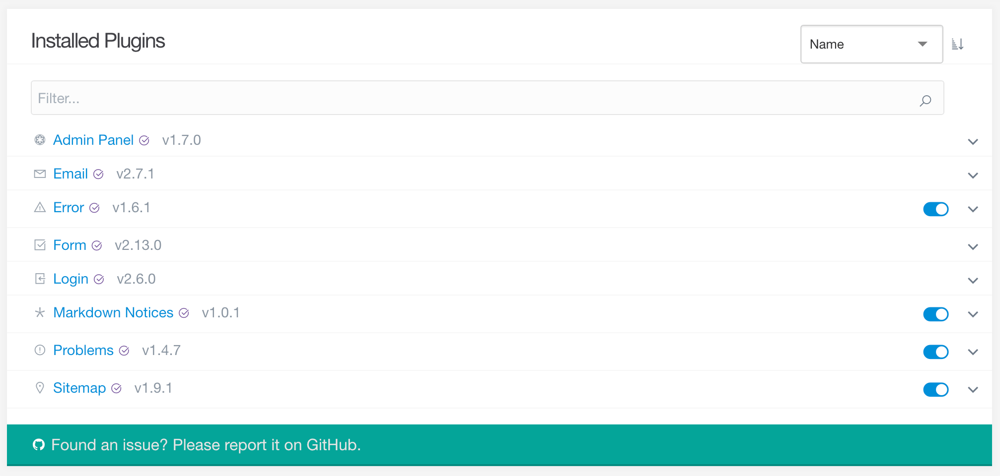
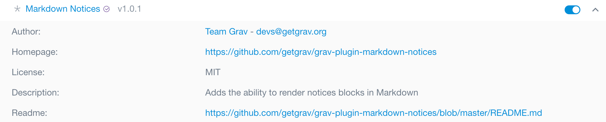

管理パネルの **Plugins** エリアでは、プラグインの管理ができます。新しいプラグインを追加したり、既存のプラグインを削除したり、プラグインのドキュメントやその他の情報にすぐにアクセスできるリンクが表示されたりします。

このページでは、管理パネルのこのエリアを詳しく見ていき、インストールしたプラグインの有効化・無効化の方法や、簡単にプラグインを追加する方法を解説します。

> [!Info]  
> この Plugins 機能にアクセスするには、 `access.admin.super` パーミッションもしくは `access.admin.plugins` パーミッションが必要です。

### Controls

ページの上部にある **Controls** エリアでは、新しくプラグインを追加したり、既存のプラグインのアップデートをチェックしたりできます。

`+ Add` ボタンで、現在利用可能な全 Grav プラグインのリストページに移動し、それらプラグインの情報を見たり、プラグインの右側にある `+ Install` ボタンを選択してインストールしたりできます。

> [!Note]  
> `check circle（チェックマークを丸で囲んだ）アイコン` は、Grav チームが作成し、サポートしているプラグインを意味します。このアイコンの無いプラグインは、サードパーティー開発者により作成されたプラグインです。

### Installed Plugins

プラグイン管理ページの `Installed Plugins` エリアでは、現在 Grav サイトにインストール済みのプラグインの一覧を表示します。加えて、それぞれのプラグインの右側にある `toggle （トグル）アイコン` を選択することで、それらのプラグインを有効化・無効化できます。

`chevron （山型）アイコン` を選択すると、そのプラグインの情報を取得できます。たとえば、作者や、プロジェクトのホームページや、バグトラッカーや、ライセンス、及び短い説明などです。また、プラグインの readme ファイルに簡単にアクセスして、追加情報や使用ガイドを得ることもできます。

プラグインの名前部分をクリックすることでも、プラグインの詳細ページへ遷移し、プラグインの設定エリアで設定することもできます。

