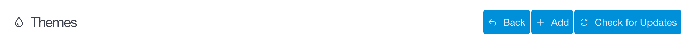

管理パネルの **Themes** では、サイトのテーマを追加したり管理したりできます。

このページでは、既存テーマの管理や、新しいテーマをサイトに追加する方法を説明します。

> [!Info]  
> この Themes 機能にアクセスするには、 `access.admin.super` パーミッションもしくは `access.admin.themes` パーミッションが必要です。

### Controls

管理パネルの **Themes** エリアの上部に沿って、 **Back** ボタン、 **Add** ボタン、そして **Check for Updates** ボタンがあります。

**Back** ボタンは、単純で、 **Dashboard** ページに戻るか、Themes ページ内のサブページにいる場合は、メインの **Themes** ページに戻ります。

**Check for Updates** ボタンは、現在インストールしているテーマのアップデートをチェックします。

#### Adding a New Theme

**Add** ボタンは、現在利用可能で、サイトに追加できる Grav テーマを表示します。新しいテーマのインストールは、速く簡単にできます。単に、 **Install** ボタンを選択するだけです。

そうすると、新しいテーマの **Information** パネルに遷移し、テーマに関するより詳しい情報と、 *ブループリント* ファイルに設定されたオプション設定ページが表示されます。設定変更に満足したら、 **Save** ボタンをクリックするだけで、変更が保存されます。

テーマをサイトから削除することもできます。パネルのボタンの右下にある、赤い **Remove Theme** ボタンを選択してください。

### Installed Themes

**Installed Themes** セクションでは、現在インストールされているテーマが表示されます。テーマのサムネイルを選択すると、そのテーマの情報ページに遷移し、それぞれのサムネイルの下にある灰色の **Activate** ボタンを押すと、そのテーマがサイトのデフォルトテーマとして有効化されます。

現在有効なテーマには、 **Active Theme** アイコンが付いています。

それぞれのサムネイルの上部には、それぞれのテーマ名と、現在のバージョンナンバーが表示されます。紫色の `check circle アイコン` は、Grav チームにより作成されたことを示します。そのアイコンの無いテーマは、サードパーティ開発者により作成され、メンテナンスされているテーマです。

