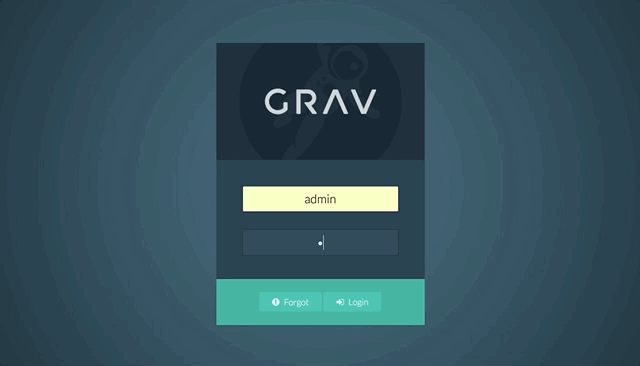

2要素認証（2FA）は、すぐれたセキュリティ対策で、ユーザーは rolling-clock スタイルの（管理パネルにアクセスするために、ユーザー名とパスワードに加えて、生成された6桁のコードを使用する）認証方法を使います。

この機能を利用するため、2FA をサポートするアプリをダウンロードする必要があります。たとえば、 [Authy](https://authy.com/) や [Google Authenticator](https://play.google.com/store/apps/details?id=com.google.android.apps.authenticator2&hl=en) があります。このアプリは、認証コードのための仮想のキーリングです。

<h2 id="how-to-set-it-up">セットアップ方法</h2>


Grav で、2要素認証をセットアップするのは簡単です。管理パネルで、 **Plugins > Admin Panel > Basics** とナビゲーションを辿ってください。

ここに、 2-Factor Authentication が見つかるでしょう。**Yes** を選択することにより、この機能を on にできます。これにより、ユーザーは、自身のアカウントで2要素認証を有効化できるようになります。


次に、あなたのユーザープロフィール設定に移動するため、アバター画像をクリックしてください。そして、**2FA Enabled** オプションを、 **Yes** にしてください。

QR コードが 2FA シークレットキーとともに現れるので、書き出して、安全な場所に保管してください。


認証アプリを使う場合は、QR コードをスキャンするか、2FA キーを登録するためのシークレットキーを入力してください。2FA 設定を確定させるため、プロフィールページを save してください。


紫色の 2FA バッジが、これによりサイドバーのあなたの名前の横に表示されました。
このバッジは、そのアカウントで 2FA が有効化されていることを知らせるものです。

それでは、ログアウトして、再ログインしてみましょう。
これまでと同じユーザー名とパスワードの入力欄が表示されますが、この情報を入力後、追加の6桁コード入力を求められます。
このコードは30秒ごとにリセットされ、この間のみ有効です。
新しいコードが生成され、置き換えられます。

これで終わりです！ あなたはこれでより安全な Grav サイトを手に入れました！

そうだ、もし 2FA キーを変更したいなら、赤い大きな **Regenerate** ボタンを押すだけです。

<h2 id="frequently-asked-questions">よくある質問</h2>

<h4 id="what-happens-if-i-lose-access-to-my-2fa-device">2FA デバイスを無くしてしまいました。どうしたら良いですか？</h4>

ご心配なく！ すべてを失ったわけではありません。

あなたの 2FA ステータスとハッシュキーは、サイトのファイルシステム内にユーザー YAML ファイル上に保存されています。 たとえば、あなたのユーザーアカウント名が `admin` だったとき、 `ROOT/user/accounts/admin.yaml` ファイルに移動し、以下の2行を見てください：

```yaml
twofa_enabled: true
twofa_secret: RQX46XTTBK7QMMB6VR4RAUNWOYVXXTSR
```

**twofa_enabled** を `false` に設定し、保存するだけです。
これで、ユーザー名とパスワードだけでサイトにログインできるようになります。
または、 **twofa_secret** を使って、お好みの認証アプリにアカウントを登録することもできます。。

<h4 id="what-if-my-2fa-secret-is-compromised">もし 2FA 情報が漏洩したら？</h4>

2FA 情報が漏洩した可能性がある場合、管理パネルのユーザープロフィール設定にある赤く大きな **Regenerate** ボタンを選択することで、新しいキーを生成でき、古いものを無効にできます。

