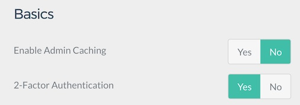
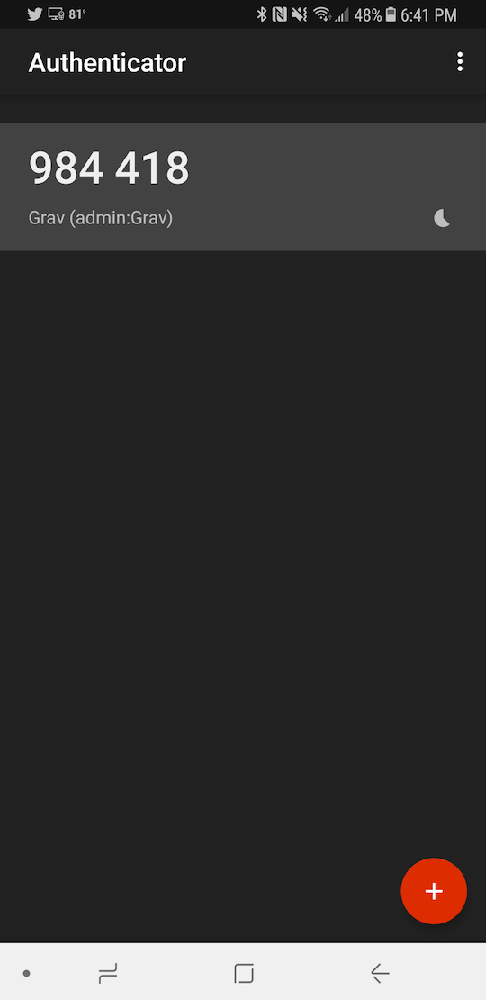

2-factor authentication (2FA) is an excellent security measure that uses a rolling-clock style authentication method that generates six-digit codes you can use in addition to your username and password to access the Admin.

To take advantage of this feature, you'll want to download a 2FA-supporting app such as [Authy](https://authy.com/) or [Google Authenticator](https://play.google.com/store/apps/details?id=com.google.android.apps.authenticator2&hl=en). This app will act as a virtual key ring for authentication codes.

<h2 id="how-to-set-it-up">セットアップ方法</h2>



Grav で、2要素認証をセットアップするのは簡単です。管理パネルで、 **Plugins > Admin Panel > Basics** とナビゲーションを辿ってください。

ここに、 2-Factor Authentication が見つかるでしょう。**Yes** を選択することにより、この機能を on にできます。これにより、ユーザーは、自身のアカウントで2要素認証を有効化できるようになります。


次に、あなたのユーザープロフィール設定に移動するため、アバター画像をクリックしてください。そして、**2FA Enabled** オプションを、 **Yes** にしてください。

QR コードが 2FA シークレットキーとともに現れるので、書き出して、安全な場所に保管してください。



認証アプリを使う場合は、QR コードをスキャンするか、2FA キーを登録するためのシークレットキーを入力してください。2FA 設定を確定させるため、プロフィールページを save してください。


A purple 2FA badge will now appear next to your name in the sidebar. This badge lets you know that 2FA is active on the account.

You can now log out and log back in. You will be greeted with the same username and password fields, but once you enter this information, you will be asked to provide an additional six-digit code. This code is in your authenticator app. It resets every 30 seconds, so the code is only good during that short period. A new code will generate to replace it.

That's it! You now have a more secure Grav site!

Oh, and if you want to change your 2FA key, all you need to do is hit the big red **Regenerate** button.

<h2 id="frequently-asked-questions">よくある質問</h2>

<h4 id="what-happens-if-i-lose-access-to-my-2fa-device">2FA デバイスを無くしてしまいました。どうしたら良いですか？</h4>

ご心配なく！ すべてを失ったわけではありません。

Your 2FA status and hashed key are stored in your site's file system on your user YAML file. For example, if your user account is `admin`, navigate to **ROOT/user/accounts/admin.yaml** and look for these two lines:

```yaml
twofa_enabled: true
twofa_secret: RQX46XTTBK7QMMB6VR4RAUNWOYVXXTSR
```

Simply set **twofa_enabled** to `false` and save. You should now be able to access your site using just your username and password. Alternatively, you can use the **twofa_secret** to register your account on your authenticator app of choice.

#### What if my 2FA secret is compromised?

If you believe your 2FA secret may be compromised, you can generate a new key and invalidate the old one by selecting the big red **Regenerate** button in your user profile settings from the Admin.

