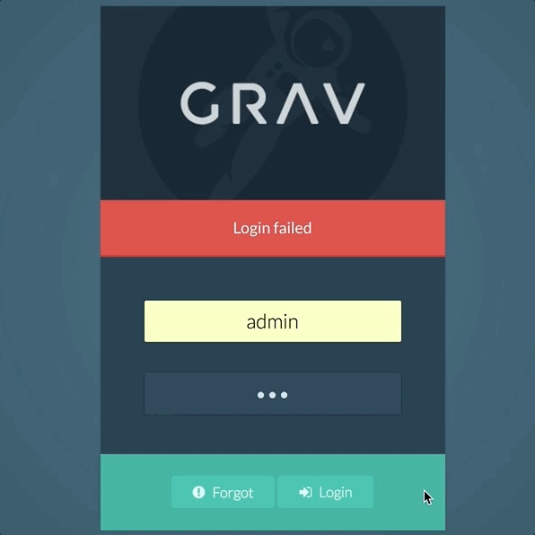

ブルートフォース攻撃は、web サイトへの不正な侵入者がよく使う攻撃です。  
あなたの知っている人が、成功するまで、何度も何度もパスワードを試している可能性もありますし、やがてパスワードが発見されるまで、洪水のようにログインを試みるボットである可能性もあります。

Grav のフラッドプロテクション（連続リクエスト制限とも呼ばれる）機能は、この種類の攻撃を困難にするものです。  
指定した一定時間内に、指定した一定量のログインに失敗すると、アカウントを一時凍結する設定ができます。  
加えて、アカウントがパスワードリセットできる総回数を制限して、それを超えるとパスワードリセット機能が無効化するようにできます。

<h2 id="what-you-ll-need">必要な要件</h2>

この機能は、 [**Login** プラグイン](https://github.com/getgrav/grav-plugin-login) により管理されており、管理パネルを使っていれば、すでにインストールされ、有効化されているはずです。

<h2 id="how-to-set-it-up">セットアップ方法</h2>

Grav のフラッドプロテクションの設定場所は、 Login プラグインの画面内にあります。  
単純に、 **Admin > Plugins > Login** と画面遷移し、 **Security** タブを選択してください。

ここで、以下の設定ができます：

* 無効化されるまでのパスワードリセットの最大回数
* パスワードリセットの最大インターバル
* 凍結するまでのログインに失敗できる最大回数
* ログイン失敗後の最大インターバル

これにより、無効化するまでのパスワードリセットやログインの失敗回数を何回まで許容するかを決定できます。  
この無効化は、一時的なもので、設定されたインターバルの間、続きます。

