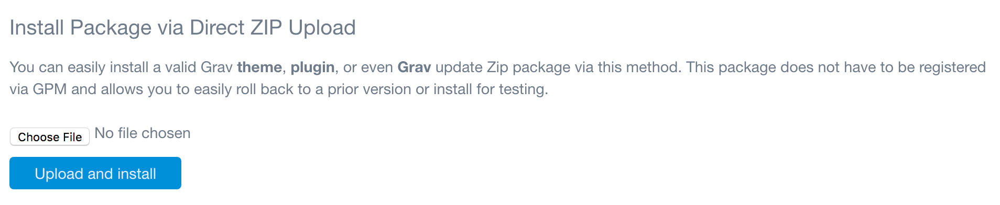

もしかすると、現時点ではメインの Grav ディレクトリに無いテーマやプラグインをアップロードしたいことがあるかもしれません。あるいは、 zip ファイルで提供されたプレミアムテーマをお持ちかもしれませんし、もしくは、プラグインを開発していて、 Grav にテストインストールとして最新のビルドをアップロードしたいかもしれません。いずれのケースでも、 FTP を使えば可能です。しかし、管理パネルも、よりシンプルな解決策を提供します。

**Direct Install** ツールを使えば、 zip されたパッケージを直接 Grav にアップロードでき、すぐに使い始められます。これは、プラグインやテーマに限りません。 Grav そのものさえこの方法でアップロードでき、アップグレード（もしくはダウングレード）することもできます。これは、特に Grav のコントリビューターが、彼らの作成物を簡単に試したいときに便利です。

どのようなインストールプロセスによる場合でも、このツールを利用する前には、 Grav のインストール内容のバックアップを取っておいてください。このツールを使用して Grav すべてを変更しようとしている場合は、特にそうしてください。

<h3 id="uploading">ローカル環境からアップロード</h3>

ダイレクトインストールの1つ目の方法は、ファイルのアップロードする方法です。
このツールを利用して、 zip パッケージを直接アップロードできます。
単純に、 **Choose File** ボタンをクリックし、ローカルのパッケージファイルを選択します（もしくは、ブラウザで zip パッケージをそのボタンへドラッグします）。ファイルを選択したあとは、 **Upload and Install** を選択するだけで、パッケージがインストールされます。

パッケージのインストールが成功したら、それを知らせるアラートが表示されます。それで終わりです！

<h4 id="remote-location">リモート環境からインストール</h4>

2つ目の方法は、パッケージファイルへの直接リンクを実行する方法です。
たとえば、パッケージをリモートサーバーにホスティングしているときに、パッケージの URL を入力できます。GPM は `https://getgrav.org/download/themes/bootstrap/1.6.0` のようなリンクを、、ダウンロードします。

デフォルトでは、これらのアップロードは、公式 GPM リポジトリに制限されています。しかし、**Configuration > System** に行き、 **Official GPM Only** オプションを **No** にトグルすれば、このフィールドのロックが解除され、公式の GPM リポジトリではなくても直接 zip パッケージリンクが有効化されます。たとえば、 `http://example.com/mypackage.zip` がダウンロードできます。
これは高度な機能であり、パッケージが安全であることを適切に検証できるときのみ使ってください。

> [!訳注]  
> このドキュメントを読む限り、リモートサーバーから直リンクでダウンロードは普通に危ない機能なので、使う機会は無いと思います。

