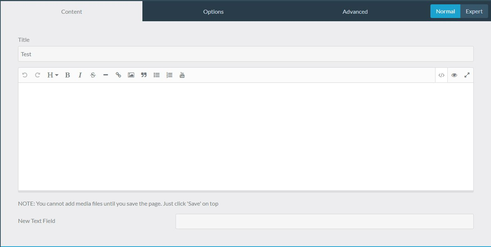

このページでは、管理パネルの拡張方法や、その際のベストプラクティスをガイドします。

<h3 id="understanding-admin-themes">管理パネルテーマを理解する</h3>

普通の Grav テーマを拡張したり、修正したりするのとちょうど同じように、管理パネルの構造や見た目をテンプレートで上書きできます。つまり、デフォルトのテンプレートの代わりに、あなたのプラグインで定義したテンプレートで、管理パネルのテーマが映し出せます。たとえば、左側にあるサイドバーナビゲーションのアバターを変更したいと思ったら、 `nav-user-avatar.html.twig` を変更することで、できます。

管理パネルプラグインでは、テンプレートへの path は：  `user/plugins/admin/themes/grav/templates` のフォルダ以下に、 *ADMIN_TEMPLATES* として参照されます。見つけたいファイルは、  `ADMIN_TEMPLATES/partials/nav-user-avatar.html.twig` にある、 `` です。

あなたのプラグインの中では、テンプレートへの path は： `user/plugins/myadminplugin/admin/themes/grav/templates` のフォルダ以下に、 *PLUGIN_TEMPLATES* として参照されます。対応ファイルは、 `PLUGIN_TEMPLATES/partials/nav-user-avatar.html.twig` であり、 `` のような内容になります。

このように、テンプレートの path を、非破壊的に上書きします。関連するテンプレートだけを対象とします。不要なテンプレートを上書きしてしまったり、他の管理テーマが同じ用途で代替テンプレートを登録してしまうのを防ぎます。そのため、次のようにプラグインに path を登録します：

```php
public static function getSubscribedEvents(): array
{
    return [
        'onAdminTwigTemplatePaths' => ['onAdminTwigTemplatePaths', 0]
    ];
}

public function onAdminTwigTemplatePaths($event): void
{
    $paths = $event['paths'];
    $paths[] = __DIR__ . '/admin/themes/grav/templates';
    $event['paths'] = $paths;
}
```

It is important to remember that the theme used in the Admin plugin is sensitive to the templates available. As a general rule, you should only modify templates with *low impact*, that is, make changes that will not break the interface for any user who installs your plugin. In this sense it is better to override `nav-user-avatar.html.twig` than `nav.html.twig`, as the latter contains much more functionality but uses `` to include the former.

> [!Note]  
> **TIP:** Admin template files have autoescaping turned on. You do not need to add `|e` filters to escape HTML content, but you do need to add `|raw` if your input is valid HTML.

<h3 id="adding-a-custom-field">カスタムフィールドを追加</h3>

To create a custom field, we will add it to `PLUGIN_TEMPLATES/forms/fields/myfield`. In the *myfield*-folder we need a Twig-template which declares how the field will operate. The easiest way to add a field is to find a similar field in `ADMIN_TEMPLATES/forms/fields` and copy that, to see how they are structured. For example, to add a HTML range-slider we create `PLUGIN_TEMPLATES/forms/fields/range/range.html.twig`. In this file, we add:

```twig



    type="range"
    min="{{ field.validate.min }}"
    max="{{ field.validate.max }}"
    step="{{ field.validate.step }}"
    {{ parent() }}

```

This adds a field-type called "range", with the type *range*, that allows the user to select a value by [sliding a button](http://www.html5tutorial.info/html5-range.php). To use the new field in a blueprint, we would simply add this in [*blueprints.yaml*](../../04.plugins/03.plugin-tutorial/#required-items-to-function):

```yaml
form:
  fields:
    radius:
      type: range
      label: Radius
      id: radius
      default: 100
      validate:
        min: 0
        max: 100
        step: 10
```

Which gives us a slider with a default value of 100, where accepted values are between 0 and 100, and each value increments by 10 as we slide it.

We could extend this further by using the `prepend` or `append` blocks available, by for example adding a visual indicator of the selected value. We change `range.html.twig` to contain this:

```twig



    type="range"
    style="display: inline-block;vertical-align: middle;"
    
        oninput="{{ field.id }}_output.value = {{ field.id }}.value"
    
    min="{{ field.validate.min }}"
    max="{{ field.validate.max }}"
    step="{{ field.validate.step }}"
    {{ parent() }}


  
    <output
        name="{{ (scope ~ field.name)|fieldName }}"
        id="{{ field.id }}_output"
        style="display: inline-block;vertical-align: baseline;padding: 0 0.5em 5px 0.5em;"
    >
    {{ value|join(', ')|e('html_attr') }}
    </output>
  

```

Thus we append an `<output>`-tag which will hold the selected value, and add to it and the field itself simple styling to align them properly. We also add an `oninput`-attribute to the field, so that changing values automatically updates the `<output>`-tag with the value. This requires that each field using the range-slider has an unique `id`-property, like the `id: radius` we declared above, which should be something like `id: myadminplugin_radius` to avoid conflicts.

> [!Info]  
> If this new template will be shared between frontend and Admin Panel (e.g. using `PLUGIN_TEMPLATES` folder), you need to escape all variables with `|e`. Alternatively you can just go to `Configuration` > `Twig Templating` > `Autoescape variables` and turn it to `Yes`.

### Creating custom page templates

As mentioned in [Theme Basics](../../03.themes/01.theme-basics/#content-pages-twig-templa), there is a direct relationship between **pages** in Grav and the **Twig template files** provided in a theme/ plugin.
To create a custom page template, you will need a blueprint file to define the fields for the Admin plugin and a template file for rendering the content.

#### Adding a custom page template to a theme/ plugin
In the root of the theme/ plugin folder, create a folder named `templates`.  Inside this folder, create a new mypage.html.twig file.  This will be the Twig template for the new page template "mypage".

Example mypage.html.twig:

```twig



    {{ page.header.newTextField|e }}
    {{ page.content|raw }}

```

There is more information about Twig theming in the [Twig Primer](../../03.themes/03.twig-primer/) section.

Themes automatically find template files within the theme's `templates` folder.  If the template is being added via a plugin, you'll need to add the template via the event `onTwigTemplatePaths`:

```php
public function onPluginsInitialized(): void
{
    // If in an Admin page.
    if ($this->isAdmin()) {
        return;
    }
    // If not in an Admin page.
    $this->enable([
        'onTwigTemplatePaths' => ['onTwigTemplatePaths', 1],
    ]);
}

/**
 * Add templates directory to twig lookup paths.
 */
public function onTwigTemplatePaths(): void
{
    $this->grav['twig']->twig_paths[] = __DIR__ . '/templates';
}
```


#### Adding a custom page blueprint to a theme/ plugin

In order for the Admin plugin to provide a new `mypage` page option, create a folder named `blueprints` in the root of the theme/ plugin. Inside this folder, create a new mypage.yaml file.  This is where you will define custom fields for the Admin plugin to display when creating a new page.  Available form fields can be found in the [Forms](../../06.forms/) chapter.

The example blueprint `mypage.yaml` below extends the default page template, and then adds header.newTextField under the content tab.:

```yaml
title: My Page Blueprint
'@extends':
    type: default
    context: blueprints://pages

form:
  fields:
    tabs:
      type: tabs
      active: 1
      fields:
        content:
          type: tab
          fields:
             header.newTextField:
              type: text
              label: 'New Text Field'

```

Similarly to the `templates` folder, a theme will automatically add any blueprint yaml files found within the `blueprints` folder.  If the blueprint is being added via a plugin, you'll need to add the blueprint via the event `onGetPageTemplates`:

```php
public function onPluginsInitialized(): void
{
    // If in an Admin page.
    if ($this->isAdmin()) {
        $this->enable([
            'onGetPageBlueprints' => ['onGetPageBlueprints', 0],
            'onGetPageTemplates' => ['onGetPageTemplates', 0],
        ]);
    }
}

/**
 * Add blueprint directory.
 */
public function onGetPageBlueprints(Event $event): void
{
    $types = $event->types;
    $types->scanBlueprints('plugin://' . $this->name . '/blueprints');
}

/**
 * Add templates directory.
 */
public function onGetPageTemplates(Event $event): void
{
    $types = $event->types;
    $types->scanTemplates('plugin://' . $this->name . '/templates');
}
```

#### Creating a new page

After defining the blueprint and template files, create a new page within the admin panel by clicking on **Add** and then selecting "Mypage":


The Admin edit form now displays the new custom field "New Text Field":


