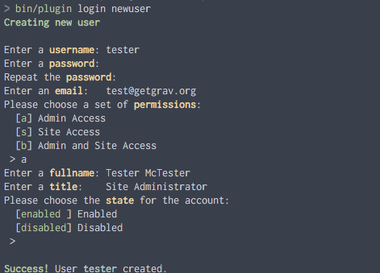
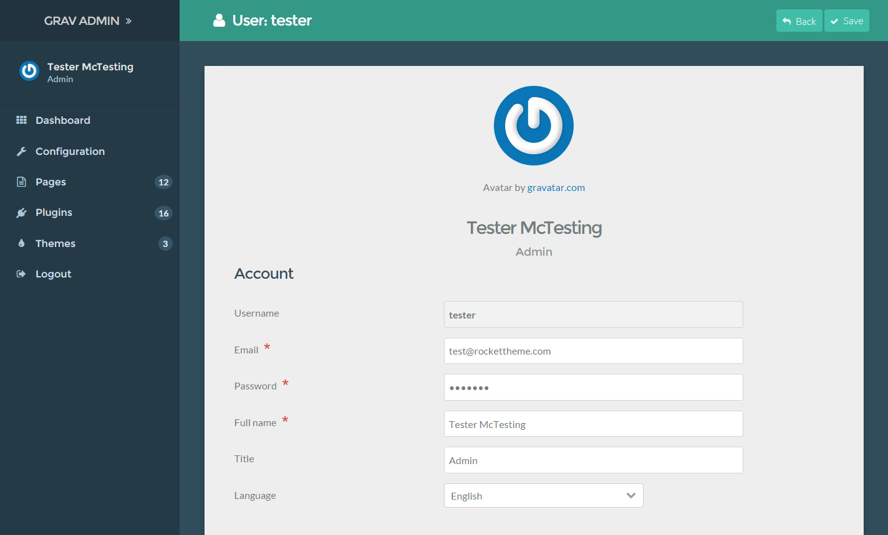
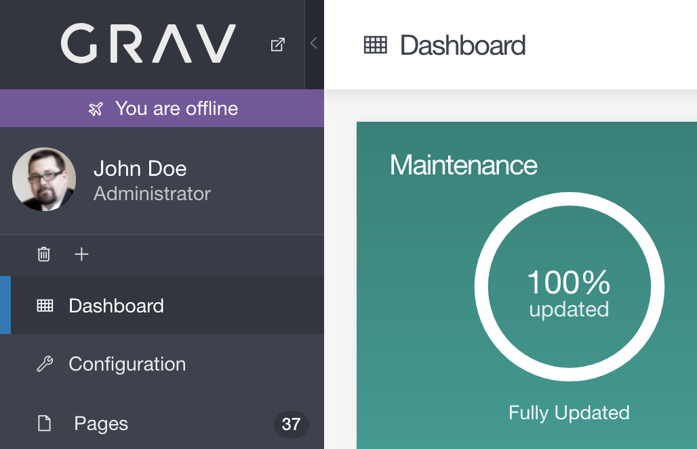

このFAQでは、管理パネルを最大限に利用するために役立つ、便利なチュートリアルや、チップス、トリックを提供します。

<h3 id="manual-installation-of-admin">管理プラグインを手動でインストールする</h3>

手動でのインストールは、推奨しませんが、管理パネルプラグインを手動でインストールすることは可能ではあります。基本的に、以下のプラグインを個別にダウンロードする必要があります。

* [admin](https://github.com/getgrav/grav-plugin-admin/archive/master.zip)
* [login](https://github.com/getgrav/grav-plugin-login/archive/master.zip)
* [form](https://github.com/getgrav/grav-plugin-form/archive/master.zip)
* [email](https://github.com/getgrav/grav-plugin-email/archive/master.zip)

それぞれのアーカイブファイルを、`user/plugins` フォルダに展開し、フォルダ名を単に `admin/`、 `login/`、 `form/`、 そして `email/` にしてください。その後は、 **それ以降の使用方法** に従ってください。

<h3 id="adding-and-managing-users">ユーザーの追加と管理</h3>

最初に管理パネルプラグインをインストールするとき、ブラウザからアクセスすると、管理ユーザーを作るようにプロンプトで促されます。これはシンプルな web のフォームで、最低でも1人の管理ユーザーを作る必要があります。


他のユーザーを追加することは簡単にできますが、少しだけ ターミナル/コマンドプロンプト 作業が必要になります。ユーザーを追加したい Grav サイトをインストールしている root ディレクトリに移動し、以下のコマンドを入力します：

```bash
bin/plugin login newuser
```



これにより、一連のプロンプトが表示され、新しいユーザーを作成するガイドをしてくれます。プロンプトで聞かれることには、ユーザー名、パスワード、メールアドレス、そしてそのユーザーのパーミッションレベルが含まれます。

> [!Warning]  
> You will need to have a user name consisting of between 3 and 16 characters which can include lowercase letters, numbers, underscores, and hyphens. Uppercase letters, spaces, and special characters are not allowed for the user name.

At one point during the creation process you will be asked to choose a set of permissions for the new user. There are currently three options:

| Role(s)        | Description    |
| :-----         | :-----         |
| Admin          | Gives the user access to the Admin back end. This role does not include front end access to protected pages. |
| Site           | Gives user access to all pages in the front end. This is the equivalent of a logged-in user.                      |
| Admin and Site | Gives user access to the entire site, front and back end.                                                         |

User data is stored in `SITE_ROOT/user/accounts/` and each user is given a **YAML** file containing that user's login information and other details. Here is an example of the data contained within a user account file. For example this could be the content of `SITE_ROOT/user/accounts/tester.yaml`.

!! The filename `tester.yaml` dictates the username is `tester`

```yaml
email: test@rockettheme.com
access:
  admin:
    login: true
    super: true
  site:
    login: true
fullname: 'Tester McTesting'
title: Admin
hashed_password: $2y$10$5RAUI6ZCISWR.4f0D6FILu3efYq3078ZX/.9vtAnZbjxS/4PXN/WW
```

You can edit this information directly to the user's YAML file, or by selecting your user avatar from the sidebar of the admin. This will take you to a page where you can easily manage user information.



!! Avatar photos are automatically generated by [Gravatar](https://gravatar.com), based on the user's email address.

For security reasons, user passwords are stored as a hash. If you would like to change your password, we recommend doing so from within the admin.

### Managing ACL

Every user yaml file has an `access` property. By setting this property appropriately, you can grant a specific user access to just a specific part of the admin.

Here are the currently supported access levels explained:

- `admin.login`: allows a user to login to the admin
- `admin.super`: grants a user super admin powers, allowing access to all the admin interface and functionality ignoring other access properties except `admin.login`
- `admin.pages`: allows a user to view pages, edit them and add new ones
- `admin.maintenance`: allows a user to update Grav from the admin side, check for updates and clear the cache
- `admin.plugins`: allows a user to access the plugins functionality, edit the plugins settings, disable plugins or add new ones
- `admin.themes`: allows a user to access the themes functionality, edit theme settings, change themes and add new ones
- `admin.statistics`: allows a user to see the site statistics
- `admin.cache`: allows a user to clear the cache
- `admin.configuration`: allows a user to access the configuration of the instance. Permission for the individual parts have to be given separately via the variables listed below. Only enabling the "sub-variables" without enabling this variable will not enable the configuration menu for the user.
  - `admin.configuration_system`: allows a user to change the system settings
  - `admin.configuration_site`: allows a user to change the site settings
  - `admin.configuration_media`: allows a user to edit the available media types
  - `admin.configuration_info`: allows a user to view the info about this instance
- other access levels, which have not yet been explained are:
  - `admin.tools`
  - `admin.settings`
  - `admin.users`

!! Changes made to a user.yaml file while that user is logged-in will only take effect after they log out and back in again.

### Custom Admin URL

One way to help keep your admin panel secure is to hide its location. To do this would be to change the URL from

```txt
http://yourwebsite.com/admin
```

to something more ambiguous that is going to be harder for someone to guess.  To do this you need to locate `admin.yaml` which can be found in `user/plugins/admin/` folder and **copy this** to `user/config/plugins/admin.yaml`.

Then change the line `route: '/admin'` to something more ambiguous, for example `route: '/myspecialplace'`, this way if you need to access the admin panel for your grav site you will enter

```txt
http://yourwebsite.com/myspecialplace
```

### Offline Mode



In the event that your server loses its connection to the Internet, the Grav Admin automatically enters into an Offline Mode. This mode is indicated by a notice below the low in the upper-left corner of the admin.

When in Offline Mode, the admin will not attempt to retrieve updates to the CMS, plugins, or themes. This prevents hangups and other issues that would otherwise result from being unable to reach the update servers.

Once an Internet connection is re-established, the notice will disappear and Offline Mode will end, automatically.

