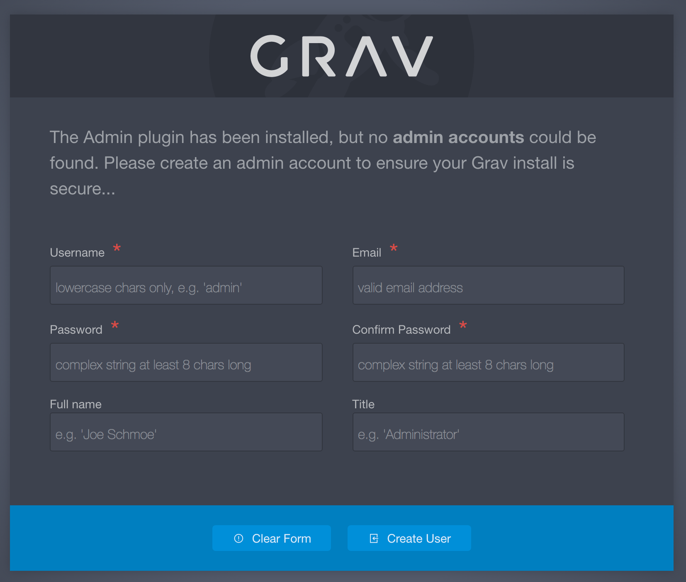

このFAQでは、管理パネルを最大限に利用するために役立つ、便利なチュートリアルや、テクニック、裏技を解説します。

<h3 id="manual-installation-of-admin">管理プラグインを手動でインストールする</h3>

手動でのインストールは、推奨しませんが、管理パネルプラグインを手動でインストールすることは可能ではあります。  
基本的に、以下のプラグインを個別にダウンロードする必要があります。

* [admin](https://github.com/getgrav/grav-plugin-admin/archive/master.zip)
* [login](https://github.com/getgrav/grav-plugin-login/archive/master.zip)
* [form](https://github.com/getgrav/grav-plugin-form/archive/master.zip)
* [email](https://github.com/getgrav/grav-plugin-email/archive/master.zip)

それぞれのアーカイブファイルを、`user/plugins` フォルダに展開し、フォルダ名を単に `admin/`、 `login/`、 `form/`、 そして `email/` にしてください。  
その後は、 **それ以降の使用方法** に従ってください。

<h3 id="adding-and-managing-users">ユーザーの追加と管理</h3>

最初に管理パネルプラグインをインストールするとき、ブラウザからアクセスすると、管理ユーザーを作るようにプロンプトで促されます。  
これはシンプルな web のフォームで、最低でも1人の管理ユーザーを作る必要があります。



他のユーザーを追加することは簡単にできますが、少しだけ ターミナル/コマンドプロンプト 作業が必要になります。  
ユーザーを追加したい Grav サイトをインストールしている root ディレクトリに移動し、以下のコマンドを入力します：

```bash
bin/plugin login newuser
```


これにより、一連のプロンプトが表示され、新しいユーザーを作成するガイドをしてくれます。  
プロンプトで聞かれることには、ユーザー名、パスワード、メールアドレス、そしてそのユーザーのパーミッションレベルが含まれます。

> [!Warning]  
> ユーザー名は、3文字以上16文字以内で、小文字、数字、アンダースコア、ハイフンを含めることができます。大文字、空白文字、特殊文字はユーザー名には使えません。

作成処理の最中に、新しいユーザーのパーミッションの設定を選択するように尋ねられます。  
現在、3つのオプションがあります。

| Role(s)        | 説明    |
| :-----         | :-----         |
| Admin          | ユーザーに、バックエンドの管理パネルへのアクセスを許可します。この役割は、フロントエンドの保護ページへのアクセス権を含みません。 |
| Site           | ユーザーに、フロントエンドのすべてのページへのアクセスを許可します。ログインユーザーと同じ権限です。 |
| Admin and Site | ユーザーに、フロントエンドもバックエンドも両方、サイト全体へのアクセスを許可します。 |

ユーザーのデータは、 `SITE_ROOT/user/accounts/` に保存され、各ユーザーには **YAML** ファイルが与えられます。  
そのファイルには、そのユーザーのログイン情報とその他の詳細情報が書かれています。  
以下は、ユーザーアカウントファイル内のデータの例です。  
この例では、 `SITE_ROOT/user/accounts/tester.yaml` を表します。

> [!Info]  
> `tester.yaml` というファイル名は、ユーザー名が `tester` であることを示します。

```yaml
email: test@rockettheme.com
access:
  admin:
    login: true
    super: true
  site:
    login: true
fullname: 'Tester McTesting'
title: Admin
hashed_password: $2y$10$5RAUI6ZCISWR.4f0D6FILu3efYq3078ZX/.9vtAnZbjxS/4PXN/WW
```

このユーザーの YAML ファイル情報を、直接編集することもできますし、管理パネルのサイドバーから、アバターを選択することによって編集することもできます。  
管理パネルでは、ユーザー情報を簡単に管理できるページが表示されます。


> [!Info]  
> アバター写真は、ユーザーのメールアドレスをもとに、 [Gravatar](https://gravatar.com) により、自動で生成されます。

セキュリティ上の理由から、ユーザーパスワードはハッシュ値で保存されます。  
パスワードを変更したい場合は、管理パネル内から行うことをおすすめします。

<h3 id="managing-acl">ACL 管理</h3>

すべてのユーザーの yaml ファイルには、 `access` プロパティがあります。  
このプロパティを適切に設定することにより、特定のユーザーに、管理パネルの特定の場所へのアクセス権を付与できます。

以下は、現在サポートされているアクセスレベルの説明です：

- `admin.login`: 管理パネルへのログイン権限
- `admin.super`: スーパー管理者権限。管理パネルのすべてのインターフェースと機能にアクセスでき、 `admin.login` 以外のアクセスプロパティを無視します。
- `admin.pages`: pages の閲覧、編集、新規追加権限
- `admin.maintenance`: 管理パネルから Grav をアップデートでき、アップデートのチェックや、キャッシュのクリアが可能です。
- `admin.plugins`: プラグイン機能へアクセスし、プラグイン設定を編集し、プラグインを無効化したり、新規プラグインを追加できます
- `admin.themes`: テーマ機能へアクセスし、テーマ設定を編集し、テーマを変更したり、新規テーマを追加できます。
- `admin.statistics`: サイトの統計情報を確認できます
- `admin.cache`: キャッシュをクリアできます
- `admin.configuration`: config 設定権限。個々の部分へのパーミッションは、以下のリストの変数を個別に設定しなければいけません。この変数を有効化せず、 "サブ変数" のみを有効化しても、ユーザーに config メニューは表示されません。
  - `admin.configuration_system`: system 設定の変更権限
  - `admin.configuration_site`: site 設定の変更権限
  - `admin.configuration_media`: 利用可能な media タイプの編集権限
  - `admin.configuration_info`: info 設定の閲覧権限
- ここで説明されていない、その他のアクセスレベル：
  - `admin.tools`
  - `admin.settings`
  - `admin.users`

> [!Info]  
> そのユーザーがログイン中に行った user.yaml ファイルへの変更は、一度ログアウトして、サイドログインしてから適用されます。

<h3 id="custom-admin-url">管理パネル URL の変更</h3>

管理パネルを安全にする助けとなる方法のひとつとして、その場所を隠すことができます。  
これをするには、 URL を以下から変更します：

```txt
http://yourwebsite.com/admin
```

上記を、もっと複雑にし、第三者が思いつきにくいものに変更します。  
これをするには、`user/plugin/admin` フォルダにある `admin.yaml` を探し、**これをコピーして** `user/config/plugins/admin.yaml` に貼り付けます。

それから、貼り付けた方のファイルの `route: '/admin'` を何かもっと複雑なものにします。  
たとえば、 `route: '/myspecialplace'` のように。  
これにより、 Grav の管理パネルへのアクセスは、次のアドレスになります：

```txt
http://yourwebsite.com/myspecialplace
```

<h3 id="offline-mode">オフラインモード</h3>


サーバーのインターネット接続が落ちた場合、 Grav 管理パネルは自動的にオフラインモードに入ります。  
このモードでは、管理パネルの右上にある Grav のロゴの下に、注意書きが表示されます。

オフラインモードの間は、管理パネルは CMS やプラグインや、テーマの更新を試みません。  
これにより、アップデートサーバーに到達できないことによるハングアップやその他の問題を防いでくれます。

インターネットが再接続されたら、この注意書きは消え、オフラインモードは自動で終了します。

