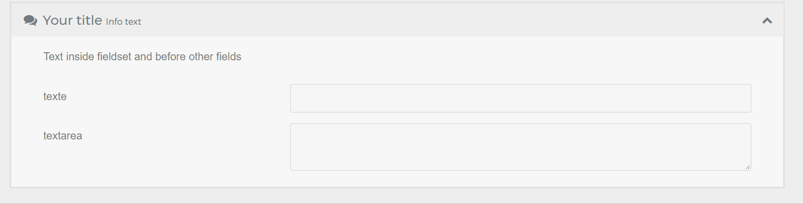
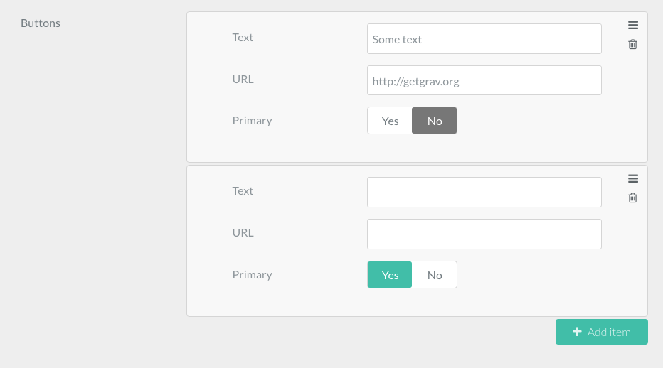
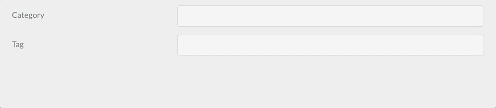

<h2 id="available-form-fields-for-use-in-the-admin">管理プラグインで使えるform.fields</h2>

管理パネルでは、さまざまな入力欄を作れます。このドキュメントでは、それぞれの入力欄のプロパティの完全なリファレンスと、使用例を提供します。

管理パネルでは、以下に一覧表示されている、 form.fields に加えて、フロントエンドで利用できる form.fields もすべて利用できます。[フロントエンドのフォーム入力欄のリファレンス](../../02.forms/02.fields-available/) に解説されています。

<h3 id="special-form-fields-available-exclusively-in-the-admin">管理プラグインだけで利用できる特別なフォームフィールド</h3>

| フィールド                                             | 説明                                                  |
| :-----                                            | :-----                                                       |
| **[Array](#array-field)**                         | key-value 形式の配列を作ります                              |
| **BackupHistory**                                 |                                                              |
| **Blueprint**                                     |                                                              |
| **[Colorpicker](#colorpicker-field)**             | カラーピッカーを表示                                         | 
| **[Columns](#columns-column-fields)**             | 複数のカラムに分けます |
| **[Column](#columns-column-fields)**              | （`Columns` フィールドで使われて）1つのカラムを表示します |
| **Cron**                                          |                                                              |
| **CronStatus**                                    |                                                              |
| **[Dateformat](#dateformat-field)**               | 渡されたフォーマットで、今日/今の時間 をレンダリングする特別な選択 |
| **[Datetime](#datetime-field)**                   | 日時を選択するフィールド |
| **[Editor](#editor-field)**                       | markdown エディタを表示 |
| **[Elements](#elements-field)**                   | 選択された "トリガー" の値をもとに、子要素を見せたり/隠したりする条件付きの整理用フィールドです。表示するオプションが多いとき、煩雑さを抑えるのにとても便利です |
| **[Fieldset](#fieldset-field)**                   | 折りたたみ可能なアコーディオン内にフィールドのセットをグルーピングします   |
| **[File](#file-field)**                           | 管理プラグイン内では、 **File** は、プラグインやテーマ設定（ブループリント）で使用されることに特化しています。ファイルのアップロード保存と、そのファイルの削除、テーマ/プラグイン設定からの参照の削除などを行います |
| **[Filepicker](#filepicker-field)**               | **Filepicker** により、web サーバーのファイルシステムに保存したファイルを選択できます |
| **Frontmatter**                                   |                                                              |
| **IconPicker**                                    |                                                              |
| **[List](#list-field)**                           | フィールドのコレクションを作ります |
| **Markdown**                                      |                                                              |
| **MediaPicker**                                   |                                                              |
| **Multilevel**                                    |                                                              |
| **Order**                                         |                                                              |
| **PageMedia**                                     |                                                              |
| **[PageMediaSelect](#pagemediaselect-field)**     | すべてのページメディアからの選択を表示します。ページのブループリントで使われ、ユーザーがそのフィールドに適用されたメディアファイルを選べるようになります |
| **[Pages](#pages-field)**                         | サイトページの一覧を表示します |
| **Parents**                                       |                                                              |
| **Permissions**                                   |                                                              |
| **Range**                                         |                                                              |
| **[Section](#section-field)**                     | 設定ページをセクションに区切ります； each section comes with a title                                                                                                                                |
| **[Selectize](#selectize-field)**                 | テキストボックスとセレクトボックスのハイブリッドです。タグなどの要素をピックアップするのに便利です。 |
| **SelectUnique**                                  |                                                              |
| **[Taxonomy](#taxonomy-field)**                   | タクソノミーを1つもしくは複数選択するために、事前に設定された特別な選択肢 |
| **ThemeSelect**                                   |                                                              |
| **UserInfo**                                      |                                                              |
| **Xss**                                           |                                                              |

<h3 id="common-fields-attributes">一般的な属性フィールド</h3>

このリストの属性は、基本的にすべてのフィールドで利用可能です。それぞれのフィールドは、一般的な属性を共有しますが、特定のフィールドでは、適用されないこともあります。フィールドでどの属性が利用可能かを知る最良の方法は、このページの説明を読み、どの属性が言及されているか確認することです。

このリストは共通事項なので、フィールドで説明は繰り返しません。

| 属性           | 説明    |
| :-----              | :-----  |
| `autocomplete`      | `on` もしくは `off` を受付 |
| `autofocus`         | 有効化すると、フィールドをオートフォーカスします |
| `classes`           | 文字列を受け付け、CSSのクラスを追加します |
| `default`           | デフォルト値を設定します。ユーザーが指定した値か、このデフォルト値が必ず入力されます。`placeholder` も見てください。 |
| `disabled`          | フィールドを disabled 状態にします |
| `help`              | フィールドに tooltip を追加します |
| `id`                | label の `for` 属性とともに、フィールドに id を設定します |
| `label`             | label を設定します |
| `name`              | フィールドの name を設定します |
| `novalidate`        | フィールドをバリデーション対象外にします |
| `placeholder`       | フィールドに placeholder 値を設定します。ユーザーが自分の値のプロンプトとして見ることができる値ですが、最終的な書き込みには影響しません。`default` も見てください。 |
| `readonly`          | フィールドを読み取り専用にします |
| `size`              | フィールドに size を設定します。この size は、コンテナにクラスとして追加されます。`large`, `x-small`, `medium`, `long`, `small` が適切な値ですが、もちろんフロントエンドで使える別の値を追加することも可能です。 |
| `style`             | フィールドに style を設定します。`vertical` を設定すると、フィールドが最大幅で表示されます。これはフォームをすっきりさせる簡単な方法です。 |
| `title`             | フィールドのタイトル値を設定します |
| `toggleable`        | フィールドの 有効化/無効化 をトグルするチェックボックスを追加します |
| `validate.required` | ポジティブな値（`true` など）を設定すると、フィールドが required になります |
| `validate.pattern`  | バリデーションのパターンを設定します |
| `validate.message`  | バリデーションが失敗したときに表示されるメッセージを設定します |
| `validate.type`     | バリデーション中に使われるフィールドタイプを設定します |

<h3 id="know-more-about-fields">フィールドについてより詳しく知る</h3>

どのようにソースコードからフィールドがビルドされるかは、ここで読めます： [Form Plugin によるフィールドの追加](https://github.com/getgrav/grav-plugin-form/tree/master/templates/forms) 及び [管理パネルでのみ利用可能なフィールド](https://github.com/getgrav/grav-plugin-admin/tree/master/themes/grav/templates/forms) 。

### Validation

ほとんどのフィールドで、バリデーションできます。

```yaml
validate:
    required: true
```

上記により、そのフィールドは required となります。

```yaml
validate:
    message: 'Some message'
```

上記では、フィールドが正しく入力されなかったときに、定義されたメッセージを表示します。

```yaml
validate:
    pattern: 'Some pattern'
```

上記では、入力値を、渡された正規表現でバリデーションします。たとえば： `pattern: "[1-9][0-9]*"`, `pattern: '[A-Za-z0-9-]+'`, `pattern: '[a-z0-9-]+'`, ` pattern: '^[a-z0-9_-]{3,16}$'`, `pattern: '(?=.*\d)(?=.*[a-z])(?=.*[A-Z]).{8,}'`

#### validate.type

`validate.type` は、どの type （型）に対して入力値を検証するかを指定します。

いくつかの具体例：

editor タイプの入力欄への入力を、`textarea` タイプに適合するかチェックしたい：

```yaml
content:
    type: editor
    validate:
      type: textarea
```

selectize タイプの入力欄への入力を、 `commalist` タイプに適合するかチェックしたい：

```yaml
taxonomies:
    type: selectize
    size: large
    label: PLUGIN_ADMIN.TAXONOMY_TYPES
    classes: fancy
    help: PLUGIN_ADMIN.TAXONOMY_TYPES_HELP
    validate:
        type: commalist

filters.category:
  type: selectize
  label: Category filter
  help: Comma separated list of category names
  validate:
    type: commalist
```

text タイプの入力欄への入力を、eメール タイプに適合するかチェックしたい：

```yaml
author.email:
    type: text
    size: large
    label: PLUGIN_ADMIN.DEFAULT_EMAIL
    help: PLUGIN_ADMIN.DEFAULT_EMAIL_HELP
    validate:
        type: email
```

toggle タイプの入力欄への入力を、bool タイプに適合するかチェックしたい：

```yaml
summary.enabled:
    type: toggle
    label: PLUGIN_ADMIN.ENABLED
    highlight: 1
    help: PLUGIN_ADMIN.ENABLED_HELP
    options:
        1: PLUGIN_ADMIN.YES
        0: PLUGIN_ADMIN.NO
    validate:
        type: bool
```

text タイプの入力欄への入力を、int 型で、0から65536の間にあるかチェックしたい：

```yaml
summary.size:
    type: text
    size: x-small
    label: PLUGIN_ADMIN.SUMMARY_SIZE
    help: PLUGIN_ADMIN.SUMMARY_SIZE_HELP
    validate:
        type: int
        min: 0
        max: 65536
```

text タイプの入力欄への入力を、数字で 1以上 に適合するかチェックしたい：

```yaml
pages.list.count:
    type: text
    size: x-small
    label: PLUGIN_ADMIN.DEFAULT_PAGE_COUNT
    help: PLUGIN_ADMIN.DEFAULT_PAGE_COUNT_HELP
    validate:
        type: number
        min: 1
```

taxonomy タイプの入力欄への入力を、array 型に適合するかチェックしたい：

```yaml
header.taxonomy:
  type: taxonomy
  label: PLUGIN_ADMIN.TAXONOMY
  multiple: true
  validate:
    type: array
```

text タイプの入力欄への入力を、slug 型に適合するかチェックしたい：

```yaml
folder:
  type: text
  label: PLUGIN_ADMIN.FOLDER_NAME
  validate:
    type: slug
```

### Array Field


シンプルな key - values オブジェクト（一般的な連想配列）を作ります。もしくは、 `value_only` オプションを使うと、ただの values のリスト（配列） を作ります。

具体例：

```yaml
metadata:
   type: array
   label: PLUGIN_ADMIN.METADATA
   help: PLUGIN_ADMIN.METADATA_HELP
   placeholder_key: PLUGIN_ADMIN.METADATA_KEY
   placeholder_value: PLUGIN_ADMIN.METADATA_VALUE
   required: true
```


| 属性           | 説明 |
| :-----              | :-----      |
| `placeholder_key`   |             |
| `placeholder_value` |             |
| `value_only`        | 配列の key を求めたり、保存したりしないでください。シンプルな値のみの配列を保存してください。 |
| `value_type`        | 配列値を入力する際に、小さい [text field](../../02.forms/02.fields-available/#text-field) ではなく、 [textarea field](../../02.forms/02.fields-available/#textarea-field) で表示したい場合に、`textarea` を設定してください |


| 利用可能な一般属性                      |
| :-----                                         |
| [default](#common-fields-attributes)           |
| [help](#common-fields-attributes)              |
| [label](#common-fields-attributes)             |
| [name](#common-fields-attributes)              |
| [style](#common-fields-attributes)             |
| [toggleable](#common-fields-attributes)        |
| [validate.required](#common-fields-attributes) |
| [validate.type](#common-fields-attributes)     |


### Colorpicker Field


カラーピッカーを表示します

具体例：

```yaml
color:
   type: colorpicker
   label: Choose a color
   default: '#FFFFFF'
```


| 利用可能な一般属性                      |
| :-----                                         |
| [autocomplete](#common-fields-attributes)      |
| [autofocus](#common-fields-attributes)         |
| [classes](#common-fields-attributes)           |
| [default](#common-fields-attributes)           |
| [disabled](#common-fields-attributes)          |
| [help](#common-fields-attributes)              |
| [id](#common-fields-attributes)                |
| [label](#common-fields-attributes)             |
| [name](#common-fields-attributes)              |
| [placeholder](#common-fields-attributes)       |
| [style](#common-fields-attributes)             |
| [title](#common-fields-attributes)             |
| [toggleable](#common-fields-attributes)        |
| [validate.message](#common-fields-attributes)  |
| [validate.required](#common-fields-attributes) |
| [validate.type](#common-fields-attributes)     |


### Columns / column Fields


`columns` と `column` フィールドタイプは、フィールドをカラムに分けます（縦に分割します）

具体例：

```yaml
columns:
  type: columns
  fields:
    column1:
      type: column
      fields:

        # .... subfields

    column2:
      type: column
      fields:

        # .... other subfields
```


| 属性 | 説明                    |
| :-----    | :-----                         |
| `fields`  | columns / column のサブフィールド |


### Dateformat Field


日付のフォーマットの選択肢です

具体例：

```yaml
pages.dateformat.short:
    type: dateformat
    size: medium
    classes: fancy
    label: PLUGIN_ADMIN.SHORT_DATE_FORMAT
    help: PLUGIN_ADMIN.SHORT_DATE_FORMAT_HELP
    default: "jS M Y"
    options:
        "F jS \\a\\t g:ia": Date1
        "l jS \\of F g:i A": Date2
        "D, d M Y G:i:s": Date3
        "d-m-y G:i": Date4
        "jS M Y": Date5
```

| 属性   | 説明                                             |
| :-----      | :-----                                                  |
| `options`   | key-value 型の選択肢                   |
| `multiple`  | 真偽値。もしポジティブ（`true` など）なら、複数の値を許容します |
| `selectize` |                                                         |


| 利用可能な一般属性                      |
| :-----                                         |
| [autofocus](#common-fields-attributes)         |
| [classes](#common-fields-attributes)           |
| [default](#common-fields-attributes)           |
| [disabled](#common-fields-attributes)          |
| [help](#common-fields-attributes)              |
| [label](#common-fields-attributes)             |
| [name](#common-fields-attributes)              |
| [novalidate](#common-fields-attributes)        |
| [size](#common-fields-attributes)              |
| [style](#common-fields-attributes)             |
| [toggleable](#common-fields-attributes)        |
| [validate.required](#common-fields-attributes) |
| [validate.type](#common-fields-attributes)     |


### Datetime Field


日時のフィールドを保存し、表示します

具体例：

```yaml
header.date:
  type: datetime
  label: PLUGIN_ADMIN.DATE
  toggleable: true
  help: PLUGIN_ADMIN.DATE_HELP
```


| 属性      | 説明           |
| :-----         | :-----                |
| `format`       |  日時のフォーマット値です。 [PHPのdatetime formats](https://www.php.net/manual/ja/datetime.format.php) がすべて使えます |
| `validate.min` | 許容する最小値 |
| `validate.max` | 許容する最大値 |


| 利用可能な一般属性                      |
| :-----                                         |
| [default](#common-fields-attributes)           |
| [help](#common-fields-attributes)              |
| [label](#common-fields-attributes)             |
| [name](#common-fields-attributes)              |
| [size](#common-fields-attributes)              |
| [style](#common-fields-attributes)             |
| [toggleable](#common-fields-attributes)        |
| [validate.required](#common-fields-attributes) |
| [validate.type](#common-fields-attributes)     |


### Editor Field


Codemirror エディタを表示します

具体例：

```yaml
frontmatter:
  classes: frontmatter
  type: editor
  label: PLUGIN_ADMIN.FRONTMATTER
  autofocus: true
  codemirror:
    mode: 'yaml'
    indentUnit: 4
    autofocus: true
    indentWithTabs: false
    lineNumbers: true
    styleActiveLine: true
    gutters: ['CodeMirror-lint-markers']
    lint: true
```


| 属性    | 説明                                                                              |
| :-----       | :-----                                                                                   |
| `codemirror` | [codemirror editor](https://codemirror.net/doc/manual.html#config) の設定値。デフォルトでは、gfm（github flavored markdown）モードです |
| `resizer`    | ポジティブな値の場合、resizer を有効化します。そうでない場合、エディタは固定です。 |


| 利用可能な一般属性                      |
| :-----                                         |
| [default](#common-fields-attributes)           |
| [help](#common-fields-attributes)              |
| [label](#common-fields-attributes)             |
| [name](#common-fields-attributes)              |
| [style](#common-fields-attributes)             |
| [validate.required](#common-fields-attributes) |
| [validate.type](#common-fields-attributes)     |
| [autofocus](#common-fields-attributes)         |
| [classes](#common-fields-attributes)           |
| [disabled](#common-fields-attributes)          |
| [id](#common-fields-attributes)                |
| [novalidate](#common-fields-attributes)        |
| [placeholder](#common-fields-attributes)       |
| [readonly](#common-fields-attributes)          |


### Elements Field


このフィールドは、整理するだけのものです。アイテムをグループ化し、名前を付け、select 要素の値と一致すればそれだけを表示します。

具体例：

```yaml
header.elements-demo.type:
  type: elements
  label: 'Elements Demo'
  size: small
  default: gelato
  options:
    gelato: Gelato Flavors
    color: Color
    planets: Planets
  fields:
    gelato:
      type: element
      fields:
        .flavours:
          type: array
          default:
            pistacchio: Pistacchio
            vanilla: Vanilla
            chocolate: Chocolate
            stracciatella: Stracciatella
    color:
      type: element
      fields:
        .description:
          type: textarea
          rows: 10
          default: Color (American English) or colour (Commonwealth English) is the visual perceptual property corresponding in humans to the categories called blue, green, red, etc. Color derives from the spectrum of light (distribution of light power versus wavelength) interacting in the eye with the spectral sensitivities of the light receptors. Color categories and physical specifications of color are also associated with objects or materials based on their physical properties such as light absorption, reflection, or emission spectra. By defining a color space colors can be identified numerically by their coordinates.
    planets:
      type: element
      fields:
        .favorites:
          type: text
          placeholder: What are your favorite planets?
          markdown: true
          description: 'Find a list of planets from [Wikipedia](https://en.wikipedia.org/wiki/Planet)'
```

### Fieldset Field



表示したり消したりできるボックスに、フィールドをまとめます。

具体例：

```yaml
header.fieldset:
  type: fieldset
  title: Your title
  help: Help text
  info: Info text
  text: Text inside fieldset and before other fields
  icon: comments       # Fork Awesome icons system (see : forkaweso.me).
  collapsed: true      # Initial state of fieldset (see collapsible option)
  collapsible: true    # Whether one can expand the fieldset or not
  fields:
    header.fieldset.an_example_text:
      type: text
      label: text
    header.fieldset.an_example_textarea:
      type: textarea
      label: textarea
```

> [!Note]  
> Fieldsets は、サブフィールドの状態を正しく記憶させるため、 `header.` 付きで、テーマ設定ファイルのフロントマターに保存されなければいけません！

> [!Info]  
> **既知の問題：** フィールドセット内のフィールドで `toggleable:` を使う場合、　`header.` が接頭辞として付いていないと、それらの状態が記憶されません。以下は、 *ページネーション* オプションを変更する、適切な構造の例です：

```yaml
header.fieldset:
  type: fieldset
  ... etc...
  fields:
    header.content.pagination:
      type: toggle
      toggleable: true
      label: "Activate Pagination ?"
      highlight: 1
      default: 0
      options:
        1: Yes
        0: No
      validate:
        type: bool
```

#### Icon of the fieldset

フィールドセットのヘッダにアイコンが使えます。システムの使うアイコンは、[Fork Awesome](https://forkaweso.me) です。


| 属性     | 説明   |
| :-----        | :----- |
| `icon`        | box 用のアイコン |
| `collapsed`   | `true` にすると、閉じた状態でページが表示されます。デフォルトでは、開いた状態です。 |
| `collapsible` | フィールドセットを開閉できるかどうか |


| 利用可能な一般属性                      |
| :-----                                         |
| [disabled](#common-fields-attributes)          |
| [help](#common-fields-attributes)              |
| [label](#common-fields-attributes)             |
| [name](#common-fields-attributes)              |
| [size](#common-fields-attributes)              |
| [style](#common-fields-attributes)             |
| [toggleable](#common-fields-attributes)        |


### File Field


> [!Info]  
> `file`  フィールドは、**configration** と、 **テーマ** と、**プラグイン** のブループリントで使われるためのもので、 **ページのブループリントのためのものではありません** 。ページのためには、既存の `pagemedia` フィールドを使うべきです。その後のファイルの選択には、 [filepicker](#filepicker-field) を使ってください。

> [!Info]  
> The `file` field does not currently work as expected in a list field. Use a single `pagemedia` field separate from the list with one or more `filepicker` fields in the list.

> [!Note]  
> より詳しくは、 [ハウツー： アップロードでファイルを追加](../04.how-to-add-file-upload/) セクションをご覧ください。 また、 file フィールドにアップロードされた画像の表示方法は、 filepicker フィールドによるものとは、同じ方法ではないことにも注意してください。 file フィールドでアップロードした画像へのアクセスに関する詳細は、この [レシピ](../../../10.cookbook/02.twig-recipes/#displaying-an-image-uploaded-in-a-file-field) をご覧ください。

具体例：

```yaml
custom_logo_login_screen:
  type: file
  label: Custom Logo Login Screen
  destination: 'plugins://admin/assets'
  accept:
    - image/*
```

```yaml
custom_file:
  type: file
  label: A Label
  destination: 'theme://assets'
  multiple: true
  limit: 5
  filesize: 1
  accept:
    - image/*
```


| 属性  | 説明  |
| :-----              | :----- |
| `destination`       | ファイルを保存するフォルダです。ストリームか、Grav ルートフォルダからの相対パスを使います 例： `plugins://my-plugin/assets` |
| `multiple`          | フィールドごとに、複数のファイルを許可するかどうか  |
| `limit`             | When `multiple` を有効化したときに、アップロードできるファイルの数を制限できます         |
| `filesize`          | 各ファイルに許可される MB 単位のサイズ    |
| `accept`            | 受け入れ可能なページの mime タイプと拡張子のリストを追加します 例： `["image/*", '.mp3']`  |
| `random_name`       | 各ファイルにランダムなファイル名を使用します。  |
| `avoid_overwriting` | 競合が発生した場合、各ファイル名の前にタイムスタンプを追加します |


| 利用可能な一般属性                      |
| :-----                                         |
| [default](#common-fields-attributes)           |
| [disabled](#common-fields-attributes)          |
| [help](#common-fields-attributes)              |
| [label](#common-fields-attributes)             |
| [name](#common-fields-attributes)              |
| [size](#common-fields-attributes)              |
| [style](#common-fields-attributes)             |
| [toggleable](#common-fields-attributes)        |
| [validate.required](#common-fields-attributes) |
| [validate.type](#common-fields-attributes)     |


### Filepicker Field


`filepicker` フィールドタイプは、ページ、プラグイン、テーマの設定（ブループリント）で使われます。特定の場所からファイルを選択し、ページヘッダーもしくはテーマ / プラグイン設定に保存します。

具体例：

```yaml
picked_image:
  type: filepicker
  folder: 'theme://images/pages'
  label: Select a file
  preview_images: true
  accept:
    - .png
    - .jpg
```

```yaml
header.a_file:
  type: filepicker
  folder: 'self@'
  preview_images: true
  label: Select a file
```


| 属性     | 説明   |
| :-----        | :-----  |
| `folder` | ストリームもしくは Grav ルートからの相対パスを使い、ファイルを探す対象のフォルダ。 Accepts any value in the [file field destination format](../../01.blueprints/06.how-to-add-file-upload/#destination) |
| `accept` | 受け入れるファイル拡張子のリスト   |
| `preview_images` | 有効化すると、画像ファイルに小さなプレビューが表示されます |
| `on_demand` | 有効化すると、ファイルピッカーにフォーカスが当たっているときのみファイルや画像が読み込まれます。大きいメディアや、たくさんのファイルピッカーフィールドがある場合に、管理パネルの編集ページの読み込み時間を短縮するのに役に立ちます  |


| 利用可能な一般属性                      |
| :-----                                         |
| [default](#common-fields-attributes)           |
| [disabled](#common-fields-attributes)          |
| [help](#common-fields-attributes)              |
| [label](#common-fields-attributes)             |
| [name](#common-fields-attributes)              |
| [size](#common-fields-attributes)              |
| [style](#common-fields-attributes)             |
| [toggleable](#common-fields-attributes)        |
| [validate.required](#common-fields-attributes) |


### Honeypot Field

`honeypot` フィールドタイプは、入力されるとエラーを返す hidden フィールドを作成します。ボットによるフォームの入力と送信を防ぐのに便利です。

具体例：

```yaml
fields:
    - name: honeypot
      type: honeypot
```

これは、シンプルな text フィールドですが、フロントエンドには表示されません。コード内のフィールドを探索し、自動入力するボットは、このフィールドも入力する可能性があります。このエラーにより、フォームは適切に送信されません。エラーは、メッセージブロックの上部ではなく、フォーム要素の次に表示されます。

ハニーポットは、captcha フィールドの代替としてよく利用されます。


### List Field


`list` フィールドタイプは、フィールドのコレクションを作成します。このフィールドには、サブフィールドの親となる `fields` 属性を与えます。 "Add item" ボタンが表示され、ユーザーはコレクションにアイテムを追加することができます。

具体例：

```yaml
header.buttons:
  name: buttons
  type: list
  style: vertical
  label: Buttons
  fields:
    .text:
      type: text
      label: Text
    .url:
      type: text
      label: URL
    .primary:
      type: toggle
      label: Primary
      highlight: 1
      default: 1
      options:
          1: 'Yes'
          0: 'No'
      validate:
          type: bool
```

この例では、次のような管理パネルのインターフェースが生成されます：



ページを保存すると、次のような YAML がページのフロントマターに追加されます：

```yaml
buttons:
    -
        text: 'Some text'
        url: 'https://getgrav.org'
        primary: false
    -
        text: 'Another text'
        url: 'https://another-url.com'
        primary: true
```

これは、テーマの Twig で、適切な方法でリストを出力するために使われます。

このフィールド定義の別の例として、Features のリストがあります。Antimatter テーマの Features Modular child page で使われます。すべての feature には、アイコンと、ヘッダーと、テキストが含まれます：

```yaml
header.features:
  name: features
  type: list
  label: Features

  fields:
    .icon:
      type: text
      label: Icon
    .header:
      type: text
      label: Header
    .text:
      type: text
      label: Text
```

`list` フィールドのデータにアクセスし、表示するには、シンプルな twig のループを使います。次の例のように：

```twig

    {{ feature.icon }}
    {{ feature.header }}
    {{ feature.text }}

```

| 属性   | 説明                                              |
| :-----      | :-----                                                   |
| `fields`    | サブフィールド                                            |
| `collapsed` | `true` のとき、初期表示のリストは折りたたまれます。デフォルトでは展開されています。 |
| `style`     | 水平方向の空間を節約するため、 `vertical` を設定できます |
| `btnLabel`  | "add new item" のラベルのテキスト |
| `sort`      | 真偽値。ネガティブの場合、アイテムの並べ替えをできなくします |
| `controls`  | "Add Item" ボタンをどこに追加するか決めます。 `[top|bottom|both]` のいずれかに設定できます。デフォルトは、 `bottom` です。  |
| `placement` | アイテムをどこに追加するか決めます。 `[top|bottom|position]` のいずれかに設定できます。デフォルトは `bottom` です。 もし `placement` の値が `top` や `bottom` のとき、どちらのボタンでも、指定した top もしくは bottom にアイテムが追加されます。もし `placement` の値が `position` のときは、クリックしたボタンの場所をもとに、アイテムは追加されます。 - もし上のボタンがクリックされたら、アイテムは最初に追加され、下のボタンであれば下になります |
| `min`       | リストで許容されるアイテムの最小値。 |
| `max`       | リストで許容されるアイテムの最大値。この数字を超えると、 'Add item' ボタンが機能しなくなります |

| 利用可能な一般属性                      |
| :-----                                         |
| [default](#common-fields-attributes) |
| [help](#common-fields-attributes) |
| [label](#common-fields-attributes) |
| [name](#common-fields-attributes) |
| [validate.required](#common-fields-attributes) |
| [validate.type](#common-fields-attributes) |
| [size](#common-fields-attributes) |


### PageMediaSelect Field

`pagemediaselect` フィールドタイプは、 FTP 経由またはページのメディアマネージャーを使用して、すでにアップロードされているページメディアのいずれかからユーザーがメディアを選択できるようにします。

具体例

```yaml
header.img_link:
  label: Choose media
  type: pagemediaselect
```

| 属性  | 説明           |
| :-----     | :-----                |
| `multiple` | 複数のファイルを選択します |

| 利用可能な一般属性                      |
| :-----                                         |
| [default](#common-fields-attributes)           |
| [help](#common-fields-attributes)              |
| [label](#common-fields-attributes)             |
| [name](#common-fields-attributes)              |
| [style](#common-fields-attributes)             |
| [toggleable](#common-fields-attributes)        |
| [validate.required](#common-fields-attributes) |
| [validate.type](#common-fields-attributes)     |
| [autofocus](#common-fields-attributes)         |
| [classes](#common-fields-attributes)           |
| [disabled](#common-fields-attributes)          |
| [id](#common-fields-attributes)                |
| [novalidate](#common-fields-attributes)        |
| [size](#common-fields-attributes)              |


### Pages Field


`pages` フィールドタイプは、サイトページのリストを表示します。

具体例

```yaml
home.alias:
    type: pages
    size: medium
    classes: fancy
    label: PLUGIN_ADMIN.HOME_PAGE
    start_route: '/some_page'
    show_all: false
    show_modular: false
    show_root: false
    help: PLUGIN_ADMIN.HOME_PAGE_HELP
```

| 属性       | 説明                            |
| :-----          | :-----                                 |
| `start_route`   | リストのルート（根）となるルーティングを選びます |
| `show_fullpath` | タイトルの代わりに、ページの path を表示します |
| `show_slug`     | slug を表示                              |
| `show_all`      | すべてのページを表示               |
| `show_modular`  | モジュラーページを表示 |
| `show_root`     | ルート（根）ページを表示 |
| `options`       | 追加する選択肢のオプションのリスト |
| `multiple`      | 複数ページを選択       |
| `limit_levels`  | 表示するレベル数      |
| `selectize`     |                                        |

`multiple` を true に設定するときは、`validate.type: array` を追加する必要があります。
そうでなければ、選択されたページの配列が、正しく保存されません。

| 利用可能な一般属性                      |
| :-----                                         |
| [default](#common-fields-attributes)           |
| [help](#common-fields-attributes)              |
| [label](#common-fields-attributes)             |
| [name](#common-fields-attributes)              |
| [style](#common-fields-attributes)             |
| [toggleable](#common-fields-attributes)        |
| [validate.required](#common-fields-attributes) |
| [validate.type](#common-fields-attributes)     |
| [autofocus](#common-fields-attributes)         |
| [classes](#common-fields-attributes)           |
| [disabled](#common-fields-attributes)          |
| [novalidate](#common-fields-attributes)        |
| [size](#common-fields-attributes)              |


### Section Field

`Section` フィールドタイプは、設定ページをセクションに分けます。

具体例：

```yaml
content:
    type: section
    title: PLUGIN_ADMIN.DEFAULTS
    underline: true

    fields:

        #..... subfields
```


| 属性     | 説明                                                    |
| :-----        | :-----                                                         |
| `title`       | タイトルの見出し |
| `underline`   | タイトルの後にアンダーラインを引く |
| `text`        | 下に表示するテキスト |
| `security`    | このセクションを見せる必要のあるユーザーの credentials の配列 |


### Selectize Field


`selectize` フィールドタイプは、text ボックスと select ボックスのハイブリッドを表示します。主に、タグ付けやその他の要素選択フィールドに便利です。

具体例：

```yaml
taxonomies:
    type: selectize
    selectize:
        options:
            - text: "test"
              value: "real value 1"
            - text: "test-2"
              value: "real value 2"
            - text: "test-3"
              value: "real value 3"
    size: large
    label: PLUGIN_ADMIN.TAXONOMY_TYPES
    classes: fancy
    help: PLUGIN_ADMIN.TAXONOMY_TYPES_HELP
    validate:
        type: commalist
```


| 利用可能な一般属性                      |
| :-----                                         |
| [default](#common-fields-attributes)           |
| [help](#common-fields-attributes)              |
| [label](#common-fields-attributes)             |
| [name](#common-fields-attributes)              |
| [style](#common-fields-attributes)             |
| [toggleable](#common-fields-attributes)        |
| [validate.required](#common-fields-attributes) |
| [validate.type](#common-fields-attributes)     |


| インプットブロック内の一般属性 |
| :-----                                        |
| [autocomplete](#common-fields-attributes)     |
| [autofocus](#common-fields-attributes)        |
| [classes](#common-fields-attributes)          |
| [disabled](#common-fields-attributes)         |
| [id](#common-fields-attributes)               |
| [novalidate](#common-fields-attributes)       |
| [placeholder](#common-fields-attributes)      |
| [readonly](#common-fields-attributes)         |
| [size](#common-fields-attributes)             |
| [title](#common-fields-attributes)            |
| [validate.pattern](#common-fields-attributes) |
| [validate.message](#common-fields-attributes) |


### Taxonomy Field



`taxonomy` フィールドタイプは、1つ以上のタクソノミー値を選択するために、事前に設定された、特別な入力欄です。

具体例：

```yaml
header.taxonomy:
  type: taxonomy
  label: PLUGIN_ADMIN.TAXONOMY
  multiple: true
  validate:
    type: array
```


| 属性  | 説明                                             |
| :-----     | :-----                                                  |
| `multiple` | 真偽値。ポジティブのとき、フィールドは複数の値を受け入れます |


| 利用可能な一般属性                      |
| :-----                                         |
| [autofocus](#common-fields-attributes)         |
| [classes](#common-fields-attributes)           |
| [default](#common-fields-attributes)           |
| [disabled](#common-fields-attributes)          |
| [help](#common-fields-attributes)              |
| [id](#common-fields-attributes)                |
| [label](#common-fields-attributes)             |
| [name](#common-fields-attributes)              |
| [novalidate](#common-fields-attributes)        |
| [outerclasses](#common-fields-attributes)      |
| [size](#common-fields-attributes)              |
| [style](#common-fields-attributes)             |
| [validate.required](#common-fields-attributes) |
| [validate.pattern](#common-fields-attributes)  |
| [validate.message](#common-fields-attributes)  |

