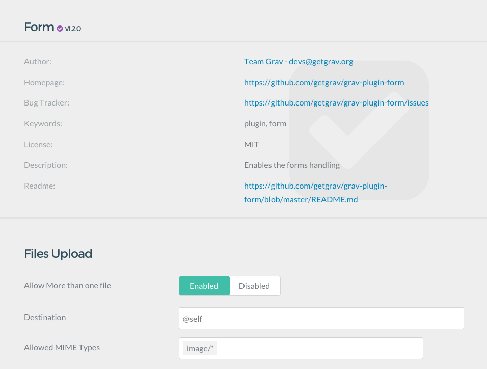
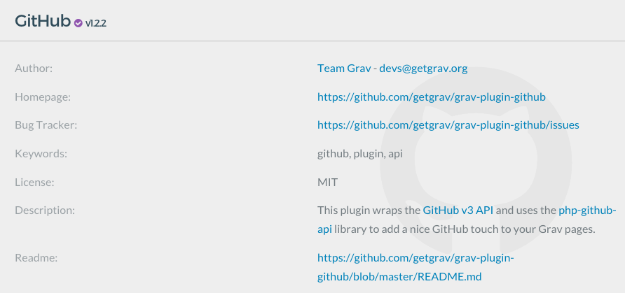
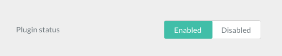

<h2 id="what-is-a-blueprint">ブループリントとは？</h2>

ブループリント（blueprint、青焼き図面、設計図）とは、Gravにとって重要なものです。テーマやプラグインとGravの管理パネルがやりとりするための根底にあるものです。ブループリントによって、Gravはテーマやプラグインが何であるかを知り、その名前や GitHub のどこにあるのかなどを知ります。また、Gravの管理パネル内でテーマやプラグインの設定オプションを生成します。

ブループリントは、YAML ファイルで書かれ、一般的に、form の定義と同じ書かれ方ができます。

ほとんどのGrav ユーザーは、ブループリントを編集することはありません。かんたんに言うと、プラグインやテーマがサイトのバックエンドでどのように現れるかを決定するものです。ほとんどのユーザーにとって、Gravの管理パネルを使ってテーマやプラグインの設定をしたり、主要なYAMLファイルのオプション操作をするのは、ここです。

ブループリントを扱うのは、開発者です。彼らは新しいテーマやプラグインを作り、バックエンドのリソースオプションをカスタマイズします。ブループリントは、強力なツールなので、リソースが何かや、Gravがどこでアップデートを探すか、どんなオプションが設定できるかなどを決定してくれます。

<h2 id="types-of-blueprints">ブループリントのタイプ</h2>

Gravでは、ブループリントを次のように使います：

- テーマとプラグインの情報を定義する
- テーマ/プラグインの設定オプションを管理プラグインに表示する
- 管理パネル画面中のページのフォームを定義する
- 管理パネルの Congiguration セクションのオプションに表示する内容を定義する
- フレックス・ディレクトリ/オブジェクトを定義する

ここで、ブループリントがGravでどのように機能するか、詳細を説明します。

<h4 id="themes-and-plugins">テーマとプラグイン</h4>

テーマやプラグインを使う時、慣例的に、パッケージに **blurprints.yaml** ファイルを入れます。これにより、Gravは管理プラグインに導入するリソースのメタデータを得ることができます。

**blueprints.yaml** ファイルは、あらゆるテーマやプラグインで重要です。GPM（Gravパッケージマネージャ）システムに不可欠です。GPMは、ユーザーにプラグインを使えるようにするため、ブループリントに入っている情報を使います。

[プラグインのブループリント例](./02.example-plugin-blueprint/) では、**アセット** プラグインのブループリントを詳しく見ていきます。このブループリントには、名前や、作者情報、キーワード、ホームページ、バグレポートリンク、その他のメタデータがセットされています。また、どこでプラグインアップデートを探せるかをGravシステムに教えるだけでなく、管理プラグインからアクセス可能で便利なリソースを提供します。

Once this information is given, further down in the Blueprint's page, you find forms information. This information creates the Admin Forms that are accessible by the user in the backend of Grav. For example, if you wanted to add a toggle that enables or disables a particular feature of that plugin, you would add it here.



The **blueprints.yaml** file works with the plugin's named YAML file (example: **assets.yaml**). The blueprint sets what the configurable options are, and the resource's self-named named YAML file sets their values. It's this named YAML file that is then duplicated to the Grav instance's `user/config` section to override these defaults either manually or through the Grav admin.

So essentially, when it comes to any configuration option for a theme or plugin, the **blueprints.yaml** file defines it, and the named YAML file for that resource tells you what it is set at.

<h4 id="pages">ページ</h4>

Grav Pages can really be anything. A page can be a blog listing, a blog post, a product page, an image gallery, etc.

What determines what a page should do and how it should appear is the **Page Blueprint**.

Grav provides some basic Page Blueprints: Default and Modular. Those are the two main building blocks of Grav.

Additional page Blueprints are added and set up by the theme, which might decide to add as many page Blueprints as possible, or focus on some particular Page blueprints focused on what it needs to do.

A Grav theme is much more flexible and powerful than what you might be used to on other platforms.

This allows themes to be application specific. For example, a theme might specialize in one of those goals:

- building a documentation site, like the one you are reading now.
- building an e-commerce site.
- build a blog.
- build a portfolio site.

A theme can also allow its users to build all of them, but usually a fine-tuned theme created for a single purpose can satisfy that goal better than a generic theme.

A page file is used by a page by setting its markdown file name, e.g. `blog.md`, `default.md` or `form.md`.

Each of those files will use a different page file. You can also change the file type by [using the template header property](https://learn.getgrav.org/content/headers#template).

The template used by a page not only determines the "look and feel" in the frontend, but also determines how the Admin Plugin will render it, allowing you to add options, select boxes, custom inputs and toggles.

How to do it: in your theme, add a `blueprints/` folder and add a YAML file with the name of the page template you added. For example if you add a `blog` page template, add a `blueprints/blog.yaml` file. You can find an [example of this directory in the **Antimatter** theme](https://github.com/getgrav/grav-theme-antimatter/tree/develop/blueprints).

<h2 id="components-of-a-blueprint">ブループリントのコンポーネント</h2>

There are two sets of information presented in a **blueprints.yaml** file. The first set of metadata information is the identity of the resource itself, the second set is about the forms. All this information is stored in a single **blueprints.yaml** file stored at the root of each plugin and theme.

Here is an example of the metadata portion of a **blueprints.yaml** file:

```yaml
name: GitHub
slug: github
type: plugin
version: 1.0.1
description: "This plugin wraps the [GitHub v3 API](https://developer.github.com/v3/) and uses the [php-github-api](https://github.com/KnpLabs/php-github-api/) library to add a nice GitHub touch to your Grav pages."
icon: github
author:
  name: Team Grav
  email: devs@getgrav.org
  url: https://getgrav.org
homepage: https://github.com/getgrav/grav-plugin-github
keywords: github, plugin, api
bugs: https://github.com/getgrav/grav-plugin-github/issues
license: MIT
```

As you can see here, this area contains a lot of general identifying information about the plugin, including its name, version number, description, author information, license, keywords, and URLs where you can find more information or report bugs. You can see this section in action in the screenshot taken from the Grav Admin below.



The next section is the forms area, which is just a couple spaces below the data listed above. This area of the blueprint generates forms and fields used to configure the plugin from the Grav Admin. Here is a quick example of this area of the **blueprints.yaml** file.

```yaml
form:
  validation: strict
  fields:
    enabled:
        type: toggle
        label: Plugin status
        highlight: 1
        default: 1
        options:
            1: Enabled
            0: Disabled
        validate:
            type: bool
```

This area of the file creates any administrative options accessible in the Grav Admin. In this particular instance, we have created a simple **Plugin Status** toggle which lets the user enable or disable the plugin from the admin (pictured below).



<h2 id="debugging-blueprints">ブループリントのデバッグ</h2>

ブループリントファイルにエラーがあると、予期せぬ結果を引き起こすかもしれません。

> [!Tip]  
> **TIP:** **CLIコマンド** で、 `bin/grav yamllinter` を実行すると、yaml ファイルのエラーレポートが取得できます。YAML ファイルを修正するときには、価値のある情報が得られるかもしれません。

