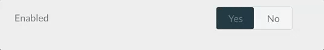

<h2 id="common-field-attributes">一般的なフィールドの属性</h2>

すべてのフィールドは、使用可能な属性のリストを受け入れます。  
それぞれのフィールドは、一般的な属性を共有できますが、特定のフィールドでは無視されることがあります。  
フィールドで、どの属性が許可されているかチェックする最良の方法は、このページのフィールドの説明を確認して、どの属性が言及されているかを確認することです。

以下のリストは、共通する事項なので、各フィールドの説明では繰り返しません。

| 属性 | 説明 |
| :----- | :----- |
| `autocomplete`      | `on` もしくは `off` を受け付けます |
| `autofocus`         | 有効化すると、フィールドでオートフォーカスします  |
| `classes`           | 文字列を受けて、CSS クラスを追加します  |
| `default`           | デフォルト値を設定します  |
| `disabled`          | フィールドを disabled 状態にします |
| `help`              | tooltip をフィールドに追加します  |
| `id`                | フィールドに　id を設定します。また、label に `for` 属性を設定します |
| `label`             | フィールドに label を設定します  |
| `display_label`     | `true` もしくは `false` を受け付けます  |
| `labelclasses`      | 文字列を受け取り、CSS クラスを追加します  |
| `sublabel`          | フィールドに sublabel を設定します  |
| `sublabelclasses`   | 文字列を受け取り、CSS クラスを追加します |
| `name`              | フィールドの name を設定します |
| `novalidate`        | フィールドを novalidate 状態にします |
| `outerclasses`      | label とそのフィールドを囲む div にクラスを追加します |
| `wrapper_classes`   | 説明とフィールドを含む wrapper にクラスを追加します  |
| `placeholder`       | placeholder の値を設定します  |
| `readonly`          | readonly 状態に設定します |
| `size`              | フィールドに size を設定します。この size は、コンテナにクラスとして追加されます。  `large` 、 `x-small` 、 `medium` 、 `long` 、 `small` が適切な値ですが、もちろんフロントエンドで利用する場合に使える別の値を追加することも可能です |
| `style`             | フィールドに style を設定します |
| `title`             | フィールドに title の値を設定します |
| `type`              | フィールドに type を設定します |
| `validate.required` | true などのポジティブな値を設定すると、必須項目になります |
| `validate.pattern`  | validation の pattern を設定します |
| `validate.message`  | validation が失敗したときのメッセージを設定します |

カスタム属性を追加することもできます：

```
attributes:
  key: value
```

カスタムの `data-*` 値を追加することもできます：

```
datasets:
  key: value
```

上記の `attributes` や、 `datasets` 定義は、次のようなフィールドになります：

```
<input name="data[name]" value="" type="text" class="form-input " key="value" data-key="value">
```

> [!Tip]  
> 注意： ポジティブな値は、複数の設定方法があります（`'on'` や、 `true` 、`1` など）。その他の値は、ネガティブな値として解釈されます。

---

<h2 id="available-fields">利用可能なフィールド</h2>

### Basic-Captcha Field

Forms プラグイン `7.0.0` で、 Google ReCaptcha フィールドのローカルでの代替として追加されました。  
このフィールドは、 Google の提供する GDPR 制限に惑わされたくない場合で、コンタクトフォームでのスパムを取り扱うときに、特に便利です。  
攻撃を阻止するため、 **OCR-耐性** のあるフォントを利用し、コピーするコードや、かんたんな算数の問題を設定できます。


`basic-captcha` フィールドタイプは、グローバルにも、フィールドごとにも、完全に設定可能です。  
グローバル設定は、 form の設定ファイル（通常は、 `user/config/plugins/form.yaml` ）で設定し、フィールドごとの設定は、フォーム内の独立した captcha フィールドでカスタマイズできます。

<h4 id="global-configuration">グローバル設定</h4>

デフォルトのグローバルオプションは：

```yaml
basic_captcha:
  type: characters            # options: [characters | math | dotcount | position]
  debug: false                # enable debug logging
  image:
    width: 135                # default image width (for math/dotcount/position types)
    height: 40                # default image height (for math/dotcount/position types)
    bg: '#ffffff'             # default background color
  chars:
    length: 6                 # number of chars to output
    font: zxx-xed.ttf         # options: [zxx-xed.ttf | zxx-sans.ttf | zxx-camo.ttf | zxx-noise.ttf]
    size: 24                  # font size in px
    box_width: 200            # image width for character captchas (overrides image.width)
    box_height: 70            # image height for character captchas (overrides image.height)
    start_x: 10               # start position in x direction in px
    start_y: 40               # start position in y direction in px
    bg: '#ffffff'             # background color for character captchas
    text: '#000000'           # text color (hex format)
  math:
    min: 1                    # smallest digit
    max: 12                   # largest digit
    operators: ['+','-','*']  # operators that can be used in math
```

<h4 id="field-level-configuration">フィールドレベルの設定</h4>

As of Forms `7.1.0`, you can override the global configuration on a per-field basis. This allows different forms to have different captcha styles, fonts, colors, and types.

! **Important**: Use `captcha_type` (not `type`) for the captcha type in field-level configuration to avoid conflict with the required `type: basic-captcha` field type declaration.

**Simple Example:**

[prism classes="language-yaml line-numbers"]
basic-captcha:
    type: basic-captcha
    placeholder: enter the characters
    label: Are you human?
[/prism]

**Advanced Example with Field-Level Configuration:**

```yaml
basic-captcha:
    type: basic-captcha
    placeholder: enter the characters
    label: Are you human?
    # Field-level configuration overrides global defaults
    captcha_type: characters        # use 'captcha_type' not 'type'
    chars:
        font: zxx-sans.ttf          # cleaner font
        size: 32                    # larger text
        length: 6                   # 6 characters
        box_width: 200              # wider image
        box_height: 70              # taller image
        bg: '#f0f8ff'               # light blue background
        text: '#0066cc'             # dark blue text
        start_x: 20                 # custom X position
        start_y: 50                 # custom Y position
```

**Math Captcha Example:**

```yaml
basic-captcha:
    type: basic-captcha
    placeholder: enter the answer
    label: Solve this math problem
    captcha_type: math              # math problem instead of characters
    math:
        min: 1                      # use small numbers
        max: 10
        operators: ['+','-']        # only addition and subtraction
```

#### Available Captcha Types

When using field-level configuration, set the captcha type with `captcha_type`:

- **`characters`** - Random character string (default)
- **`math`** - Simple math problem (e.g., "3 + 5 = ?")
- **`dotcount`** - Count dots of a specific color
- **`position`** - Identify position of a symbol

#### Available Fonts

The Basic-Captcha field includes four OCR-resistant fonts:

- **`zxx-xed.ttf`** - Default, balanced readability and security
- **`zxx-sans.ttf`** - Clean sans-serif, easier to read
- **`zxx-camo.ttf`** - Camouflage style, more challenging
- **`zxx-noise.ttf`** - Noisy style, highest security

#### Configuration Options Reference

| Option | Type | Default | Description |
|--------|------|---------|-------------|
| `captcha_type` | string | `characters` | Type of captcha: `characters`, `math`, `dotcount`, or `position` |
| `chars.font` | string | `zxx-xed.ttf` | Font file for character captchas |
| `chars.size` | int | `24` | Font size in pixels |
| `chars.length` | int | `6` | Number of characters to generate |
| `chars.box_width` | int | `200` | Image width for character captchas |
| `chars.box_height` | int | `70` | Image height for character captchas |
| `chars.bg` | string | `#ffffff` | Background color (hex) for character captchas |
| `chars.text` | string | `#000000` | Text color (hex) |
| `chars.start_x` | int | `10` | Starting X position for text |
| `chars.start_y` | int | `40` | Starting Y position for text |
| `math.min` | int | `1` | Minimum number in math problems |
| `math.max` | int | `12` | Maximum number in math problems |
| `math.operators` | array | `['+','-','*']` | Available operators |
| `image.width` | int | `135` | Default image width (non-character types) |
| `image.height` | int | `40` | Default image height (non-character types) |
| `image.bg` | string | `#ffffff` | Default background color |

#### Form Processing

これは、フォームのバリデーションが適切に行われるために、`process:` とも適合している必要があります。

> [!Note]  
> もし captcha が失敗していたときに、フォームのプロセスがきちんと止まるようにするため、フォームの `process:` の中で、これが最初のエントリーでなければいけません。

具体例：

```yaml
process:
    basic-captcha:
        message: Humanity verification failed, please try again...
```

### Turnstile Captcha Field (Cloudflare)

Form プラグイン `v7.1.0` から、新しく Cloudflare 社の Turnstile フィールドをサポートしました。  
このフィールドは、フォームの SPAM 除けの新しい方法です。  
Google ReCaptcha フィールドと、 Google からの **GDPR** 規制の代替となる素晴らしいものです。  
このフィールドは、コンタクトフォームで SPAM を取り扱うときに特に便利です。  
[Turnstile については、こちらを参照してください](https://blog.cloudflare.com/turnstile-private-captcha-alternative/) 

<h5 id="advantages-over-google-recaptcha">Google ReCaptcha よりも優れている点</h5>

1. GDPR に準拠し、ユーザーのプライバシーを重視している
2. 検証が極めて速い
3. Cloudflare と Grav の両方で、実装がとても簡単で、複雑な UI やパラメータを設定する必要がない
4. 非同期のフォーム送信 (ajax) のための派手な追加コードが不要で、そのまま動く!
5. ReCaptcha と比べて、ユーザー体験が良い。車や信号機を数えたり、その他のナンセンスなことをしなくて済む
6. 機械学習の上に構築されているので、時間の経過とともに改良され、新しい攻撃にも適応する
7. チャレンジの効果を徹底的に分析できる。 [スクリーンショットを見てください](https://blog.cloudflare.com/content/images/2022/09/image1-64.png)


<h5 id="integration">統合</h5>

Grav のフォームを Turnstile と統合する前に、まずは [Turnstile サイトを新しく作らなければいけません](https://dash.cloudflare.com/?to=/:account/turnstile) 。  
そして、 [公式の "get started" チュートリアル](https://developers.cloudflare.com/turnstile/get-started/) も進めてください。
ここで、 widget のタイプを選べます。  
`managed` か、`non-interactive` か、 `invisible` のいずれかです。  
重要な注意点として、 widget のタイプは Cloudflare からのみ変更できます。  
Grav からは設定できません。  
しかし、ある選択が良くなかったとき、必要に応じて、後で変更は可能です。  
[widget タイプの違いについて、より詳しくはCloudflareで学んでください](https://developers.cloudflare.com/turnstile/reference/widget-types/) 

> [!Note]  
> Turnstile フィールドを使うかもしれないドメインはすべて、忘れずに追加してください。これには、あなたのローカル環境も含まれます。

一度サイトを作成すると、`site_key` と `site_secret` が与えられます。  
これらはフォームの設定ファイル（通常は、`user/config/plugins/form.yaml` ）から設定するのに必要なものです。  
Grav が処理するので、提案されたスクリプトタグは無視して構いません。

デフォルトのオプションは、以下のとおりです：

```yaml
turnstile:
  theme: light
  site_key: <Your Turnstile Site Key>
  secret_key: <Your Turnstile Secret Key>
```

最後に、ここでもまた、バリデーションが適切に行われたことを確認するため、`process:` 要素との整合が必要になります。

> [!Note]  
> キャプチャのバリデーションが失敗したとき、フォームの処理が実行されないように、キャプチャの整合確認は、`process:` セクションの最初になければいけません。

<h5 id="example">具体例</h5>

コンタクトフォームの典型的な例は、以下のようになります。

```yaml
form:
  name: contact
  fields:
    name:
      label: Name
      type: text
      validate:
        required: true
    email:
      label: Email
      type: email
      validate:
        required: true
    message:
      label: Message
      type: textarea
      validate:
        required: true
    captcha:
        type: turnstile
        theme: light
  buttons:
    submit:
      type: submit
      value: Submit
  process:
    turnstile: true
    email:
      subject: "[Acme] {{ form.value.name|e }}"
      reply_to: "{{ form.value.name|e }} <{{ form.value.email }}>"
    message: Thanks for contacting us!
    reset: true
    display: '/'
```


### Google Captcha Field (ReCaptcha)

`captcha` フィールドタイプは、 Google reCAPTCHA 要素をフォームに追加するために使われます。  
他の要素と違い、1つのフォームに1回だけ使えます。

> [!Note]  
> Google reCAPTCHA の設定は、 [reCAPTCHA Admin Console](https://www.google.com/recaptcha/admin) で設定してください。

バージョン `3.0` から、このフィールドは、 reCAPTCHA の3つのバリエーションをサポートしています。  
reCAPTCHA の全体的な設定は、グローバルなフォームの設定ファイル (通常は `user/config/plugins/form.yaml`) で行うのが最適です。  
デフォルトのオプションは、次の通りです:

```yaml
recaptcha:
  version: 2-checkbox
  theme: light
  site_key:
  secret_key:
```

これらのオプションは、以下のように設定してください:

| キー | 値 |
| :----- | :----- |
| version | デフォルトは、 `2-checkbox` ですが、 `2-invisible` や `3` にもできます |
| theme | デフォルトは、 `light` ですが、 `dark` にもできます (現在、 `2-x` バージョンでのみ機能します) |
| site_key | あなたの Google Site Key  |
| secret_key | あなたの Google Secret Key |

> [!Info]  
> サイトのドメインが、 Google の reCAPTCHA 設定のリストに入っていることを確認してください。

フォーム定義では、 captcha フィールドの `name` 属性は、 `g-recaptcha-response` でなければいけません。  
というのも、 Google reCAPTCHA は、 Captcha 設定コードを `g-recaptcha-response` に保存するからです。

具体例：

```yaml
g-recaptcha-response:
  type: captcha
  label: Captcha

```

失敗したときの `recaptcha_not_validated` カスタムメッセージを提供することもできます。  
カスタムメッセージがなければ、 Form プラグインのデフォルトのものが提供されます。  
`recaptcha_site_key` を、サイト全体ではなく、フォームごとに設定したい場合は、そのようにもできます。

```yaml
g-recaptcha-response:
  type: captcha
  label: Captcha
  recaptcha_site_key: ENTER_YOUR_CAPTCHA_PUBLIC_KEY
  recaptcha_not_validated: 'Captcha not valid!'
```

| 属性                 | 説明                                     |
| :-----                    | :-----                                          |
| `recaptcha_site_key`      | Google reCAPTCHA の Site Key (オプション)  |
| `recaptcha_not_validated` | captcha に失敗したときに表示されるメッセージ |

| 利用可能な一般属性                      |
| :-----                                         |
| [help](#common-fields-attributes)              |
| [label](#common-fields-attributes)             |
| [name](#common-fields-attributes)              |
| [outerclasses](#common-fields-attributes)      |
| [validate.required](#common-fields-attributes) |

このフィールドも、フォームが適切にバリデーションされたことを確認するため、 `process:` 要素と整合する必要があります。

> [!Note]  
> ReCaptcha のバリデーションが失敗したとき、フォームの処理が実行されないように、キャプチャの整合確認は、`process:` セクションの最初になければいけません。

具体例：

```yaml
process:
    captcha: true
```

<h5 id="server-side-captcha-validation">サーバーサイドのキャプチャのバリデーション</h5>

上記のコードは、 Captcha をフロントエンドでバリデーションし、正しくない場合は送信しないようにします。  
サーバーサイドでも captcha をバリデーションするには、フォームに captcha process アクションを追加してください。

```yaml
  process:
    captcha: true
```

オプションの成功 `message` を提供することもできます。  
提供されない場合は、成功時に何もメッセージは表示されません。  
`recaptcha_secret` を、サイト全体ではなく、フォームごとに設定したい場合は、そのようにもできます。

```yaml
  process:
    captcha:
      recaptcha_secret: ENTER_YOUR_CAPTCHA_SECRET_KEY
      message: 'Successfully passed reCAPTCHA!'
```

アクション内の処理を知るには、 [コンタクトフォームの具体例をみてください](../03.example-form/) 。

---

### Checkbox Field


`checkbox` フィールドタイプは、ひとつのチェックボックスをフォームに追加します。

具体例：

```yaml
agree_to_terms:
  type: checkbox
  label: "Agree to the terms and conditions"
  validate:
      required: true
```

| 利用可能な一般属性                      |
| :-----                                         |
| [autofocus](#common-fields-attributes)         |
| [classes](#common-fields-attributes)           |
| [default](#common-fields-attributes)           |
| [disabled](#common-fields-attributes)          |
| [id](#common-fields-attributes)                |
| [label](#common-fields-attributes)             |
| [name](#common-fields-attributes)              |
| [novalidate](#common-fields-attributes)        |
| [outerclasses](#common-fields-attributes)      |
| [size](#common-fields-attributes)              |
| [style](#common-fields-attributes)             |
| [validate.required](#common-fields-attributes) |
| [validate.pattern](#common-fields-attributes)  |
| [validate.message](#common-fields-attributes)  |

---

### Checkboxes Field


`checkboxes` フィールドタイプは、チェックボックスのグループをフォームに追加します。

具体例：

```yaml
pages.process:
    type: checkboxes
    label: PLUGIN_ADMIN.PROCESS
    help: PLUGIN_ADMIN.PROCESS_HELP
    default:
        markdown: true
        twig: true
    options:
        markdown: Markdown
        twig: Twig
    use: keys
```

```yaml
my_field:
    type: checkboxes
    label: A couple of checkboxes with help for each option and option1 disabled
    default:
        - option1
        - option2
    options:
        option1: Option 1
        option2: Option 2
    help_options:
        option1: Help for Option 1
        option2: Help for Option 2
    disabled_options:
        - option1
```


| 属性 | 説明   |
| :-----    | :-----  |
| `use`     | `keys` を設定すると、チェックボックスは、フォームの送信時に要素の key の値を保存します。そうでない場合は、要素の値を使います |
| `options` | key-value 形式の利用可能な選択肢の配列 |
| `help_options` | `options` で定義したそれぞれの選択肢のヘルプの key-value 形式の配列 |
| `disabled_options` | disabled 状態で表示する選択肢のリスト |

| 利用可能な一般属性                      |
| :-----                                         |
| [autofocus](#common-fields-attributes)         |
| [classes](#common-fields-attributes)           |
| [default](#common-fields-attributes)           |
| [disabled](#common-fields-attributes)          |
| [help](#common-fields-attributes)              |
| [id](#common-fields-attributes)                |
| [label](#common-fields-attributes)             |
| [name](#common-fields-attributes)              |
| [outerclasses](#common-fields-attributes)      |
| [size](#common-fields-attributes)              |
| [style](#common-fields-attributes)             |
| [validate.required](#common-fields-attributes) |
| [validate.pattern](#common-fields-attributes)  |
| [validate.message](#common-fields-attributes)  |

> [!Info]  
> 注意： checkboxes フィールドは、`remember` プロセスアクションはサポートしません。

---

### Conditional Field

`conditional` フィールドタイプは、条件によっては表示されるフィールドです。

具体例：

すでに `true` もしくは `false` で条件が決まった場合、以下のようなシンプルなフォーマットが使えます：

```yaml
my_conditional:
  type: conditional
  condition: config.plugins.yourplugin.enabled
  fields: # The field(s) below will be displayed only if the plugin named yourplugin is enabled
    header.mytextfield:
      type: text
      label: A text field
```

しかし、より複雑な条件を要するなら、`true` もしくは `false` を文字列で返すロジックを実行できます。  
そしてこのフィールドはそのことも理解します。

```yaml
my_conditional:
  type: conditional
  condition: "config.site.something == 'custom'"
  fields: # The field(s) below will be displayed only if the `site` configuration option `something` equals `custom`
    header.mytextfield:
        type: text
        label: A text field
```

| 属性   | 説明  |
| :----- | :-----  |
| `condition` | Twig で評価される条件。Twig から利用可能な変数であれば、評価できます |

| 利用可能な一般属性             |
| :-----                                |
| [disabled](#common-fields-attributes) |
| [id](#common-fields-attributes)       |
| [label](#common-fields-attributes)    |
| [name](#common-fields-attributes)     |

---

### Date Field


`data` フィールドタイプは、HTML5 の `data` の input フィールドです。

具体例：

```yaml
-
  type: date
  label: Enter a date
  validate.min: "2014-01-01"
  validate.max: "2018-12-31"
```

| 属性      | 説明     |
| :-----         | :-----  |
| `validate.min` | `min` 属性を設定します（次を見てください： [http://html5doctor.com/the-woes-of-date-input/#feature-min-max-attributes](http://html5doctor.com/the-woes-of-date-input/#feature-min-max-attributes) |
| `validate.max` | `max` 属性を設定します（次を見てください： [http://html5doctor.com/the-woes-of-date-input/#feature-min-max-attributes](http://html5doctor.com/the-woes-of-date-input/#feature-min-max-attributes) |

| 利用可能な一般属性                      |
| :-----                                         |
| [autofocus](#common-fields-attributes)         |
| [classes](#common-fields-attributes)           |
| [default](#common-fields-attributes)           |
| [disabled](#common-fields-attributes)          |
| [help](#common-fields-attributes)              |
| [id](#common-fields-attributes)                |
| [label](#common-fields-attributes)             |
| [name](#common-fields-attributes)              |
| [novalidate](#common-fields-attributes)        |
| [outerclasses](#common-fields-attributes)      |
| [readonly](#common-fields-attributes)          |
| [size](#common-fields-attributes)              |
| [style](#common-fields-attributes)             |
| [title](#common-fields-attributes)             |
| [validate.required](#common-fields-attributes) |
| [validate.pattern](#common-fields-attributes)  |
| [validate.message](#common-fields-attributes)  |

---

### Display Field


`display` フィールドタイプは、フォーム内でテキストや説明書きを表示するために使われます。  
マークダウンコンテンツを受け付けます。

具体例：


```yaml
test:
    type: display
    size: large
    label: Instructions
    markdown: true
    content: "This is a test of **bold** and _italic_ in a text/display field\n\nanother paragraph...."
```

| 属性  | 説明                                                         |
| :-----     | :-----                                                              |
| `markdown` | コンテンツフィールドでマークダウン処理を有効化するかどうかの真偽値 |
| `content`  | 表示するテキストコンテンツ |

| 利用可能な一般属性                 |
| :-----                                    |
| [help](#common-fields-attributes)         |
| [id](#common-fields-attributes)        |
| [label](#common-fields-attributes)        |
| [name](#common-fields-attributes)         |
| [id](#common-fields-attributes)           |
| [outerclasses](#common-fields-attributes) |
| [size](#common-fields-attributes)         |
| [style](#common-fields-attributes)        |

---

### Email Field


`email` フィールドタイプは、 [HTML5 の email input](http://html5doctor.com/html5-forms-input-types/#input-email) を使い、Eメールを受け付ける入力欄を表示します。

> [!Info]  
> Eメールは、大文字と小文字を区別しないように設計されています。アプリケーションロジックを書くときは、大文字、小文字、それらの混在を適切に扱ってください。

具体例：

```yaml
header.email:
  type: email
  autofocus: true
  label: Email
```

| 属性 | 説明     |
| :----- | :----- |
| `minlength` | 最小文字数 |
| `maxlength`  | 最大文字数 |
| `validate.min` | minlength と同じ |
| `validate.max`  | maxlength と同じ |

| 利用可能な一般属性                      |
| :-----                                         |
| [autofocus](#common-fields-attributes)         |
| [classes](#common-fields-attributes)           |
| [default](#common-fields-attributes)           |
| [disabled](#common-fields-attributes)          |
| [help](#common-fields-attributes)              |
| [id](#common-fields-attributes)                |
| [label](#common-fields-attributes)             |
| [name](#common-fields-attributes)              |
| [novalidate](#common-fields-attributes)        |
| [outerclasses](#common-fields-attributes)      |
| [readonly](#common-fields-attributes)          |
| [size](#common-fields-attributes)              |
| [style](#common-fields-attributes)             |
| [title](#common-fields-attributes)             |
| [validate.required](#common-fields-attributes) |
| [validate.pattern](#common-fields-attributes)  |
| [validate.message](#common-fields-attributes)  |

---

### File Field

`file` フィールドタイプにより、ユーザーはフォームからファイルをアップロードできるようになります。  
デフォルトでは、 **画像** タイプの **1つのファイル** のみを許容し、フォームが表示されている **現在の** ページにアップロードされます。

```yaml
# Default settings
my_files:
  type: file
  multiple: false
  destination: 'self@'
  accept:
    - image/*
```

| 属性     | 説明  |
| :-----        | :----- |
| `multiple`    | `true` もしくは `false` 。**true** を設定すると、一度に複数ファイルが選択できます |
| `destination` | **@self** もしくは **@page:/route** 、 **local/rel/path/** もしくは PHPストリームを受け付けます。<br> **@self** を設定すると、フォームが宣言された（現在の .md ）フォルダにアップロードされます。<br> **@page:/route** を使うと、そのルーティングページが存在すれば、そこににアップロードされます。（例： **@page:/blog/a-blog-post** ）<br> **'local/rel/path'** を設定すると、Grav のルートディレクトリからの相対パスでどこでも保存できます。たとえば、`user/images/uploads` などです。path が存在しなければ、作成されます。このため、書き込み権限があることを確認してください。<br> これ以外にも、Grav が認識できる適切な PHPストリームに設定可能です。たとえば： `user-data://my-form` や、 `theme://media/uploads` などです。 |
| `accept`      | 受け取れる MIME タイプの配列を渡します。たとえば、gif 画像と mp4 ファイルのみを受け付ける場合： `accept: ['image/gif', 'video/mp4']` |

> [!Tip]  
> 管理プラグインでの File fields は少し違いがあり、フォームからアップロードされたファイルの削除もできます。なぜなら、管理パネルでのユースケースは、アップロードした後、ファイルをデータ項目に紐付けることだからです。

| 利用可能な一般属性                      |
| :-----                                         |
| [help](#common-fields-attributes)              |
| [label](#common-fields-attributes)             |
| [name](#common-fields-attributes)              |
| [outerclasses](#common-fields-attributes)      |

デフォルトでは、管理パネルでは、フィールド定義で、`avoid_overwriting` を `true` にしておかない限り、 `file` フィールドは同じフォルダに同じ名前のファイルがアップロードされると、上書きします。

---

### FilePond Field

Forms プラグイン `7.0.0` で追加された `filepond` フィールドは、 File フィールドの代替となるモダンな技術で、 [FilePond JavaScript library](https://pqina.nl/filepond/) により作成されています。  
これにより、ドラッグアンドドロップによるアップロードや、画像プレビュー、組み込みの画像編集（切り取り、リサイズ、回転）、そしてスムーズなアニメーションによる、より良いユーザー体験が提供されます。

**FilePond を使う場面:**

- プレビューと画像編集機能が必要な画像重視のフォーム
- ドラッグアンドドロップによるモダンな UI 機能
- アップロード前に、クライアントサイドでの画像最適化が必要なフォーム
- 古いブラウザをサポートするよりも、ユーザー体験を重視するプロジェクト

**File フィールド（Dropzone）を使う場面:**

- 一般的なファイルアップロード（画像ファイル以外）
- 画像編集が不要なシンプルな実装
- 古いブラウザの機能へ対応が必要

<h4 id="basic-usage">基本的な使い方</h4>

```yaml
my_images:
    type: filepond
    label: Upload Images
    destination: user/media/uploads
    multiple: true
    limit: 5
    filesize: 10
    accept:
        - image/*
```

<h4 id="configuration-options">オプション設定</h4>

| 属性 | 説明 |
| :-------- | :---------- |
| `multiple` | 真偽値。 `true` のとき、複数ファイルを同時に選択できます（デフォルト: `false`） |
| `limit` | 整数値。 フィールドごとに許容する最大ファイル数 （デフォルト: `10`） |
| `destination` | アップロード先。オプション:<br>• `@self` - 現在のページにアップロード<br>• `@page:/route` - 特定のページルーティング先にアップロード<br>• `user/path/to/folder` - Grav のルートディレクトリからの相対パス<br>• PHP streams のような `user-data://uploads` |
| `filesize` | 整数値。 MB単位の最大ファイルサイズ。 `0` は無制限を意味し、サーバーの制限値によります。 (デフォルト: `0`) |
| `accept` | 許可する MIME types/extensions の配列。例えば:<br>• `['image/*']` - すべての画像<br>• `['image/jpeg', 'image/png']` - 特定のタイプ<br>• `['application/pdf']` - PDF |
| `avoid_overwriting` | 真偽値。 `true` のとき、上書きを防ぐために日付プレフィックスを追加します (デフォルト: `false`) |
| `random_name` | 真偽値。 `true` のとき、アップロード時にランダムなファイル名を生成します (デフォルト: `false`) |
| `validate.required` | 真偽値。フィールドを required （入力必須）にします (デフォルト: `false`) |

<h4 id="image-transform-resize-options">画像変形とリサイズオプション</h4>

FilePond では、 `filepond` 設定キーにより、パワフルな画像処理機能を使えます:

```yaml
my_images:
    type: filepond
    label: Upload and Edit Images
    destination: user/media/uploads
    multiple: true
    filesize: 10
    accept:
        - image/jpeg
        - image/png
        - image/webp
    filepond:
        # Output Format
        allowImageTransform: true
        imageTransformOutputMimeType: 'image/jpeg'
        imageTransformOutputQuality: 85
        imageTransformOutputStripImageHead: true

        # Resize Settings
        allowImageResize: true
        imageResizeTargetWidth: 1024
        imageResizeTargetHeight: 768
        imageResizeMode: 'contain'
        imageResizeUpscale: false

        # Crop Settings
        allowImageCrop: true
        imageCropAspectRatio: '16:9'

        # Preview Settings
        allowImagePreview: true
        imagePreviewHeight: 256

        # UI Customization
        stylePanelLayout: 'compact'
        labelIdle: '<span class="filepond--label-action">Browse</span> or drop images'
```

<h4 id="filepond-specific-options-reference">FilePond 特有のオプションのリファレンス</h4>


| オプション | タイプ | デフォルト | 説明 |
| :----- | :--- | :------ | :---------- |
| **画像変形** | | | |
| `allowImageTransform` | boolean | `true` | アップロード前に画像の変形を許可 |
| `imageTransformOutputMimeType` | string | `image/jpeg` | 出力フォーマット: `image/jpeg`, `image/png`, `image/webp` |
| `imageTransformOutputQuality` | int | `90` | 出力の画質 0-100 (JPEG/WebP のみ) |
| `imageTransformOutputStripImageHead` | boolean | `true` | 画像から EXIF メタデータを削除 |
| **画像リサイズ** | | | |
| `allowImageResize` | boolean | `true` | 自動で画像リサイズを許可 |
| `imageResizeTargetWidth` | int | `null` | リサイズする目標ピクセル幅 (null = リサイズしない) |
| `imageResizeTargetHeight` | int | `null` | リサイズする目標ピクセル高さ (null = リサイズしない) |
| `imageResizeMode` | string | `cover` | リサイズモード: `cover` (切り取って合わせる), `contain` (含まれるように合わせる), `force` (強制リサイズ) |
| `imageResizeUpscale` | boolean | `false` | 元画像より目標サイズが大きいときに大きいリサイズを許可する |
| **画像切り取り** | | | |
| `allowImageCrop` | boolean | `true` | プレビューに切り取りツールを許可 |
| `imageCropAspectRatio` | string | `null` | 次のようなアスペクト比 `16:9`, `4:3`, `1:1`, もしくは自由切り取りの `null` |
| **プレビュー** | | | |
| `allowImagePreview` | boolean | `true` | 編集ツールとともにプレビュー画像を表示 |
| `imagePreviewHeight` | int | `256` | プレビューパネルのピクセル高さ |
| **UI とスタイル** | | | |
| `stylePanelLayout` | string | `compact` | パネルのレイアウトスタイル |
| `styleLoadIndicatorPosition` | string | `center bottom` | ローディング表示の場所 |
| `styleProgressIndicatorPosition` | string | `center bottom` | 読み込み表示バーの場所 |
| `styleButtonRemoveItemPosition` | string | `right` | 削除ボタンの場所 |
| **ラベル** | | | |
| `labelIdle` | string | `Browse or drop files` | メインのドロップゾーンのラベル (HTML タグをサポート) |
| `labelFileTypeNotAllowed` | string | `Invalid file type` | ファイルのタイプが間違っていた場合のエラーメッセージ |
| `labelFileSizeNotAllowed` | string | `File is too large` | ファイルサイズがオーバーしたときのエラーメッセージ |

<h4 id="complete-form-example">完全なフォームの例</h4>

```txt
---
title: 'Photo Upload Form'
form:
    id: photo-upload
    xhr_submit: true
    fields:
        photos:
            type: filepond
            label: Upload Your Photos
            help: Upload up to 5 photos. They will be automatically resized to 1920x1080.
            destination: user/media/galleries
            multiple: true
            limit: 5
            filesize: 15
            accept:
                - image/jpeg
                - image/png
                - image/webp
            validate:
                required: true
            filepond:
                # Optimize images for web
                imageTransformOutputMimeType: 'image/jpeg'
                imageTransformOutputQuality: 85
                imageTransformOutputStripImageHead: true

                # Resize to HD
                allowImageResize: true
                imageResizeTargetWidth: 1920
                imageResizeTargetHeight: 1080
                imageResizeMode: 'contain'

                # Force 16:9 crop
                allowImageCrop: true
                imageCropAspectRatio: '16:9'

                # Custom label
                labelIdle: '<span class="filepond--label-action">Click to browse</span> or drag photos here'

    buttons:
        submit:
            type: submit
            value: Upload Photos

    process:
        upload: true
        message: 'Thank you! Your photos have been uploaded successfully.'
        reset: true
---

# Photo Gallery Upload

Upload your photos and they will be automatically optimized and resized.
```

#### Form Processing

FilePond フィールドは、アップロードされたファイルを保存するため、 `upload` プロセスアクションが必要です:

```yaml
process:
    upload: true
    message: 'Files uploaded successfully!'
```

ファイルは、 AJAX 経由で処理され、特定の `destination` フォルダへ保存されます。  
画像変形（リサイズ、切り取り、フォーマット変更）は、ブラウザ内でアップロード前に実行され、サーバー読み込みとアップロード時間が短縮されます。

#### XHR Form Integration

FilePond は、 AJAX フォーム送信（`xhr_submit: true`） にもシームレスに対応します。  
このフィールドは、自動的に以下を行います:

- ファイルのアップロード中はフォームの送信をしないようにします
- フォームの更新後に再度初期化します
- バリデーションエラー中も、アップロードされたファイルを保持します
- 送信が成功したら一時ファイルをクリーンアップします

<h4 id="features-summary">機能の要点</h4>

- **モダンなドラッグアンドドロップのインターフェース** - スムーズなアニメーションと視覚的なフィードバック
- **画像プレビュー** - アップロード前に、画像をズームしたり移動したりできる
- **組み込みの画像編集** - 画像の切り取り、リサイズ、回転をブラウザ上でできる
- **クライアントサイドの最適化** - アップロード前にファイルサイズを削減できる
- **フォーマット変更** - 画像を JPEG/PNG/WebP に変換できる
- **リアルタイムのバリデーション** - ファイルのタイプとサイズのバリデーションを即座にフィードバックできる
- **進捗表示** - ファイルごとにアップロード処理の進捗バーを表示できる
- **複数ファイルに対応** - ひとつのフィールドでいくつかのファイルをアップロードできる
- **レスポンシブデザイン** - デスクトップでも、タブレットでも、モバイルデバイスでも機能する
- **アクセシビリティ** - キーボードナビゲーション及びスクリーンリーダー対応

<h4 id="comparison-with-file-field">File Field との比較</h4>

| 機能 | FilePond | File (Dropzone) |
| :------ | :------- | :-------------- |
| 画像プレビュー | ✅ ズーム/移動可能 | ✅ サムネイルのみ |
| 画像編集 | ✅ 切り取り, リサイズ, 回転 | ❌ 無し |
| 画像最適化 | ✅ クライアントサイド | ❌ サーバサイドのみ |
| フォーマット変換 | ✅ JPEG/PNG/WebP | ❌ 無し |
| ドラッグ & ドロップ | ✅ モダンな UI | ✅ クラシックな UI |
| ファイルタイプのバリデーション | ✅ 即時 | ✅ アップロード時 |
| 複数ファイル | ✅ 可能 | ✅ 可能 |
| XHR フォーム対応 | ✅ 自動対応 | ✅ config の設定が必要 |
| 何に最適か | 画像 & UX | 普通のファイル |

| 利用可能な一般属性 |
| :-----  |
| [help](#common-fields-attributes)              |
| [label](#common-fields-attributes)             |
| [name](#common-fields-attributes)              |
| [outerclasses](#common-fields-attributes)      |
| [validate](#common-fields-attributes)          |

---

### Hidden Field

`hidden` フィールドタイプは、フォームに hidden 要素を追加します。

具体例：

```yaml
header.some_field:
  type: hidden
  default: my-value
```

| 属性 | 説明  |
| :-----    | :----- |
| `name`    | フィールド名です。もし書き忘れた場合、要素の定義フィールドの名前になります（上の例では： `header.some_field` ）|
| `evaluate` | `page.title` のような変数を、値として使えるようにするため、この値を `true` にする必要がある |

| 利用可能な一般属性            |
| :-----                               |
| [default](#common-fields-attributes) |

---

### Honeypot Field

`honeypot` フィールドタイプは、入力されるとエラーを返す hidden フィールドを作ります。  
入力を埋めて送信するだけのボットへの対策として便利です。

具体例：

```yaml
fields:
    honeypot:
      type: honeypot
```

上記は、単純なテキストフィールドで、フロントエンドには表示されません。  
ボットは、コードを探索し、自動で入力欄を埋めるので、このフィールドも埋めてしまいます。  
エラーにより、フォームは正しく送信されません。  
エラーは、メッセージブロックの上部ではなく、フォーム要素の次に表示されます。

honeypot は、captcha フィールドの代替として人気です。

---

### Ignore Field

`ignore` フィールドタイプは、他のブループリントから拡張されたときに、不使用のフィールドを削除します。

具体例：

```yaml
header.process:
  type: ignore
content:
  type: ignore
```

---

### Number Field

`number` フィールドタイプは、 [HTML5 の number input](http://html5doctor.com/html5-forms-input-types/#input-number) を使い、数字のみを受け付ける入力欄を表示します。

具体例：

```yaml
header.count:
  type: number
  label: 'How Much?'
  validate:
    min: 10
    max: 360
    step: 10
```

| 属性 | 説明    |
| :----- | :-----  |
| `validate.min` | 最小値 |
| `validate.max`  | 最大値 |
| `validate.step`  | 増減の step |

| 利用可能な一般属性                      |
| :-----                                         |
| [autofocus](#common-fields-attributes)         |
| [classes](#common-fields-attributes)           |
| [default](#common-fields-attributes)           |
| [disabled](#common-fields-attributes)          |
| [help](#common-fields-attributes)              |
| [id](#common-fields-attributes)                |
| [label](#common-fields-attributes)             |
| [name](#common-fields-attributes)              |
| [novalidate](#common-fields-attributes)        |
| [outerclasses](#common-fields-attributes)      |
| [readonly](#common-fields-attributes)          |
| [size](#common-fields-attributes)              |
| [style](#common-fields-attributes)             |
| [title](#common-fields-attributes)             |
| [validate.required](#common-fields-attributes) |
| [validate.pattern](#common-fields-attributes)  |
| [validate.message](#common-fields-attributes)  |

---

### Password Field

`password` フィールドタイプは、パスワード入力欄を表示します。

具体例：

```yaml
password:
  type: password
  label: Password
```

| 利用可能な一般属性                      |
| :-----                                         |
| [autofocus](#common-fields-attributes)         |
| [classes](#common-fields-attributes)           |
| [default](#common-fields-attributes)           |
| [disabled](#common-fields-attributes)          |
| [help](#common-fields-attributes)              |
| [id](#common-fields-attributes)                |
| [label](#common-fields-attributes)             |
| [name](#common-fields-attributes)              |
| [novalidate](#common-fields-attributes)        |
| [outerclasses](#common-fields-attributes)      |
| [readonly](#common-fields-attributes)          |
| [size](#common-fields-attributes)              |
| [style](#common-fields-attributes)             |
| [title](#common-fields-attributes)             |
| [validate.required](#common-fields-attributes) |
| [validate.pattern](#common-fields-attributes)  |
| [validate.message](#common-fields-attributes)  |

---

### Radio Field


ラジオボタンのひと組を表示します

具体例：

```yaml
my_choice:
  type: radio
  label: Choice
  default: markdown
  options:
      markdown: Markdown
      twig: Twig
```

| 属性 | 説明                                         |
| :-----    | :-----                                              |
| `options` | key-value の選択肢の配列 |

| 利用可能な一般属性                      |
| :-----                                         |
| [default](#common-fields-attributes)           |
| [disabled](#common-fields-attributes)          |
| [help](#common-fields-attributes)              |
| [id](#common-fields-attributes)                |
| [label](#common-fields-attributes)             |
| [name](#common-fields-attributes)              |
| [outerclasses](#common-fields-attributes)      |
| [validate.required](#common-fields-attributes) |
| [validate.pattern](#common-fields-attributes)  |
| [validate.message](#common-fields-attributes)  |

---

### Range Field


[input type="range"](http://html5doctor.com/html5-forms-input-types/#input-range) を表示します。

具体例：

```yaml
header.choose_a_number_in_range:
  type: range
  label: Choose a number
  validate:
    min: 1
    max: 10
```

| 利用可能な一般属性                      |
| :-----                                         |
| [autofocus](#common-fields-attributes)         |
| [classes](#common-fields-attributes)           |
| [default](#common-fields-attributes)           |
| [disabled](#common-fields-attributes)          |
| [help](#common-fields-attributes)              |
| [id](#common-fields-attributes)                |
| [label](#common-fields-attributes)             |
| [name](#common-fields-attributes)              |
| [novalidate](#common-fields-attributes)        |
| [outerclasses](#common-fields-attributes)      |
| [readonly](#common-fields-attributes)          |
| [size](#common-fields-attributes)              |
| [style](#common-fields-attributes)             |
| [title](#common-fields-attributes)             |
| [validate.required](#common-fields-attributes) |
| [validate.pattern](#common-fields-attributes)  |
| [validate.message](#common-fields-attributes)  |

---

### Section Field

ページをセクションに分けます。

具体例：

```yaml
content:
    type: section
    title: PLUGIN_ADMIN.DEFAULTS
    underline: true

    fields:

        #..... subfields
```

| 属性   | 説明   |
| :----- | :----- |
| `title`       | 見出しタイトル |
| `text`        | 下部に表示するテキスト |
| `security`    | このセクションを表示するためにユーザーが必要とするクレデンシャルの配列 |
| `title_level` | カスタム見出しタグの設定。 デフォルト： `h3` |

---

### Select Field


select 入力欄を表示します。

具体例 1：

```yaml
pages.order.by:
    type: select
    size: long
    classes: fancy
    label: 'Default Ordering'
    help: 'Pages in a list will render using this order unless it is overridden'
    options:
        default: 'Default - based on folder name'
        folder: 'Folder - based on prefix-less folder name'
        title: 'Title - based on title field in header'
        date: 'Date - based on date field in header'
```

具体例 2 - 選択肢を disable にする：

```yaml
my_element:
    type: select
    size: long
    classes: fancy
    label: 'My Select Element'
    help: 'Use the disabled key:value to display but disable a particular option'
    options:
        option1:
          value: 'Option 1'
        option2:
          value: 'Option 2'
        option3:
          disabled: true
          value: 'Option 3'
```

| 属性  | 説明    |
| :----- | :----- |
| `options`  | key-value 形式の選択肢の配列。key はフォームで送信されます。 |
| `multiple` | 複数の値を許容するか |

`multiple` を true にするとき、以下を追記してください

```
pages.order.by:
  validate:
    type: array
```

そうでなければ、選ばれた値の配列が正しく保存されません。

| 利用可能な一般属性                      |
| :-----                                         |
| [autofocus](#common-fields-attributes)         |
| [classes](#common-fields-attributes)           |
| [default](#common-fields-attributes)           |
| [disabled](#common-fields-attributes)          |
| [help](#common-fields-attributes)              |
| [id](#common-fields-attributes)                |
| [label](#common-fields-attributes)             |
| [name](#common-fields-attributes)              |
| [novalidate](#common-fields-attributes)        |
| [outerclasses](#common-fields-attributes)      |
| [size](#common-fields-attributes)              |
| [style](#common-fields-attributes)             |
| [validate.required](#common-fields-attributes) |
| [validate.pattern](#common-fields-attributes)  |
| [validate.message](#common-fields-attributes)  |

---

### Select Optgroup Field


グループに分かれた select 入力欄を表示します。

具体例：

```yaml
header.newField:
    type: select_optgroup
    label: Test Optgroup Select Field
    options:
      - OptGroup1:
        - Option1
        - Option2
      - OptGroup2:
        - Option3
        - Option4
```

| 属性  | 説明    |
| :----- | :----- |
| `options`  | key-value 形式の選択肢の配列 |
| `multiple` | 複数の値を許容するか |

| 利用可能な一般属性                      |
| :-----                                         |
| [autofocus](#common-fields-attributes)         |
| [classes](#common-fields-attributes)           |
| [default](#common-fields-attributes)           |
| [disabled](#common-fields-attributes)          |
| [help](#common-fields-attributes)              |
| [id](#common-fields-attributes)                |
| [label](#common-fields-attributes)             |
| [name](#common-fields-attributes)              |
| [novalidate](#common-fields-attributes)        |
| [outerclasses](#common-fields-attributes)      |
| [size](#common-fields-attributes)              |
| [style](#common-fields-attributes)             |
| [validate.required](#common-fields-attributes) |
| [validate.pattern](#common-fields-attributes)  |
| [validate.message](#common-fields-attributes)  |

---

### Spacer Field

テキストか、headline、hr タグを追加します

具体例：


```yaml
test:
    type: spacer
    title: A title
    title_type: h2
    text: Some text
    underline: true
```

| 属性   | 説明   |
| :----- | :----- |
| `title`     | タイトルを追加します |
| `title_type` | タイトルの HTML タグ（例: `h1`, `h2`, `h3`, など）を決定します。指定しなければ、デフォルトでは `h3` です |
| `text`      | テキストを追記します。タイトルが設定されていれば、タイトルの後に追加されます |
| `underline` | 真偽値で、ポジティブな値の場合、`<hr>` タグを追加します。 |

---

### Tabs / Tab Fields


フォームの入力欄をタブに分けます。

具体例：

```yaml
tabs:
  type: tabs
  active: 1

  fields:
    content:
      type: tab
      title: PLUGIN_ADMIN.CONTENT

      fields:

        # .... other subfields

    options:
      type: tab
      title: PLUGIN_ADMIN.OPTIONS

      fields:

        # .... other subfields
```


| 属性 | 説明           |
| :-----    | :-----                |
| `active`  | active にするタブ番号 |

---

### Tel Field

[HTML5 の input tel](http://html5doctor.com/html5-forms-input-types/#input-tel) を使って、電話番号入力欄を表示します。

具体例：

```yaml
header.phone:
  type: tel
  label: 'Your Phone Number'
```

| 属性 | 説明                                       |
| :-----    | :-----                                            |
| `minlength` | 最小文字数 |
| `maxlength`  | 最大文字数  |
| `validate.min` | minlength と同じ |
| `validate.max`  | maxlength と同じ  |

| 利用可能な一般属性                      |
| :-----                                         |
| [autofocus](#common-fields-attributes)         |
| [classes](#common-fields-attributes)           |
| [default](#common-fields-attributes)           |
| [disabled](#common-fields-attributes)          |
| [help](#common-fields-attributes)              |
| [id](#common-fields-attributes)                |
| [label](#common-fields-attributes)             |
| [name](#common-fields-attributes)              |
| [novalidate](#common-fields-attributes)        |
| [outerclasses](#common-fields-attributes)      |
| [readonly](#common-fields-attributes)          |
| [size](#common-fields-attributes)              |
| [style](#common-fields-attributes)             |
| [title](#common-fields-attributes)             |
| [validate.required](#common-fields-attributes) |
| [validate.pattern](#common-fields-attributes)  |
| [validate.message](#common-fields-attributes)  |

---

### Text Field


テキストの入力欄を表示します。

具体例：

```yaml
header.title:
  type: text
  autofocus: true
  label: PLUGIN_ADMIN.TITLE
  minlength: 10
  maxlength: 255
```

| 属性 | 説明                                       |
| :-----    | :-----                                            |
| `prepend` | フィールドの前にテキストや HTML を追加する |
| `append`  | フィールドの後にテキストや HTML を追加する |
| `minlength` | 文字数の最小値 |
| `maxlength`  | 文字数の最大値 |
| `validate.min` | minlength と同じ |
| `validate.max`  | maxlength と同じ |

| 利用可能な一般属性                      |
| :-----                                         |
| [autofocus](#common-fields-attributes)         |
| [classes](#common-fields-attributes)           |
| [default](#common-fields-attributes)           |
| [disabled](#common-fields-attributes)          |
| [help](#common-fields-attributes)              |
| [id](#common-fields-attributes)                |
| [label](#common-fields-attributes)             |
| [name](#common-fields-attributes)              |
| [novalidate](#common-fields-attributes)        |
| [outerclasses](#common-fields-attributes)      |
| [readonly](#common-fields-attributes)          |
| [size](#common-fields-attributes)              |
| [style](#common-fields-attributes)             |
| [title](#common-fields-attributes)             |
| [validate.required](#common-fields-attributes) |
| [validate.pattern](#common-fields-attributes)  |
| [validate.message](#common-fields-attributes)  |

---

### Textarea Field


textarea を表示します。

具体例：

```yaml
header.content:
  type: textarea
  autofocus: true
  label: PLUGIN_ADMIN.CONTENT
  minlength: 10
  maxlength: 255
```

| 属性 | 説明     |
| :----- | :----- |
| `rows`    | rows 属性を追加します |
| `cols`    | cols 属性を追加します |
| `minlength` | 文字数の最小値 |
| `maxlength`  | 文字数の最大値 |
| `validate.min` | minlength と同じ |
| `validate.max`  | maxlength と同じ |

| 利用可能な一般属性                      |
| :-----                                         |
| [autofocus](#common-fields-attributes)         |
| [classes](#common-fields-attributes)           |
| [default](#common-fields-attributes)           |
| [disabled](#common-fields-attributes)          |
| [help](#common-fields-attributes)              |
| [id](#common-fields-attributes)                |
| [label](#common-fields-attributes)             |
| [name](#common-fields-attributes)              |
| [novalidate](#common-fields-attributes)        |
| [outerclasses](#common-fields-attributes)      |
| [readonly](#common-fields-attributes)          |
| [size](#common-fields-attributes)              |
| [style](#common-fields-attributes)             |
| [title](#common-fields-attributes)             |
| [validate.required](#common-fields-attributes) |
| [validate.pattern](#common-fields-attributes)  |
| [validate.message](#common-fields-attributes)  |

---

### Toggle Field



オン/オフ 切り替え入力欄を、label と一緒に表示します。

具体例：

```yaml
summary.enabled:
    type: toggle
    label: PLUGIN_ADMIN.ENABLED
    highlight: 1
    help: PLUGIN_ADMIN.ENABLED_HELP
    options:
        1: PLUGIN_ADMIN.YES
        0: PLUGIN_ADMIN.NO
    validate:
        type: bool
```


| 属性   | 説明   |
| :----- | :----- |
| `highlight` | オプションのキーを強調（選択されたときに緑色に着色） |
| `options`   | key-value 形式の選択肢のリスト |

| 利用可能な一般属性                      |
| :-----                                         |
| [default](#common-fields-attributes)           |
| [help](#common-fields-attributes)              |
| [label](#common-fields-attributes)             |
| [name](#common-fields-attributes)              |
| [style](#common-fields-attributes)             |
| [toggleable](#common-fields-attributes)        |
| [validate.required](#common-fields-attributes) |
| [validate.type](#common-fields-attributes)     |
| [disabled](#common-fields-attributes)          |

---

### Url Field

[HTML5 input url](http://html5doctor.com/html5-forms-input-types/#input-url) を使って、URLを受け付ける入力欄を表示します。

具体例：

```yaml
header.url:
  type: url
  label: 'Your Website Url'
```

| 属性 | 説明                                       |
| :-----    | :-----                                            |
| `minlength` | 文字数の最小値 |
| `maxlength`  | 文字数の最大値 |
| `validate.min` | minlength と同じ |
| `validate.max`  | maxlength と同じ |

| 利用可能な一般属性                      |
| :-----                                         |
| [autofocus](#common-fields-attributes)         |
| [classes](#common-fields-attributes)           |
| [default](#common-fields-attributes)           |
| [disabled](#common-fields-attributes)          |
| [help](#common-fields-attributes)              |
| [id](#common-fields-attributes)                |
| [label](#common-fields-attributes)             |
| [name](#common-fields-attributes)              |
| [novalidate](#common-fields-attributes)        |
| [outerclasses](#common-fields-attributes)      |
| [readonly](#common-fields-attributes)          |
| [size](#common-fields-attributes)              |
| [style](#common-fields-attributes)             |
| [title](#common-fields-attributes)             |
| [validate.required](#common-fields-attributes) |
| [validate.pattern](#common-fields-attributes)  |
| [validate.message](#common-fields-attributes)  |


<h2 id="currently-undocumented-fields">未ドキュメント化のfields</h2>


| フィールド | 説明 |
| :----- | :-----  |
| **Array**     |  |
| **Avatar**    |  |
| **Color**     |  |
| **Columns**   |  |
| **Column**    |  |
| **Datetime**  |  |
| **Fieldset**  |  |
| **Formname**  |  |
| **Key**       |  |
| **Month**     |  |
| **Signature** |  |
| **Switch**    |  |
| **Time**      |  |
| **Unique Id** |  |
| **Value**     |  |
| **Week**      |  |

