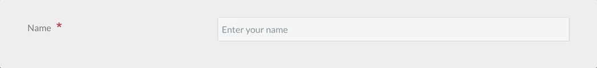

<h2 id="common-field-attributes">一般的なフィールドの属性</h2>

すべてのフィールドは、使用可能な属性のリストを受け入れます。  
それぞれのフィールドは、一般的な属性を共有できますが、特定のフィールドでは無視されることがあります。  
フィールドで、どの属性が許可されているかチェックする最良の方法は、このページのフィールドの説明を確認して、どの属性が言及されているかを確認することです。

以下のリストは、共通する事項なので、各フィールドの説明では繰り返しません。

| 属性 | 説明 |
| :----- | :----- |
| `autocomplete`      | `on` もしくは `off` を受け付けます |
| `autofocus`         | 有効化すると、フィールドでオートフォーカスします  |
| `classes`           | 文字列を受けて、CSS クラスを追加します  |
| `default`           | デフォルト値を設定します  |
| `disabled`          | フィールドを disabled 状態にします |
| `help`              | tooltip をフィールドに追加します  |
| `id`                | フィールドに　id を設定します。また、label に `for` 属性を設定します |
| `label`             | フィールドに label を設定します  |
| `display_label`     | `true` もしくは `false` を受け付けます  |
| `labelclasses`      | 文字列を受け取り、CSS クラスを追加します  |
| `sublabel`          | フィールドに sublabel を設定します  |
| `sublabelclasses`   | 文字列を受け取り、CSS クラスを追加します |
| `name`              | フィールドの name を設定します |
| `novalidate`        | フィールドを novalidate 状態にします |
| `outerclasses`      | label とそのフィールドを囲む div にクラスを追加します |
| `wrapper_classes`   | 説明とフィールドを含む wrapper にクラスを追加します  |
| `placeholder`       | placeholder の値を設定します  |
| `readonly`          | readonly 状態に設定します |
| `size`              | フィールドに size を設定します。この size は、コンテナにクラスとして追加されます。  `large` 、 `x-small` 、 `medium` 、 `long` 、 `small` が適切な値ですが、もちろんフロントエンドで利用する場合に使える別の値を追加することも可能です |
| `style`             | フィールドに style を設定します |
| `title`             | フィールドに title の値を設定します |
| `type`              | フィールドに type を設定します |
| `validate.required` | true などのポジティブな値を設定すると、必須項目になります |
| `validate.pattern`  | validation の pattern を設定します |
| `validate.message`  | validation が失敗したときのメッセージを設定します |

カスタム属性を追加することもできます：

```
attributes:
  key: value
```

カスタムの `data-*` 値を追加することもできます：

```
datasets:
  key: value
```

上記の `attributes` や、 `datasets` 定義は、次のようなフィールドになります：

```
<input name="data[name]" value="" type="text" class="form-input " key="value" data-key="value">
```

> [!Tip]  
> 注意： ポジティブな値は、複数の設定方法があります（`'on'` や、 `true` 、`1` など）。その他の値は、ネガティブな値として解釈されます。

---

<h2 id="available-fields">利用可能なフィールド</h2>

### Basic-Captcha Field

Forms プラグイン `7.0.0` で、 Google ReCaptcha フィールドのローカルでの代替として追加されました。  
このフィールドは、 Google の提供する GDPR 制限に惑わされたくない場合で、コンタクトフォームでのスパムを取り扱うときに、特に便利です。  
攻撃を阻止するため、 **OCR-耐性** のあるフォントを利用し、コピーするコードや、かんたんな算数の問題を設定できます。


`basic-captcha` フィールドタイプは、`forms` 設定で、完全に制御できますが、適切なデフォルト値が設定されています。  
Basic-Captcha の全体的な設定は、グローバルなフォーム設定ファイル（通常は、 `user/config/plugins/form.yaml` ）で行います。  
デフォルトのオプションは：

```yaml
basic_captcha:
  type: characters            # options: [characters | math]
  chars:
    length: 6                 # number of chars to output
    font: zxx-noise.ttf       # options: [zxx-noise.ttf | zxx-camo.ttf | zxx-xed.ttf | zxx-sans.ttf]
    bg: '#cccccc'             # 6-char hex color
    text: '#333333'           # 6-char hex color
    size: 24                  # font size in px
    start_x: 5                # start position in x direction in px
    start_y: 30               # start position in y direction in px
    box_width: 135            # box width in px
    box_height: 40            # box height in px
  math:
    min: 1                    # smallest digit
    max: 12                   # largest digit
    operators: ['+','-','*']  # operators that can be used in math
```

具体例：

```yaml
basic-captcha:
    type: basic-captcha
    placeholder: copy the 6 characters
    label: Are you human?
```

これは、フォームのバリデーションが適切に行われるために、`process:` とも適合している必要があります。

> [!Note]  
> もし captcha が失敗していたときに、フォームのプロセスがきちんと止まるようにするため、フォームの `process:` の中で、これが最初のエントリーでなければいけません。

具体例：

```yaml
process:
    basic-captcha:
        message: Humanity verification failed, please try again...
```

### Turnstile Captcha Field (Cloudflare)

Form プラグイン `v7.1.0` から、新しく Cloudflare 社の Turnstile フィールドをサポートしました。  
このフィールドは、フォームの SPAM 除けの新しい方法です。  
Google ReCaptcha フィールドと、 Google からの **GDPR** 規制の代替となる素晴らしいものです。  
このフィールドは、コンタクトフォームで SPAM を取り扱うときに特に便利です。  
[Turnstile については、こちらを参照してください](https://blog.cloudflare.com/turnstile-private-captcha-alternative/) 

<h5 id="advantages-over-google-recaptcha">Google ReCaptcha よりも優れている点</h5>

1. GDPR に準拠し、ユーザーのプライバシーを重視している
2. 検証が極めて速い
3. Cloudflare と Grav の両方で、実装がとても簡単で、複雑な UI やパラメータを設定する必要がない
4. 非同期のフォーム送信 (ajax) のための派手な追加コードが不要で、そのまま動く!
5. ReCaptcha と比べて、ユーザー体験が良い。車や信号機を数えたり、その他のナンセンスなことをしなくて済む
6. 機械学習の上に構築されているので、時間の経過とともに改良され、新しい攻撃にも適応する
7. チャレンジの効果を徹底的に分析できる。 [スクリーンショットを見てください](https://blog.cloudflare.com/content/images/2022/09/image1-64.png)


<h5 id="integration">統合</h5>

Grav のフォームを Turnstile と統合する前に、まずは [Turnstile サイトを新しく作らなければいけません](https://dash.cloudflare.com/?to=/:account/turnstile) 。  
そして、 [公式の "get started" チュートリアル](https://developers.cloudflare.com/turnstile/get-started/) も進めてください。
ここで、 widget のタイプを選べます。  
`managed` か、`non-interactive` か、 `invisible` のいずれかです。  
重要な注意点として、 widget のタイプは Cloudflare からのみ変更できます。  
Grav からは設定できません。  
しかし、ある選択が良くなかったとき、必要に応じて、後で変更は可能です。  
[widget タイプの違いについて、より詳しくはCloudflareで学んでください](https://developers.cloudflare.com/turnstile/reference/widget-types/) 

> [!Note]  
> Turnstile フィールドを使うかもしれないドメインはすべて、忘れずに追加してください。これには、あなたのローカル環境も含まれます。

一度サイトを作成すると、`site_key` と `site_secret` が与えられます。  
これらはフォームの設定ファイル（通常は、`user/config/plugins/form.yaml` ）から設定するのに必要なものです。  
Grav が処理するので、提案されたスクリプトタグは無視して構いません。

デフォルトのオプションは、以下のとおりです：

```yaml
turnstile:
  theme: light
  site_key: <Your Turnstile Site Key>
  secret_key: <Your Turnstile Secret Key>
```

最後に、ここでもまた、バリデーションが適切に行われたことを確認するため、`process:` 要素との整合が必要になります。

> [!Note]  
> キャプチャのバリデーションが失敗したとき、フォームの処理が実行されないように、キャプチャの整合確認は、`process:` セクションの最初になければいけません。

<h5 id="example">具体例</h5>

コンタクトフォームの典型的な例は、以下のようになります。

```yaml
form:
  name: contact
  fields:
    name:
      label: Name
      type: text
      validate:
        required: true
    email:
      label: Email
      type: email
      validate:
        required: true
    message:
      label: Message
      type: textarea
      validate:
        required: true
    captcha:
        type: turnstile
        theme: light
  buttons:
    submit:
      type: submit
      value: Submit
  process:
    turnstile: true
    email:
      subject: "[Acme] {{ form.value.name|e }}"
      reply_to: "{{ form.value.name|e }} <{{ form.value.email }}>"
    message: Thanks for contacting us!
    reset: true
    display: '/'
```


### Google Captcha Field (ReCaptcha)

`captcha` フィールドタイプは、 Google reCAPTCHA 要素をフォームに追加するために使われます。  
他の要素と違い、1つのフォームに1回だけ使えます。

> [!Note]  
> Google reCAPTCHA の設定は、 [reCAPTCHA Admin Console](https://www.google.com/recaptcha/admin) で設定してください。

バージョン `3.0` から、このフィールドは、 reCAPTCHA の3つのバリエーションをサポートしています。  
reCAPTCHA の全体的な設定は、グローバルなフォームの設定ファイル (通常は `user/config/plugins/form.yaml`) で行うのが最適です。  
デフォルトのオプションは、次の通りです:

```yaml
recaptcha:
  version: 2-checkbox
  theme: light
  site_key:
  secret_key:
```

これらのオプションは、以下のように設定してください:

| キー | 値 |
| :----- | :----- |
| version | デフォルトは、 `2-checkbox` ですが、 `2-invisible` や `3` にもできます |
| theme | デフォルトは、 `light` ですが、 `dark` にもできます (現在、 `2-x` バージョンでのみ機能します) |
| site_key | あなたの Google Site Key  |
| secret_key | あなたの Google Secret Key |

> [!Info]  
> サイトのドメインが、 Google の reCAPTCHA 設定のリストに入っていることを確認してください。

フォーム定義では、 captcha フィールドの `name` 属性は、 `g-recaptcha-response` でなければいけません。  
というのも、 Google reCAPTCHA は、 Captcha 設定コードを `g-recaptcha-response` に保存するからです。

具体例：

```yaml
g-recaptcha-response:
  type: captcha
  label: Captcha

```

失敗したときの `recaptcha_not_validated` カスタムメッセージを提供することもできます。  
カスタムメッセージがなければ、 Form プラグインのデフォルトのものが提供されます。  
`recaptcha_site_key` を、サイト全体ではなく、フォームごとに設定したい場合は、そのようにもできます。

```yaml
g-recaptcha-response:
  type: captcha
  label: Captcha
  recaptcha_site_key: ENTER_YOUR_CAPTCHA_PUBLIC_KEY
  recaptcha_not_validated: 'Captcha not valid!'
```

| 属性                 | 説明                                     |
| :-----                    | :-----                                          |
| `recaptcha_site_key`      | Google reCAPTCHA の Site Key (オプション)  |
| `recaptcha_not_validated` | captcha に失敗したときに表示されるメッセージ |

| 利用可能な一般属性                      |
| :-----                                         |
| [help](#common-fields-attributes)              |
| [label](#common-fields-attributes)             |
| [name](#common-fields-attributes)              |
| [outerclasses](#common-fields-attributes)      |
| [validate.required](#common-fields-attributes) |

このフィールドも、フォームが適切にバリデーションされたことを確認するため、 `process:` 要素と整合する必要があります。

> [!Note]  
> ReCaptcha のバリデーションが失敗したとき、フォームの処理が実行されないように、キャプチャの整合確認は、`process:` セクションの最初になければいけません。

具体例：

```yaml
process:
    captcha: true
```

<h5 id="server-side-captcha-validation">サーバーサイドのキャプチャのバリデーション</h5>

上記のコードは、 Captcha をフロントエンドでバリデーションし、正しくない場合は送信しないようにします。  
サーバーサイドでも captcha をバリデーションするには、フォームに captcha process アクションを追加してください。

```yaml
  process:
    captcha: true
```

オプションの成功 `message` を提供することもできます。  
提供されない場合は、成功時に何もメッセージは表示されません。  
`recaptcha_secret` を、サイト全体ではなく、フォームごとに設定したい場合は、そのようにもできます。

```yaml
  process:
    captcha:
      recaptcha_secret: ENTER_YOUR_CAPTCHA_SECRET_KEY
      message: 'Successfully passed reCAPTCHA!'
```

アクション内の処理を知るには、 [コンタクトフォームの具体例をみてください](../03.example-form/) 。

---

### Checkbox Field


`checkbox` フィールドタイプは、ひとつのチェックボックスをフォームに追加します。

具体例：

```yaml
agree_to_terms:
  type: checkbox
  label: "Agree to the terms and conditions"
  validate:
      required: true
```

| 利用可能な一般属性                      |
| :-----                                         |
| [autofocus](#common-fields-attributes)         |
| [classes](#common-fields-attributes)           |
| [default](#common-fields-attributes)           |
| [disabled](#common-fields-attributes)          |
| [id](#common-fields-attributes)                |
| [label](#common-fields-attributes)             |
| [name](#common-fields-attributes)              |
| [novalidate](#common-fields-attributes)        |
| [outerclasses](#common-fields-attributes)      |
| [size](#common-fields-attributes)              |
| [style](#common-fields-attributes)             |
| [validate.required](#common-fields-attributes) |
| [validate.pattern](#common-fields-attributes)  |
| [validate.message](#common-fields-attributes)  |

---

### Checkboxes Field


`checkboxes` フィールドタイプは、チェックボックスのグループをフォームに追加します。

具体例：

```yaml
pages.process:
    type: checkboxes
    label: PLUGIN_ADMIN.PROCESS
    help: PLUGIN_ADMIN.PROCESS_HELP
    default:
        markdown: true
        twig: true
    options:
        markdown: Markdown
        twig: Twig
    use: keys
```

```yaml
my_field:
    type: checkboxes
    label: A couple of checkboxes with help for each option and option1 disabled
    default:
        - option1
        - option2
    options:
        option1: Option 1
        option2: Option 2
    help_options:
        option1: Help for Option 1
        option2: Help for Option 2
    disabled_options:
        - option1
```


| 属性 | 説明   |
| :-----    | :-----  |
| `use`     | `keys` を設定すると、チェックボックスは、フォームの送信時に要素の key の値を保存します。そうでない場合は、要素の値を使います |
| `options` | key-value 形式の利用可能な選択肢の配列 |
| `help_options` | `options` で定義したそれぞれの選択肢のヘルプの key-value 形式の配列 |
| `disabled_options` | disabled 状態で表示する選択肢のリスト |

| 利用可能な一般属性                      |
| :-----                                         |
| [autofocus](#common-fields-attributes)         |
| [classes](#common-fields-attributes)           |
| [default](#common-fields-attributes)           |
| [disabled](#common-fields-attributes)          |
| [help](#common-fields-attributes)              |
| [id](#common-fields-attributes)                |
| [label](#common-fields-attributes)             |
| [name](#common-fields-attributes)              |
| [outerclasses](#common-fields-attributes)      |
| [size](#common-fields-attributes)              |
| [style](#common-fields-attributes)             |
| [validate.required](#common-fields-attributes) |
| [validate.pattern](#common-fields-attributes)  |
| [validate.message](#common-fields-attributes)  |

> [!Info]  
> 注意： checkboxes フィールドは、`remember` プロセスアクションはサポートしません。

---

### Conditional Field

`conditional` フィールドタイプは、条件によっては表示されるフィールドです。

具体例：

すでに `true` もしくは `false` で条件が決まった場合、以下のようなシンプルなフォーマットが使えます：

```yaml
my_conditional:
  type: conditional
  condition: config.plugins.yourplugin.enabled
  fields: # The field(s) below will be displayed only if the plugin named yourplugin is enabled
    header.mytextfield:
      type: text
      label: A text field
```

しかし、より複雑な条件を要するなら、`true` もしくは `false` を文字列で返すロジックを実行できます。  
そしてこのフィールドはそのことも理解します。

```yaml
my_conditional:
  type: conditional
  condition: "config.site.something == 'custom'"
  fields: # The field(s) below will be displayed only if the `site` configuration option `something` equals `custom`
    header.mytextfield:
        type: text
        label: A text field
```

| 属性   | 説明  |
| :----- | :-----  |
| `condition` | Twig で評価される条件。Twig から利用可能な変数であれば、評価できます |

| 利用可能な一般属性             |
| :-----                                |
| [disabled](#common-fields-attributes) |
| [id](#common-fields-attributes)       |
| [label](#common-fields-attributes)    |
| [name](#common-fields-attributes)     |

---

### Date Field


`data` フィールドタイプは、HTML5 の `data` の input フィールドです。

具体例：

```yaml
-
  type: date
  label: Enter a date
  validate.min: "2014-01-01"
  validate.max: "2018-12-31"
```

| 属性      | 説明     |
| :-----         | :-----  |
| `validate.min` | `min` 属性を設定します（次を見てください： [http://html5doctor.com/the-woes-of-date-input/#feature-min-max-attributes](http://html5doctor.com/the-woes-of-date-input/#feature-min-max-attributes) |
| `validate.max` | `max` 属性を設定します（次を見てください： [http://html5doctor.com/the-woes-of-date-input/#feature-min-max-attributes](http://html5doctor.com/the-woes-of-date-input/#feature-min-max-attributes) |

| 利用可能な一般属性                      |
| :-----                                         |
| [autofocus](#common-fields-attributes)         |
| [classes](#common-fields-attributes)           |
| [default](#common-fields-attributes)           |
| [disabled](#common-fields-attributes)          |
| [help](#common-fields-attributes)              |
| [id](#common-fields-attributes)                |
| [label](#common-fields-attributes)             |
| [name](#common-fields-attributes)              |
| [novalidate](#common-fields-attributes)        |
| [outerclasses](#common-fields-attributes)      |
| [readonly](#common-fields-attributes)          |
| [size](#common-fields-attributes)              |
| [style](#common-fields-attributes)             |
| [title](#common-fields-attributes)             |
| [validate.required](#common-fields-attributes) |
| [validate.pattern](#common-fields-attributes)  |
| [validate.message](#common-fields-attributes)  |

---

### Display Field


`display` フィールドタイプは、フォーム内でテキストや説明書きを表示するために使われます。  
マークダウンコンテンツを受け付けます。

具体例：


```yaml
test:
    type: display
    size: large
    label: Instructions
    markdown: true
    content: "This is a test of **bold** and _italic_ in a text/display field\n\nanother paragraph...."
```

| 属性  | 説明                                                         |
| :-----     | :-----                                                              |
| `markdown` | コンテンツフィールドでマークダウン処理を有効化するかどうかの真偽値 |
| `content`  | 表示するテキストコンテンツ |

| 利用可能な一般属性                 |
| :-----                                    |
| [help](#common-fields-attributes)         |
| [id](#common-fields-attributes)        |
| [label](#common-fields-attributes)        |
| [name](#common-fields-attributes)         |
| [id](#common-fields-attributes)           |
| [outerclasses](#common-fields-attributes) |
| [size](#common-fields-attributes)         |
| [style](#common-fields-attributes)        |

---

### Email Field


`email` フィールドタイプは、 [HTML5 の email input](http://html5doctor.com/html5-forms-input-types/#input-email) を使い、Eメールを受け付ける入力欄を表示します。

> [!Info]  
> Eメールは、大文字と小文字を区別しないように設計されています。アプリケーションロジックを書くときは、大文字、小文字、それらの混在を適切に扱ってください。

具体例：

```yaml
header.email:
  type: email
  autofocus: true
  label: Email
```

| 属性 | 説明     |
| :----- | :----- |
| `minlength` | 最小文字数 |
| `maxlength`  | 最大文字数 |
| `validate.min` | minlength と同じ |
| `validate.max`  | maxlength と同じ |

| 利用可能な一般属性                      |
| :-----                                         |
| [autofocus](#common-fields-attributes)         |
| [classes](#common-fields-attributes)           |
| [default](#common-fields-attributes)           |
| [disabled](#common-fields-attributes)          |
| [help](#common-fields-attributes)              |
| [id](#common-fields-attributes)                |
| [label](#common-fields-attributes)             |
| [name](#common-fields-attributes)              |
| [novalidate](#common-fields-attributes)        |
| [outerclasses](#common-fields-attributes)      |
| [readonly](#common-fields-attributes)          |
| [size](#common-fields-attributes)              |
| [style](#common-fields-attributes)             |
| [title](#common-fields-attributes)             |
| [validate.required](#common-fields-attributes) |
| [validate.pattern](#common-fields-attributes)  |
| [validate.message](#common-fields-attributes)  |

---

### File Field

`file` フィールドタイプにより、ユーザーはフォームからファイルをアップロードできるようになります。  
デフォルトでは、 **画像** タイプの **1つのファイル** のみを許容し、フォームが表示されている **現在の** ページにアップロードされます。

```yaml
# Default settings
my_files:
  type: file
  multiple: false
  destination: 'self@'
  accept:
    - image/*
```

| 属性     | 説明  |
| :-----        | :----- |
| `multiple`    | `true` もしくは `false` 。**true** を設定すると、一度に複数ファイルが選択できます |
| `destination` | **@self** もしくは **@page:/route** 、 **local/rel/path/** もしくは PHPストリームを受け付けます。<br> **@self** を設定すると、フォームが宣言された（現在の .md ）フォルダにアップロードされます。<br> **@page:/route** を使うと、そのルーティングページが存在すれば、そこににアップロードされます。（例： **@page:/blog/a-blog-post** ）<br> **'local/rel/path'** を設定すると、Grav のルートディレクトリからの相対パスでどこでも保存できます。たとえば、`user/images/uploads` などです。path が存在しなければ、作成されます。このため、書き込み権限があることを確認してください。<br> これ以外にも、Grav が認識できる適切な PHPストリームに設定可能です。たとえば： `user-data://my-form` や、 `theme://media/uploads` などです。 |
| `accept`      | 受け取れる MIME タイプの配列を渡します。たとえば、gif 画像と mp4 ファイルのみを受け付ける場合： `accept: ['image/gif', 'video/mp4']` |

> [!Tip]  
> 管理プラグインでの File fields は少し違いがあり、フォームからアップロードされたファイルの削除もできます。なぜなら、管理パネルでのユースケースは、アップロードした後、ファイルをデータ項目に紐付けることだからです。

| 利用可能な一般属性                      |
| :-----                                         |
| [help](#common-fields-attributes)              |
| [label](#common-fields-attributes)             |
| [name](#common-fields-attributes)              |
| [outerclasses](#common-fields-attributes)      |

デフォルトでは、管理パネルでは、フィールド定義で、`avoid_overwriting` を `true` にしておかない限り、 `file` フィールドは同じフォルダに同じ名前のファイルがアップロードされると、上書きします。

---

### Hidden Field

`hidden` フィールドタイプは、フォームに hidden 要素を追加します。

具体例：

```yaml
header.some_field:
  type: hidden
  default: my-value
```

| 属性 | 説明  |
| :-----    | :----- |
| `name`    | フィールド名です。もし書き忘れた場合、要素の定義フィールドの名前になります（上の例では： `header.some_field` ）|

| 利用可能な一般属性            |
| :-----                               |
| [default](#common-fields-attributes) |

---

### Honeypot Field

`honeypot` フィールドタイプは、入力されるとエラーを返す hidden フィールドを作ります。  
入力を埋めて送信するだけのボットへの対策として便利です。

具体例：

```yaml
fields:
    honeypot:
      type: honeypot
```

上記は、単純なテキストフィールドで、フロントエンドには表示されません。  
ボットは、コードを探索し、自動で入力欄を埋めるので、このフィールドも埋めてしまいます。  
エラーにより、フォームは正しく送信されません。  
エラーは、メッセージブロックの上部ではなく、フォーム要素の次に表示されます。

honeypot は、captcha フィールドの代替として人気です。

---

### Ignore Field

`ignore` フィールドタイプは、他のブループリントから拡張されたときに、不使用のフィールドを削除します。

具体例：

```yaml
header.process:
  type: ignore
content:
  type: ignore
```

---

### Number Field

`number` フィールドタイプは、 [HTML5 の number input](http://html5doctor.com/html5-forms-input-types/#input-number) を使い、数字のみを受け付ける入力欄を表示します。

具体例：

```yaml
header.count:
  type: number
  label: 'How Much?'
  validate:
    min: 10
    max: 360
    step: 10
```

| 属性 | 説明    |
| :----- | :-----  |
| `validate.min` | 最小値 |
| `validate.max`  | 最大値 |
| `validate.step`  | 増減の step |

| 利用可能な一般属性                      |
| :-----                                         |
| [autofocus](#common-fields-attributes)         |
| [classes](#common-fields-attributes)           |
| [default](#common-fields-attributes)           |
| [disabled](#common-fields-attributes)          |
| [help](#common-fields-attributes)              |
| [id](#common-fields-attributes)                |
| [label](#common-fields-attributes)             |
| [name](#common-fields-attributes)              |
| [novalidate](#common-fields-attributes)        |
| [outerclasses](#common-fields-attributes)      |
| [readonly](#common-fields-attributes)          |
| [size](#common-fields-attributes)              |
| [style](#common-fields-attributes)             |
| [title](#common-fields-attributes)             |
| [validate.required](#common-fields-attributes) |
| [validate.pattern](#common-fields-attributes)  |
| [validate.message](#common-fields-attributes)  |

---

### Password Field

`password` フィールドタイプは、パスワード入力欄を表示します。

具体例：

```yaml
password:
  type: password
  label: Password
```

| 利用可能な一般属性                      |
| :-----                                         |
| [autofocus](#common-fields-attributes)         |
| [classes](#common-fields-attributes)           |
| [default](#common-fields-attributes)           |
| [disabled](#common-fields-attributes)          |
| [help](#common-fields-attributes)              |
| [id](#common-fields-attributes)                |
| [label](#common-fields-attributes)             |
| [name](#common-fields-attributes)              |
| [novalidate](#common-fields-attributes)        |
| [outerclasses](#common-fields-attributes)      |
| [readonly](#common-fields-attributes)          |
| [size](#common-fields-attributes)              |
| [style](#common-fields-attributes)             |
| [title](#common-fields-attributes)             |
| [validate.required](#common-fields-attributes) |
| [validate.pattern](#common-fields-attributes)  |
| [validate.message](#common-fields-attributes)  |

---

### Radio Field


ラジオボタンのひと組を表示します

具体例：

```yaml
my_choice:
  type: radio
  label: Choice
  default: markdown
  options:
      markdown: Markdown
      twig: Twig
```

| 属性 | 説明                                         |
| :-----    | :-----                                              |
| `options` | key-value の選択肢の配列 |

| 利用可能な一般属性                      |
| :-----                                         |
| [default](#common-fields-attributes)           |
| [disabled](#common-fields-attributes)          |
| [help](#common-fields-attributes)              |
| [id](#common-fields-attributes)                |
| [label](#common-fields-attributes)             |
| [name](#common-fields-attributes)              |
| [outerclasses](#common-fields-attributes)      |
| [validate.required](#common-fields-attributes) |
| [validate.pattern](#common-fields-attributes)  |
| [validate.message](#common-fields-attributes)  |

---

### Range Field


[input type="range"](http://html5doctor.com/html5-forms-input-types/#input-range) を表示します。

具体例：

```yaml
header.choose_a_number_in_range:
  type: range
  label: Choose a number
  validate:
    min: 1
    max: 10
```

| 利用可能な一般属性                      |
| :-----                                         |
| [autofocus](#common-fields-attributes)         |
| [classes](#common-fields-attributes)           |
| [default](#common-fields-attributes)           |
| [disabled](#common-fields-attributes)          |
| [help](#common-fields-attributes)              |
| [id](#common-fields-attributes)                |
| [label](#common-fields-attributes)             |
| [name](#common-fields-attributes)              |
| [novalidate](#common-fields-attributes)        |
| [outerclasses](#common-fields-attributes)      |
| [readonly](#common-fields-attributes)          |
| [size](#common-fields-attributes)              |
| [style](#common-fields-attributes)             |
| [title](#common-fields-attributes)             |
| [validate.required](#common-fields-attributes) |
| [validate.pattern](#common-fields-attributes)  |
| [validate.message](#common-fields-attributes)  |

---

### Section Field

ページをセクションに分けます。

具体例：

```yaml
content:
    type: section
    title: PLUGIN_ADMIN.DEFAULTS
    underline: true

    fields:

        #..... subfields
```

| 属性   | 説明   |
| :----- | :----- |
| `title`       | 見出しタイトル |
| `text`        | 下部に表示するテキスト |
| `security`    | このセクションを表示するためにユーザーが必要とするクレデンシャルの配列 |
| `title_level` | カスタム見出しタグの設定。 デフォルト： `h3` |

---

### Select Field


select 入力欄を表示します。

具体例 1：

```yaml
pages.order.by:
    type: select
    size: long
    classes: fancy
    label: 'Default Ordering'
    help: 'Pages in a list will render using this order unless it is overridden'
    options:
        default: 'Default - based on folder name'
        folder: 'Folder - based on prefix-less folder name'
        title: 'Title - based on title field in header'
        date: 'Date - based on date field in header'
```

具体例 2 - 選択肢を disable にする：

```yaml
my_element:
    type: select
    size: long
    classes: fancy
    label: 'My Select Element'
    help: 'Use the disabled key:value to display but disable a particular option'
    options:
        option1:
          value: 'Option 1'
        option2:
          value: 'Option 2'
        option3:
          disabled: true
          value: 'Option 3'
```

| 属性  | 説明    |
| :----- | :----- |
| `options`  | key-value 形式の選択肢の配列。key はフォームで送信されます。 |
| `multiple` | 複数の値を許容するか |

`multiple` を true にするとき、以下を追記してください

```
pages.order.by:
  validate:
    type: array
```

そうでなければ、選ばれた値の配列が正しく保存されません。

| 利用可能な一般属性                      |
| :-----                                         |
| [autofocus](#common-fields-attributes)         |
| [classes](#common-fields-attributes)           |
| [default](#common-fields-attributes)           |
| [disabled](#common-fields-attributes)          |
| [help](#common-fields-attributes)              |
| [id](#common-fields-attributes)                |
| [label](#common-fields-attributes)             |
| [name](#common-fields-attributes)              |
| [novalidate](#common-fields-attributes)        |
| [outerclasses](#common-fields-attributes)      |
| [size](#common-fields-attributes)              |
| [style](#common-fields-attributes)             |
| [validate.required](#common-fields-attributes) |
| [validate.pattern](#common-fields-attributes)  |
| [validate.message](#common-fields-attributes)  |

---

### Select Optgroup Field


グループに分かれた select 入力欄を表示します。

具体例：

```yaml
header.newField:
    type: select_optgroup
    label: Test Optgroup Select Field
    options:
      - OptGroup1:
        - Option1
        - Option2
      - OptGroup2:
        - Option3
        - Option4
```

| 属性  | 説明    |
| :----- | :----- |
| `options`  | key-value 形式の選択肢の配列 |
| `multiple` | 複数の値を許容するか |

| 利用可能な一般属性                      |
| :-----                                         |
| [autofocus](#common-fields-attributes)         |
| [classes](#common-fields-attributes)           |
| [default](#common-fields-attributes)           |
| [disabled](#common-fields-attributes)          |
| [help](#common-fields-attributes)              |
| [id](#common-fields-attributes)                |
| [label](#common-fields-attributes)             |
| [name](#common-fields-attributes)              |
| [novalidate](#common-fields-attributes)        |
| [outerclasses](#common-fields-attributes)      |
| [size](#common-fields-attributes)              |
| [style](#common-fields-attributes)             |
| [validate.required](#common-fields-attributes) |
| [validate.pattern](#common-fields-attributes)  |
| [validate.message](#common-fields-attributes)  |

---

### Spacer Field

テキストか、headline、hr タグを追加します

具体例：


```yaml
test:
    type: spacer
    title: A title
    title_type: h2
    text: Some text
    underline: true
```

| 属性   | 説明   |
| :----- | :----- |
| `title`     | タイトルを追加します |
| `title_type` | タイトルの HTML タグ（例: `h1`, `h2`, `h3`, など）を決定します。指定しなければ、デフォルトでは `h3` です |
| `text`      | テキストを追記します。タイトルが設定されていれば、タイトルの後に追加されます |
| `underline` | 真偽値で、ポジティブな値の場合、`<hr>` タグを追加します。 |

---

### Tabs / Tab Fields


フォームの入力欄をタブに分けます。

具体例：

```yaml
tabs:
  type: tabs
  active: 1

  fields:
    content:
      type: tab
      title: PLUGIN_ADMIN.CONTENT

      fields:

        # .... other subfields

    options:
      type: tab
      title: PLUGIN_ADMIN.OPTIONS

      fields:

        # .... other subfields
```


| 属性 | 説明           |
| :-----    | :-----                |
| `active`  | active にするタブ番号 |

---

### Tel Field

[HTML5 の input tel](http://html5doctor.com/html5-forms-input-types/#input-tel) を使って、電話番号入力欄を表示します。

具体例：

```yaml
header.phone:
  type: tel
  label: 'Your Phone Number'
```

| 属性 | 説明                                       |
| :-----    | :-----                                            |
| `minlength` | 最小文字数 |
| `maxlength`  | 最大文字数  |
| `validate.min` | minlength と同じ |
| `validate.max`  | maxlength と同じ  |

| 利用可能な一般属性                      |
| :-----                                         |
| [autofocus](#common-fields-attributes)         |
| [classes](#common-fields-attributes)           |
| [default](#common-fields-attributes)           |
| [disabled](#common-fields-attributes)          |
| [help](#common-fields-attributes)              |
| [id](#common-fields-attributes)                |
| [label](#common-fields-attributes)             |
| [name](#common-fields-attributes)              |
| [novalidate](#common-fields-attributes)        |
| [outerclasses](#common-fields-attributes)      |
| [readonly](#common-fields-attributes)          |
| [size](#common-fields-attributes)              |
| [style](#common-fields-attributes)             |
| [title](#common-fields-attributes)             |
| [validate.required](#common-fields-attributes) |
| [validate.pattern](#common-fields-attributes)  |
| [validate.message](#common-fields-attributes)  |

---

### Text Field



テキストの入力欄を表示します。

具体例：

```yaml
header.title:
  type: text
  autofocus: true
  label: PLUGIN_ADMIN.TITLE
  minlength: 10
  maxlength: 255
```

| 属性 | 説明                                       |
| :-----    | :-----                                            |
| `prepend` | フィールドの前にテキストや HTML を追加する |
| `append`  | フィールドの後にテキストや HTML を追加する |
| `minlength` | 文字数の最小値 |
| `maxlength`  | 文字数の最大値 |
| `validate.min` | minlength と同じ |
| `validate.max`  | maxlength と同じ |

| 利用可能な一般属性                      |
| :-----                                         |
| [autofocus](#common-fields-attributes)         |
| [classes](#common-fields-attributes)           |
| [default](#common-fields-attributes)           |
| [disabled](#common-fields-attributes)          |
| [help](#common-fields-attributes)              |
| [id](#common-fields-attributes)                |
| [label](#common-fields-attributes)             |
| [name](#common-fields-attributes)              |
| [novalidate](#common-fields-attributes)        |
| [outerclasses](#common-fields-attributes)      |
| [readonly](#common-fields-attributes)          |
| [size](#common-fields-attributes)              |
| [style](#common-fields-attributes)             |
| [title](#common-fields-attributes)             |
| [validate.required](#common-fields-attributes) |
| [validate.pattern](#common-fields-attributes)  |
| [validate.message](#common-fields-attributes)  |

---

### Textarea Field


textarea を表示します。

具体例：

```yaml
header.content:
  type: textarea
  autofocus: true
  label: PLUGIN_ADMIN.CONTENT
  minlength: 10
  maxlength: 255
```

| 属性 | 説明     |
| :----- | :----- |
| `rows`    | rows 属性を追加します |
| `cols`    | cols 属性を追加します |
| `minlength` | 文字数の最小値 |
| `maxlength`  | 文字数の最大値 |
| `validate.min` | minlength と同じ |
| `validate.max`  | maxlength と同じ |

| 利用可能な一般属性                      |
| :-----                                         |
| [autofocus](#common-fields-attributes)         |
| [classes](#common-fields-attributes)           |
| [default](#common-fields-attributes)           |
| [disabled](#common-fields-attributes)          |
| [help](#common-fields-attributes)              |
| [id](#common-fields-attributes)                |
| [label](#common-fields-attributes)             |
| [name](#common-fields-attributes)              |
| [novalidate](#common-fields-attributes)        |
| [outerclasses](#common-fields-attributes)      |
| [readonly](#common-fields-attributes)          |
| [size](#common-fields-attributes)              |
| [style](#common-fields-attributes)             |
| [title](#common-fields-attributes)             |
| [validate.required](#common-fields-attributes) |
| [validate.pattern](#common-fields-attributes)  |
| [validate.message](#common-fields-attributes)  |

---

### Toggle Field


オン/オフ 切り替え入力欄を、label と一緒に表示します。

具体例：

```yaml
summary.enabled:
    type: toggle
    label: PLUGIN_ADMIN.ENABLED
    highlight: 1
    help: PLUGIN_ADMIN.ENABLED_HELP
    options:
        1: PLUGIN_ADMIN.YES
        0: PLUGIN_ADMIN.NO
    validate:
        type: bool
```


| 属性   | 説明   |
| :----- | :----- |
| `highlight` | オプションのキーを強調（選択されたときに緑色に着色） |
| `options`   | key-value 形式の選択肢のリスト |

| 利用可能な一般属性                      |
| :-----                                         |
| [default](#common-fields-attributes)           |
| [help](#common-fields-attributes)              |
| [label](#common-fields-attributes)             |
| [name](#common-fields-attributes)              |
| [style](#common-fields-attributes)             |
| [toggleable](#common-fields-attributes)        |
| [validate.required](#common-fields-attributes) |
| [validate.type](#common-fields-attributes)     |
| [disabled](#common-fields-attributes)          |

---

### Url Field

[HTML5 input url](http://html5doctor.com/html5-forms-input-types/#input-url) を使って、URLを受け付ける入力欄を表示します。

具体例：

```yaml
header.url:
  type: url
  label: 'Your Website Url'
```

| 属性 | 説明                                       |
| :-----    | :-----                                            |
| `minlength` | 文字数の最小値 |
| `maxlength`  | 文字数の最大値 |
| `validate.min` | minlength と同じ |
| `validate.max`  | maxlength と同じ |

| 利用可能な一般属性                      |
| :-----                                         |
| [autofocus](#common-fields-attributes)         |
| [classes](#common-fields-attributes)           |
| [default](#common-fields-attributes)           |
| [disabled](#common-fields-attributes)          |
| [help](#common-fields-attributes)              |
| [id](#common-fields-attributes)                |
| [label](#common-fields-attributes)             |
| [name](#common-fields-attributes)              |
| [novalidate](#common-fields-attributes)        |
| [outerclasses](#common-fields-attributes)      |
| [readonly](#common-fields-attributes)          |
| [size](#common-fields-attributes)              |
| [style](#common-fields-attributes)             |
| [title](#common-fields-attributes)             |
| [validate.required](#common-fields-attributes) |
| [validate.pattern](#common-fields-attributes)  |
| [validate.message](#common-fields-attributes)  |


<h2 id="currently-undocumented-fields">未ドキュメント化のfields</h2>


| フィールド | 説明 |
| :----- | :-----  |
| **Array**     |  |
| **Avatar**    |  |
| **Color**     |  |
| **Columns**   |  |
| **Column**    |  |
| **Datetime**  |  |
| **Fieldset**  |  |
| **Formname**  |  |
| **Key**       |  |
| **Month**     |  |
| **Signature** |  |
| **Switch**    |  |
| **Time**      |  |
| **Unique Id** |  |
| **Value**     |  |
| **Week**      |  |

