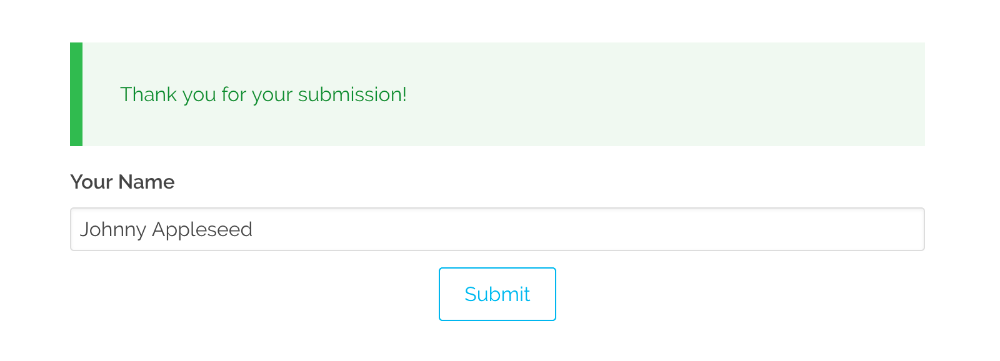

<h2 id="submitting-forms-via-xhr-ajax">XHR/Ajax でフォームを送信</h2>

フォーム処理のデフォルトのメカニズムは、 HTML 標準のフォーム送信によっており、 HTML フォームは、 `POST` または `GET` （デフォルトは `POST` ）でサーバーに送られます。送られたフォームは、 [バリデーション](../02.fields-available/) され、 [処理](../04.reference-form-actions/) された後に、結果がフォームに送り返され（もしくは、 [リダイレクトされたページへ遷移し](../04.reference-form-actions/#redirect) ）、メッセージが表示されたり、必要に応じて再送信するための編集ができたりします。

これは、ページのリロードを伴うため、ときどき、望ましくないこともあります。このような場合、 Ajax や XHR を使った JavaScript 経由で、フォームを送信することがより良い選択になります。幸運なことに、 Grav のフォーム機能は、このタスクに対応しています。

<h2 id="automatic-approach-form-plugin-v7-3-0">自動的なアプローチ（From プラグイン `v7.3.0` 以上）</h2>

Form プラグインのバージョン `7.3.0` のリリースにより、XHR によるフォーム送信機能が、素早いセットアップオプションで利用可能になりました。XHR により、フォームのその場所での処理となり、ページ全体のリロードは不要になります。

これを有効にするには、単純に、このオプションを Form のブループリントに追記するだけです：

```yaml
xhr_submit: true
```

`action:` や、 `template:` 、 `id:` さえ設定する必要はありません。1ページに複数の ajax フォームがあったとしても、プラグインは '機能' します。これは、新しい `form-xhr.html.twig` テンプレートを使い、 vanilla JS（ライブラリを利用しないJavaScript）コードでリクエストを行います。

> [!Info]  
> このアプローチでは、 XHR を使って、フォーム全体を送信し、フォームの HTML 全体をレスポンスで書き換えます。これはシンプルなアプローチですが、必要に応じて独自の高度なソリューションを作成できます。

> [!Tip]  
> XHR リクエストに使用される JavaScript コードは、 `form/layouts/xhr.html.twig` にあります。必要であれば、これを あなたのテーマの `templates` フォルダに（パス構造を維持しながら）コピーし、必要な修正をほどこしてください。

<h2 id="manual-approach-required-for-form-plugin-v7-3-0">手動のアプローチ（Form プラグイン `v7.3.0` 未満）</h2>

<h3 id="creating-the-form">フォームを作成する</h3>

お好みで、標準的なフォームを作り、それを利用できます。今回の例では、Ajax 制御部分にフォーカスするため、できるだけシンプルなものにしています。まず、 `forms/ajax-test/` フォルダに、 `form.md` というページを作成します：

```yaml
---
title: Ajax Test-Form
form:
    name: ajax-test-form
    action: '/forms/ajax-test'
    template: form-messages
    refresh_prevention: true

    fields:
        name:
            label: Your Name
            type: text

    buttons:
        submit:
            type: submit
            value: Submit

    process:
        message: 'Thank you for your submission!'
---
```

ご覧の通り、これはとても基本的なフォームで、シンプルに名前を尋ねて、送信ボタンが提供されます。目立っているのは、 `template: form-messages` の部分だけです。 [フロントエンドのフォーム](../) セクションで解説したとおり、フォーム処理の結果を表示するためにカスタムの Twig テンプレートを提供できます。これは、フォームを処理し、 Ajax 経由でメッセージを返し、ページに注入するための素晴らしい方法です。フォームプラグインには、これを実現する `form-messages.html.twig` テンプレートがすでに用意されています。

> [!Note]  
> ここでは、 `action: '/forms/ajax-test'` をハードコーディングして使用しています。そのため、 Ajax は固定の URL を持ち、現在のページルーティングにアクションを設定するわけではありません。これは、 Ajax リクエストがリダイレクトを適切に制御しない問題を解決します。これをしておかないと、 'home' ページなどで、問題が起こりえます。ハードコーディングするのは、現在のフォームページである必要はなく、ただ固有で、到達可能なルーティングでありさえすれば良いです。


<h3 id="the-page-content">ページコンテンツ</h3>

この同じページに、少しの HTML と、 JavaScript を追加する必要があります：


```twig
<div id="form-result"></div>

<script>
document.addEventListener('DOMContentLoaded', function() {
    const form = document.querySelector('#ajax-test-form');
    form.addEventListener('submit', function(event) {
        event.preventDefault();
        
        const result = document.querySelector('#form-result');
        const action = form.getAttribute('action');
        const method = form.getAttribute('method');
        
        fetch(action, {
            method: method,
            body: new FormData(form)
        })
        .then(function(response) {
            if (response.ok) {
                return response.text();
            } else {
                return response.json();
            }
        })
        .then(function(output) {
            if (result) {
                result.innerHTML = output;
            }
        })
        .catch(function(error) {
            if (result) {
                result.innerHTML = 'Error: ' + error;
            }
                
            throw new Error(error);
        });
    });
});
</script>
```

```twig
<div id="form-result"></div>

<script>
$(document).ready(function(){

    var form = $('#ajax-test-form');
    form.submit(function(e) {
        // prevent form submission
        e.preventDefault();

        // submit the form via Ajax
        $.ajax({
            url: form.attr('action'),
            type: form.attr('method'),
            dataType: 'html',
            data: form.serialize(),
            success: function(result) {
                // Inject the result in the HTML
                $('#form-result').html(result);
            }
        });
    });
});
</script>
```

まず、 div タグのプレースホルダを定義します。 ID は`#form-result` で、フォームの結果を注入する場所として利用します。

ここでは、簡単のため jQuery 構文を使用していますが、同じような機能を実行するものならば、お好きな JavaScript を使うことができます。まず、フォームのデフォルトの submit アクションを止めて、 Ajax でフォームのデータをシリアライズしながらアクションを呼び出します。この呼び出しに対する結果は、先に作成した div タグに戻ります。



