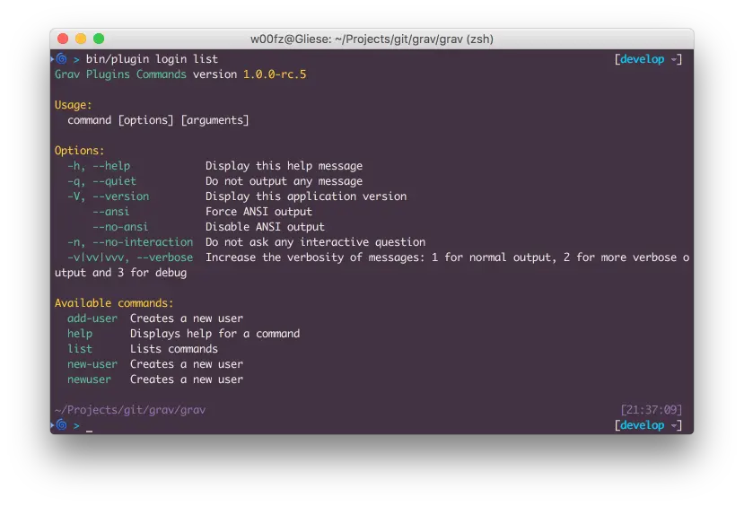
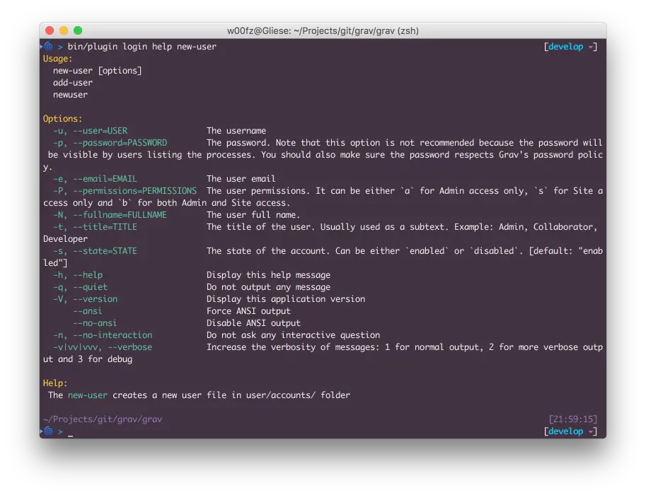
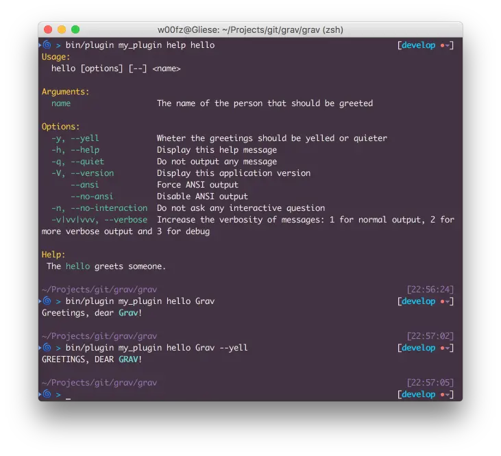

プラグインは、 Grav の CLI `bin/plugin` と統合でき、特定のタスクをターミナルから実行することで、プラグイン機能を強化します。

[Grav CLI](../02.grav-cli/) セクションで説明したとおり、コマンドの実行には　**terminal** を使う必要があります。

`bin/plugin` コマンドを実行すると、CLI 機能を提供するプラグインすべてのリストが表示されます。


`bin/plugin` コマンドに渡される最初のオプションは、常にプラグインのスラッグです（例  _error_, _login_, など）。2つ目のオプションは、プラグインが提供する実際の _command_ です。

プラグインの実装次第で、他のオプションを受け付けることもあります。`bin/plugin [スラッグ] list` コマンドにより、それらの、より詳しい内容を調べられます。

<h2 id="reserved-commands-and-options">コマンドとオプションの予約語</h2>

いくつか、予約された _コマンド_ と _オプション_ があります。これらは、どのプラグインでもいつでも使えます。あなたが開発者で、独自のタスクを実装しようとしているなら、これらを覚えておくことは特に重要です。なぜなら、これらの予約語をコマンドやオプションに使えないからです。

| **コマンド** |   |
| :----- | :----- |
| `help`       | コマンドのヘルプを表示 |
| `list`       | コマンドの一覧を表示 |

| **オプション** |   |
| :----- | :----- |
| `-h`, `--help`   | ヘルプメッセージを表示 |
| `-q`, `--quiet`  | メッセージを一切表示しない |
| `-v`, `--version` | アプリケーションバージョンを表示 |
| `--ansi`  | ANSI で強制出力 |
| `--no-ansi`  | ANSI 出力を無効化 |
| `-n`, `--no-interaction`   | インタラクティブな質問を聞かない |
| `-v\|vv\|vvv`, `--verbose`   | メッセージの詳細度を増加します： 1つの場合ノーマル出力、2つの場合より詳しい出力、 3つの場合デバッグ用です |

<h2 id="how-to-use-the-cli-for-plugins">プラグインでの CLI の使い方</h2>

**list** と **help** コマンドは、まだプラグイン CLI の使い方に詳しくないときに、とても便利です。

**list** により、利用可能な全コマンドにアクセスでき、それぞれの簡単な説明を見られます。

以下は、 **login** プラグインの例です。 `bin/plugin login list` を実行した結果です。

> [!Note]  
> プラグインのスラッグのあとに何もコマンド入力しなかった場合、デフォルトでは自動的に `list` になります。つまり、 `bin/plugin [スラッグ] list` と、 `bin/plugin [スラッグ]` は同じ意味です。



見てのとおり、オプションとコマンドのほとんどは、 [予約語リスト](#reserved-commands-and-options) に対応しています。 login プラグインが提供する実質的なコマンドは、 `add-user`, `new-user` and `newuser` です。

お気づきのとおり、この3つの実質的なコマンドのヘルプ説明は同じです。これは、どれを選んでも、3つのコマンドは全く同じになるからです。 **add-user** と **newuser** は、実際、 **new-user** のエイリアス（別名）で、そのコマンドを知らなかったり、覚えていなくても、簡単に言い当てられるようになっています。

では、login プラグインに `new-user` コマンドがあることがわかりましたから、あとは使い方を知るだけです。ここで、予約語の **help** コマンドの出番です。 `bin/plugin login help new-user` を実行してみましょう。



これで、 `new-user` コマンドと、その使い方を完全に理解しました。
新しいユーザーを作ってみましょう。定義上、オプションはすべて任意なので、パスワードはあえて省略しています（後で、プロンプトに聞かれることになります）。

```bash
bin/plugin login newuser -u joeuser -e joeuser@grav.org -P b -N "Joe User" -t "Site Administrator"
Creating new user

Enter a password: *********
Repeat the password: *********

Success! User joeuser created.
```

<h2 id="developers-integrate-the-cli-in-plugin">開発者向け：プラグインでの CLI 統合</h2>

開発者の方は、管理パネルやユーザーが実行できる CLI コマンドを作りたくなるかもしれません。プラグインにそのような機能を追加するのは、とても簡単です。

The first thing you want to do is to create a subfolder `cli/` at the root of your plugin. This folder will be processed by `bin/plugin` and scanned for commands classes.

Grav's CLI is based on the great [Symfony Console Component](http://symfony.com/doc/current/components/console/introduction.html) and you can pretty much follow their documentation for a complete reference, there are just a few important things you should consider.

1. The name of the class file is standard. It should start with a capital letter and end with **Command.php**.
    * `Hello.php`: WRONG
    * `helloworldCommand.php`: WRONG
    * `HelloworldCommand.php`: CORRECT
    * `HelloWorldCommand.php`: CORRECT
2. You should always extend `ConsoleCommand`, this will offer you some Grav extras such as formatted colors, direct access to the Grav instance and other utilities ([more details](https://github.com/getgrav/grav/blob/develop/system/src/Grav/Console/ConsoleTrait.php)).
3. Symfony Console requires an `execute` method. When extending **ConsoleCommand** this becomes `serve`.

Below is a simple example to get you started. You can test it, as is, by saving it as `HelloCommand.php` and by placing it under your plugin's root `cli/` folder (**user/plugins/my_plugin/cli/HelloCommand.php**).

```php
<?php
namespace Grav\Plugin\Console;

use Grav\Console\ConsoleCommand;
use Symfony\Component\Console\Input\InputArgument;
use Symfony\Component\Console\Input\InputOption;

/**
 * Class HelloCommand
 *
 * @package Grav\Plugin\Console
 */
class HelloCommand extends ConsoleCommand
{
    /**
     * @var array
     */
    protected $options = [];

    /**
     * Greets a person with or without yelling
     */
    protected function configure()
    {
        $this
            ->setName("hello")
            ->setDescription("Greets a person.")
            ->addArgument(
                'name',
                InputArgument::REQUIRED,
                'The name of the person that should be greeted'
            )
            ->addOption(
                'yell',
                'y',
                InputOption::VALUE_NONE,
                'Wheter the greetings should be yelled or quieter'
            )
            ->setHelp('The <info>hello</info> greets someone.')
        ;
    }

    /**
     * @return int|null|void
     */
    protected function serve()
    {
        // Collects the arguments and options as defined
        $this->options = [
            'name' => $this->input->getArgument('name'),
            'yell' => $this->input->getOption('yell')
        ];

        // Prepare the strings we want to output and wraps the name into a cyan color
        // More colors available at:
        // https://github.com/getgrav/grav/blob/develop/system/src/Grav/Console/ConsoleTrait.php
        $greetings = 'Greetings, dear <cyan>' . $this->options['name'] . '</cyan>!';

        // If the optional `--yell` or `-y` parameter are passed in, let's convert everything to uppercase
        if ($this->options['yell']) {
            $greetings = strtoupper($greetings);
        }

        // finally we write to the output the greetings
        $this->output->writeln($greetings);
    }
}
```



> [!Note]  
> Another good simple example can be found in the [Error Plugin (LogCommand.php)](https://github.com/getgrav/grav-plugin-error/blob/develop/cli/LogCommand.php), If you are looking for a more complex example, you should have a look at the [Login Plugin (NewUserCommand.php)](https://github.com/getgrav/grav-plugin-login/blob/develop/cli/NewUserCommand.php)

