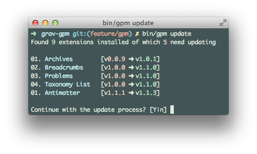

バージョン **0.9.3** をリリース以降、Grav には _GPM_ （Grav パッケージマネージャ）が搭載されています。この GPM により、Gravリポジトリにあるテーマやプラグインすべてを、インストールしたり、更新したり、アンインストールしたり、一覧表示したりできます。また、Grav そのものを最新バージョンにアップグレードできます。

[Grav CLI](../02.grav-cli/) と同様、 _GPM_ は、MacOSにおける **Terminal** のような、コマンドラインインターフェースを通じてコマンドを実行する、コマンドラインツールです。UNIXスタイルのコマンドは、Windows の cmd では、ネイティブには動きません。Windows マシンに [msysgit](http://msysgit.github.io/) をインストールし、[Git](https://git-scm.com/) と Git BASH という代替のコマンドプロンプトを追加することで、UNIX コマンドが利用可能になります。

_GPM_ を使い始めるにあたり、利用可能なコマンドの一覧を得るため、次のコマンドを実行できます。

```bash
bin/gpm list
```

特定のコマンドのヘルプが必要なときは、コマンドの前に help を追加してください：

```bash
bin/gpm help install
```

> [!Info]  
> **install** と、 **upgrade** 、 **selfupgrade** を実行したいとき、PHPには `php_openssl` 拡張が有効になっていなければいけません。もしダウンロード中に致命的エラーが出る場合、おそらくこれが原因です。

<h4 id="php-cgi-fcgi-information">PHP CGI-FCGI 情報</h4>

コマンドラインで、サーバーが `cgi-fcgi` で動いているか知るには、次のように入力してください：

```bash
php -v
PHP 5.5.17 (cgi-fcgi) (built: Sep 19 2014 09:49:55)
Copyright (c) 1997-2014 The PHP Group
Zend Engine v2.5.0, Copyright (c) 1998-2014 Zend Technologies
    with the ionCube PHP Loader v4.6.1, Copyright (c) 2002-2014, by ionCube Ltd.
```

もしPHPが `(cgi-fcgi)` を参照している場合、すべての `bin/gpm` コマンドの前に、`php-cli` を入力する必要があります。もしくは、シェルにエイリアスを設定することもできます。このように： `alias php="php-cli"` これは、PHPの **CLI** バージョンでコマンドラインからの実行を行うようにするためのものです。

<h2 id="how-does-it-work">どのように動いているか？</h2>

_GPM_ は、**GetGrav.org** からリポジトリのメタデータをダウンロードします。そのリポジトリには、利用可能なすべてのパッケージの詳細が入っており、 _GPM_ により、これらのパッケージがインストール済みかどうかや、アップデートが必要かどうかを検討できます。

そのリポジトリ自身は、Gravのコマンドを実行したPCのローカル環境に、24時間キャッシュされます。キャッシュができた後のリクエストは、**GetGrav.org** サーバーではなく、ローカルに保存されたリポジトリに問い合わせます。このアプローチにより、迅速に対応できます。

（以下に表示する）コマンドのほとんどは、リポジトリを強制的にリフレッシュするための `--force (-f)` オプションが使えます。これは、アップデートがあることがわかっているのに、キャッシュがクリアされるまでの24時間を待てないような場合に、便利なコマンドオプションです。

<h2 id="commands">コマンド</h2>

以下に、 _GPM_ で使えるコマンドをすべて、解説します。コマンド実行のためには、お好みのターミナルアプリを立ち上げ、Grav をインストールしたルートディレクトリ内で、 `bin/gpm <コマンド>` と実行してください。

## Index

_themes_ と _plugins_ ごとに整理して、Grav のリポジトリ内の利用可能なリソースの一覧を表示します。


それぞれの行は、**名前** と、 **スラッグ** 、 **バージョン** 、すでにインストール済みかどうかを表示します。

この表示から、インストール済みのリソースに新しいバージョンが無いか、すぐに調べられます。

たとえば、とても古いバージョンの Antimatter テーマ（v1.1.1）があり、最新バージョンが v1.1.3だったとき、以下のようにすぐにわかります。


> [!Info]  
> `--installed-only` オプションを使うと、**インストール済みの** プラグインやテーマを表示できます。

## Info

指定したパッケージの詳細を表示します。たとえば、そのパッケージの説明や、作者、ホームページなどです。


> [!Info]  
> このプラグイン/テーマの **変更履歴（Changelog）** をこのオプションで見ることができます。

## Install

The `install` command does exactly what it states. It installs a resource from the repository to your current Grav instance with a simple command.

The command will also detect if a resource is already installed, or if it is symbolically linked, and prompts you on what to do.

You can also install multiple resources at once by separating the slugs with a space.

[plugin:youtube](https://www.youtube.com/watch?v=SUUtcYl2xrE)

!! You can use the option `--all-yes (-y)` to skip any prompts. Existing resources will be overridden and if they are symbolic links will automatically be skipped.

## Update

The `update` command shows a list of updatable resources and works similarly to `install`.



[plugin:youtube](https://www.youtube.com/watch?v=jkxk2xBr5TM)

Alternatively, you can limit the updates to specific resources only.


[plugin:youtube](https://www.youtube.com/watch?v=rSWdmdx9TDA)

## Uninstall

The `uninstall` command removes an installed theme or plugin and clears the cache. Because Grav is purely filesystem, uninstalling a theme or a plugin means deleting the folder physically.

The command will also detect if a resource is symbolically linked, and prompts you on what to do.

You can also uninstall multiple resources at once by separating the slugs with a space.

!! You can use the option `--all-yes (-y)` to skip any prompts. If a resource is detected as symbolic link, it will automatically be skipped.

## Self-upgrade

The `self-upgrade` (or selfupgrade) allows you to update Grav to the latest available version. If no upgrade is needed, a message will tell you so, noting also which version you are currently running and when the release was published.

It is strongly advised to always do a backup before performing a self-upgrade (see _Creating a Backup_ in the [CLI section](../grav-cli)).

!! The self-upgrade only upgrades portions of your Grav instance, like `system/` folder, `vendor/` folder, `index.php`, and others. Your **`user`** and **`images`** folders will never be touched.


[plugin:youtube](https://www.youtube.com/watch?v=15-E8l5aaUo)

## Important Developer Information

#### Blueprints

With the introduction of _GPM_, we now have strict rules about valid `blueprints`. Whether it's a _theme_ or a _plugin_ you are developing, you should always ensure `blueprints` are formatted properly.

A blueprint can serve several different purposes, including defining your resource identity. Please refer to the [Blueprints](../blueprints) for more detailed documentation about what blueprints are and how they should be compiled.

#### Releases

Grav repository refreshes every hour and automatically detects when there are new releases, this implies that as a developer you followed our [Contributing](https://github.com/getgrav/grav#contributing) requirements.

On your end all you have to do is ensure you have updated the blueprints with the new version, and that you tagged and released the new version. The Grav repository will do the rest for you and as soon as your release is picked up, it will be available to everyone via Grav website or through _GPM_.

#### Add your resource to the repository

advanced/grav-development#themeplugin-release-process
Follow the instructions in the [Theme/Plugin Release Process](../../advanced/grav-development#themeplugin-release-process) section.

To add your new plugin/theme to the Grav repository, please open a Grav Issue on GitHub. You can also [use this precompiled link](https://github.com/getgrav/grav/issues/new?title=[add-resource]%20New%20Plugin/Theme&body=I%20would%20like%20to%20add%20my%20new%20plugin/theme%20to%20the%20Grav%20Repository.%0AHere%20are%20the%20project%20details:%20**user/repository**). Make sure you update the body to the proper `user/repository`.

More details about what the plugin/theme does are welcome and can be placed in the Issue.

Also please be aware that before adding a repository, the Grav team will inspect your plugin/theme ensuring that it fits the Grav standards. The team may also respond with requests for additional information, suggest minor improvements, etc. prior to closing the issue and adding the plugin/theme.

