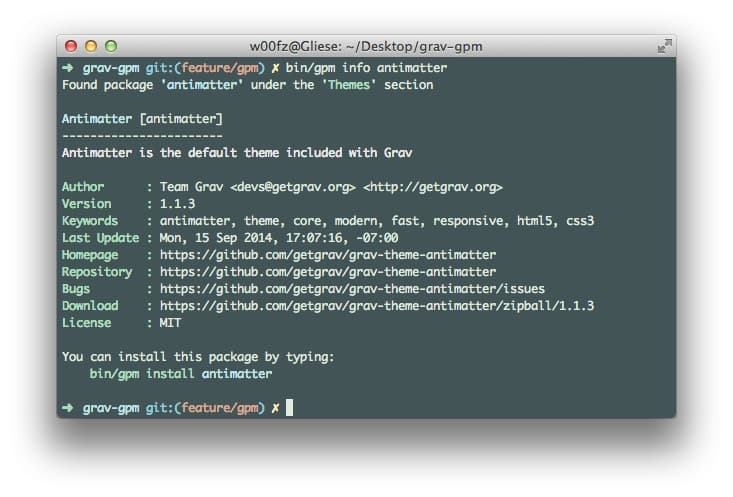
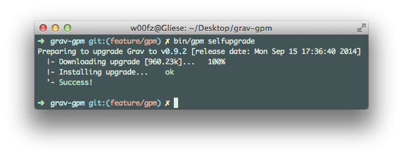

バージョン **0.9.3** をリリース以降、Grav には _GPM_ （Grav パッケージマネージャ）が搭載されています。この GPM により、Gravリポジトリにあるテーマやプラグインすべてを、インストールしたり、更新したり、アンインストールしたり、一覧表示したりできます。また、Grav そのものを最新バージョンにアップグレードできます。

[Grav CLI](../02.grav-cli/) と同様、 _GPM_ は、MacOSにおける **Terminal** のような、コマンドラインインターフェースを通じてコマンドを実行する、コマンドラインツールです。UNIXスタイルのコマンドは、Windows の cmd では、ネイティブには動きません。Windows マシンに [msysgit](http://msysgit.github.io/) をインストールし、[Git](https://git-scm.com/) と Git BASH という代替のコマンドプロンプトを追加することで、UNIX コマンドが利用可能になります。

_GPM_ を使い始めるにあたり、利用可能なコマンドの一覧を得るため、次のコマンドを実行できます。

```bash
bin/gpm list
```

特定のコマンドのヘルプが必要なときは、コマンドの前に help を追加してください：

```bash
bin/gpm help install
```

> [!Info]  
> **install** と、 **upgrade** 、 **selfupgrade** を実行したいとき、PHPには `php_openssl` 拡張が有効になっていなければいけません。もしダウンロード中に致命的エラーが出る場合、おそらくこれが原因です。

<h4 id="php-cgi-fcgi-information">PHP CGI-FCGI 情報</h4>

コマンドラインで、サーバーが `cgi-fcgi` で動いているか知るには、次のように入力してください：

```bash
php -v
PHP 5.5.17 (cgi-fcgi) (built: Sep 19 2014 09:49:55)
Copyright (c) 1997-2014 The PHP Group
Zend Engine v2.5.0, Copyright (c) 1998-2014 Zend Technologies
    with the ionCube PHP Loader v4.6.1, Copyright (c) 2002-2014, by ionCube Ltd.
```

もしPHPが `(cgi-fcgi)` を参照している場合、すべての `bin/gpm` コマンドの前に、`php-cli` を入力する必要があります。もしくは、シェルにエイリアスを設定することもできます。このように： `alias php="php-cli"` これは、PHPの **CLI** バージョンでコマンドラインからの実行を行うようにするためのものです。

<h2 id="how-does-it-work">どのように動いているか？</h2>

_GPM_ は、**GetGrav.org** からリポジトリのメタデータをダウンロードします。そのリポジトリには、利用可能なすべてのパッケージの詳細が入っており、 _GPM_ により、これらのパッケージがインストール済みかどうかや、アップデートが必要かどうかを検討できます。

そのリポジトリ自身は、Gravのコマンドを実行したPCのローカル環境に、24時間キャッシュされます。キャッシュができた後のリクエストは、**GetGrav.org** サーバーではなく、ローカルに保存されたリポジトリに問い合わせます。このアプローチにより、迅速に対応できます。

（以下に表示する）コマンドのほとんどは、リポジトリを強制的にリフレッシュするための `--force (-f)` オプションが使えます。これは、アップデートがあることがわかっているのに、キャッシュがクリアされるまでの24時間を待てないような場合に、便利なコマンドオプションです。

<h2 id="commands">コマンド</h2>

以下に、 _GPM_ で使えるコマンドをすべて、解説します。コマンド実行のためには、お好みのターミナルアプリを立ち上げ、Grav をインストールしたルートディレクトリ内で、 `bin/gpm <コマンド>` と実行してください。

## Index

_themes_ と _plugins_ ごとに整理して、Grav のリポジトリ内の利用可能なリソースの一覧を表示します。


それぞれの行は、**名前** と、 **スラッグ** 、 **バージョン** 、すでにインストール済みかどうかを表示します。

この表示から、インストール済みのリソースに新しいバージョンが無いか、すぐに調べられます。

たとえば、とても古いバージョンの Antimatter テーマ（v1.1.1）があり、最新バージョンが v1.1.3だったとき、以下のようにすぐにわかります。


> [!Info]  
> `--installed-only` オプションを使うと、**インストール済みの** プラグインやテーマを表示できます。

## Info

指定したパッケージの詳細を表示します。たとえば、そのパッケージの説明や、作者、ホームページなどです。



> [!Info]  
> このプラグイン/テーマの **変更履歴（Changelog）** をこのオプションで見ることができます。

## Install

`install` コマンドは、その言葉のとおりインストールします。シンプルなコマンドで、リポジトリから 現在の Grav 環境へリソースをインストールします。

このコマンドは、そのリソースがインストール済みかどうか、もしくはシンボリックリンクされているかどうかを検知し、プロンプトで教えてくれます。

また、スラッグをスペースで区切ることで、複数のリソースを一度にインストールすることもできます。

[YouTube](https://www.youtube.com/watch?v=SUUtcYl2xrE)

> [!Info]  
> `--all-yes (-y)` オプションを使うことで、プロンプトをスキップすることもできます。既存のリソースは上書きされ、それがシンボリックリンクであれば、自動的にスキップされます。

## Update

`update` コマンドは、アップデート可能なリソースのリストを表示します。 `install` と似た機能をします。


[YouTube](https://www.youtube.com/watch?v=jkxk2xBr5TM)

また、特定のリソースのみにアップデートを制限することもできます。


[YouTube](https://www.youtube.com/watch?v=rSWdmdx9TDA)

## Uninstall

`uninstall` コマンドは、インストール済みのテーマやプラグインを削除し、キャッシュをクリアします。 Grav は純粋なファイルシステムなので、テーマやプラグインのアンインストールとは、フォルダの物理的な削除を意味します。

このコマンドも、リソースがシンボリックリンクかどうか検知し、プロンプトで教えてくれます。

また、スラッグをスペースで区切ることで、複数のリソースを一度にアンインストールできます。

> [!Info]  
> `--all-yes (-y)` オプションを使えば、プロンプトをスキップできます。リソースがシンボリックリンクだった場合、自動的にスキップします。

## Self-upgrade

`self-upgrade` （もしくは、 selfupgrade ） コマンドにより、Grav を最新バージョンにアップデートできます。アップグレードの必要なない場合、必要が無い旨と、現在のバージョン番号、そのリリース公開日についてのメッセージが表示されます。

self-upgrade 実行前には、いつもバックアップを取っておくことを強く推奨します。（ [CLI セクション](../02.grav-cli/) の _バックアップの作成_ をご覧ください）

> [!Info]  
> self-upgrade コマンドは、 Grav の一部のみをアップグレードします。具体的には、 `system/` フォルダや、 `vendor/` フォルダ、 `index.php` などです。 **`user`** フォルダや **`images`** フォルダは影響を受けません。



[YouTube](https://www.youtube.com/watch?v=15-E8l5aaUo)

<h2 id="important-developer-information">開発者向け重要情報</h2>

<h4 id="blueprints">ブループリント</h4>

_GPM_ の導入に際して、`blueprints` のバリデーションには、厳密なルールがあります。開発対象が _テーマ_ であれ、 _プラグイン_ であれ、常に `blueprints` のフォーマットが適切であることを確認してください。

ブループリントは、いくつかの異なる目的で作成されます。その中には、あなたの開発するリソースの識別も含まれます。より詳しいドキュメントは、 [ブループリント](../../06.forms/01.blueprints/) を参照してください。ブループリントがどんなもので、どのようにコンパイルされるのか説明されています。

<h4 id="releases">リリース</h4>

Grav のリポジトリは毎時間リフレッシュされ、新しいリリースがあったときは、自動検出されます。これは、開発者として、 Grav の [コントリビュート](https://github.com/getgrav/grav#contributing) 要件に従っていることを意味します。

最終的にやらなければならないことは、ブループリントを新しいバージョンで更新し、その新バージョンでタグ付けしリリースすることです。Grav リポジトリが、残りの作業を行います。あなたのリリースをピックアップし、すぐに Grav の web サイトや _GPM_ を通じてすべてのユーザーが利用できるようにします。

<h4 id="add-your-resource-to-the-repository">リポジトリにリソースを追加する</h4>

[テーマ/プラグインのリリースプロセス](../../08.advanced/09.grav-development/#themeplugin-release-process) セクションの解説に従ってください。

Grav の公式リポジトリに新しくプラグインやテーマを追加するには、 GitHub 上で issue を立ててください。[この precompiled link を使うこともできます](https://github.com/getgrav/grav/issues/new?title=[add-resource]%20New%20Plugin/Theme&body=I%20would%20like%20to%20add%20my%20new%20plugin/theme%20to%20the%20Grav%20Repository.%0AHere%20are%20the%20project%20details:%20**user/repository**) 。本文の `user/repository` を適切に書き換えるのを忘れないでください。

そのプラグイン/テーマが何をするのかについて、その Issue に詳しく書いていただくのは大歓迎です。

また、リポジトリへ追加する前に、 Grav team によって、プラグイン/テーマが Grav 標準に適合しているかどうかの検査が行われることに注意してください。Grav team は、追加情報を求めたり、軽微な改善を推奨したりすることもあります。その後、 issue はクローズされ、プラグイン/テーマが追加されます。

