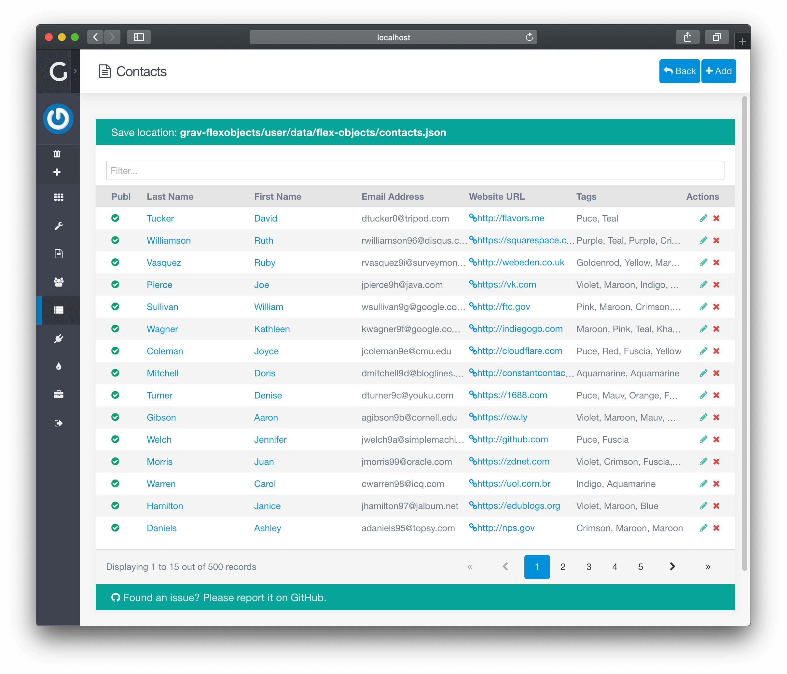

Grav 1.7 で、 **管理パネル** を使ったことがあれば、すでに **Flex オブジェクト** を使っています。最良の具体例は、 **Accounts** と **Pages** です。これらは、**Flex** でできることの素晴らしい具体例です。

デフォルトでは、 **Flex Directory の管理画面** は、ユーザーに表示されません。 **Flex ディレクトリ** を表示するためには、それを有効化しなければいけません。有効化された flex ディレクトリは、管理パネルのサイドバーの **ナビゲーションメニュー** か、**Flex Objects** のプラグイン管理メニューか、もしくは他のプラグイン中の、いずれかに表示されます。

> [!Info]  
> カスタムディレクトリを利用するには、**Flex Objects** プラグインを有効化しなければいけません。

> [!訳注]  
> ここはわかりにくいですが、Flex プラグインを有効化したうえで、各Flex ディレクトリを有効化しないといけない、ということが言いたいのだろうと思います。  
> Flex プラグインの有効化というのは、`user/config/plugins/flex-objects.yaml` ファイルの `enable: true # or false` のことを指し、 Flex ディレクトリの有効化というのは、同じ yaml ファイルの `directories: - 'blueprints: ...'` となっているリストに載っていることを指しています。  
> 管理パネルでの方法は、以下説明されます。

<h2 id="enabling-a-directory">Flex ディレクトリの有効化</h2>

カスタムの **Flex ディレクトリ** を有効化するには、管理パネルで、サイドバーの **Plugins** > **Flex Objects** へとページ移動してください。

プラグイン内の **Directories** オプションには、検出されたすべての **Flex ディレクトリ** がリストになっています。有効化したいディレクトリを選択し、 `Enabled` になっているか確認してください。

**Save** ボタンをクリックすると、ページをロード後、ディレクトリが表示されます。

> [!Note]  
> **TIP:** ディレクトリを表示するページの作り方は、 **[はじめに](./01.introduction/)** を、ひととおりチェックしてください。

<h2 id="directory-listing">Flex ディレクトリの一覧</h2>

デフォルトでは、 **Flex オブジェクト** のナビゲーションメニューアイテムは、サイトで有効化されている **Flex ディレクトリ** すべてが含まれます。

> [!Info]  
> ただし、いくつかの Flex ディレクトリは、このリストに表示されず、別の場所に表示されます。 **Accounts** と **Pages** がその良い例です。

<h4 id="controls">コントロール</h4>

ページの上部に、管理用のコントロール部分があります。

- **Back** ： **[Dashboard](../../../05.admin-panel/02.dashboard/)** に戻る 
- **Configure** ：  **Plugins** > **Flex Objects** にリダイレクトします。 [ディレクトリを有効化してください](#enabling-a-directory)

<h4 id="directories">flex ディレクトリ</h4>

flex ディレクトリを選択すると、 **Content Listing** 画面が表示されます。

**[コンテンツリスト](./01.views-list/)** では、flex オブジェクトを閲覧し、 **検索** 、や **順序** の変更ができます。さらに、各オブジェクトに **アクション** があり、とりわけ **編集** や **削除** ができます。また、ページ上部の **Add** ボタンにより、新しい flex オブジェクトを追加することも可能です。その隣には、 **Configuration** ボタンもあり、ディレクトリ全体の設定を変更することもできます。

**[コンテンツエディタ](./02.views-edit/)** では、 flex オブジェクトを編集し、 **保存** できます。

**[Config 設定](./03.configuration/)** では、ディレクトリ全体のふるまいを変更できます。通常、キャッシュもこれらのオプションのひとつです。

