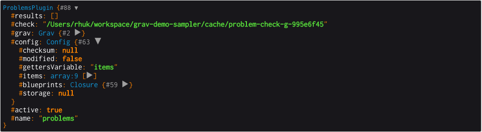

テーマとプラグインを開発するとき、しばしば **デバッグ** 情報を表示する必要があります。Grav にはさまざまな種類の機能により、強力にデバッグできます。

<h2 id="debug-bar">デバッグバー</h2>

Grav には、 **デバッグバー** と呼ばれる、デバッグの努力を簡単にしてくれるすばらしいツールがあります。この機能は、デフォルトでは **無効化** されていますが、`system.yaml` 設定ファイルから有効化できます。すべての環境でも適用できますし、もしくは [開発環境](../04.environment-config/) でのみ適用することもできます。

```yaml
debugger:
  enabled: true                        # Grav のデバッガと以下の設定を有効化する
  provider: debugbar                   # デバッガに provide を設定する
  shutdown:
    close_connection: true             # onShutdown() 関数が呼ばれる前にコネクションを閉じる。デバッグ中は false にしてください。
```


> [!Info]  
> 最初に有効化したとき、デバッグバーはページの左下に、小さい Grav アイコンとして表示されるかもしれません。クリックすると、デバッグバー全体が表示されます。

PHP デバッグバーは、これまで通り全体的な **プロセス時間** や **メモリー使用** を表示しますが、新しくいくつかのタブで、より詳しい情報を提供するようになりました。

最初のタブは、 **Messages** です。あなたのコードからこのタブに情報が投稿されることで、 Grav の開発時の処理のデバッグに役立ちます。

**Request** や、 **Exceptions** そして **Configuration** 情報とともに、 **Timeline** パネルでは、 Grav のタイムライン上の詳細な内訳を見ることもできます：


<h3 id="dump-command-for-php">PHP 向けの dump コマンド</h3>

PHP をデバッグしているとき、たとえば開発中のカスタムプラグインで、オブジェクトや変数を素早く調べたいときには、パワフルな `dump()` コマンドを利用できます。この関数には、基本的な PHP 変数であれば何でも渡せて、結果をきれいにフォーマットし、着色してブラウザに表示します。

たとえば、PHP 変数やオブジェクトを簡単に dump できます：

```php
dump($myvariable);
```

ブラウザでは、次のように結果が表示されます：



次のような構文を利用することで、デバッグバーの **Messages** タブに変数を dump することもできます：

```php
$this->grav['debugger']->addMessage($myvariable)
```

<h3 id="dump-command-for-twig">Twig 向けの dump コマンド</h3>

また、 Twig 変数を Twig テンプレートから表示することもできます。これは、同じように行われますが、結果はデバッグバーの **Messages** パネルに表示されます。この機能は、デフォルトでは **disabled** です。しかし、`system.yaml` config ファイルにより、グローバルに有効化するか、 [環境設定](../04.environment-config/) で特定の環境のみで有効化できます：

```yaml
twig:
  debug: true                        # Enable Twig debugger
```

たとえば、 Twig 変数やオブジェクトを簡単に dump できます：

```twig
{{ dump(page.header) }}
```

結果を、デバッグバーで確認できます：


同時に複数の dump コマンドを出力することは可能ですが、見分けられず混乱するかもしれません。静的なテキストを次のように追加してください：

```twig
{{ dump('page.header output:',page.header) }}
```

```
  // 翻訳元でリンク切れ画像です
```

<h3 id="dump-to-browser-console-from-twig">Twig からブラウザのコンソールに dump</h3>

ページが Grav から返ってくる前に変数を表示したい場合や、ページの再読込みが発生しない場合（たとえば AJAX を利用しているような場合）は、他の方法を取ります。JavaScript の1行を使って、変数をブラウザの developper console に表示できます。次のように：

```twig
<script> console.log({{ page.header|json_encode|raw }}) </script>
```

それから、ブラウザのコンソールで値を確認できます：


<h2 id="error-display">エラー表示</h2>

新しいエラー表示ページでは、詳細情報や、 backtraces 、そして関連するコードブロックまで提供しています。これにより、より早くクリティカルエラーを分離し、特定し、解決することができるようになります。デフォルトの Grav では、有効化されていないため、開発中のエラーハンドリングに役立てるためには、有効化する必要があります：

```yaml
errors:
  display: true
```


本番環境では、詳細なエラーページを非表示にして、かわりに、より控えめなエラーページを表示することができます。 `user/config/system.yaml` ファイルの errors オプションを設定することで可能です。エラーログをファイルに残すこともできます：

```yaml
errors:
  display: false
  log: true
```


<h2 id="logging">ログ</h2>

情報をログに記録する機能は、しばしば便利ですが、これまで同様、 Grav ではパワフルなログ機能をシンプルな方法で提供します。以下の構文のいずれかを利用してください：

```twig
$this->grav['log']->info('My informational message');
$this->grav['log']->notice('My notice message');
$this->grav['log']->debug('My debug message');
$this->grav['log']->warning('My warning message');
$this->grav['log']->error('My error message');
$this->grav['log']->critical('My critical message');
$this->grav['log']->alert('My alert message');
$this->grav['log']->emergency('Emergency, emergency, there is an emergency here!');
```

すべてのメッセージは、 `/logs/grav.log` ファイルに追記されます。

