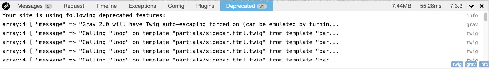

Grav 1.6 は、Grav の最初のリリース以来、最大のアップデートでした。いくつかの新機能追加、改善、バグ修正がなされ、そして Grav 2.0 への道を開くたくさんのアーキテクチャの変更が提供されています。

> [!Warning]  
> **重要：** 多くの人にとって、 Grav 1.6 は何の問題もなく簡単にアップグレードできるものです。しかし、あらゆるアップグレードがそうであるように、サイトのアップグレード前には、サイトの **バックアップを取り** 、**テスト環境でアップグレードのテストをしてください** 。

あなたが開発者もしくはサイト管理者であれば、テストサイトでは [デバッグバー](../../03.debugging/#debug-bar) を有効化してください。なぜなら、デバッグバーには、いくつかの便利なツールがあり、それらによって、 Grav のそれ以降のバージョンで動作する準備を確実にしてくれるからです。

> [!TIP]  
> 機能を有効化する方法に関するより詳しい情報は、このドキュメントの [デバッグとログ](../../03.debugging/) セクションを参照してください。

<h2 id="deprecated-debug-bar-tab">デバッグバーの deprecated タブ</h2>

デバッグバーの **Deprecated （非推奨）** タブを見てください。
このタブは、非推奨の問題を特定し、 Grav を新しいバージョンへアップグレードする前に、それらを修正したり、レポートしたりしてくれます。 **Deprecated** タブ内にある問題を修正ことで、サイトは速くなり、将来アップグレードする時間を削減してくれます。



> [!Note]  
> **Deprecated** タブに表示されるのは、そのページで非推奨のコールが検出されたときだけです。

すべての問題を確実に捕まえるために、キャッシュをクリアし、キャッシュを無効化して Grav を実行すべきです。そうすることで、すべてのエラーを捕まえる可能性が最大化されます。以下の手順を進める際でさえ、キャッシュのクリア後にのみ YAML/Twig エラーのいくつかが現れることに気がつくかもしれません。

**Deprecated** タブには、見つかった非推奨機能のリストが掲載されます。すべての問題について、クリックして非推奨に関するメッセージを開くことができます。このメッセージは、問題と問題の所在をさかのぼる簡単な説明文で、このメッセージのおかげで、コードの場所が分かり、修正できるようになります。右側には、非推奨エラーのタイプが表示されます。右下のバッジをクリックすることにより、表示されたタイプをフィルタリングできます。

非推奨メッセージを開いたとき、最初のうちはその内容に圧倒されるかもしれません。しかし多くの場合、必要なのは最初の数行で、（メッセージと、ファイルと、もしあれば行数）で、ほとんどの内容は無視できます。

非推奨の問題は、いくつかのタイプに分けられます：

* `yaml`: YAML もしくはマークダウンファイルで、非推奨の YAML 構文を使っている。
* `twig`: Twig ファイルに、非推奨の Twig 構文を含んでいるか、もしくはそれ以外の Twig 関係の問題。
* `grav`: Grav の非推奨のメソッドもしくはプロパティが使われている。
* `vendor`: 非推奨のサードパーティ製ライブラリコードが使われている。
* `unknown`: 上記以外の非推奨メッセージ。

<h2 id="yaml-parsing">YAML のパース</h2>

> [!Note]  
> Grav 1.6 では、 YAML は後方互換性のフォールバックにより厳密にパースされます。

Grav 1.6 では、 **Symfony 4.2 YAML parser** が使われます。これは、以前の Symfony **3.4** のパーサーよりも、より厳密に [YAML 標準仕様](https://yaml.org/spec) に従っています。これはつまり、以前機能していた YAML ファイルであっても、妥当でない YAML であればエラーを起こしうるということです。しかし、ファイルが **4.2** バージョンのパーサーで読み込み失敗したとしても、 Grav はデフォルトで古い **3.4** バージョンのパーサーで読み込み、サイトを運用し続けます。とはいえ、このことはサイトパフォーマンスを悪化させるので、問題を見つけ、修正し、パフォーマンスを最適化すべきです。

> [!Note]  
> このフォールバック機構は、 Grav 2.0 で削除予定です。

**Grav 1.6.7** 以降では、 YAML パース時の問題を検出する CLI コマンドが新しく追加されました。 `bin/grav yamllinter` を実行し、サイト内の YAML パースエラーを見つけ、修正してください。 Grav 1.6 以上にアップグレードした直後に、このコマンドを実行することをおすすめします。

**管理パネルプラグイン 1.9.3** 以降では、 **YAML Linter** を **Tools** > **Reports** に統合していますので、 CLI コマンドのかわりにこちらを利用することもできます。

<h5 id="look-for-these-yaml-errors">YAML エラーの探し方</h5>

- クオテーションマークで囲んでいない文字列の最初を `@`, `\`, `|`, `%` そして `>` で始めないでください。 `@data-options: []` を使わないでください。代わりに、 `data-options@: []` を使ってください。
- すべてのキーについて、コロン `:` の後はホワイトスペースを入れてください。 `key:value` ではなく、 `key: value` を使用してください。
- すべてのキーについて、 `null`, `true`, `false`, `2.0` (実数値) は、クオテーションマークで囲んでください。キーは、整数もしくは文字列のみです。
- 同様に、値の `null`, `true`, `false`, `2` そして `2.0` は、それが文字列を意味するのであれば、クオテーションマークで囲んでください。
- 文字列をダブルクオテーションで囲む場合は、 `\` 文字でエスケープしなければいけません。

また、デバッグバーで、非推奨の YAML を見つけることができます。デバッグバーを開き、 **Deprecation** タブを見るだけです。タブが見当たらない場合は、問題は検出されていません。

> [!Tip]  
> デバッグバーの **右下隅のバッジ** で、 **YAML** 問題をフィルタリングできます。 YAML 以外のボタンをクリックすることで、それらを無効化するだけで、簡単に **YAML** 問題だけをフィルタリングして表示できます。

> [!Note]  
> YAML エラーは、キャッシュクリアを必要とします。エラーは、 YAML ファイルが読み取られるときにだけ検出されます。

<h3 id="yaml-compatibility-mode">YAML 互換モード</h3>

デフォルトでは、 YAML 互換モードは、 Grav 1.6 で有効化されています。これにより、アップグレード後も、古いサイトを動かし続けることができますが、この状態は、新しいサイトでは理想的とは言えません。YAML パースのエラーについて、修正し、テストをしてください。

この設定は、 `user/config/system.yaml` で変更できます：

```yaml
strict_mode:
  yaml_compat: false
```

既存サイトでは、この設定を触らないことをおすすめします。むしろ、互換モードを **false** にして、テストサイトを作成してください。Grav 1.6 以上で作成された新しいサイトは、すべて互換モードが無効化しておいてください。これにより、 Grav 2.0 にアップグレードする際には、多くの時間が削減できます。

## Twig

<h3 id="deferred-blocks">遅延ブロック</h3>

あなたのテーマをアップデートして、 Grav 1.6 で提供された遅延アセットブロックがサポートされるようにしてください。もしくは、テーマを修正してカスタムテーマにしていたり、独自のテーマを開発している場合は、ご自身でこの新しい機能と、Grav とそのプラグインの新しいバージョンが使えるようにしてください。以下のブログ投稿が参考になります： [Important Theme Updates](https://getgrav.org/blog/important-theme-updates)

<h3 id="deprecated-twig">Twig における非推奨</h3>

Grav 1系で、現在使われている Twig 1系の代わりに、Grav 2.0 では、 **Twig 2系** を使う予定です。Twig 2 では、いくつかの非推奨機能があります。このため、 Grav 2.0 へアップグレードする前に、これらの問題をすべて見つけ出し、修正しておくと良いでしょう。

デバッグバーでは、 Twig の非推奨問題を見つけることができます。デバッグバーを開き、 **Deprecated** タブをクリックしてください。

<h5 id="look-for-these-twig-issues">Twig 問題の探し方</h5>

- ファイルでインポートしたマクロは、（include 呼び出し経由の）子テンプレートでは利用できない。これらで利用する場合は、各ファイルで明示的にマクロをインポートする必要。
- `|replace()` フィルタは、パラメータとして連想配列が渡されたときのみ機能する：`{ "I like this and that."|replace({'this': 'foo', 'that': 'bar'}) }}`.
- `sameas()` によるテストは、 `same as()` と書かれるべき。

非推奨に関するより詳しい情報は、 [このページで見つかります](https://twig.symfony.com/doc/1.x/deprecated.html) 。

<h3 id="auto-escaping">オートエスケープ</h3>

Grav は、 XSS 攻撃を除けば、脆弱性からは安全です。XSS 攻撃は、ユーザーからの信頼できない入力を適切にエスケープしていないコードがあれば、大した労力もなく発生してしまう脆弱性です。Twig は、テンプレートファイルを簡単に作成できますが、同時に、テンプレートファイル内で使われる多くの変数について、それらをサニタイズすることも忘れられがちです。たとえ入力がフィルタリングされ、安全であったとしても、本来エスケープされるべき特殊文字が含まれていて、適切な HTML コードが作成されない可能性があります。

たとえば、以下のような Twig テンプレートがあったとします：

```twig

<p>
    {{ my_string }}
</p>
```

デフォルトでは、 Grav は **Twig オートエスケープを無効化して** 、テンプレートのシンプル化、クリア化してきましたが、不幸なことに、これは良くない決定でした。特殊文字が含まれるかもしれない、もしくは信頼できないソースからの変数に、常にエスケープし続けることを覚えていられる人など、私たちも含め、誰もいなかったからです。より悪いことに、その変数が HTML 安全かどうかも、通常は分からないものです。ほとんどの XSS 脆弱性からサイトを守るには、 config 設定でオートエスケープを有効化すべきです。不幸なことに、 Twig テンプレートを使うテーマやプラグインは、この設定が有効化されていると機能しない傾向があります。 -- そして、明示的にエスケープされていないテンプレートは、悪意のあるコンテンツに対して脆弱である場合が多いです。

上記の例では、オートエスケープが無効化されているので、出力はピュアな HTML としてレンダリングされるでしょう。そして、アラートボックスが `"hello there!"` とポップアップされます。しかし、 Twig エスケープフィルタの `|e` もしくは `e|('html')` を使って、この部分をエスケープするべきです：

```twig

<p>
    {{ my_string|e }}
</p>
```

多くの人は、 Twig 内の変数をエスケープし忘れる傾向にあり、すべての場所に `|e` を使うのはテンプレートファイルの可読性を落とすため、 `user/config/system.yaml` に新しい設定が用意されました：


```yaml
strict_mode:
  twig_compat: false
```

この設定は、すべての Twig テンプレートファイル内で、 `オートエスケープ` を有効化することに特化しています。そして、オートエスケープの有効化・無効化の古い設定を破棄します。この設定の副作用として、サイトには、いくつかのコンテンツのかけらが残されます。それらは、コンテンツが無理にエスケープされたもので、 `|raw` フィルタを使って HTML を、 HTML のみを含むように修正されなければいけません。多くのテンプレートとプラグインは、強制エスケープに対応したアップデートをしていません。そのため、これらの修正が必要なバグについて、速やかに報告をお願いします。

オートエスケープを使うための変更については、簡単なものではありません。変更中に、すべてのテンプレートファイルには、 `|e` と、 `|raw` の両方のフィルタが存在し、テンプレートファイルがどちらのモードでも安全になるようにしなければなりません。もしくは、 Twig タグの `` を使うこともできます。

より詳しい情報は、 [Twig マニュアル](https://twig.symfony.com/doc/1.x/tags/autoescape.html) をご覧ください。

