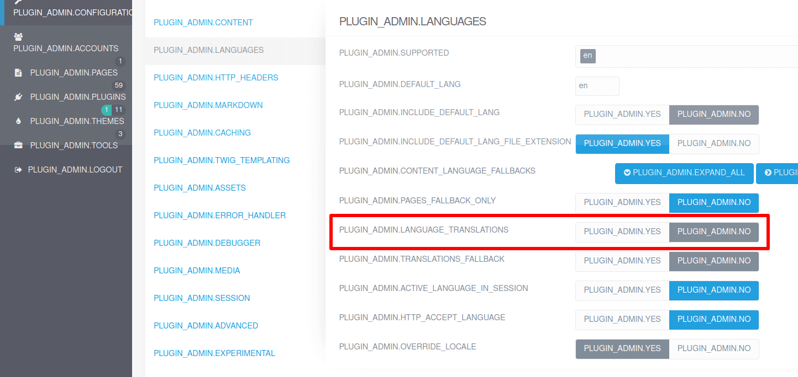

Grav 1.7 では、いくつかの新機能追加、改善、バグ修正がなされ、そして Grav 2.0 への道を開くたくさんのアーキテクチャの変更が提供されています。以下は、そのうちの重要部分です：

* **Flex Objects**: 独自のデータタイプを作成する新しい方法
* **Symfony Server**: web サーバーをインストールせずに Grav を実行
* **Improved Multi-Language**: 言語フォールバックの改良、管理パネルサポートの改善
* **Improved Multi-Site**: マルチサイトサポートに向けた管理パネル改善
* **Improved Admin ACL**: ユーザーとページに対して完全な CRUD をサポート
* **Improved Media Support**: `webp` 画像フォーマットのサポート、遅延読み込み、その他
* **Improved Caching**: 新しい `` タグ、及び特に管理パネルにおけるパフォーマンス改善
* **XSS Detection in Forms**: XSS が疑われる場合、フォームは送信されません。チェックを無効化する方法は [フォームオプションのドキュメント](../../../06.forms/02.forms/01.form-options/#xss-checks) をご覧ください。
* **Better Debugging Tools**: [Clockwork](https://underground.works/clockwork/) の統合、 Twig プロファイル、そしてパフォーマンスプロファイルのための [Tideways XHProf](https://github.com/tideways/php-xhprof-extension) PHP 拡張のサポート

> [!Warning]  
> **重要：** 多くの人にとって、 Grav 1.7 は何の問題もなく簡単にアップグレードできるものです。しかし、あらゆるアップグレードがそうであるように、サイトのアップグレードの前には、サイトの **バックアップを取り** 、 **テスト環境でアップグレードのテストをしてください** 。

<h3 id="most-common-issues">最もよくある問題</h3>

1.  ###### HTML が、意図した通り **レンダリングされた** HTML としてではなく、 **コード** として表示されてしまう
    この振る舞いは、 Grav 1.7 で **オートエスケープ** がデフォルトで有効となった結果です。これはセキュリティ強化策であり、 1.7 以前のバージョンからアップグレードした場合、 system config 設定の **Twig 互換** 設定が自動的に有効化します。古い Twig コードが機能し続けるためのものです。もし手動で 1.7 にアップデートしたり、 GPM のセルフアップグレード処理ではない方法でアップグレードした場合、この設定はあなた自身で行う必要があります。  
    このガイドの [Twig セクション](#twig) に完全な詳細があります。確認してください。

2.  ###### invalid(妥当でない) YAML エラーが出現する
    Symfony フレームワークのバージョンを上げたため、 YAML パーサーが 1.7 以前のものよりも厳密になりました。これを制御するため、 **YAML 互換** 設定を有効化したときに利用するための古いバージョンのパーサーが用意されています。Grav 1.7 に GPM でアップグレードした場合、これは自動的に制御されますが、手動でアップグレードした場合は、あなた自身で設定を行う必要があります。  
    このガイドの [YAML セクション](#yaml) に完全な詳細があります。確認してください。

3. ###### 管理パネルに翻訳されない文字列が表示される
    管理パネルのインターフェースに翻訳されていない文字列が表示される場合、最もあり得る理由は、以前 **言語翻訳** を無効化していたからです。これは、以前のバージョンの Grav にあったバグで、これを無効化しても、管理画面上では、翻訳が実質的には無効になっていませんでした。これは、 Grav 1.7 で **修正され** 、この設定は、意図した通りに機能します。翻訳文字列そのものではなく、翻訳コードが大文字で表示されます。  
    修正のため、 [トラブルシューティング](#troubleshooting-issues) セクションを確認してください。

4. ###### 管理パネルで保存時エラーもしくは保存ができない
    Grav 1.7 では、 **Flex Pages** が導入され、新しいデフォルトのページ管理 UI となりました。また、パフォーマンス最適化のため、毎回の管理パネル呼び出しごとにページを初期化することをやめました。通常の **Grav Pages** に戻すことにより、一時的にこの問題を解決することができます。 **FlexObjects** プラグインを編集し、 **Pages (Admin)** を無効化することにより、これが完了します。  
    問題を適切に指し示すため、カスタムプラグインは `PageInterface` を使って、  **Grav Pages** と **Flex Pages** の両方をサポートスべきです。そして、必要な場合は、 Pages を明示すべきです。  
    このガイドの [Pages セクション](#pages-1) と [Admin セクション](#admin) に完全な詳細があります。確認してください。  
    また、プラグイン特有の既知の問題もあります。プラグインに特有の問題については、このページの [トラブルシューティング](#troubleshooting-issues) を確認してください。

5. ###### ページブループリントの機能が止まるもしくはループに関するエラーが出る
    **Grav 1.7.8** で、テーマ内の **ブループリント** を定義するためのサポートが追加されました。これはつまり、もし `blueprints/pages/` フォルダ内のページのブループリントがあった場合に、標準的なブループリントの場所が、プラグインと同じように使われるということです。残念ながら、古いテーマは、場合によって `blueprints/` フォルダと、 `blueprints/pages/` フォルダでファイルが混同していることがあり、その場合は検出されず、ページを編集するときに管理パネルの入力フィールドが見えなくなったり、 `Loop detected while extending blueprint file` という致命的エラーが発生します。  
    もしいずれかのエラーが発生した場合は、 [トラブルシューティング](#troubleshooting-issues) セクションを確認して修正してください。

<h3 id="quick-update-guide">アップデートのクイックガイド</h3>

> [!Info]  
> **Grav 1.7** では、 **PHP 7.3.6** 以上が必要です。推奨バージョンは、最新リリースの **PHP 7.4** です。

### YAML

> [!Warning]  
> **重要：** Grav 1.7 YAML パーサーは、より厳格になり、config ファイルやページヘッダーに構文エラーがある場合、サイトが壊れるかもしれません。しかし、 `bin/gpm` や `管理パネルプラグイン` を使って既存のサイトをアップデートした場合、壊れた YAML 構文が機能し続けるようにアップグレード処理されます。

古い動作に戻すには、 `user/config/system.yaml` ファイルの以下の設定を確認する必要があります：

```yaml
strict_mode:
  yaml_compat: true
```

もしくは、管理パネルプラグインで、 **Configuration** -> **Advanced** -> **YAML Compatibility** を確認してください。


> [!Tip]  
> **Grav 1.6 アップグレードガイド** には、専用の **[YAML パース](../02.grav-16-upgrade-guide/#yaml-parsing)** セクションがあり、これらの問題を修正するのに役立ちます。

デフォルトでは、 Grav 1.7 は **Symfony 4.4 YAML パーサー** を使います。これは、古い Grav のバージョンよりも [YAML 標準仕様](https://yaml.org/spec) に準拠しています。これはつまり、以前は正しく機能していた YAML ファイルが、妥当でない YAML によりエラーを引き起こす可能性があるということです。しかし、 Grav はデフォルトで、古い 3.4 バージョンのパーサーへフォールバックし、サイトを運用し続けます。

> [!Tip]  
> アップグレードの前後に、 **CLI コマンドで** `bin/grav yamllinter` を実行するか、もしくは管理パネルで **Admin** > **Tools** > **Reports** を表示してください。warning もしくは error になっている YAML がすべて修正されます。

### Twig

> [!Warning]  
> **重要：** Grav 1.7 は、 **Twig オートエスケープ** をデフォルトで有効化します。しかし、既存サイトを `bin/gpm` もしくは `管理パネルプラグイン` でアップデートした場合は、アップグレードの処理中に既存のオートエスケープ設定を残します。

古いやり方に戻すためには、 `user/config/system.yaml` ファイル中で、以下の設定を確認してください：

```yaml
twig:
  autoescape: false
strict_mode:
  twig_compat: true
```

もしくは、管理パネルプラグインで、 **Configuration** -> **Advanced** -> **Twig Compatibility** を表示してください。

そして、これを実行後は、忘れずにキャッシュをクリアしてください！


> [!Tip]  
> **Grav 1.6 アップグレードガイド** には、専用の **[Twig](../02.grav-16-upgrade-guide/#twig)** セクションがあります。先にここを読んでおくことがとても重要です！

Twig テンプレートエンジンは、 1.43 にアップデートされましたが、 Twig 2.13 もサポートされます。この新しいバージョンの Twig をサポートするため、既存サイトの Twig テンプレートにある古い構文をアップデートする必要があります。 **Grav 1.6 アップグレードガイド** は、これを行う際に役立ちます。

テンプレートに関する他の変更は：

* `` Twig タグが新しく追加され、 `twigcache` 拡張が不要になりました。
* `array_diff()` twig 関数が追加されました
* `template_from_string()` twig 関数が追加されました。
* 新しく `svg_image()` twig 関数が追加され、 Twig 内で SVG の 'include' が簡単になりました。
* `url()` twig 関数が改善され、3つ目の引数 (`true`) により、false を返す代わりに存在しないファイルの URL を返します。
* `|array` twig フィルタが改善され、イテレータ及び `toArray()` メソッドを持つオブジェクトに対して機能するようになりました。
* `authorize()` twig 関数が改善され、ネストされたルールパラメータでうまく機能するようになりました。
* `|yaml_serialize` twig フィルタが改善されました。 `JsonSerializable` オブジェクトと、その他の配列に似たオブジェクトをサポートします。
* `external.html.twig`, `default.html.twig`, そして `modular.html.twig` について、デフォルトのテンプレートが追加されました。
* **後方互換性の効かない事例** : `` では動かなくなるため、 `in` ではなく、 `` のように使ってください。

## Forms

> [!Warning]  
> **重要：** Grav 1.7 では、 **Strict Validation** （厳密なバリデーション）のふるまいに変更があります。しかし、既存サイトを `bin/gpm` や `管理パネルプラグイン` でアップデートした場合、アップグレードプロセスにより、既存の strict モードの振る舞いが使い続けられます。

**Strict モードの改善** : form 内で、 `validation: strict` を定義しても、バグにより望んだような厳密さになっていませんでした。strict モードでは、フォームから余分なフィールドを送信しないようにするべきで、 Grav 1.7 から修正されました。残念ながら、古いフォームの多くは、余分なデータが入っていても、厳密だと宣言していました。

古いやり方に戻すためには、 `user/config/system.yaml` ファイル内の以下の設定を確認してください：

```yaml
strict_mode:
  blueprint_compat: true
```

**XSS インジェクション検出** が、すべてのフロントエンドフォームでデフォルトで有効化されました。フォームごと・フィールドごとに無効化やカスタマイズする方法については、 [ドキュメント](../../../06.forms/02.forms/01.form-options/#xss-checks) を参照してください。

このため、古い `validation: strict` のやり方をメンテナンスするために、新しく `system.strict_mode.blueprint_compat: true` という config オプションを追加しました。この設定は、 `validation: strict` 機能を利用する際には、 無効化しておくことを推奨します。もしこの機能を利用する場合、行を削除するか、フォームが機能するかテストしてください。

> [!Note]  
> この後方互換のメカニズムは、 Grav 2.0 で削除予定です。

<h3 id="environments-and-multi-site">環境変数とマルチサイト</h3>

> [!Warning]  
> **重要：** Grav 1.7 では、 [環境変数](../../04.environment-config/) を `user/env/` フォルダに移しました。古いフォルダでも動きますが、将来的に機能が新しいフォルダを利用する可能性があるので、環境変数をひとつのフォルダに移動しておくことをおすすめします。

Grav 1.7 では、 [サーバー設定をもとにした環境設定](../../04.environment-config/#server-based-environment-configuration) や、 [サーバー設定をもとにしたマルチサイト設定](../../05.multisite-setup/#server-based-multi-site-configuration) もサポート対象に追加しました。この機能は、たとえば Docker コンテナを利用する場合や、それらを独立させておきたい場合に便利です。もしくは、config 設定内に機密情報を保存しておきたくない場合に、サーバーの設定に保存したい場合に便利です。

`setup.php` ファイルに加えて、 `GRAV_ROOT/setup.php` や、 `GRAV_ROOT/GRAV_USER_PATH/setup.php` も利用可能です。2つ目の例は、 Git リポジトリで user フォルダのみを含めたい環境での利用のときに便利です。

<h3 id="user-accounts">ユーザーアカウント</h3>

管理パネルプラグインは、新たに **Flex Users** を使用して [アカウントを管理](../../../05.admin-panel/03.accounts/) するようになりました：

* [ユーザーアカウントマネージャー](../../../05.admin-panel/03.accounts/01.users/)
* [ユーザーグループマネージャー](../../../05.admin-panel/03.accounts/02.groups/)

> [!Note]  
> Flex Users 機能は、サイトのフロントエンドでは、まだ使われていません。

<h3 id="pages">ページ</h3>

既存の [ページ管理](../../../05.admin-panel/03.page/) が、 **Flex Pages** により大幅に改善しました：

* ページ一覧リストを再構築：ページ数のよりずっと多いサイトでも対応できるようになりました
* アクセス制御の改善： [CRUD ACL](../../../05.admin-panel/03.page/06.permissions/) がページ所有者をサポートします
* 多言語サポートの改善

> [!Info]  
> **後方互換性はありません** ： ルーティング可能かつ公開されている子ページを持つ、ルーティングできないページを訪れた時の 404 エラーページの取り扱いを修正しました。新しい取り扱いは、最初のルーティング可能で公開されている子ページへリダイレクトされます。これはおそらく、もっとも望ましいページでしょう。

> [!Note]  
> Flex Pages 機能は、サイトのフロントエンドでは、まだ使われていません。

<h3 id="multi-language">多言語</h3>

Grav 1.7 では、多言語サイトでのページのフォールバック機能のふるまい方が変更されました。

以前は、リクエストされた言語のページが存在しない場合、次にサポートされている言語を探す実装となっていました。これはつまり、翻訳されていないページが常に表示されることになり、読み手にとって知らない言語を使ったページである可能性がありました。

新しいふるまいでは、サイトのデフォルト言語にのみフォールバックします。このデフォルトのふるまいは、 `system.languages.content_fallback` 設定オプションを使うことで、言語ごとにフォールバック言語の設定を上書きできます。

フォールバック言語のいずれも、ページが存在しない場合、 **404 Not Found** エラーが代わりに表示されます。

> [!Info]  
> **後方互換性がありません** ： `system.yaml` ファイルもしくは管理パネルプラグイン（ **Configuration** > **System** > **Languages** > Content Language Fallback** ）で、ページコンテンツの現在のフォールバック言語を追加してください。

<h3 id="media">メディア</h3>

メディア制御は、 Grav 1.7 で大幅に改善されました。特筆すべき点としては：

* `webp` 画像フォーマットをサポート
* マークダウン： 画像にネイティブの `loading=lazy` 属性をサポート。 `system.images.defaults` もしくは、画像のマークダウン記述ごとに `?loading=lazy` を付けることで設定できます。
* `noprocess` 機能を追加し、リンクや画像の抜粋において、特定のアイテムについて処理をしないことができます。例： `http://foo.com/page?id=foo&target=_blank&noprocess=id`

### CLI

いくつかの特筆すべき点は：

* すべての CLI コマンドで `--env` と `--lang` パラメータを受け付けます。環境変数を設定したり、利用言語を設定できるようになりました。（`-e` は、現在機能しません）
* `bin/grav server` CLI コマンドが追加され、簡単に Symfony もしくは PHP ビルトインサーバーが実行できるようになりました
* `Scheduler` cron コマンドチェックが改善され、より便利な CLI 情報も改善されました
* `-r <job-id>` オプションが新しく追加され、 Scheduler CLI コマンドで job の強制実行ができるようになりました
* `bin/grav yamllinter` CLI コマンドが改善され、サイト全体や特定のフォルダのみについか YAML リントの問題を探すオプションが追加されました
* CLI/GPM コマンドが失敗したとき、非ゼロコードを返します（コマンドが失敗するときエラーが検出されます）

<h3 id="configuration">config 設定</h3>

新しく config オプションが追加され、 `false` を設定するとデフォルト言語が `.md` ファイルのままにできるようになりました
* system.yaml ファイル： `languages.include_default_lang_file_extension`: **true**|false
* 管理パネルプラグイン： **Configuration** > **System** > **Languages** > **Include default language in file extension**

新しく config オプションが追加され、すべての言語に対して、個別にコンテンツが無かった場合のフォールバック言語を設定できるようになりました
* system.yaml ファイル： `languages.content_fallback` ： [言語設定](../../../02.content/11.multi-language/#language-configuration) を参照してください
* 管理パネルプラグイン： **Configuration** > **System** > **Languages** > **Content Language Fallback**

新しく config オプションが追加され、デバッガと clockwork が選べるようになりました
* system.yaml ファイル： `debugger.provider`: **clockwork**|debugbar
* 管理パネルプラグイン： **Configuration** > **System** > **Debugger** > **Debugger Provider**

新しく config オプションが追加され、潜在的なセンシティブ情報をかくせるようになりました
* system.yaml ファイル： `debugger.censored`: **false**|true
* 管理パネルプラグイン： **Configuration** > **System** > **Debugger** > **Censor Sensitive Data**

新しく config オプションが追加され、 `validation: strict` のふるまいをメンテナンス（過去のままに）できるようになりました
* system.yaml ファイル： `strict_mode.blueprint_compat`: **true**|false
* 管理パネルプラグイン： **Configuration** > **System** > **Advanced** > **Blueprint Compatibility**

新しく config オプションが追加され、 `HTTP_X_FORWARDED` ヘッダーをサポートしました（デフォルトで無効です）
* system.yaml ファイル： `http_x_forwarded.protocol`: **true**|false
* 管理パネルプラグイン： **Configuration** > **System** > **Advanced** > **HTTP_X_FORWARDED_PROTO Enabled**
* system.yaml ファイル： `http_x_forwarded.host`: true|**false**
* 管理パネルプラグイン： **Configuration** > **System** > **Advanced** > **HTTP_X_FORWARDED_HOST Enabled**
* system.yaml ファイル： `http_x_forwarded.port`: **true**|false
* 管理パネルプラグイン： **Configuration** > **System** > **Advanced** > **HTTP_X_FORWARDED_PORT Enabled**
* system.yaml ファイル： `http_x_forwarded.ip`: true|**false**
* 管理パネルプラグイン： **Configuration** > **System** > **Advanced** > **HTTP_X_FORWARDED IP Enabled**

新しく config オプションが追加され、 `security.sanitize_svg` により SVG ファイルから潜在的に危険なコードを削除できるようになりました
* security.yaml ファイル： `sanitize_svg`: **true**|false
* 管理パネルプラグイン： **Configuration** > **Security** > **Sanitize SVG**

<h2 id="developers">開発者向け</h2>

<h3 id="debugging">デバッグ</h3>

* [Clockwork](https://underground.works/clockwork) ディベロッパーツールをサポートしました（現在のデフォルトのデバッガです）
* Added support for [Tideways XHProf](https://github.com/tideways/php-xhprof-extension) PHP Extension for profiling method calls
* Added Twig profiling for Clockwork debugger

### Use composer autoloader

* Upgraded `bin/composer.phar` to `2.0.2` which is all new and much faster
* Please add `composer.json` file to your plugin and run `composer update --no-dev` (and remember to keep it updated):

    composer.json
    ```json
    {
        "name": "getgrav/grav-plugin-example",
        "type": "grav-plugin",
        "description": "Example plugin for Grav CMS",
        "keywords": ["example", "plugin"],
        "homepage": "https://github.com/getgrav/grav-plugin-example",
        "license": "MIT",
        "authors": [
            {
                "name": "...",
                "email": "...",
                "homepage": "...",
                "role": "Developer"
            }
        ],
        "support": {
            "issues": "https://github.com/getgrav/grav-plugin-example/issues",
            "docs": "https://github.com/getgrav/grav-plugin-example/blob/master/README.md"
        },
        "require": {
            "php": ">=7.1.3"
        },
        "autoload": {
            "psr-4": {
                "Grav\\Plugin\\Example\\": "classes/",
                "Grav\\Plugin\\Console\\": "cli/"
            },
            "classmap":  [
                "example.php"
            ]
        },
        "config": {
            "platform": {
                "php": "7.1.3"
            }
        }
    }
    ```

  See [Composer schema](https://getcomposer.org/doc/04-schema.md)

* Please use autoloader instead of `require` in the code:

    example.php
    ```php
      /**
       * @return array
       */
      public static function getSubscribedEvents(): array
      {
          return [
              'onPluginsInitialized' => [
                  // This is only required in Grav 1.6. Grav 1.7 automatically calls $plugin->autolaod() method.
                  ['autoload', 100000],
              ]
          ];
      }

      /**
       * Composer autoload.
       *
       * @return \Composer\Autoload\ClassLoader
       */
      public function autoload(): \Composer\Autoload\ClassLoader
      {
          return require __DIR__ . '/vendor/autoload.php';
      }
    ```

* Plugins & Themes: Call `$plugin->autoload()` and `$theme->autoload()` automatically when object gets initialized
* Make sure your code does not use `require` or `include` for loading classes

### Plugin/Theme Blueprints (`blueprints.yaml`)

* Please add:
    ```yaml
    slug: folder-name
    type: plugin|theme
    ```
* Make sure you update your dependencies. I recommend setting Grav to either 1.6 or 1.7 and update your code/vendor to PHP 7.1
    ```yaml
    dependencies:
        - { name: grav, version: '>=1.6.0' }
    ```

* Added `themes` to cached blueprints and configuration
* **Grav 1.7.8** adds support for defining any **blueprint** in your theme. Move all files and folders in `blueprints/` into `blueprints/pages/` to keep your theme forward compatible. Also remember to update minimum Grav dependency to `>=1.7.8`.

### Sessions

* Session ID now changes on login to prevent session fixation issues
* Added `Session::regenerateId()` method to properly prevent session fixation issues

### ACL

* `user.authorize()` now requires user to be authorized (passed 2FA check), unless the rule contains `login` in its name.
* Added support for more advanced ACL (CRUD)

* **BC BREAK** `user.authorize()` and Flex `object.isAuthorized()` now have two deny states: `false` and `null`.

    Make sure you do not have strict checks against false: `$user->authorize($action) === false` (PHP)  or `user.authorize(action) is same as(false)` (Twig).

    For the negative checks you should be using `!user->authorize($action)` (PHP) or `not user.authorize(action)` (Twig).

    The change has been done to allow strong deny rules by chaining the actions if previous ones do not match: `user.authorize(action1) ?? user.authorize(action2) ?? user.authorize(action3)`.

    Note that Twig function `authorize()` will still **keeps** the old behavior!

### Pages

* Added default templates for `external.html.twig`, `default.html.twig`, and `modular.html.twig`
* Admin uses `Flex Pages` by default (can be disabled from `Flex-Objects` plugin)

  

* Added page specific admin permissions support for `Flex Pages`
* Added root page support for `Flex Pages`
* Fixed wrong `Pages::dispatch()` calls (with redirect) when we really meant to call `Pages::find()`
* Added `Pages::getCollection()` method
* Moved `collection()` and `evaluate()` logic from `Page` class into `Pages` class

* **DEPRECATED** `$page->modular()` in favor of `$page->isModule()`
* **DEPRECATED** `PageCollectionInterface::nonModular()` in favor of `PageCollectionInterface::pages()`
* **DEPRECATED** `PageCollectionInterface::modular()` in favor of `PageCollectionInterface::modules()`

* **BC BREAK** Fixed `Page::modular()` and `Page::modularTwig()` returning `null` for folders and other non-initialized pages. Should not affect your code unless you were checking against `false` or `null`.
* **BC BREAK** Always use `\Grav\Common\Page\Interfaces\PageInterface` instead of `\Grav\Common\Page\Page` in method signatures
* Admin now uses `Flex Pages` by default, collection will behave in slightly different way
* **BC BREAK** `$page->topParent()` may return page itself instead of null
* **BC BREAK** `$page->header()` may now `\Grav\Common\Page\Header` return object instead of `stdClass`, you need to handle both (Flex vs regular)

### Media

* Added `MediaTrait::freeMedia()` method to free media (and memory)
* Added support for uploading and deleting images directly in `Media` by using PSR-7
* Adjusted asset types to enable extension of assets in class
* **BC BREAK** Media no longer extends `Getters`, accessing `$media->$filename` no longer works, use `$media[$filename]` instead!

### Markdown

* **BC BREAK** Upgraded Parsedown to 1.7 for Parsedown-Extra 0.8. Plugins that extend Parsedown may need a fix to render as HTML
* Added new `Excerpts::processLinkHtml()` method

### Users

* Added experimental support for `Flex Users` in the frontend (not recommended to use yet)
* Admin uses `Flex Users` by default (can be disabled from `Flex-Objects` plugin)
* Improved `Flex Users`: obey blueprints and allow Flex to be used in admin only
* Improved `Flex Users`: user and group ACL now supports deny permissions
* Changed `UserInterface::authorize()` to return `null` having the same meaning as `false` if access is denied because of no matching rule
* **DEPRECATED** `\Grav\Common\User\Group` in favor of `$grav['user_groups']`, which contains Flex UserGroup collection
* **BC BREAK** Always use `\Grav\Common\User\Interfaces\UserInterface` instead of `\Grav\Common\User\User` in method signatures

### Flex

* Do not use `Framework` Flex classes directly, it's better to use or extend classes under `Grav\Common\Flex\Types\Generic` namespace
* Added `$grav['flex']` to access all registered Flex Directories
  * Added `FlexRegisterEvent` which triggers when `$grav['flex']` is being accessed the first time
* Added `hasFlexFeature()` method to test if `FlexObject` or `FlexCollection` implements a given feature
* Added `getFlexFeatures()` method to return all features that `FlexObject` or `FlexCollection` implements
* Added `FlexObject::refresh()` method to make sure object is up to date
* Added `FlexStorage::getMetaData()` to get updated object meta information for listed keys
* Added `FlexDirectoryInterface` interface
* Added search option `same_as` to Flex Objects
* `Flex Pages` method `$page->header()` returns `\Grav\Common\Page\Header` object, old `Page` class still returns `stdClass`
* Renamed `PageCollectionInterface::nonModular()` into `PageCollectionInterface::pages()` and deprecated the old method
* Renamed `PageCollectionInterface::modular()` into `PageCollectionInterface::modules()` and deprecated the old method
* `FlexDirectory::getObject()` can now be called without any parameters to create a new object
* Implemented customizable configuration per flex directory type
* **DEPRECATED** `FlexDirectory::update()` and `FlexDirectory::remove()`
* **BC BREAK** Moved all Flex type classes under `Grav\Common\Flex`
* **BC BREAK** `FlexStorageInterface::getStoragePath()` and `getMediaPath()` can now return null
* **BC BREAK** Flex objects no longer return temporary key if they do not have one; empty key is returned instead
* **BC BREAK** Added reload argument to `FlexStorageInterface::getMetaData()`
* You can add `edit_list.html.twig` file to a form field in order to customize look in the listing view

### Multi-language

* Improved language support for `Route` class
* Translations: rename MODULAR to MODULE everywhere
* Added `Language::getPageExtensions()` to get full list of supported page language extensions
* **BC BREAK** Fixed `Language::getFallbackPageExtensions()` to fall back only to default language instead of going through all languages

### Multi-site

* Added support for having all sites / environments under `user/env` folder

### Serialization

* All classes now use PHP 7.4 serialization. The old `Serializable` methods are now final and cannot be overridden.

### Blueprints

* Added `flatten_array` filter to form field validation
* Added support for `security@: or: [admin.super, admin.pages]` in blueprints (nested AND/OR mode support)
* Blueprint validation: Added `validate: value_type: bool|int|float|string|trim` to `array` to filter all the values inside the array
* If your plugins has blueprints folder, initializing it in the event will be too late. Do this instead:

    ```php
    class MyPlugin extends Plugin
    {
        /** @var array */
        public $features = [
            'blueprints' => 0, // Use priority 0
        ];
    }
    ```

### Events

* Use `Symfony EventDispatcher` directly instead of `rockettheme/toolbox` wrapper.
* Added `$grav->dispatchEvent()` method for PSR-14 events
* Added `PluginsLoadedEvent` which triggers after plugins have been loaded but not yet initialized
* Added `SessionStartEvent` which triggers when session is started
* Added `FlexRegisterEvent` which triggers when `$grav['flex']` is being accessed the first time
* Added `PermissionsRegisterEvent` which triggers when `$grav['permissions']` is being accessed the first time
* Added `onAfterCacheClear` event
* Check `onAdminTwigTemplatePaths` event, it should NOT be:

    ```php
    public function onAdminTwigTemplatePaths($event)
    {
        // This code breaks all the other plugins in admin, including Flex Objects
        $event['paths'] = [__DIR__ . '/admin/themes/grav/templates'];
    }
    ```
    but:
    ```php
    public function onAdminTwigTemplatePaths($event)
    {
        // Add plugin template path for admin.
        $paths = $event['paths'];
        $paths[] = __DIR__ . '/admin/themes/grav/templates';
        $event['paths'] = $paths;
    }
    ```

### JavaScript

* Updated bundled JQuery to latest version `3.5.1`

### Misc

* Added `Utils::functionExists()`: PHP 8 compatible `function_exists()`
* Added `Utils::isAssoc()` and `Utils::isNegative()` helper methods
* Added `Utils::simpleTemplate()` method for very simple variable templating
* Added `Utils::fullPath()` to get the full path to a file be it stream, relative, etc.
* Support customizable null character replacement in `CSVFormatter::decode()`
* Added new `Security::sanitizeSVG()` function
* Added `$grav->close()` method to properly terminate the request with a response
* Added `Folder::countChildren()` method to determine if a folder has child folders
* Support symlinks when saving `File`
* Added `Route::getBase()` method
* **BC BREAK** Make `Route` objects immutable. This means that you need to do: `` (for all `withX` methods) to keep the updated version.
* Better `Content-Encoding` handling in Apache when content compression is disabled
* Added a `Uri::getAllHeaders()` compatibility function
* Allow `JsonFormatter` options to be passed as a string

### CLI

* **BC BREAK** Many plugins initialize Grav in a wrong way, it is not safe to initialize plugins and theme by yourself
    * Following calls require Grav 1.6.21 or later, so it is recommended to set Grav dependency to that version
    * Inside `serve()` method:
    * Call `$this->setLanguage($langCode);` before doing anything else if you want to set the language (or use default)
    * Call one of following:
        * `$this->initializeGrav();` Already called if you're in `bin/plugin`, otherwise you may need to call this one
        * `$this->initializePlugins();` This initializes grav, plugins (up to `onPluginsInitialized`)
        * `$this->initializeThemes();` This initializes grav, plugins and theme
        * `$this->initializePages();` This initializes grav, plugins, theme and everything needed by pages
* It is a good idea to prefix your CLI command classes with your plugin name, otherwise there may be naming conflicts (we already have some!)

### Used Libraries

* Updated Symfony Components to 4.4, please update any deprecated features in your code
* **BC BREAK** Please run `bin/grav yamllinter` to find any YAML parsing errors in your site (including your plugins and themes).

## PLUGINS

### Admin

* Added `Content Editor` option to user account blueprint

* **BC BREAK** Admin will not initialize frontend pages anymore, this has been done to greatly speed up Admin plugin.

    Please call `$grav['admin']->enablePages()` or `` if you need to access frontend pages. This call can be safely made multiple times.

    If you're using `Flex Pages`, please use Flex Directory instead, it will make your code so much faster.

* Admin now uses Flex for editing `Accounts` and `Pages`. If your plugin hooks into either of those, please make sure they still work.

* Admin cache is enabled by default, make sure your plugin clears cache when needed. Please avoid clearing all cache!

### Shortcode Core

* **DEPRECATED** Every shortcode needs to have `init()` method, classes without it will stop working in the future.

## Troubleshooting Issues

#### `ERROR: flex-objects.html.twig template not found for page`

If you get this error after upgrading to Grav 1.7, it might be related to a plugin called `content-edit`.  If you disable this plugin, the error should resolve itself. [Grav Issue #3169](https://github.com/getgrav/grav/issues/3169)

#### Untranslated Admin

If your admin plugin looks like this:


The fix is very easy, and can be done even when not fully translated. Simply navigate to `PLUGIN_ADMIN.CONFIGURATION` and then in `PLUGIN_ADMIN.LANGUAGES`, set `PLUGIN_ADMIN.LANGUAGE_TRANLATIONS` to `PLUGIN_ADMIN.YES`:



#### Page blueprints stop working in Admin

If you cannot see your custom fields when editing the page, your theme is using two conflicting locations for page blueprints.

If the theme was not created by you, please report a bug to the theme author.

To fix the bug, you need to move all files and folders in your theme from `blueprints/` to `blueprints/pages/` (requires **Grav 1.7.8+**). Alternatively if the theme must support older versions of Grav, do the opposite.

#### Error: Loop detected while extending blueprint file

The easiest fix for loop error is to move the files into their proper location, please see the above issue.

Alternatively you can fix the issue by changing the broken page blueprint from:

```yaml
extends@:
    type: [NAME]
    context: 'blueprints://pages'
```

where `[NAME]` is the filename (without the file extension) of the blueprint itself, to:

```yaml
extends@: self@
```

#### Missing CSS Styling in Admin

It has been reported that after upgrading to latest Grav 1.7 and Admin 1.10, some admin pages appear broken and not fully styled.  THis could be related to the `imagecreate` plugin.  Disabling this plugin is not enough, you must **completely remove** the plugin, and then the error should resolve  itself.  [Admin Issue #2035](https://github.com/getgrav/grav-plugin-admin/issues/2035)

## Reverting back to latest Grav 1.6

While we recommend resolving any issues you may have to ensure that Grav 1.7 and future updates will be an easy upgrade, there are going to be scenarios where you have custom plugin functionality, or don't have the developer resources handy, and just need to get back to Grav 1.6 quickly.

If you have CLI access to the site, this can be done by running these commands from the **root of your Grav 1.7** site:

```bash
wget -q https://getgrav.org/download/core/grav-update/1.6.31 -O tmp/grav-update-v1.6.31.zip
wget -q https://getgrav.org/download/plugins/admin/1.9.19 -O tmp/grav-plugin-admin-v1.9.19.zip
unzip tmp/grav-update-v1.6.31.zip -d tmp
unzip tmp/grav-plugin-admin-v1.9.19.zip -d tmp
cp -rf tmp/getgrav-grav-plugin-admin-5d86394/* user/plugins/admin/
cp -rf tmp/grav-update/* ./
```

Basically it does a **direct-install** of the latest version of Grav 1.6 and Admin 1.9 on top of your current installation.  It doesn't touch the `user/` folder so your content and plugins are not impacted.

For those who do not have CLI access, download [grav-update-v1.6.31.zip](https://github.com/getgrav/grav/releases/download/1.6.31/grav-update-v1.6.31.zip) and [grav-plugin-admin-1.9.19.zip](https://github.com/getgrav/grav-plugin-admin/archive/1.9.19.zip) files using the links given here. Unzip the files into your filesystem. Then use your favorite FTP/SFTP client to copy all the Grav files to your `WEBROOT` and Admin files into `WEBROOT/user/plugins/admin`.

